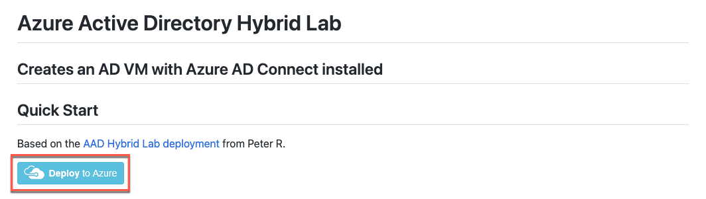
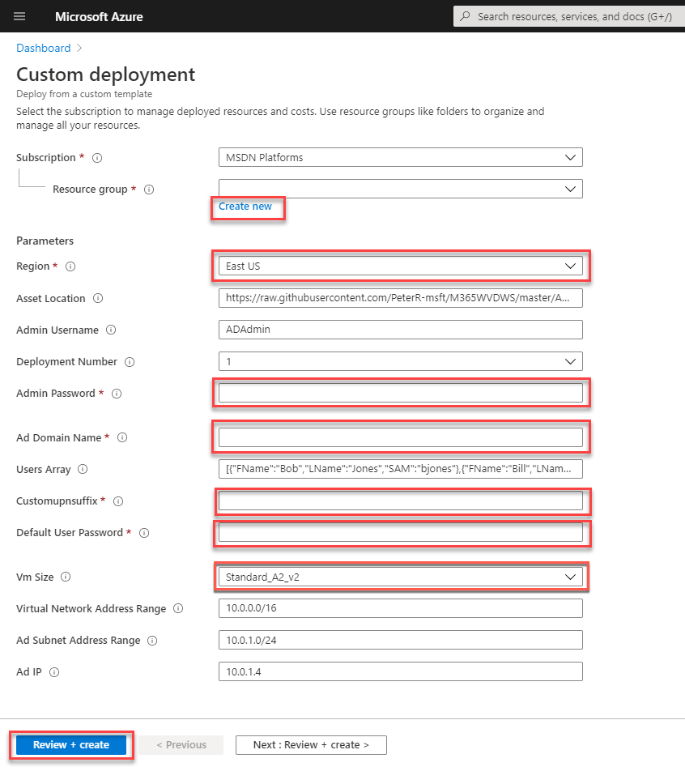

Implementing Azure Virtual Desktop in the enterprise

Before the hands-on lab setup guide

August 2022

Information in this document, including URL and other Internet Web site references, is subject to change without notice. Unless otherwise noted, the example companies, organizations, products, domain names, e-mail addresses, logos, people, places, and events depicted herein are fictitious, and no association with any real company, organization, product, domain name, e-mail address, logo, person, place or event is intended or should be inferred. Complying with all applicable copyright laws is the responsibility of the user. Without limiting the rights under copyright, no part of this document may be reproduced, stored in or introduced into a retrieval system, or transmitted in any form or by any means (electronic, mechanical, photocopying, recording, or otherwise), or for any purpose, without the express written permission of Microsoft Corporation.

Microsoft may have patents, patent applications, trademarks, copyrights, or other intellectual property rights covering subject matter in this document. Except as expressly provided in any written license agreement from Microsoft, the furnishing of this document does not give you any license to these patents, trademarks, copyrights, or other intellectual property.

The names of manufacturers, products, or URLs are provided for informational purposes only and Microsoft makes no representations and warranties, either expressed, implied, or statutory, regarding these manufacturers or the use of the products with any Microsoft technologies. The inclusion of a manufacturer or product does not imply endorsement of Microsoft of the manufacturer or product. Links may be provided to third party sites. Such sites are not under the control of Microsoft and Microsoft is not responsible for the contents of any linked site or any link contained in a linked site, or any changes or updates to such sites. Microsoft is not responsible for webcasting or any other form of transmission received from any linked site. Microsoft is providing these links to you only as a convenience, and the inclusion of any link does not imply endorsement of Microsoft of the site or the products contained therein.

© 2022 Microsoft Corporation. All rights reserved.

Microsoft and the trademarks listed at <https://www.microsoft.com/en-us/legal/intellectualproperty/Trademarks/Usage/General.aspx> are trademarks of the Microsoft group of companies. All other trademarks are property of their respective owners.

**Contents**

<!-- TOC -->

- [Implementing Azure Virtual Desktop in the enterprise before the hands-on lab setup guide](#implementing-azure-virtual-desktop-in-the-enterprise-before-the-hands-on-lab-setup-guide)
  - [Requirements](#requirements)
  - [Before the hands-on lab](#before-the-hands-on-lab)
    - [Task 1: Deploying Azure Infrastructure and AD DS with an ARM Template](#task-1-deploying-azure-infrastructure-and-ad-ds-with-an-arm-template)

<!-- /TOC -->

# Implementing Azure Virtual Desktop in the enterprise before the hands-on lab setup guide

## Requirements

Before you start setting up your Azure Virtual Desktop workspace, make sure you have the following items:

- The Azure Active Directory tenant ID for Azure Virtual Desktop users.

- A global administrator account within the Azure Active Directory tenant.

  - This also applies to Cloud Solution Provider (CSP) organizations creating an Azure Virtual Desktop workspace for their customers. If you are in a CSP organization, you must be able to sign in as a global administrator of the customer's Azure Active Directory tenant.

  - The administrator account must be sourced from the Azure Active Directory tenant in which you are trying to create the Azure Virtual Desktop workspace. This process does not support Azure Active Directory B2B (guest) accounts.

  - The administrator account must be a work or school account.

- An Azure subscription.

  - Enough Quota Cores to build four 4-core servers.

  - Access to the Azure Active Directory Global Admin account for your new or existing Azure Active Directory Tenant.

  - Owner rights on all Azure subscription(s).

## Before the hands-on lab

Duration:  45 minutes

### Task 1: Deploying Azure Infrastructure and AD DS with an ARM Template

In this task, you will leverage a custom Azure Resource Manager (ARM) template to deploy the required Active Directory Domain Services infrastructure for AVD. If you already have an AD DS environment and AD Connect configured, you can move on to **HOL step-by-step, Exercise 4: Configuring Azure AD Connect with AD DS**.

This ARM Template will provision the following resources:

- Virtual Network

  - 1 Subnet

  - 1 Network Security Group (NSG)

    - Permits AD traffic, permits RDP incoming traffic, and restricts DMZ access.

  - DNS configured to point to the domain controller.

- Virtual Machine

  - Active Directory Domain Services is installed and configured.

  - Test users created in the domain.

  - Azure AD Connect is installed and ready for configuration.

  - Public IP address assigned for remote administration via RDP.

> **Tip**: Internally, at MSFT, we have different tenant directories available. Because of this, it is not uncommon for ARM templates hosted on GitHub to get stuck during deployment. To avoid confusion and deployment errors, **open an InPrivate browser window** when deploying ARM templates from GitHub.

1. Open a browser using "InPrivate" or "Incognito" mode, and navigate to the ARM template: [AAD hybrid lab ARM template from GitHub](https://github.com/microsoft/MCW-Implementing-Azure-Virtual-Desktop-in-the-enterprise/tree/main/Hands-on%20lab/resources/HybridAD).

2. Review the notes on the GitHub page for the ARM template before deployment.

3. Under Quick Start, select **Deploy to Azure**. This will open a new browser tab to the Azure Portal for custom deployments.

    

4. If prompted, sign in with an account that is an owner of the Azure subscription.

5. Fill in the required ARM template parameters. Refer to the following example for more information on the parameters:

    - Create a new **Resource group**
    - Select a **Region**
    - Create an **Admin Password**
    - Create an **Ad Domain Name**, such as **myavd.com**
    - Create a **Customupnsuffix** for AVD, such as **"myavd"**

      >**Note**: Keep this short, no more than five characters, or you can run into errors due to the length of your virtual machine names.

    - Create a **Default User Password**
    - For **Vm Size**, choose a [SKU in your region](https://azure.microsoft.com/global-infrastructure/services/?products=virtual-machines). Our default is `Standard_A2_v2`.
    - Select **Review + create**

    >**Note**: Make sure you save these inputs, especially the password; they will be needed for reference when you go through the HOL Step-by-Step.

    

6. Agree to the Terms and conditions and select **Create**.

    The deployment is now underway. On average, this process can take 30 minutes to complete. It is important that you monitor the deployment progress to ensure there are no problems. You can monitor progress by selecting the **notification** bell in the upper right corner and selecting **Deployment in progress...**

    >**Note**: While automation can make things simpler and repeatable, sometimes it can fail. If at any time during the ARM template deployment there is a failure, review the failure, delete the Resource Group, and try the ARM template again, adjusting for any possible errors.

    Once the ARM template is done being deployed, the status will change to complete. At this point, the domain controller is ready for RDP connectivity.

You should follow all steps provided *before* performing the Hands-on lab.
