<div class="MCWHeader1">
Implementing Azure Virtual Desktop in the enterprise
</div>

<div class="MCWHeader2">
Hands-on lab step-by-step guide
</div>

<div class="MCWHeader3">
August 2022
</div>

Information in this document, including URL and other Internet Web site references, is subject to change without notice. Unless otherwise noted, the example companies, organizations, products, domain names, e-mail addresses, logos, people, places, and events depicted herein are fictitious, and no association with any real company, organization, product, domain name, e-mail address, logo, person, place or event is intended or should be inferred. Complying with all applicable copyright laws is the responsibility of the user. Without limiting the rights under copyright, no part of this document may be reproduced, stored in or introduced into a retrieval system, or transmitted in any form or by any means (electronic, mechanical, photocopying, recording, or otherwise), or for any purpose, without the express written permission of Microsoft Corporation.

Microsoft may have patents, patent applications, trademarks, copyrights, or other intellectual property rights covering subject matter in this document. Except as expressly provided in any written license agreement from Microsoft, the furnishing of this document does not give you any license to these patents, trademarks, copyrights, or other intellectual property.

The names of manufacturers, products, or URLs are provided for informational purposes only and Microsoft makes no representations and warranties, either expressed, implied, or statutory, regarding these manufacturers or the use of the products with any Microsoft technologies. The inclusion of a manufacturer or product does not imply endorsement of Microsoft of the manufacturer or product. Links may be provided to third party sites. Such sites are not under the control of Microsoft and Microsoft is not responsible for the contents of any linked site or any link contained in a linked site, or any changes or updates to such sites. Microsoft is not responsible for webcasting or any other form of transmission received from any linked site. Microsoft is providing these links to you only as a convenience, and the inclusion of any link does not imply endorsement of Microsoft of the site or the products contained therein.

© 2022 Microsoft Corporation. All rights reserved.

Microsoft and the trademarks listed at <https://www.microsoft.com/en-us/legal/intellectualproperty/Trademarks/Usage/General.aspx> are trademarks of the Microsoft group of companies. All other trademarks are property of their respective owners.

**Contents**

<!-- TOC -->

- [Implementing Azure Virtual Desktop for the enterprise hands-on lab step-by-step](#implementing-azure-virtual-desktop-for-the-enterprise-hands-on-lab-step-by-step)
  - [Abstract and learning objectives](#abstract-and-learning-objectives)
  - [Overview](#overview)
  - [Solution architecture](#solution-architecture)
  - [Requirements](#requirements)
  - [Before the hands-on lab](#before-the-hands-on-lab)
  - [Troubleshooting](#troubleshooting)
  - [Exercise 1: Configuring Azure AD Connect with AD DS](#exercise-1-configuring-azure-ad-connect-with-ad-ds)
    - [Task 1: Connecting to the domain controller](#task-1-connecting-to-the-domain-controller)
    - [Task 2: Disabling IE Enhanced Security and installing Edge](#task-2-disabling-ie-enhanced-security-and-installing-edge)
    - [Task 3: Creating a domain admin account](#task-3-creating-a-domain-admin-account)
    - [Task 4: Configuring Azure AD Connect](#task-4-configuring-azure-ad-connect)
  - [Exercise 2: Create Azure AD groups for AVD](#exercise-2-create-azure-ad-groups-for-avd)
    - [Task 1: Creating Azure AD groups](#task-1-creating-azure-ad-groups)
    - [Task 2: Assign users to groups](#task-2-assign-users-to-groups)
  - [Exercise 3: Create an Azure Files Share for FSLogix](#exercise-3-create-an-azure-files-share-for-fslogix)
    - [Task 1: Create a storage account](#task-1-create-a-storage-account)
    - [Task 2: Create an Azure file share](#task-2-create-an-azure-file-share)
    - [Task 3: Enable AD authentication for your storage account](#task-3-enable-ad-authentication-for-your-storage-account)
    - [Task 4: Configure share permissions](#task-4-configure-share-permissions)
    - [Task 5: Configure NTFS permissions for the file share](#task-5-configure-ntfs-permissions-for-the-file-share)
    - [Task 6: Configure NTFS permissions for the containers](#task-6-configure-ntfs-permissions-for-the-containers)
  - [Exercise 4: Create a gold image for AVD](#exercise-4-create-a-gold-image-for-avd)
    - [Task 1: Create a new Virtual Machine (VM) in Azure](#task-1-create-a-new-virtual-machine-vm-in-azure)
    - [Task 2: Run Windows Update](#task-2-run-windows-update)
    - [Task 3: Prepare an AVD image](#task-3-prepare-an-avd-image)
    - [Task 4: Run Sysprep](#task-4-run-sysprep)
    - [Task 5: Create a managed image from the gold Image VM](#task-5-create-a-managed-image-from-the-gold-image-vm)
  - [Exercise 5: Create a host pool for personal desktops](#exercise-5-create-a-host-pool-for-personal-desktops)
    - [Task 1: Create a new Host Pool and Workspace](#task-1-create-a-new-host-pool-and-workspace)
    - [Task 2: Create a friendly name for the workspace](#task-2-create-a-friendly-name-for-the-workspace)
    - [Task 3: Assign an Azure AD group to an application group](#task-3-assign-an-azure-ad-group-to-an-application-group)
  - [Exercise 6: Create a host pool from your custom image and assign pooled remote apps.](#exercise-6-create-a-host-pool-from-your-custom-image-and-assign-pooled-remote-apps)
    - [Task 1: Create a new host pool and workspace](#task-1-create-a-new-host-pool-and-workspace-1)
    - [Task 2: Create a friendly name for the workspace](#task-2-create-a-friendly-name-for-the-workspace-1)
    - [Task 3: Add Remote Apps to your Host Pool](#task-3-add-remote-apps-to-your-host-pool)
  - [Exercise 7: Connect to AVD with the web client](#exercise-7-connect-to-avd-with-the-web-client)
    - [Task 1: Connecting with the HTML5 web client](#task-1-connecting-with-the-html5-web-client)
  - [Exercise 8: Setup monitoring for AVD](#exercise-8-setup-monitoring-for-avd)
    - [Task 1: Create a Log Analytics workspace](#task-1-create-a-log-analytics-workspace)
    - [Task 2: Enabling diagnostic logging for AVD](#task-2-enabling-diagnostic-logging-for-avd)
    - [Task 3: Enable logging for host pools](#task-3-enable-logging-for-host-pools)
    - [Task 4: Enable logging for application groups](#task-4-enable-logging-for-application-groups)
    - [Task 5: Enable logging for workspaces](#task-5-enable-logging-for-workspaces)
    - [Task 6: Enabling Azure Monitor for the session hosts](#task-6-enabling-azure-monitor-for-the-session-hosts)
  - [Exercise 9: Improving your AVD environment](#exercise-9-improving-your-avd-environment)
    - [Task 1: Configure permissions for Autoscale](#task-1-configure-permissions-for-autoscale)
    - [Task 2: Enabling Autoscale](#task-2-enabling-autoscale)
    - [Task 2: Utilizing Application Packages (MSIX)](#task-2-utilizing-application-packages-msix)
    - [Task 3: Protect AVD with Microsoft Defender for Endpoint](#task-3-protect-avd-with-microsoft-defender-for-endpoint)
  - [After the hands-on lab](#after-the-hands-on-lab)
    - [Task 1: Delete Resource groups to remove the lab environment](#task-1-delete-resource-groups-to-remove-the-lab-environment)

<!-- /TOC -->

# Implementing Azure Virtual Desktop for the enterprise hands-on lab step-by-step

## Abstract and learning objectives

In this hands-on lab, you will implement an Azure Virtual Desktop (AVD) infrastructure and learn how to set up a working AVD environment end-to-end in a typical Enterprise model. At the end of the lab, attendees will have deployed an Azure Active Directory Tenant with Azure AD Connect to an Active Directory Domain Controller running in Azure. You will also deploy the Azure infrastructure for the Azure Virtual Desktop Tenant(s), Host Pool(s), and session host(s). Then you will connect to an AVD session utilizing different supported devices and browsers. You will publish desktops and remote apps. Finally, you will configure user profiles and FSLogics with Azure file shares. Finally, you will configure monitoring and security for the Azure Virtual Desktop infrastructure and understand the steps to manage the gold images.

## Overview

In this lab, attendees will deploy the [Azure Virtual Desktop (AVD)](https://azure.microsoft.com/en-us/services/virtual-desktop/) solution. Exclusively available as an Azure cloud service, Azure Virtual Desktop allows you to choose a flexible end-user virtualized application or desktop delivery model that best aligns with your enterprise Azure cloud strategy. AVD simplifies the IT model to virtualize and deploy modern and legacy desktop app experiences with unified management without needing to host, install, configure, and manage components such as diagnostics, networking, connection brokering, and gateway. AVD brings together Microsoft Office 365 and Azure to provide users with the only multi-session Windows 10 experience with exceptional scale and reduced IT costs while empowering today's modern digital workspace.

## Solution architecture

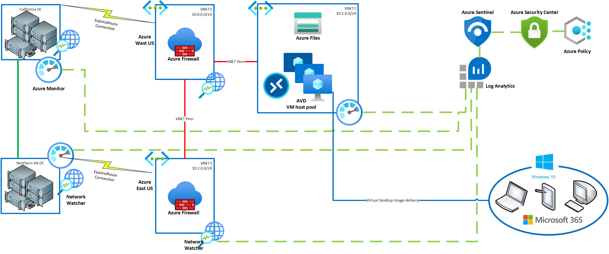

This diagram shows an Azure Virtual Desktop architecture with on-premises servers for Active Directory. In the diagram, the host pools provide the AVD session to the different supported devices. Azure Monitor, Network Watcher, and Log Analytics monitor and log activity and performance metrics.

## Requirements

Before you start setting up your Azure Virtual Desktop workspace, make sure you have the following items:

- The Azure Active Directory tenant ID for Azure Virtual Desktop users.

- A global administrator account within the Azure Active Directory tenant.

  - This also applies to Cloud Solution Provider (CSP) organizations creating an Azure Virtual Desktop workspace for their customers. When you are in a CSP organization, you must be able to sign in as a global administrator of the customer\'s Azure Active Directory tenant.

  - The administrator account must be sourced from the Azure Active Directory tenant in which you are trying to create the Azure Virtual Desktop workspace. This process does not support Azure Active Directory B2B (guest) accounts.

  - The administrator account must be a work or school account.

- An Azure subscription.

  - Enough Quota Cores to build four 4-core servers.

  - Access to the Azure Active Directory Global Admin account for your new or existing Azure Active Directory Tenant.

  - Owner rights on all Azure subscription(s).

## Before the hands-on lab

- Refer to the Before the hands-on lab setup guide before continuing to the lab exercises.
  
- Make sure to track your user accounts and where you are using them.

- Regions and locations, make sure to stay consistent as much as possible.

## Troubleshooting

When you run into issues with your Azure Virtual Desktop (AVD) environment, there will periodically be troubleshooting tips at the end of the current exercise. However, if the issues are not directly addressed, please feel free to reach out to your instructor or teacher.

Review the article [Troubleshooting overview, feedback, and support for Azure Virtual Desktop](https://docs.microsoft.com/en-us/azure/virtual-desktop/troubleshoot-set-up-overview). Part of the article will cover steps used in [Exercise 8](#exercise-8-setup-monitoring-for-avd) and can help diagnose issues you may encounter.

## Exercise 1: Configuring Azure AD Connect with AD DS

Duration:  60 minutes

In this exercise, you will be configuring [Azure AD Connect](https://docs.microsoft.com/en-us/azure/active-directory/hybrid/whatis-azure-ad-connect). With Azure Virtual Desktop, all session host VMs within the AVD tenant environment are required to be domain joined to AD DS, and the domain must be synchronized with Azure AD. To manage the synchronization of objects, you will configure Azure AD Connect on the domain controller deployed in Azure.

>**Note**: RDP access to a domain controller using a public IP address is not a best practice and is only done to simplify this lab. Better security practices such as removing the PIP, enabling just-in-time access, and/or leveraging a bastion host should be applied to enhance security.

**Additional Resources**

  |              |            |  
|----------|:-------------:|
| Description | Links |
|Azure Virtual Desktop (ARM-based model) deployment walkthrough |https://www.christiaanbrinkhoff.com/2020/05/01/windows-virtual-desktop-technical-2020-spring-update-arm-based-model-deployment-walkthrough/#NewAzurePortal-Dashboard |
  |              |            | 

### Task 1: Connecting to the domain controller

1. Sign in to the [Azure Portal](https://portal.azure.com/).

2. Type **Resource groups** in the search field and select it from the list.

3. On the Resource groups blade, select the resource group name you created in the **Before the HOL** template deployment.

4. On the Infra Resource group blade, review the list of available resources. Locate the resource named **AdPubIP1** and select it. Note that the resource type should be **Public IP address**.

    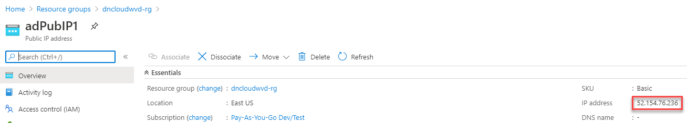

5. On the Overview page for AdPubIP1, locate the **IP address** field. Copy the IP address to a safe location.

6. On your local machine, open the **RUN** dialog window, type **MSTSC**, and enter.

    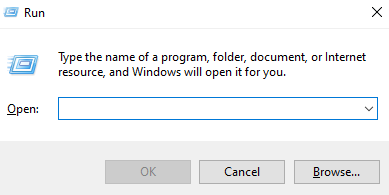

7. In the **Remote Desktop Connection** window, paste the public IP address from the previous step. Select **Connect**.

    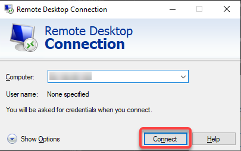

8. When prompted, sign in with the AD domain UPN credentials. For example, when you used the ARM template from [Before HOL setup guide](), the credentials will be something along the lines of: [adadmin\@MyADDomain.com](mailto:adadmin@MyADDomain.com) with the password you entered when deploying the ARM template in the before the hands-on lab. If prompted, select **Yes** to accept the RDP certification warning. If the dialog appears asking to make the server discoverable on the network, select No.

    >**Note**: This is the Active Directory account from the ARM template, not the Azure AD Global Admin account. When you have trouble signing in, try typing the credentials in manually, as copy and paste may include an unnecessary space, which will cause authentication to fail.

### Task 2: Disabling IE Enhanced Security and installing Edge

To simplify tasks in this lab, we will start by disabling [IE Enhanced Security](https://docs.microsoft.com/en-us/windows-hardware/customize/desktop/unattend/microsoft-windows-ie-esc).

1. Once connected to the domain controller, open Server Manager if it does not start automatically.

2. In Server Manager, select **Local Server** on the left., then locate the **IE Enhanced Security Configuration** option and select **On**.

    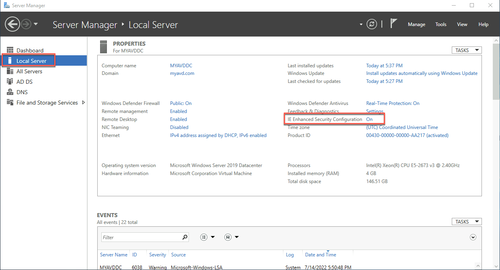 

3. On the Internet Explorer Enhanced Security Configuration window, under **Administrators**, select the **Off** radio button and select **OK**.

    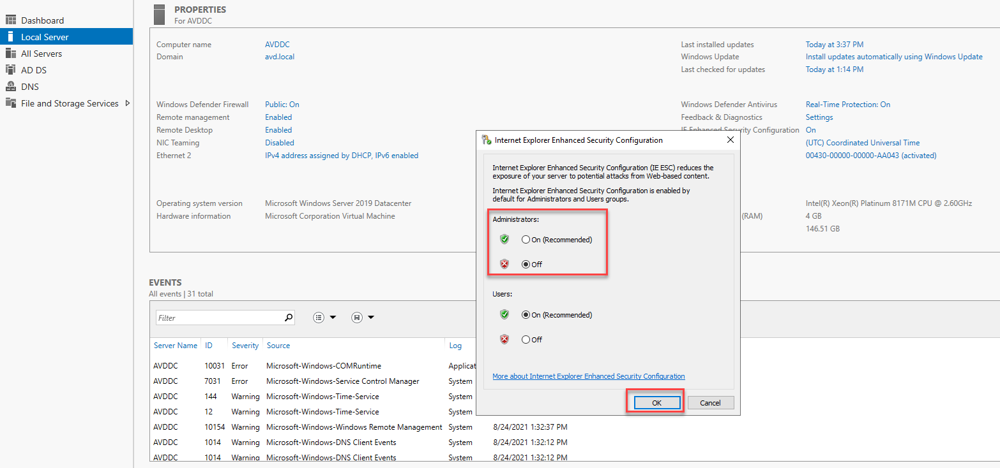

4. Open Internet Explorer, and navigate to [Download Microsoft Edge for Business](https://www.microsoft.com/en-us/edge/business/download). Select to download the **Windows 64-bit** version.

    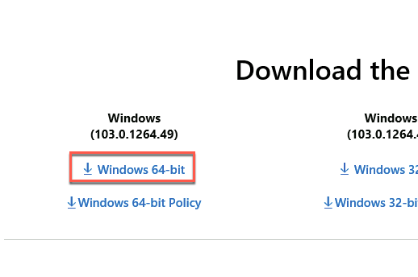

5. Select to Agree and Download, then select to Run the .msi. Internet Explorer has been officially retired, so you will use Edge as the default browser for this lab.

### Task 3: Creating a domain admin account

By default, Azure AD Connect does not synchronize the built-in domain administrator account [ADAdmin\@MyADDomain.com](mailto:ADAdmin@MyADDomain.com). This system account has the attribute isCriticalSystemObject set to *true*, preventing it from being synchronized. While it is possible to modify this, it is not a best practice.

1. In Server Manager, select **Tools** in the upper right corner and select **Active Directory Users and Computers**.

    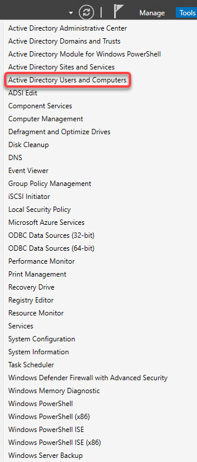 

2. In Active Directory Users and Computers, right-click the **Users** organization unit and select **New \> User** from the menu.

    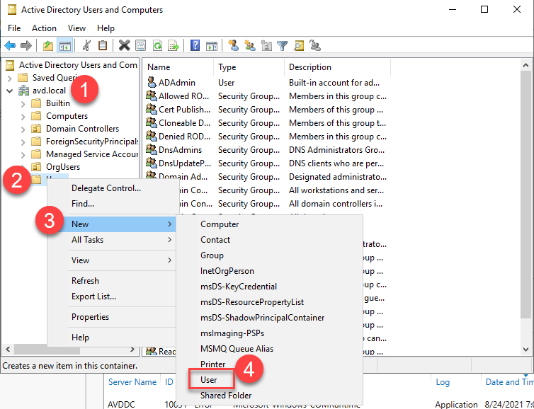

3. Complete the New User wizard.

    

    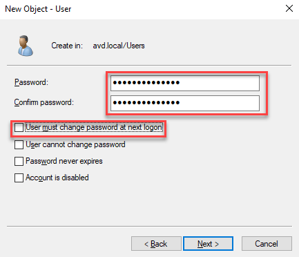

    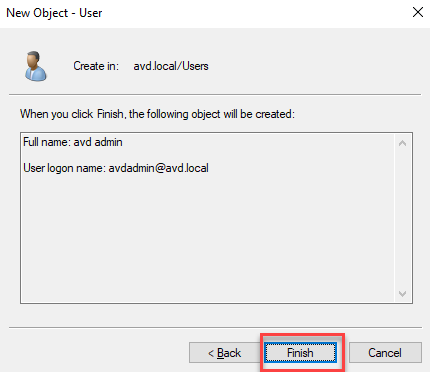

    >**Note**: This account will be important in future tasks. Make a note of the username and password you create. When setting the password, uncheck the box **User must change password at the next logon**.

4. In Active Directory Users and Computers, right-click on the new user account object and select **Add to a group**.

    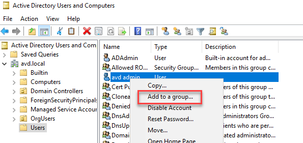

5. On the Select Groups dialog window, type **Domain Admins** and select **OK**.

    >**Note**: This account will be used during the host pool creation process for joining the hosts to the domain. Granting Domain Admin permissions will simplify the lab. However, any Active Directory account that has the following permissions will suffice. This can be done using [Active Directory Delegate Control](https://danielengberg.com/domain-join-permissions-delegate-active-directory/). 

    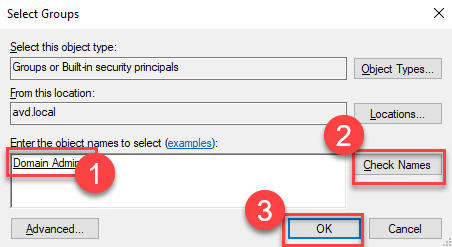

### Task 4: Configuring Azure AD Connect

1. On the domain controller, run the following PowerShell script to ensure TLS 1.2 is enabled. If it isn't enabled, the configuration of Azure AD Connect will fail.

    ```powershell
    New-Item 'HKLM:\SOFTWARE\WOW6432Node\Microsoft\.NETFramework\v4.0.30319' -Force | Out-Null

    New-ItemProperty -path 'HKLM:\SOFTWARE\WOW6432Node\Microsoft\.NETFramework\v4.0.30319' -name 'SystemDefaultTlsVersions' -value '1' -PropertyType 'DWord' -Force | Out-Null

    New-ItemProperty -path 'HKLM:\SOFTWARE\WOW6432Node\Microsoft\.NETFramework\v4.0.30319' -name 'SchUseStrongCrypto' -value '1' -PropertyType 'DWord' -Force | Out-Null

    New-Item 'HKLM:\SOFTWARE\Microsoft\.NETFramework\v4.0.30319' -Force | Out-Null

    New-ItemProperty -path 'HKLM:\SOFTWARE\Microsoft\.NETFramework\v4.0.30319' -name 'SystemDefaultTlsVersions' -value '1' -PropertyType 'DWord' -Force | Out-Null

    New-ItemProperty -path 'HKLM:\SOFTWARE\Microsoft\.NETFramework\v4.0.30319' -name 'SchUseStrongCrypto' -value '1' -PropertyType 'DWord' -Force | Out-Null

    New-Item 'HKLM:\SYSTEM\CurrentControlSet\Control\SecurityProviders\SCHANNEL\Protocols\TLS 1.2\Server' -Force | Out-Null
    
    New-ItemProperty -path 'HKLM:\SYSTEM\CurrentControlSet\Control\SecurityProviders\SCHANNEL\Protocols\TLS 1.2\Server' -name 'Enabled' -value '1' -PropertyType 'DWord' -Force | Out-Null
    
    New-ItemProperty -path 'HKLM:\SYSTEM\CurrentControlSet\Control\SecurityProviders\SCHANNEL\Protocols\TLS 1.2\Server' -name 'DisabledByDefault' -value 0 -PropertyType 'DWord' -Force | Out-Null
    
    New-Item 'HKLM:\SYSTEM\CurrentControlSet\Control\SecurityProviders\SCHANNEL\Protocols\TLS 1.2\Client' -Force | Out-Null
    
    New-ItemProperty -path 'HKLM:\SYSTEM\CurrentControlSet\Control\SecurityProviders\SCHANNEL\Protocols\TLS 1.2\Client' -name 'Enabled' -value '1' -PropertyType 'DWord' -Force | Out-Null
    
    New-ItemProperty -path 'HKLM:\SYSTEM\CurrentControlSet\Control\SecurityProviders\SCHANNEL\Protocols\TLS 1.2\Client' -name 'DisabledByDefault' -value 0 -PropertyType 'DWord' -Force | Out-Null
    Write-Host 'TLS 1.2 has been enabled.'
    ```

2. Locate the icon for **Azure AD Connect** and open it.

    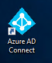

    >**Note**: The installation of Azure AD Connect may fail if the server has not been updated to enable TLS 1.2. If this is the case, run the following PowerShell script to enable and then re-open Azure AD Connect.

3. Accept the license terms and privacy notice, then select continue. On the next screen, select **Use express settings**. The required components will install.

    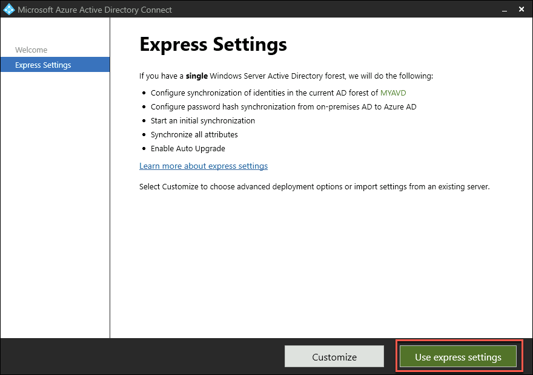

4. On the Connect to Azure AD page, enter the Azure AD Global Admin credentials. For example: [azadmin\@MyAADdomain.onmicrosoft.com](mailto:azadmin@MyAADdomain.onmicrosoft.com) and the correct password. Select **Next**.

    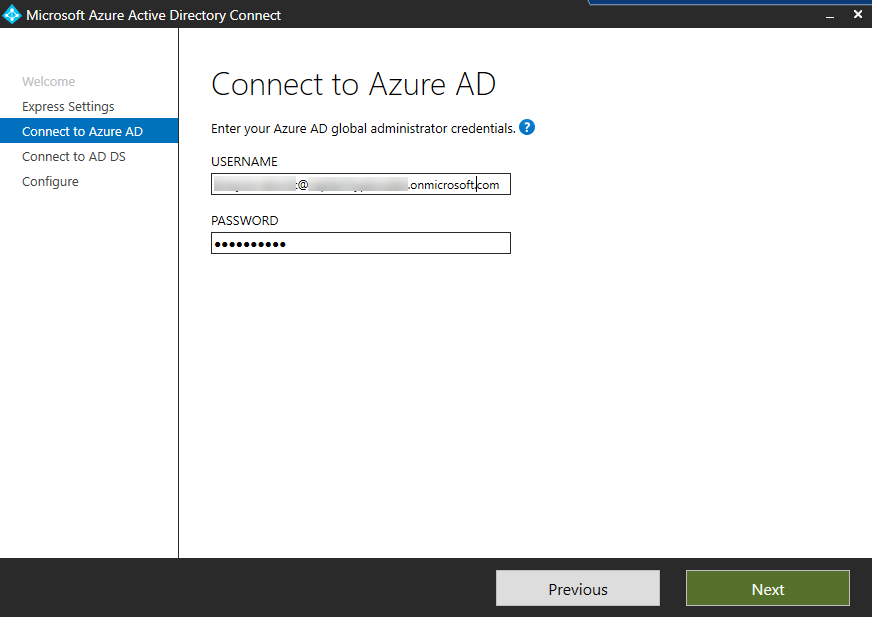
    >**Note**: This is the account associated with your Azure subscription.

5. On the Connect to AD DS page, enter the Active Directory credentials for a Domain Admin account. For example, when you used the ARM template deployment for the domain controller, the credentials will be something along the lines of: **[[MyADDomain.com]](http://myaddomain.com/) \\ADadmin** with the password: **AVD\@zureL\@b2019!**. Select **Next**.

    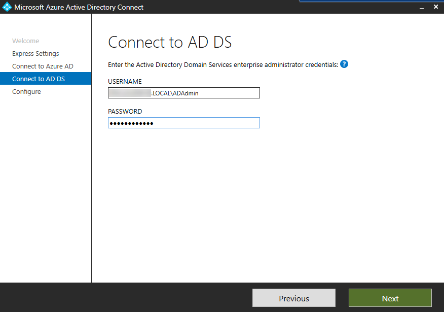

    >**Note**: When you copy and paste the password, make sure there are no trailing spaces, as that will cause the verification to fail.

6. Select **Install** to start the configuration and synchronization.

    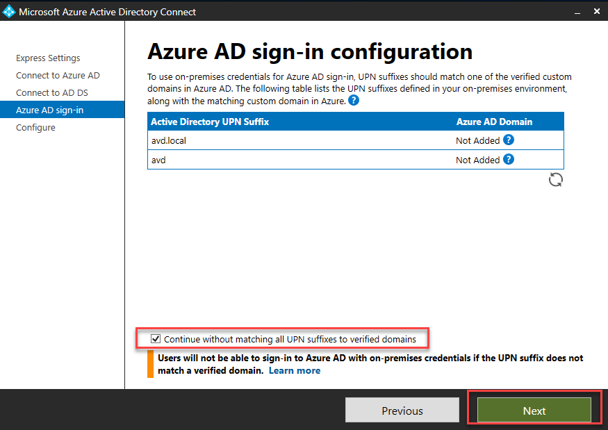

    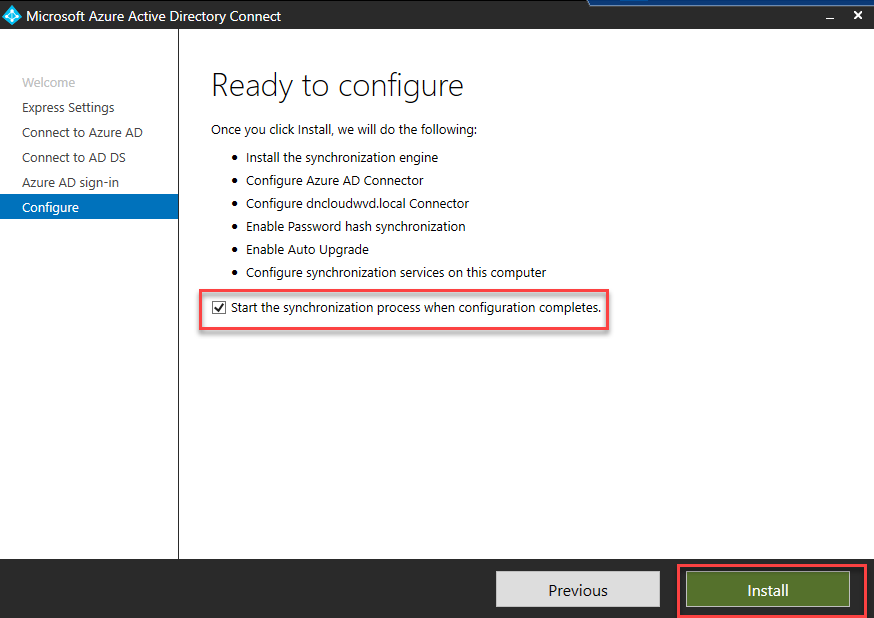

7. After a few minutes, the Azure AD Connect installation will be complete. Select **Exit**.

    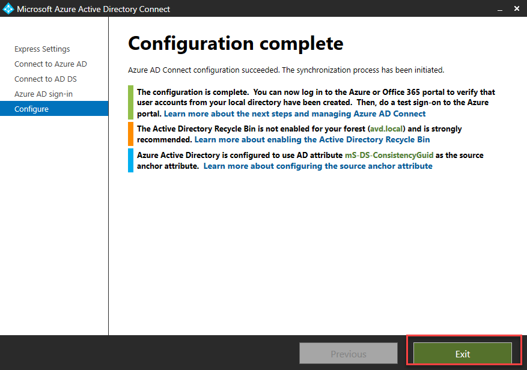

8. Minimize the RDP session for the domain controller and wait a few minutes for the AD accounts to be synchronized to Azure AD.

9. Sign in to the [Azure Portal](https://portal.azure.com/).

10. Type **Azure Active Directory** in the search field and select it from the list.

11. On the Azure Active Directory blade, under **Manage**, select **Users**.

12. Review the list of user account objects and confirm the test accounts have synchronized.  

    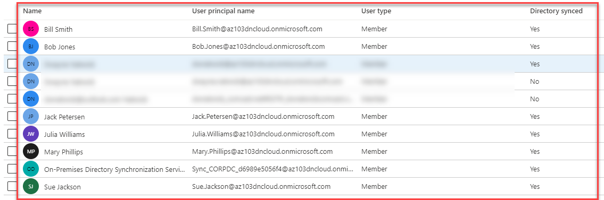

    >**Note**: It can take up to 15 minutes for the Active Directory objects to be synchronized to the Azure AD tenant.

## Exercise 2: Create Azure AD groups for AVD

Duration:  30 minutes

In this exercise, you will work with Azure Active Directory (Azure AD) groups to assist in managing access assignments to your application groups in AVD. The new ARM portal for AVD supports access assignments using Azure AD groups. This capability simplifies access management. Groups will also be leveraged in this guide to manage
permissions in Azure Files for FSLogix.

You will create three Azure AD groups to manage access to the different application groups: Personal, Pooled, and RemoteApp. For this guide, we will only create a single group for RemoteApps, but in a production scenario, it is more common to use separate groups based on the app or persona defined by the customer. Make a note of the groups you create; they will be used in later exercises.

It is also important to keep in mind that these groups can also originate from the Windows Active Directory environment and synchronize via Azure AD Connect. This will be another common scenario for customers that already have processes defined on-premises for group management.

**Additional Resources**

  |              |            |  
|----------|:-------------:|
| Description | Links |
| Create a basic group and add members in Azure AD | https://docs.microsoft.com/en-us/azure/active-directory/fundamentals/active-directory-groups-create-azure-portal |
| Azure AD Connect sync |  https://docs.microsoft.com/en-us/azure/active-directory/hybrid/concept-azure-ad-connect-sync-user-and-contacts |
  |              |            | 

### Task 1: Creating Azure AD groups

1. Sign in to the [Azure Portal](https://portal.azure.com/).

2. At the top of the page, in the **Search resources** field, type **Azure Active Directory**. Select **Azure Active Directory** from the list.

3. On the Azure Active Directory page, select **Groups** on the left and select **+ New group**.

    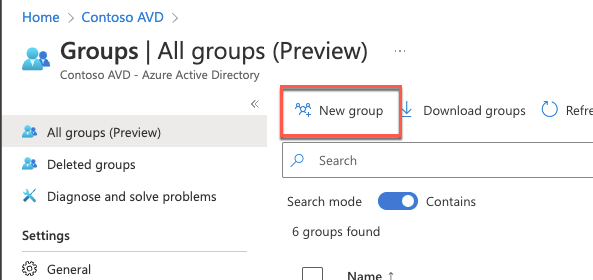

4. On the New Group page, fill in the following options, and select **Create**.

    - **Group type:** Security

    - **Group name:** AVD Pooled Desktop User

    - **Membership type:** Assigned

    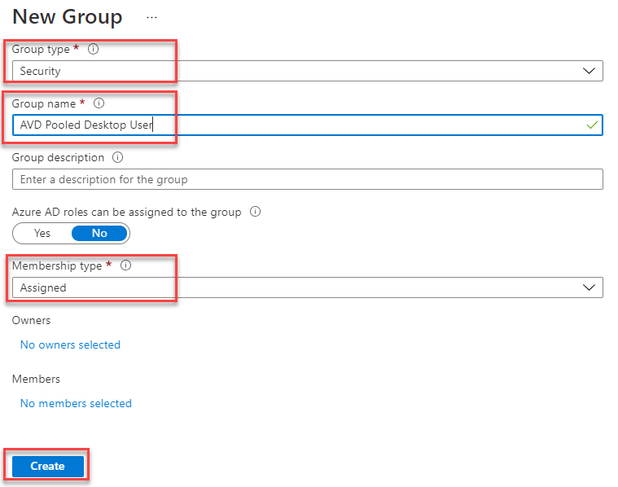

5. Select **+ New group** again, fill in the following options and select **Create**.

    - **Group type:** Security

    - **Group name:** AVD Remote App All Users

    - **Membership type:** Assigned

    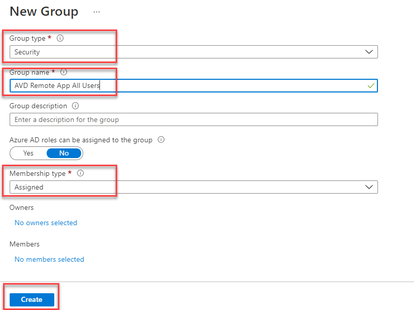

6. Select **+ New group** again, fill in the following options and select **Create**.

    - **Group type:** Security

    - **Group name:** AVD Persistent Desktop User

    - **Membership type:** Assigned

    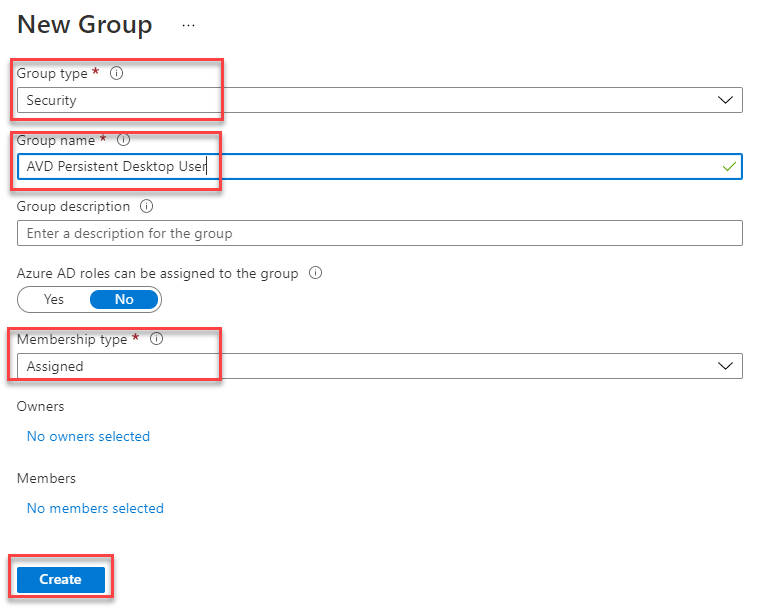

7. Confirm that the groups have been added by going to **Azure Active Directory** and selecting **Groups**. Then, scroll down to the bottom of the list of groups; the three groups you created should be listed.

    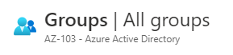

    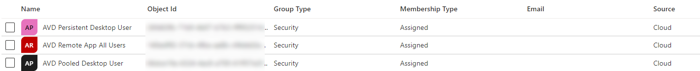

### Task 2: Assign users to groups

Now that the Azure AD groups are in place, you will assign users for testing. Once the groups are populated, you can leverage them to assign access to AVD resources once they are created.

1. Sign in to the [Azure Portal](https://portal.azure.com/).

2. At the top of the page, in the **Search resources** field, type **Azure Active Directory**. Select **Azure Active Directory** from the list.

3. On the **Azure Active Directory** page, select **Groups** on the left and select the **AVD Persistent Desktop User** group.

4. Select **Members** and **+ Add Members**

    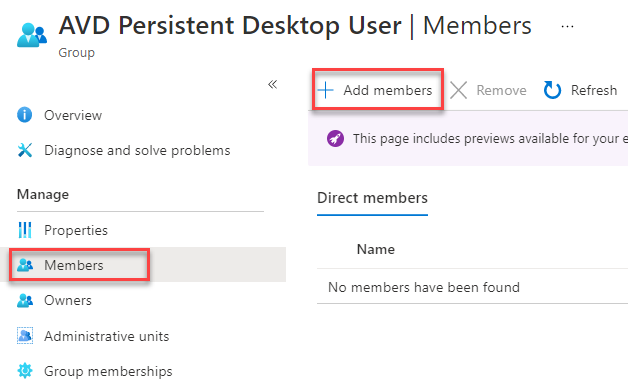

5. In the search field, enter the name of one of the users shown below and select them. Repeat this for each user; use the **Select** button to add them to the group.

    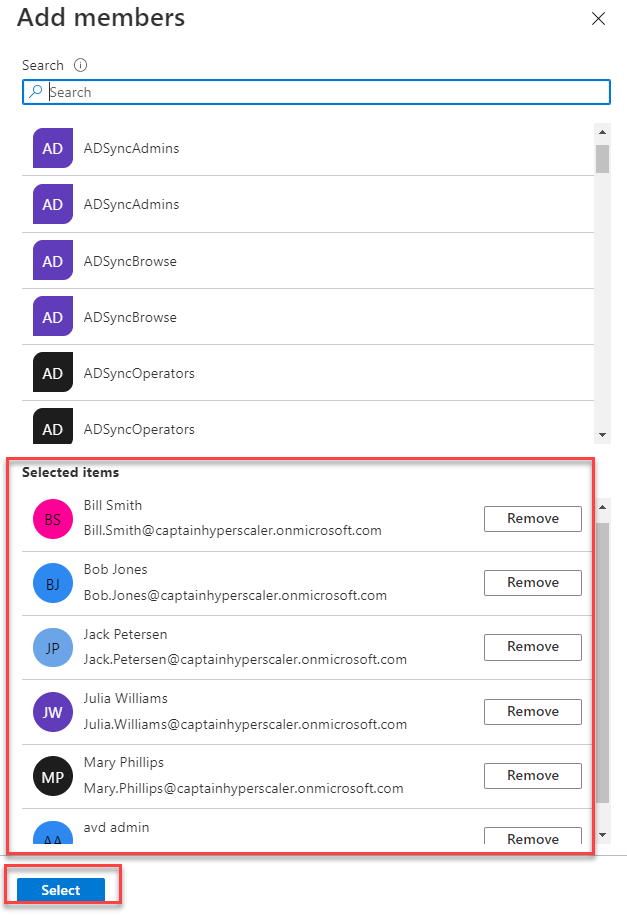

6. Repeat steps 4-6 for the **AVD Pooled Desktop User** and **AVD Remote App All Users** groups.

    At this point, you have three new Azure AD groups with members assigned. Make a note of the group names and accounts you added for use later in this guide. These groups will be used to assign access to AVD application groups.

## Exercise 3: Create an Azure Files Share for FSLogix

Duration:  90 minutes

In this exercise, you will create an Azure File share and enable SMB access via Active Directory authentication. Azure Files is a platform service (PaaS) and is one of the recommended solutions for hosting FSLogix containers for AVD users. At the end of this exercise, you will have the following components:

- A new storage account in your Azure subscription.

- A new Azure file share for your FSLogix profile containers.

- AD authentication is enabled for your Azure storage account.

- Permissions applied for user access to the file share.

**Additional Resources**

  |              |            |  
|----------|:-------------:|
| Description | Links |
| Windows File Server |https://docs.microsoft.com/en-us/azure/virtual-desktop/create-host-pools-user-profile| 
|NetApp Files|https://docs.microsoft.com/en-us/azure/virtual-desktop/create-FSLogix-profile-container |
|Azure Files | https://docs.microsoft.com/en-us/azure/virtual-desktop/create-profile-container-adds |
|              |            |

### Task 1: Create a storage account

Before you can work with an Azure file share, you need to create an Azure storage account. To create a general-purpose v2 storage account in the Azure portal, follow these steps:

1. Sign in to the [Azure Portal](https://portal.azure.com/). Ensure that you're using a subscription associated with the same Azure AD tenant in which you're a global admin. The users and groups you just created will need to be added with access to this storage account.

2. At the top of the page, in the **Search resources** field, type **storage accounts**. Select **Storage accounts** from the list.

    

3. On the Storage Accounts window that appears, select **+ Add**.

    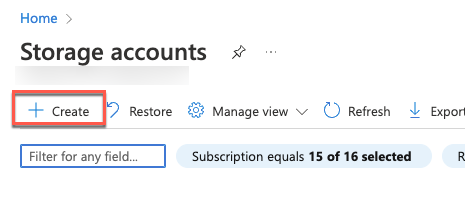

4. Fill in the required parameters for the storage account. Refer to the following example for more information on the available parameters. Make a note that contains the values you provide for **Resource group** and **Storage account name**. These will be needed later in the exercise.

    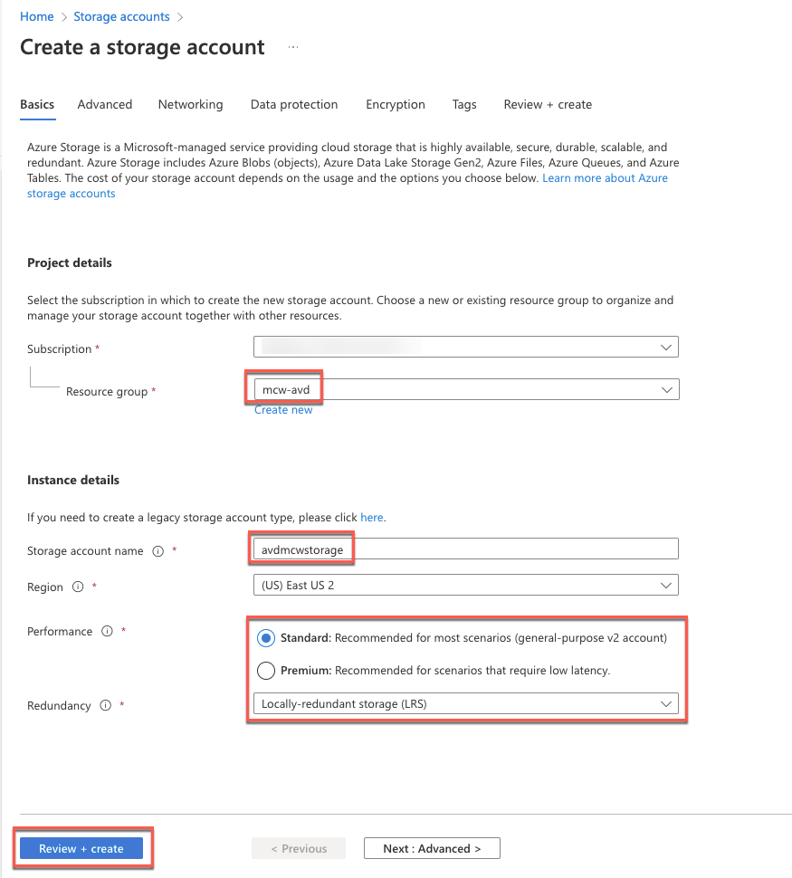

    >**Note**: The storage account name should be 15 characters or less in length.

5. Select **Review + Create** to review your storage account settings and create the account.

6. Select **Create**.

### Task 2: Create an Azure file share

1. At the top of the Azure Portal page, in the **Search resources** field, type **storage accounts**. Select **Storage accounts** from the list.

2. On the Storage accounts blade, select the storage account you created in Task 1.

3. On the Overview page for your Storage account, select **File shares**.

    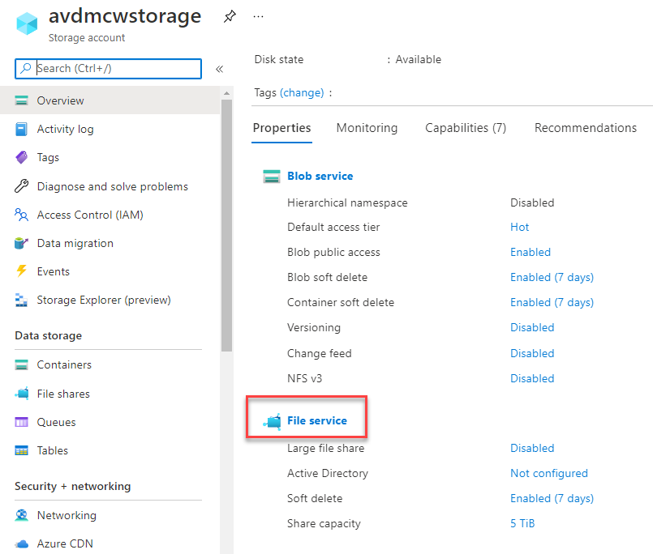

4. On the File shares blade, select **+ File Share**.

    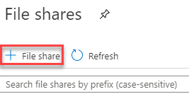

5. Enter a Name for the new file share, select **Hot** Tier, and select **Create**.

    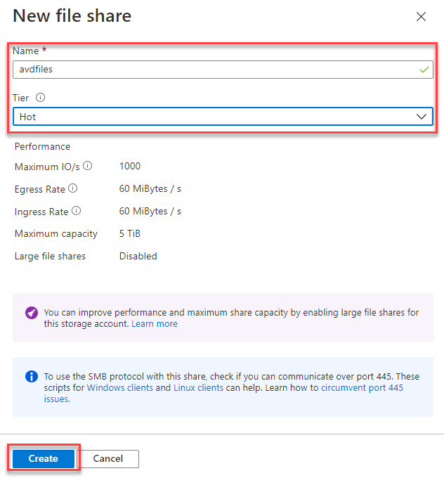

    >**Note**: The file share quota supports a maximum of 5,120 GiB and can be managed on the File shares blade.

### Task 3: Enable AD authentication for your storage account

**Prerequisites**

1. The steps in this task need to be completed from a domain-joined computer. The **AzFilesHybrid** module uses the AD PowerShell module, so running from a server is preferred.

2. The account used in this task needs to meet the following requirements:

    - Synchronized with Azure AD.

    - Permissions to create a user or computer objects in Active Directory.

    - Owner or Contributor rights on the Storage account.

In this task, you will complete the steps on the Domain Controller in Azure using an account assigned Global Administrator and Domain Administrator. In a production environment, you can scale this back if you meet the minimum requirements above.

**Setup**

1. From a domain joined computer, download and unzip the [AzFilesHybrid module](https://github.com/Azure-Samples/azure-files-samples/releases).

    **Link address**: https://github.com/Azure-Samples/azure-files-samples/releases

    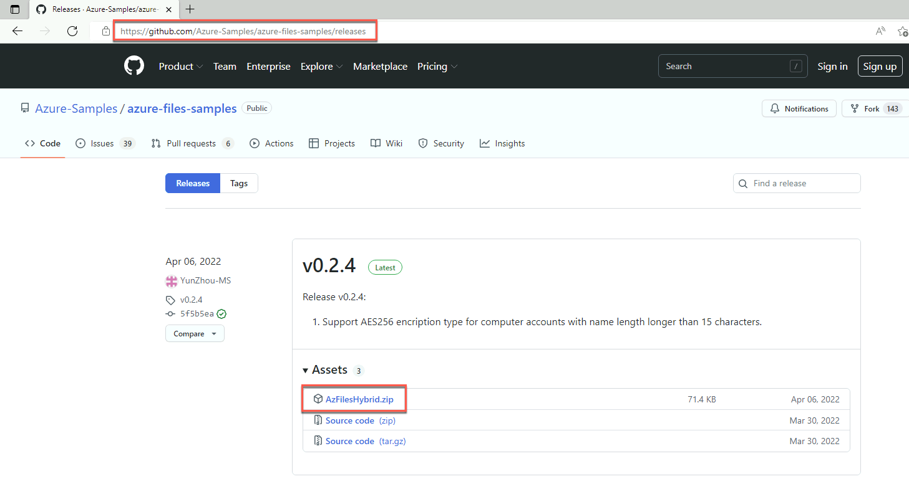

2. From the GitHub repository, select and open the AzFilesHybrid.zip file to the domain-joined computer **Documents** folder.

    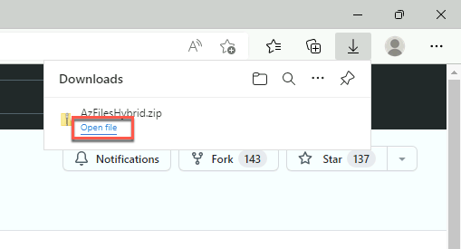

3. Extract this file to the **Documents** folder on the local Domain controller.

    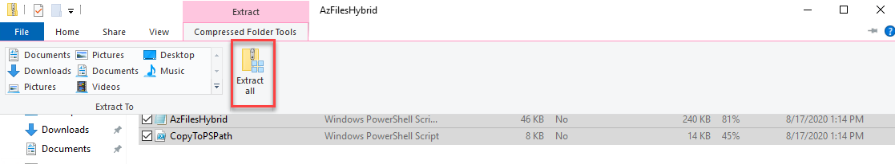

    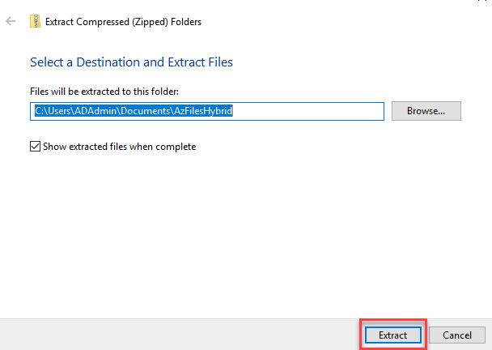

4. Open an elevated PowerShell console by finding **PowerShell** in the start menu. Right-click on the icon and select **Run as administrator**.

    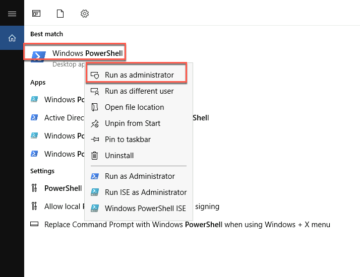

5. Configure the PowerShell execution policy **Unrestricted** for the current user. When prompted for confirmation, type **Y** and push return.

    ```powershell
     Set-ExecutionPolicy -ExecutionPolicy Unrestricted -Scope CurrentUser
    ```

6. Navigate to where you unzipped the AzFilesHybrid. For example:

    ```cmd
    cd C:\Users\ADAdmin\Documents\AzFilesHybrid\AzFilesHybrid
    ```

    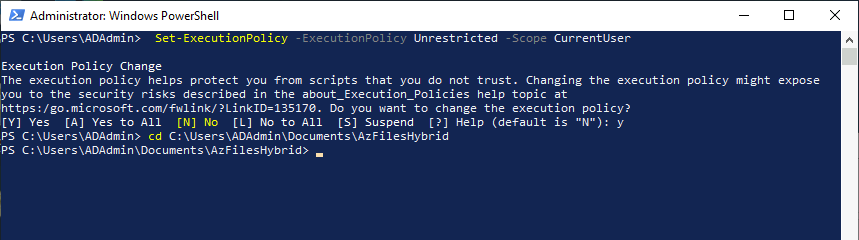

7. Install the Az PowerShell module. If any confirmation prompts appear, type **Y** and push return.

    ```powershell  
    Install-Module -Name Az -Scope CurrentUser
    ```

8. Install the AzFilesHybrid module. If you are prompted with a security warning, type **r** and then press enter to proceed with running it.

    ```powershell
    .\CopyToPSPath.ps1
    ```

9. Import the AzFilesHybrid module. If you are prompted with a security warning, type **r** and then press enter to proceed with running it. You may also be prompted to update PowerShellGet, type **y**, and press return. After that, you'll need to restart your PowerShell session. After restarting the PowerShell session, run the command below again.

    ```powershell
    Import-Module -Name AzFilesHybrid
    ```

    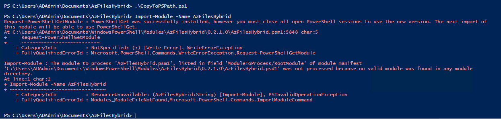

10. Sign in with an account that meets the prerequisites. (A global admin in the Azure AZ tenant that houses your AVD users and the file share you created.)

    ```powershell
    Connect-AzAccount
    ```

11. Create the following PowerShell variables replacing the subscription id, resource group name, and storage account with the information specific to your lab environment:

    ```powershell
    $SubscriptionId = "<subscription-id>"
    $ResourceGroupName = "<resource-group-name>"
    $StorageAccountName = "<storage-account-name>"
    ```

    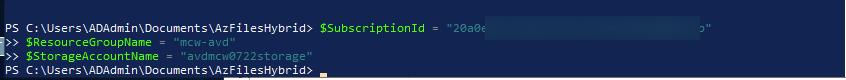

    >**Note**: The Resource Group Name and Storage Account Name were assigned in Task 1.

    >**Note**: You can run **Get-AzSubscription** to look up the available subscription names.

    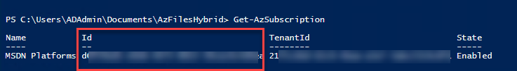

12. Select the target subscription for the current session.
  
    ```powershell
    Select-AzSubscription -SubscriptionId $SubscriptionId
    ```

13. Register the storage account with your Active Directory domain.

    ```powershell
    Join-AzStorageAccount -ResourceGroupName $ResourceGroupName -StorageAccountName $StorageAccountName
   
    ```

14. When the script completes, you will be provided confirmation that you are connected to the storage account.

    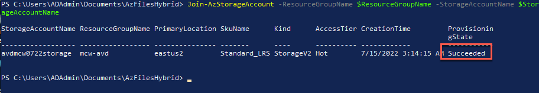

15. Confirm the object was created successfully in **Active Directory Users and Computers** by going to Domain controllers and looking for the computer object for the Azure storage account.

    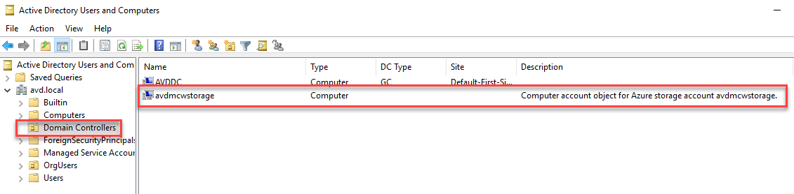

16. Confirm that the feature is enabled.

    ```powershell
    $storageaccount = Get-AzStorageAccount -ResourceGroupName $ResourceGroupName -Name $StorageAccountName
    ```

17. List the directory service of the selected service account.

    ```powershell
    $storageAccount.AzureFilesIdentityBasedAuth.DirectoryServiceOptions
    ```

18. List the directory domain information if the storage account has enabled AD authentication for file shares.

    ```powershell
    $storageAccount.AzureFilesIdentityBasedAuth.ActiveDirectoryProperties
    ```

    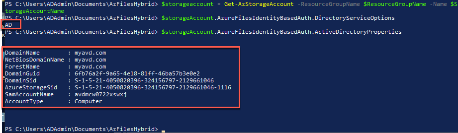

19. Confirm activation with your domain by navigating to the Azure portal, going to the storage account, and selecting **Files shares** under **Data storage**. Refer to the File share settings to see **Configured** on Active Directory (AD), as shown in the example below.

    >**Note**: You may need to navigate out of the storage account and back in for the File share settings to change.

    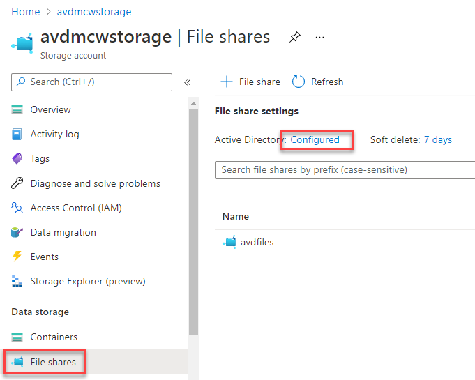

You have now successfully enabled AD authentication over SMB and assigned a custom role that provides access to an Azure file share with an AD identity.

### Task 4: Configure share permissions

There are three Azure built-in roles for granting share-level permissions to users and/or groups:

- **Storage File Data SMB Share Reader**: allows read access in Azure Storage file shares over SMB.

- **Storage File Data SMB Share Contributor**: allows read, write, and delete access in Azure Storage file shares over SMB.

- **Storage File Data SMB Share Elevated Contributor**: allows read, write, delete, and modify NTFS permissions in Azure Storage file shares over SMB.

To access Azure Files resources with identity-based authentication, an identity (a user, group, or service principal) must have the necessary permissions at the share level. This process is similar to specifying Windows share permissions, where you specify the type of access a particular user has to a file share. The guidance in this task demonstrates how to assign read, write, or delete permissions for a file share to an identity.

To simplify administration, create four new security groups in Active Directory to manage share permissions.

1. From a domain joined computer, open **Server Manager**, then navigate to **Tools** to open **Active Directory Users and Computers**.

    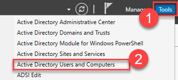

2. Under the local domain, select **Builtin** and select **Create a new group in the current container**.

    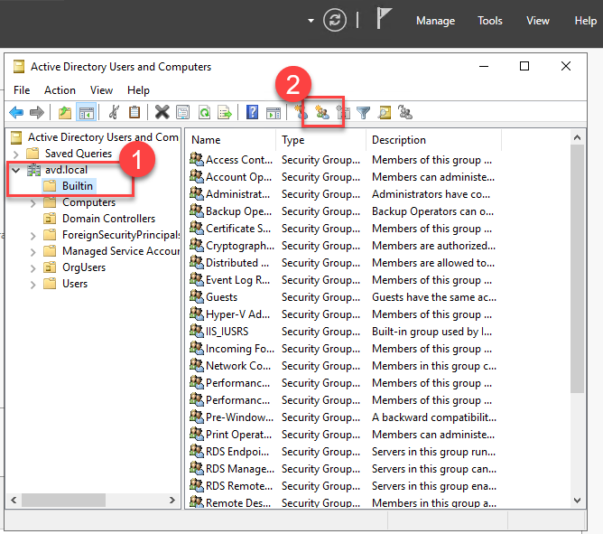

3. Create the following Active Directory security groups in an OU that is synchronized with Azure AD:

    - **AZF FSLogix Contributor**

        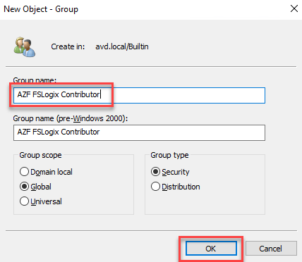

    - **AZF FSLogix Elevated Contributor**

        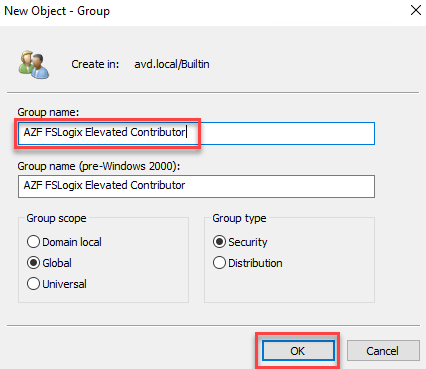

    - **AZF FSLogix Reader**

        

    - **AVD Users**

        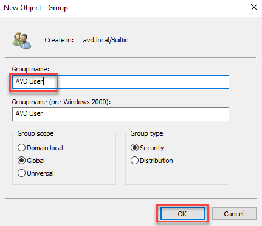

    - **AVD App Hosts**

        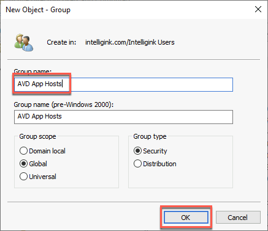

4. Add the AVD administrative account that you created previously to the group **AZF FSLogix Elevated Contributor**. This account will have permissions to modify file share permissions.

    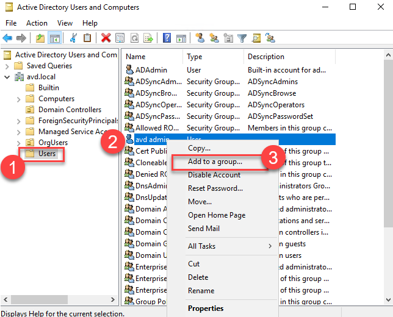

5. Type **AZF FSLogix Elevated Contributor** and select **Check Names** to verify. Select **Ok** to save.

    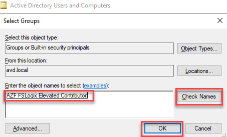

6. Add the group **AVD Users** to the group **AZF FSLogix Contributor** by going to the Builtin groups, locating AVDUsers, and right-click to **Add to a group**.
  
    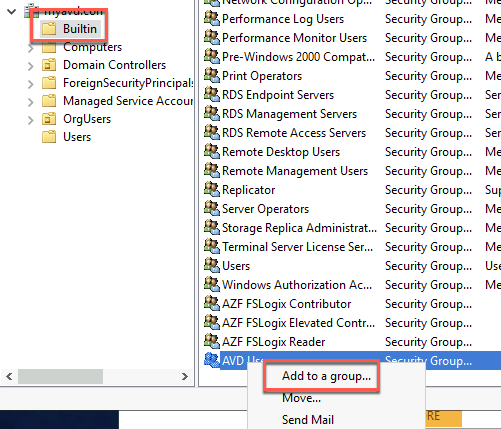

    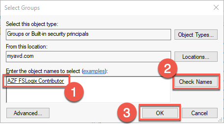

7. Add user accounts to the group **AVD Users** by selecting **OrgUsers** and choosing all the users in the list. Next, select all the users and right-click to add them to a group. These users will have access to use FSLogix profiles. Also, add the **AVD Admin** user to these groups.

    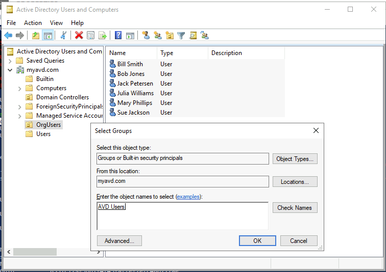

8. Wait for the new groups to synchronize with Azure AD. These groups can be verified by going to **Groups** within **Azure Active Directory** and looking for the names in the list.

    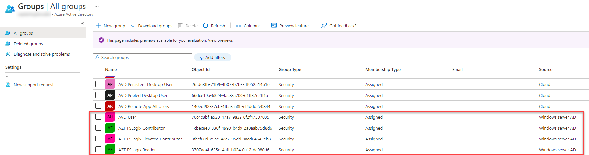

    With the new security groups available in Azure AD, use the following steps to assign them to your storage account in the Azure portal. This will enable you to manage share permissions using AD security groups.

9. In the Azure portal, in the **Search resources** field, type **storage accounts** and select **Storage accounts** from the list.

    

10. On the Storage accounts blade, select the Storage account you created in Task 1.

11. On the blade for your storage account, locate and select **File shares**. Then, on the File shares blade, select your file share.

    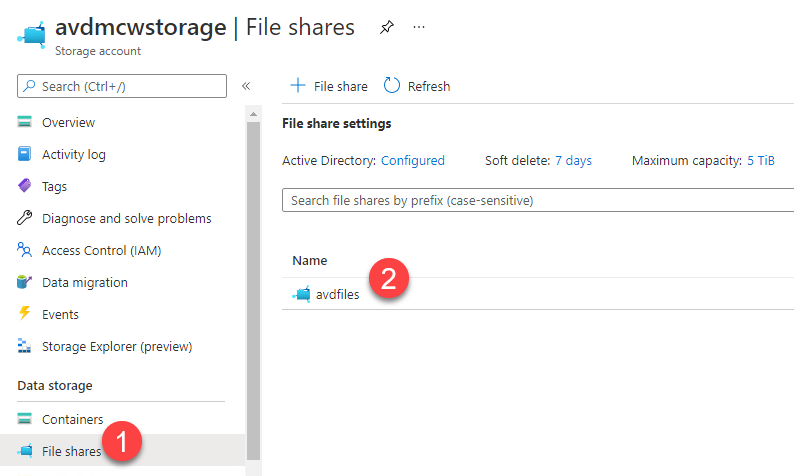

12. Select **Access Control (IAM)**, and then select **+ Add** and select **Add role assignment**.

    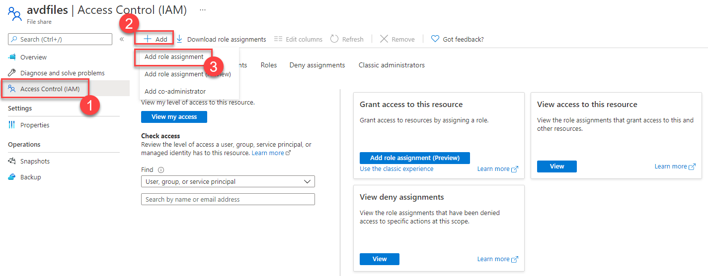

13. On the Add role assignment page, search for and select Storage File Data SMB Share Contributor and select **Next**.

    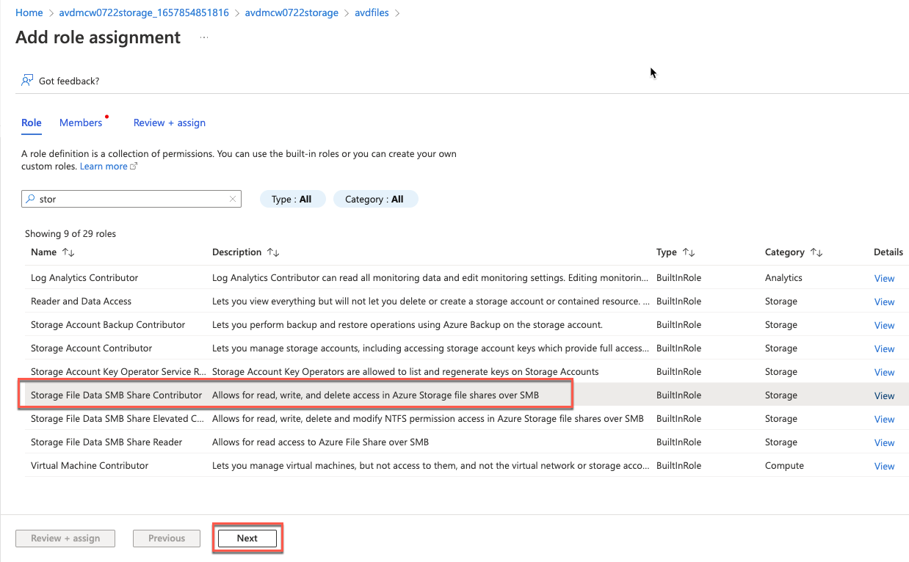

14. Select **+Select members** and add the **AZF FSLogix Contributor** and **AVD App Hosts** group. Select the **Select** button and then select **Review + assign** and **Review + assign** again.

    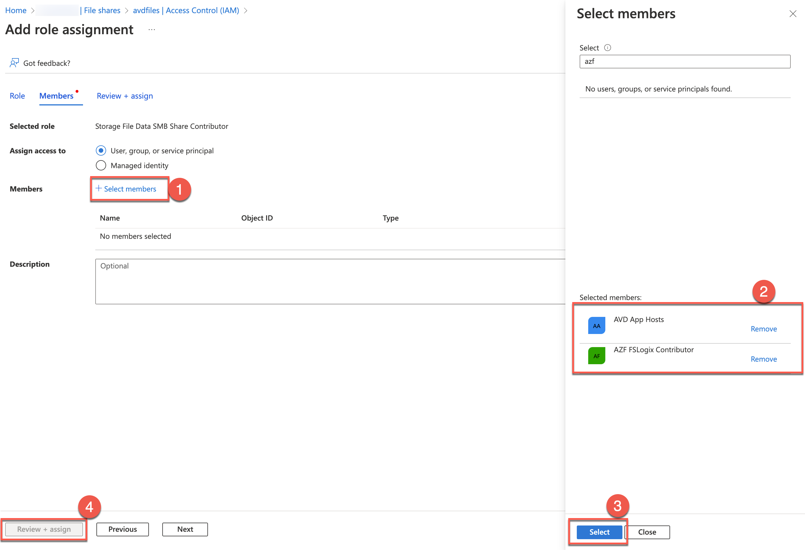

15. Repeat steps 12 - 14 for the remaining two roles.

    - Storage File Data SMB Share Elevated Contributor \> AZF FSLogix Elevated Contributor

    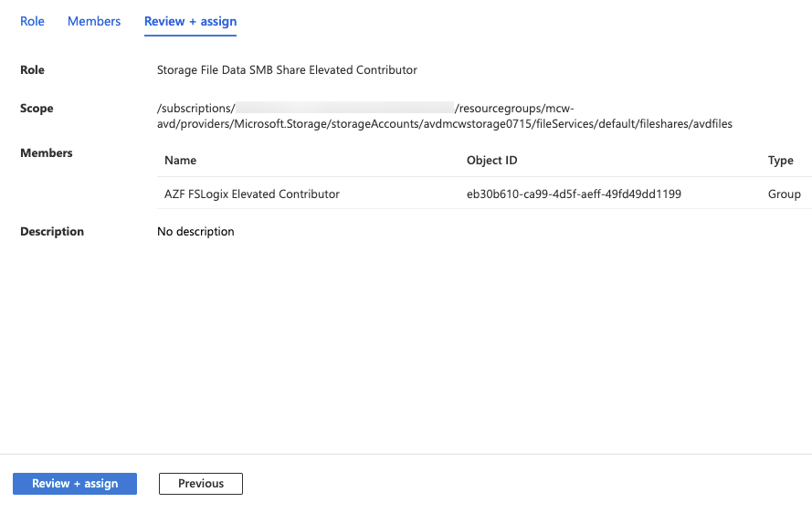

    - Storage File Data SMB Share Reader \> AZF FSLogix Reader

    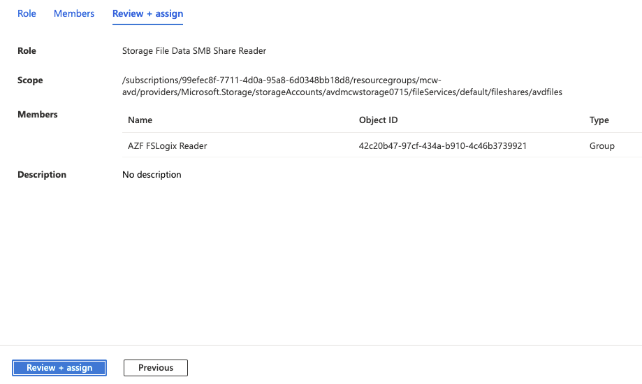

### Task 5: Configure NTFS permissions for the file share

After you assign share-level permissions with Azure RBAC, you must assign proper NTFS permissions at the root, directory, or file level. Think of share-level permissions as the high-level gatekeeper determining whether a user can access the share. Whereas NTFS permissions act at a more granular level to determine what operations the user can do at the directory or file level.

Azure Files supports the full set of NTFS basic and advanced permissions. You can view and configure NTFS permissions on directories and files in an Azure file share by mounting the share and then using Windows File Explorer or running the Windows iCACLS or Set-ACL command.

The first time you configure NTFS permission, do so using superuser permissions. This is accomplished by mounting the file share using your storage account key.

>**Note**: To complete this task, you will need to disable secure transfer in the storage account. This can be accessed from the storage account **Configuration** and selecting **Disabled** under **Secure transfer required**. Select **Save** to save the changes.

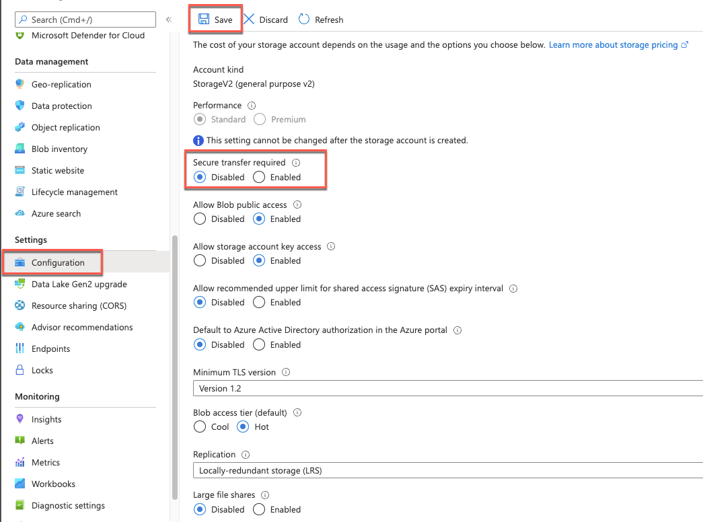

1. Reboot the domain controller you created before starting the lab. In some cases, this is needed to be able to grant NTFS permissions.

2. In the Azure portal, in the **Search resources** field, type **storage accounts** and select **Storage accounts** from the list.

3. On the Storage accounts blade, select File share in the storage account you created in Task 1.

4. On the blade for the file share within your storage account, select **Connect**. This will open the **Connect** blade. 

    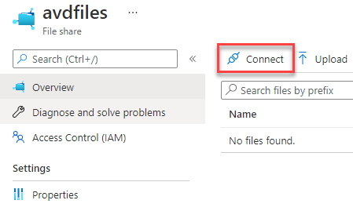

    >**Note**: The base URL is also available under the **Properties** of the storage account under the **File service** entry.  

5. On the **Connect** blade, select Drive letter **Z**, **Storage account key** for the Authentication method. 

    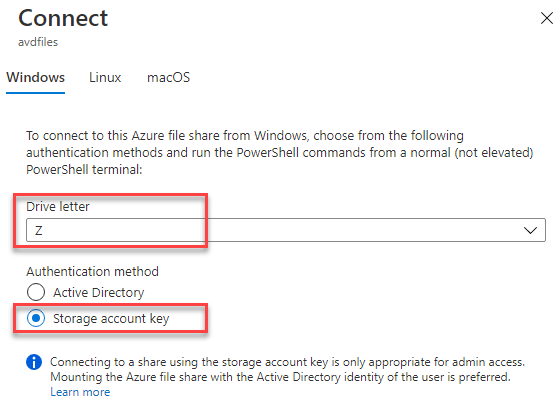

6. On the **Connect** blade for your storage account, copy the **PowerShell** script located in the gray text box.

    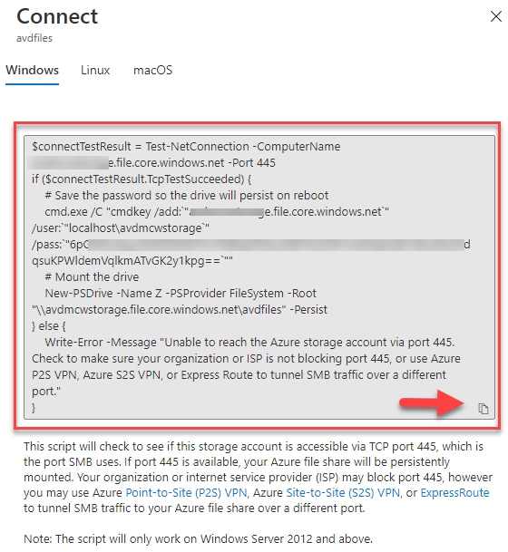

7. From a domain joined computer, open **PowerShell**, and paste the **PowerShell** script that you copied from the **Connect** blade. 

    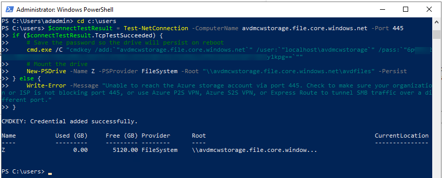

    >**Note**: After running the script, if you receive a CMDKEY: Credential added successfully and drive name **Z** appears, the script has run correctly. If this fails, it may be that this is an SMB connection on port 445, and many consumer ISPs block this port by default. When doing this in your lab and experiencing issues mounting the share from a local computer, try connecting from a domain-joined VM in Azure. 

    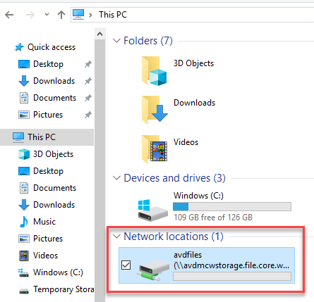

8. Open **File Explorer**, right-click on the **Z:** drive, and select **Properties**.

9. On the properties window, select the **Security** tab and select **Advanced**.

    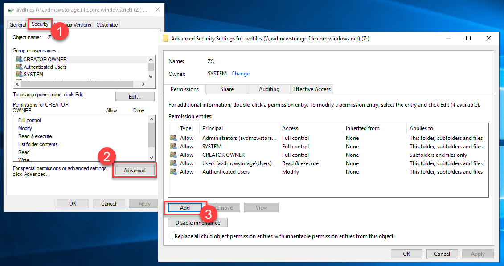

10. Select **Add** and add each of the AD security groups below with the appropriate permissions, you can only add one at a time. Select check names as each are entered to verify the connection.

    | AD Group | NTFS Permissions | Applies to |
    |----------|------------------|------------|
    | **AZF FSLogix Contributor** | Modify | This folder, subfolders, and files|
    | **AZF FSLogix Elevated Contributor** | Full control |This folder, subfolders, and files|
    | **AZF FSLogix Reader** | Read & execute |This folder, subfolders, and files|
    | **AVD Users** | Modify (This folder only) |This folder only|
    | **AVD App Hosts** | Modify | This folder, subfolders, and files |

    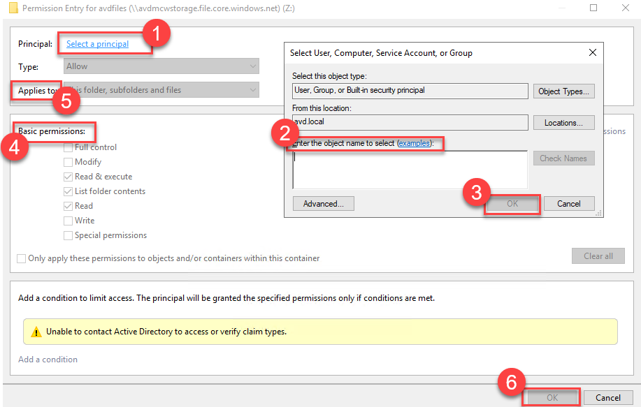

11. Repeat step 10 once for each AD Group, until all five are added.

12. Select **OK** to save your changes. Select **Yes** if you receive a **Windows Security** warning about removing inherited permissions.

    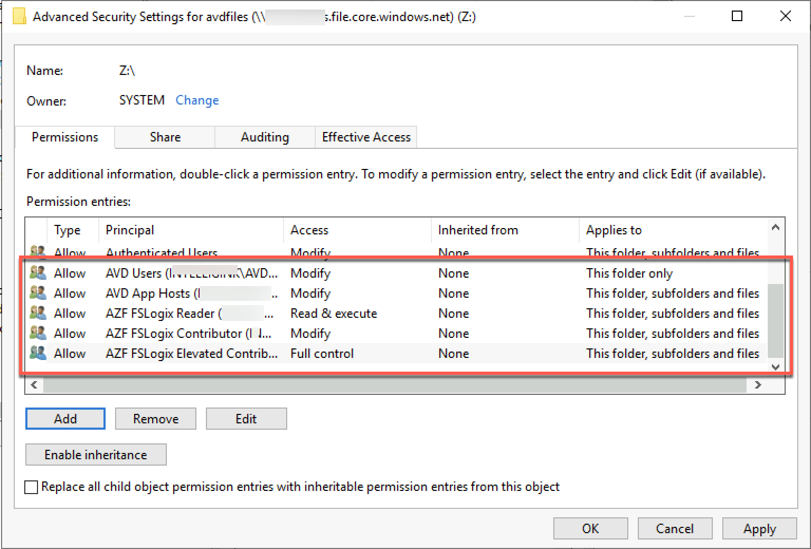

### Task 6: Configure NTFS permissions for the containers

With the NTFS permissions applied at the root file share, you can now create the FSLogix folder structure and recommended NTFS permissions. There are many ways to create secure and functional storage permissions for use with Profile Containers and Office Containers. Below is one configuration option that provides new-user functionality and doesn't require users to have administrative permissions.

In this task, we will create directories for each of the FSLogix profile types and assign the recommended permissions.

1. Navigate to the networked drive in File explorer.

    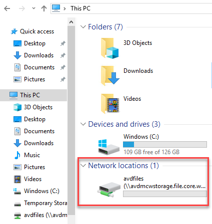

2. Create two new folder directories in the root share.

    - **Profiles**
    - **MSIX**

    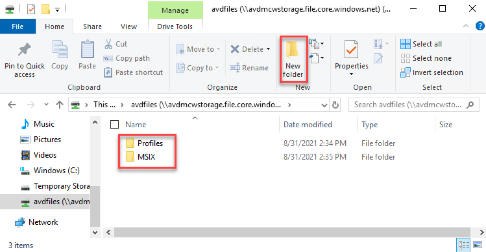

3. Right-click on the **Profiles** directory and select **Properties**.

4. On the properties window, select the **Security** tab and select **Advanced**.

5. Select **Disable inheritance** and select **Remove all inherited permissions from this object**.

    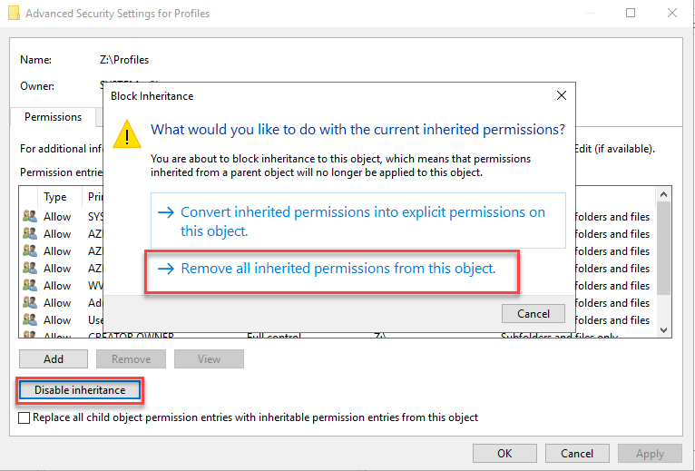

6. Select **Add** and add **AZF FSLogix Elevated Contributor**. Grant **Full Control** and check **Only apply these permissions to objects and/or containers within this container**. Select **OK**.

    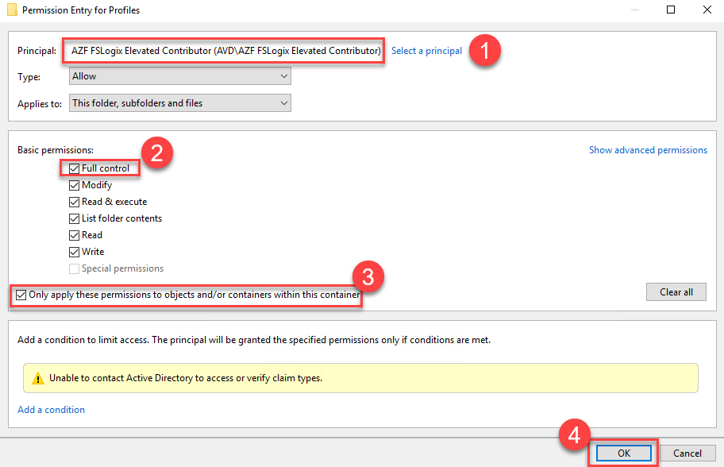

7. Select **Add** and add **Creator owner**. Grant **Full Control** to **Only apply these permissions to objects and/or containers within this container**. Select **OK**.

    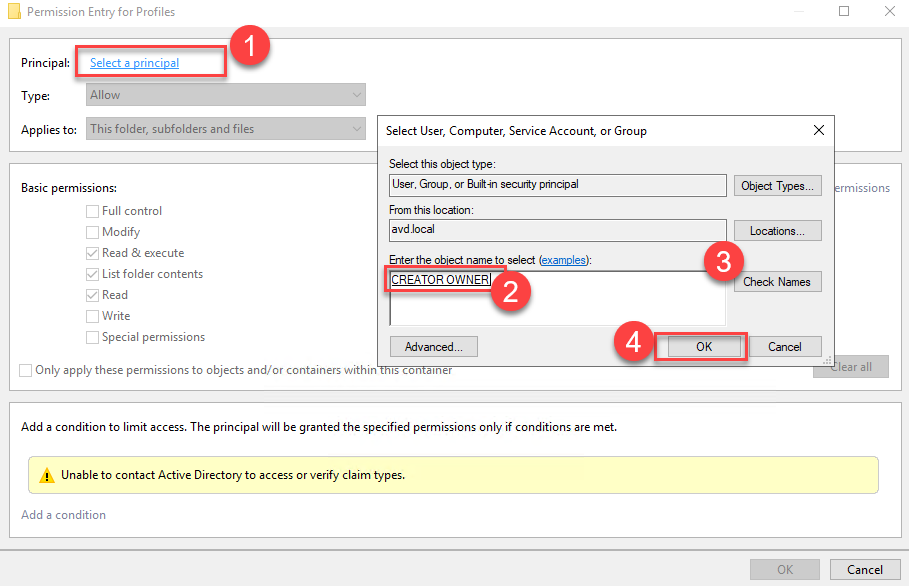

    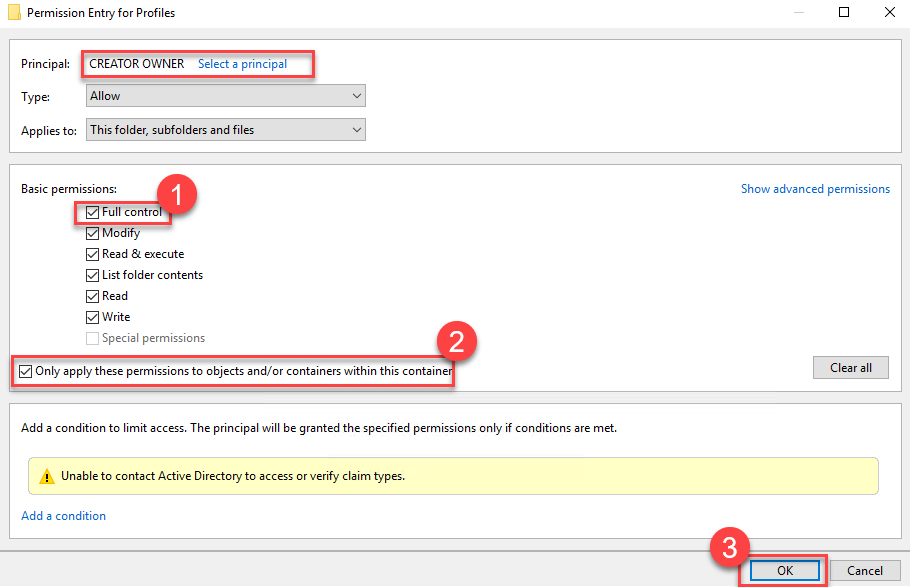

8. Select **Add** and add **AVD Users**. Grant the following four special permissions and select to **Only apply these permissions to objects and/or containers within this container**. Select **OK**.

    - Traverse folder / execute file

    - List folder / read data

    - Read attributes

    - Create folders / append data

    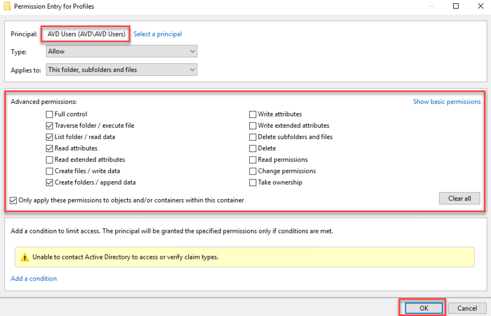

9. Select **OK** on both property windows to apply your changes.

    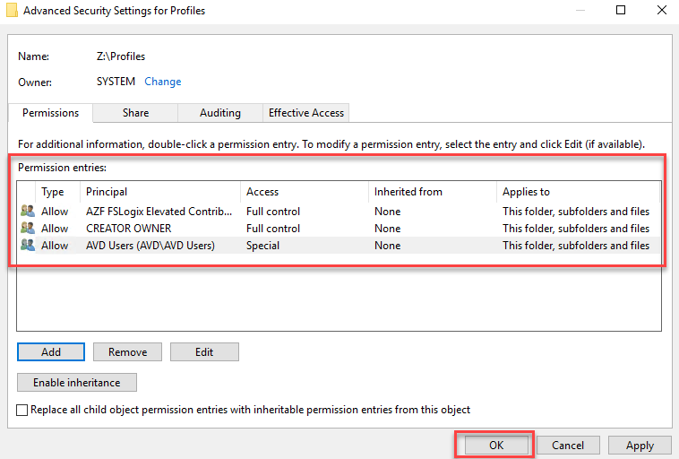

10. Right-click on the **MSIX** directory and select **Properties**.

11. On the properties window, select the **Security** tab and select **Advanced**.

12. Select **Disable inheritance** and select **Remove all inherited permissions from this object**.

    

13. Select **Add** and add **AZF FSLogix Elevated Contributor**. Grant **Full Control** to **Only apply these permissions to objects and/or containers within this container**. Select **OK**.

    

14. Select **Add** and add **AVD Users**. Grant **Read & execute** to **Only apply these permissions to objects and/or containers within this container**. Select **OK**.

    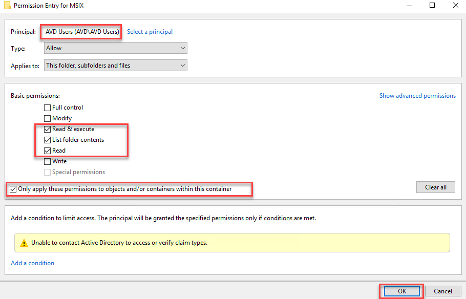

15. Repeat the step above for **AVD App Hosts**.

16. Confirm your permissions match the screenshots below.

    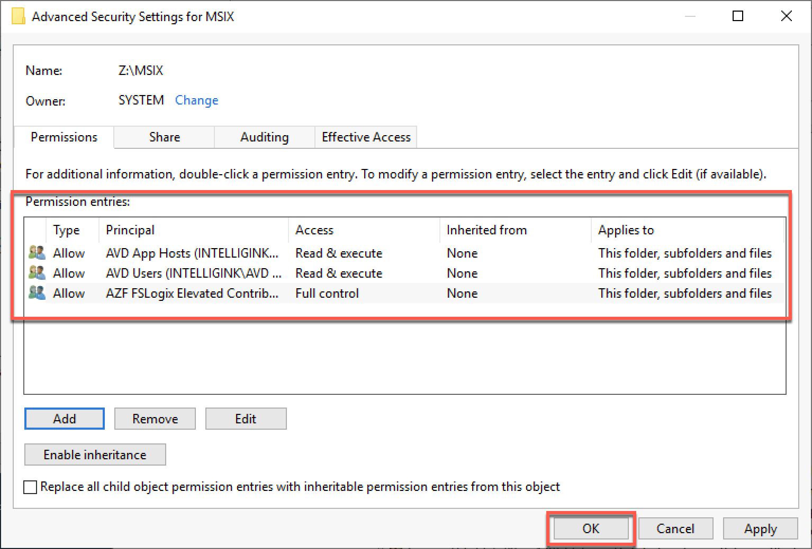

16. Select **OK** on both property windows to apply your changes.

Your Azure Files Share is now ready for FSLogix profile containers.

## Exercise 4: Create a gold image for AVD

Duration:  90 minutes

In this exercise, you will walk through the process of creating a gold image for your AVD host pools. The basic concept for a gold image is to start with a clean base install of Windows and layer on mandatory updates, applications, and configurations. There are many ways to create and manage images for AVD. The steps covered in this exercise will walk you through a basic build and capture process that includes core applications and recommended configuration options for AVD.

**Additional Resources**

  |              |            |  
|----------|:-------------:|
| Description | Links |
| Create a managed image of a generalized VM in Azure | https://docs.microsoft.com/en-us/azure/virtual-machines/windows/capture-image-resource |
  |   For more information on how to deploy a virtual machine in Azure |https://docs.microsoft.com/en-us/azure/virtual-machines/windows/quick-create-portal |
For more information on how to set up a Bastion host in Azure|https://docs.microsoft.com/en-us/azure/bastion/bastion-create-host-portal|
  |              |            | 

### Task 1: Create a new Virtual Machine (VM) in Azure

1. Sign in to the [Azure Portal](https://portal.azure.com/) with the same account you used to set up the storage account.

2. On the Azure portal home page, select **Create a resource**.

3. On the New page, search for **Microsoft Windows 10**. Select one of the **Windows 10 Enterprise multi-session** builds and **Create**.

    >**Note:** The higher the version, the better to minimize the number of Windows updates you need to install later.

    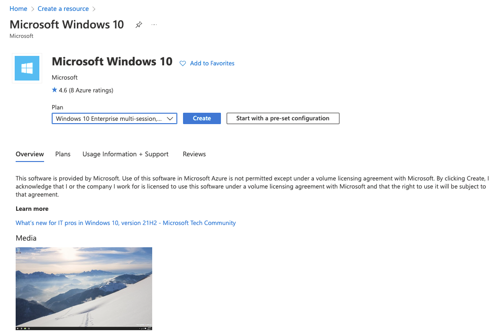

    >**Note**: In this exercise, we are selecting a base Windows 10 image to start with and installing Office 365 ProPlus using a custom deployment script. We are also using the latest available release of Windows 10 Enterprise multi-session, but you can choose the version based on your requirements.

4. On the Create a virtual machine page, fill in the required fields shown below. 

    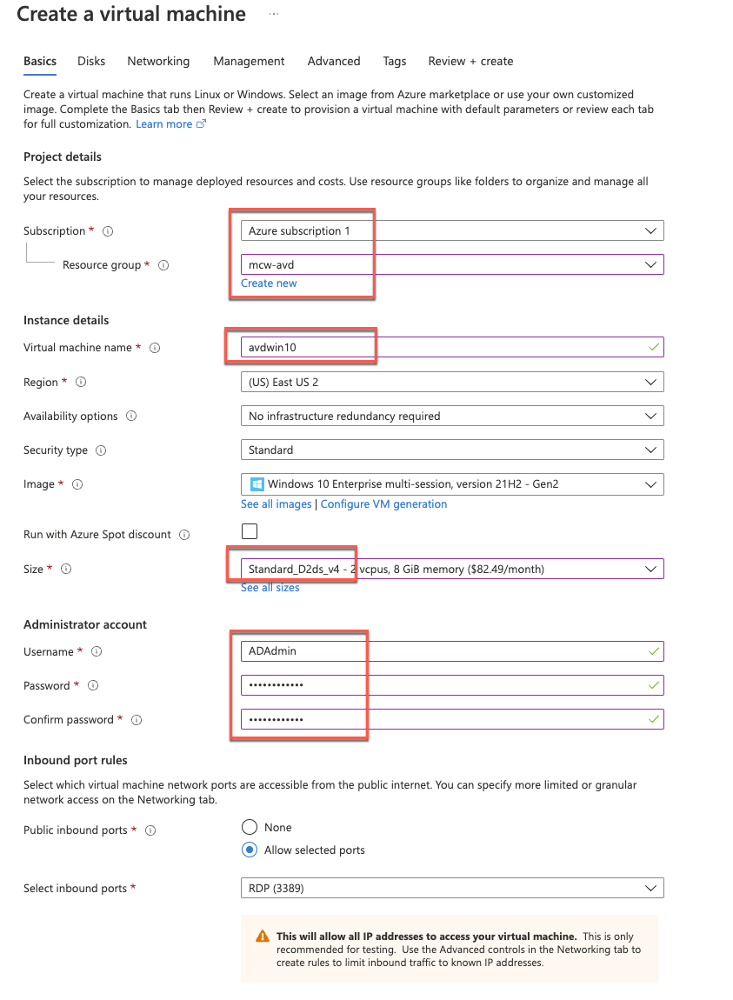

    >**Note**: Make a note of the **username** and **password** used to create the VM. This information will be required to access the VM after creation.
    >
    >**Note**: This guide does not walk through the process of creating a VM in Azure. However, for **Inbound port rules**, be sure to allow **RDP (3389)**, or have a bastion host deployed for remote access.

    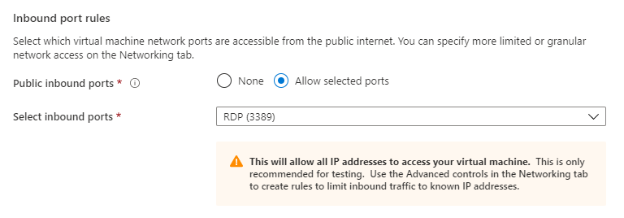

5. Select the checkbox to confirm eligible Windows 10 licensing and create the VM by selecting **Review + create** and then **Create**.

    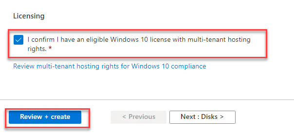

6. Once the VM is successfully deployed, go to the resource and connect using RDP. Sign in using the credentials you supplied when creating the VM.

    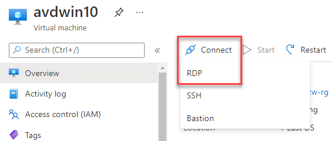

7. Download the RDP file and open the RDP file to connect.

    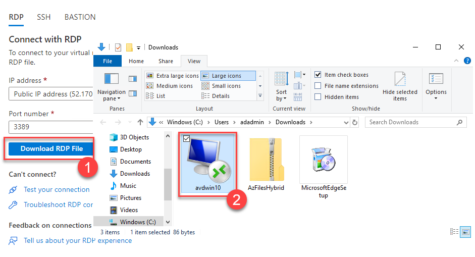

### Task 2: Run Windows Update

Despite the Azure support team's best efforts, the Marketplace images are not always up to date. Therefore, the best and most secure practice is keeping your gold image updated.

1. From your gold image VM, open the **Settings** app and select **Updates & Security**.

    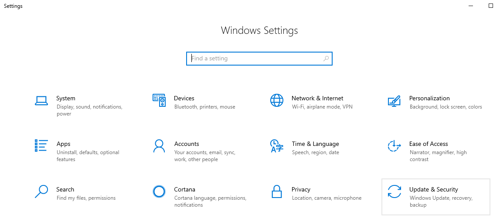

2. Install all missing updates, rebooting as necessary.

    >**Note**: After initial updates found during startup have been installed and you have rebooted the VM, check for updates again before proceeding. There may be additional updates that need to be installed.

3. Once the VM is fully patched, the Windows Update Settings page should resemble the following screenshot.

    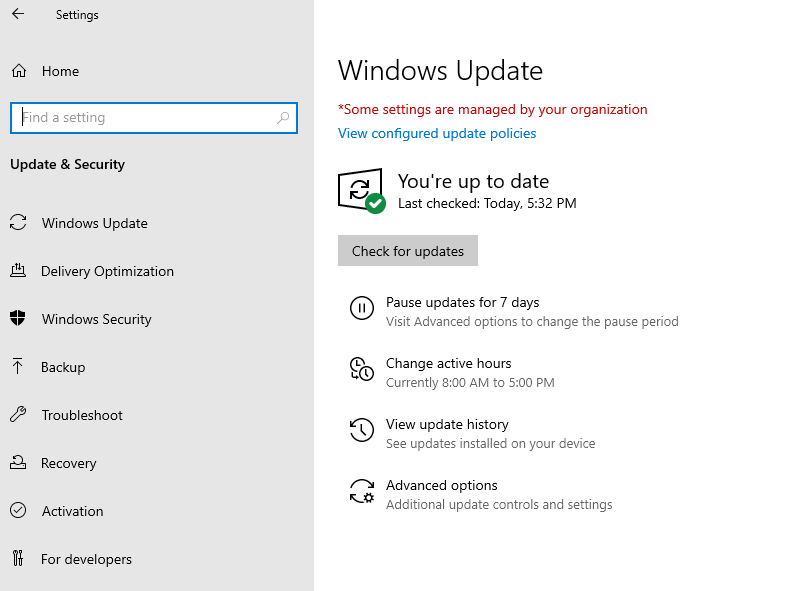

### Task 3: Prepare an AVD image

**Introduction to the script**

The authors for this content have developed a scripted solution to assist in automating some common baseline image build tasks. The script includes a UI form, enabling you to quickly select which actions to perform. The result will be a custom gold image that incorporates Microsoft's main business applications, along with the necessary
policies and settings for an optimized user experience.

The script and related tools are maintained within this GitHub repo at https://github.com/microsoft//MCW-Implementing-Azure-Virtual-Desktop-in-the-enterprise/tree/main/Hands-on%20lab/resources/AVDImageTools. This is based on the tools available from https://github.com/shawntmeyer/WVD/tree/master/Image-Build/Customizations.

[Download Link](https://minhaskamal.github.io/DownGit/#/home?url=https://github.com/microsoft/MCW-Implementing-Azure-Virtual-Desktop-in-the-enterprise/tree/main/Hands-on%20lab/resources/AVDImageTools) 

https://minhaskamal.github.io/DownGit/#/home?url=https://github.com/microsoft/MCW-Implementing-Azure-Virtual-Desktop-in-the-enterprise/tree/main/Hands-on%20lab/resources/AVDImageTools

For additional documentation about the script (e.g., parameters, functions, etc.), refer to the comments in **Prepare-WVDImage.ps1**.

For troubleshooting script execution, refer to the following log directory on the target machine: **C:\\Windows\\Logs\\ImagePrep**.

This script leverages the [Local Group Policy Object (LGPO)](https://docs.microsoft.com/en-us/windows/security/threat-protection/security-compliance-toolkit-10#what-is-the-local-group-policy-object-lgpo-tool) tool in the [Microsoft Security Compliance Toolkit (SCT)](https://docs.microsoft.com/en-us/windows/security/threat-protection/security-compliance-toolkit-10) to apply settings in the image. The settings are documented and exported on the target machine under **C:\\Windows\\Logs\\ImagePrep\\LGPO**. This approach was taken to simplify troubleshooting, enabling you to leverage Group Policy Results.

The UI form offers the following actions:

**Office 365 ProPlus**

- Install the **latest** version of Microsoft 365 Apps for Enterprise monthly channel.

- Apply recommended settings.

- Source documentation: [Install Office on a gold VHD image](https://docs.microsoft.com/en-us/azure/virtual-desktop/install-office-on-wvd-master-image).

**OneDrive for Business**

- Install the **latest** version of OneDrive for Business *per-machine*.

- Source documentation: [Install Office on a gold VHD image](https://docs.microsoft.com/en-us/azure/virtual-desktop/install-office-on-wvd-master-image).

**Microsoft Teams**

- Install the **latest** version of Microsoft Teams *per-machine*.

- Source documentation: [Use Microsoft Teams on Azure Virtual desktop](https://docs.microsoft.com/en-us/azure/virtual-desktop/teams-on-avd).

**FSLogix Profile Containers**

- Install the **latest** version of the FSLogix Agent.

- Apply recommended settings.

- Source documentation: [Download and Install FSLogix](https://docs.microsoft.com/en-us/FSLogix/install-ht).

**OS Settings**

- Apply the recommended AVD settings for image capture.

- Source documentation: [Prepare and customize a gold VHD image](https://docs.microsoft.com/en-us/azure/virtual-desktop/set-up-customize-master-image).

- Apply the recommended settings for capturing an Azure VM.

- Source documentation: [Prepare a Windows VHD or VHDX to upload to Azure](https://docs.microsoft.com/en-us/azure/virtual-machines/windows/prepare-for-upload-vhd-image). 

- Run Disk Cleanup.

- Source documentation: [cleanmgr](https://docs.microsoft.com/en-us/windows-server/administration/windows-commands/cleanmgr). 

**Running the script**

1. [**Download**](https://minhaskamal.github.io/DownGit/#/home?url=https://github.com/microsoft/MCW-Implementing-Azure-Virtual-Desktop-in-the-enterprise/tree/main/Hands-on%20lab/resources/AVDImageTools) the .zip file to your local workstation.

    https://minhaskamal.github.io/DownGit/#/home?url=https://github.com/microsoft/MCW-Implementing-Azure-Virtual-Desktop-in-the-enterprise/tree/main/Hands-on%20lab/resources/AVDImageTools

    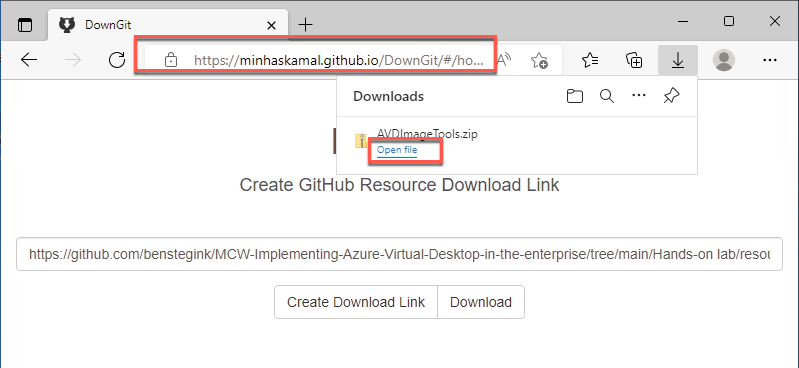

2. **Open** the .zip file on your local workstation. Open the RDP window to your gold image VM. **Save as** the .zip file to the documents folder.

3. Extract the files to **C:\AVDGold**.

    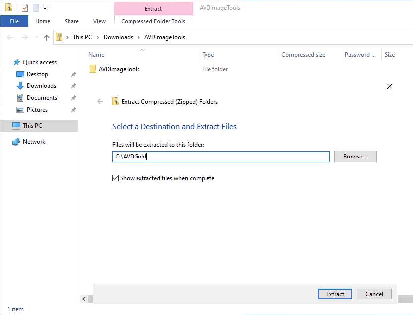

4. Open an elevated PowerShell window by searching for PowerShell on the Windows 10 VM. Right-click and run as administrator.

    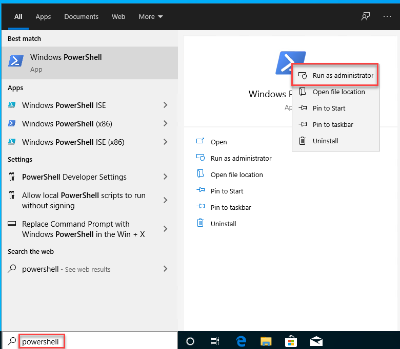

5. Navigate to \"C:\AVDGold\AVDImageTools\Prepare-AVDImage".

    ```powershell
    cd C:\AVDGold\AVDImageTools\Prepare-AVDImage
    ```

6. Run the following command to allow for script execution:

    ```powershell
    Set-ExecutionPolicy -ExecutionPolicy Bypass -Scope Process -Force
    ```

7. Execute the script by running the following command:

    ```powershell
    .\Prepare-AVDImage.ps1 -DisplayForm
    ```

    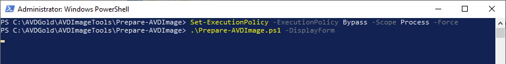

    This will trigger the PowerShell form to launch. First, select the appropriate options based on the following input information.

    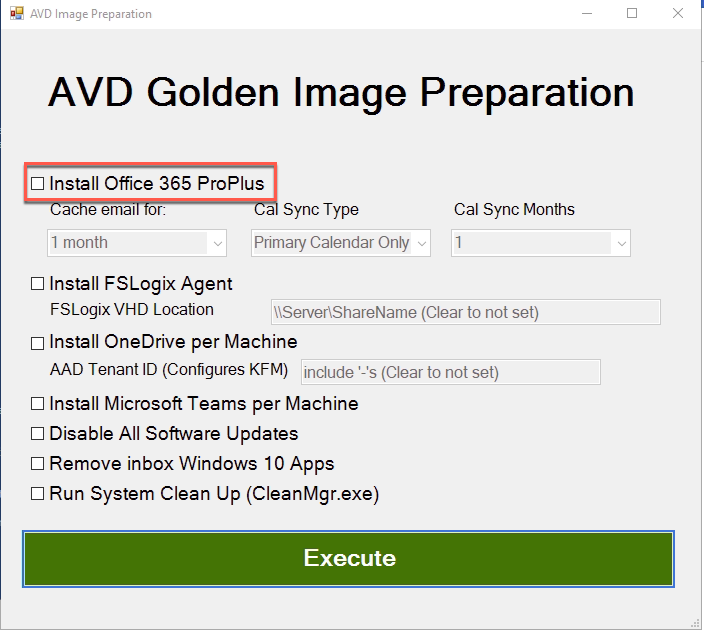

    - Select **Install Office 365** to Install Microsoft 365 Apps for enterprise while excluding Teams, Groove, and Skype. This will enable the Email and Calendar Caching settings below.

        >**Note**: Update these settings as necessary. The Microsoft recommended settings are pre-selected. When you do not wish to apply these settings to the image, set each to \'Not Configured\'.

    - Select **Install FSLogix Agent** to install the FSLogix Agent. When you select this option, the option to specify the FSLogix User Profile Container VHD Path is enabled. You do not want to specify this option in the image so blank out this setting.

    - Select **Install OneDrive per Machine** to install the OneDrive sync client per machine. When you select this option, it will enable the AAD Tenant ID field. Enter your tenant id here to enable silent Known Folder Move functionality in your image. We don't want this in our image for this lab, so blank out this setting as well.

    - Select **Install Microsoft Teams per Machine** to install the per machine Teams install.

    - Select **Install Microsoft Edge Enterprise+** to install the Microsoft Edge Enterprise browser based on Chromium.

    - Select **Disable Windows Update** to disable Windows Update in the image.

    - Clear **Remove inbox Windows 10 Apps**.

    - Select **Run System Clean Up (CleanMgr.exe)** to execute Disk Cleanup.

    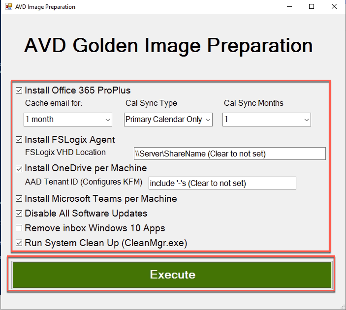

8. With the desired options selected, select **Execute**.

    The form will close at this point, and the script will begin configuring the image. **DO NOT close any of the remaining windows that appear until the script has finished execution**. Doing so will interrupt the process and will require you to start over.

    The script will take several minutes to complete depending on the options you selected. However, additional input from you is not required during this stage, so feel free to minimize the RDP session and work on other tasks.

    - When you select to install Office 365, you will see a setup.exe window during execution.

    - When you select to install OneDrive, you will see a OneDrive window during execution.

    - When you select to run System Clean Up, you will see the Disk Cleanup wizard during execution. This window may stay on the \"Windows Update Cleanup\" task for a few minutes while it cleans out older files in the Windows Side by Side.

    >**Note**: This script takes some time to run, so be patient as it may seem like nothing is happening for a while, and then applications will begin to install. You can watch the status from within PowerShell. After the Disk Cleanup Wizard closes, you may notice the PowerShell window does not update. It is waiting for the cleanmgr.exe process to close, which can take some time. You can select the PowerShell window and continue to hit the up arrow on your keyboard until you are presented with an active prompt.

    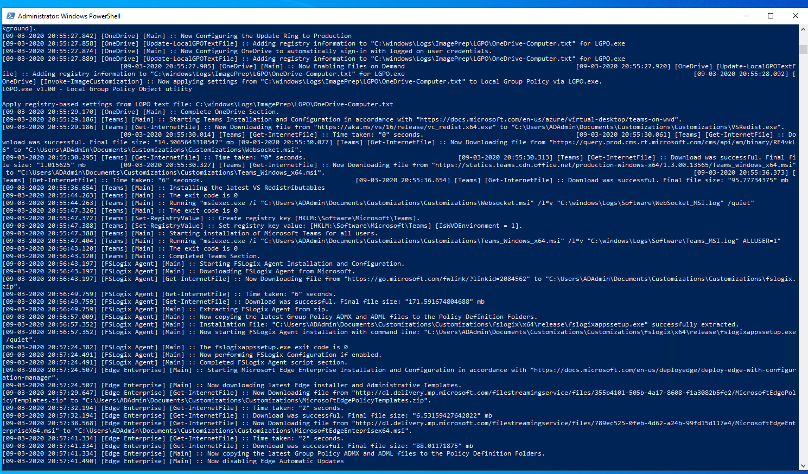

9. As part of the script, you may be logged off, or the computer may reboot. If so, log back in and rerun the script. This time without OneDrive selected.

10. After the script has completed, select the Window start icon and note that Office and Microsoft Teams have been installed.

    

11. Once the script has completed execution, complete these final tasks:

     - Delete the C:\AVDGold directory from the computer.

     - Empty the Recycle Bin.

     - Copy the C:\\Windows\\Logs\\ImagePrep\\LGPO directory to your local workstation.

     - Reboot the VM.

        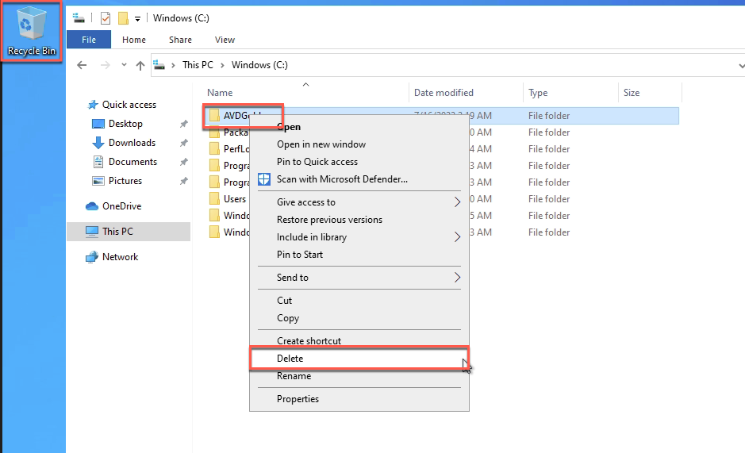

        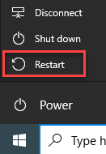

### Task 4: Run Sysprep

1. After the VM has rebooted, reconnect your RDP session and sign in.

2. Open an administrative command prompt.

3. Navigate to: **C:\\Windows\\System32\\Sysprep**.

    ```cmd
    cd C:\Windows\System32\Sysprep
    ```

4. Run the following command to sysprep the VM and shutdown:

    ```cmd
    sysprep.exe /oobe /generalize /shutdown
    ```

The system will automatically shut down and disconnect your RDP session.

### Task 5: Create a managed image from the gold Image VM

1. Sign in to the [Azure Portal](https://portal.azure.com/).

2. At the top of the page, in the **Search resources** field, type **virtual machines**. Select **Virtual machines** from the list.

    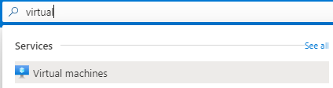

3. On the Virtual machines blade, locate the VM you used for your gold image and **select** the name.

4. On the Overview blade for your VM, confirm the **Status** shows **Stopped**. Select **Stop** in the menu bar to move it to a deallocated state.

    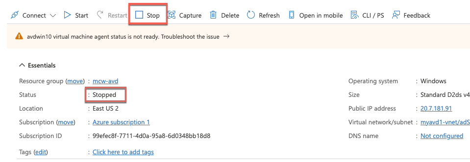

    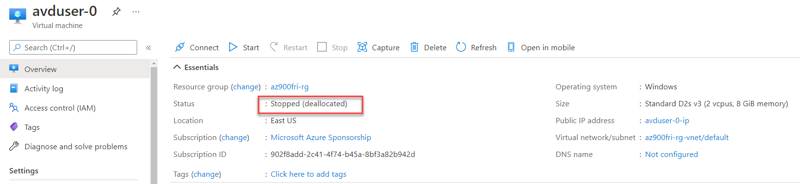

5. Once complete, select **Capture** in the menu bar.

    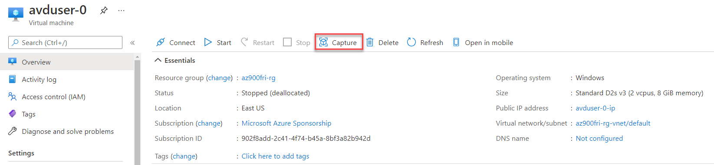

6. On the Create image wizard, fill in the required fields, and select **Review + create**, then select **Create**.

    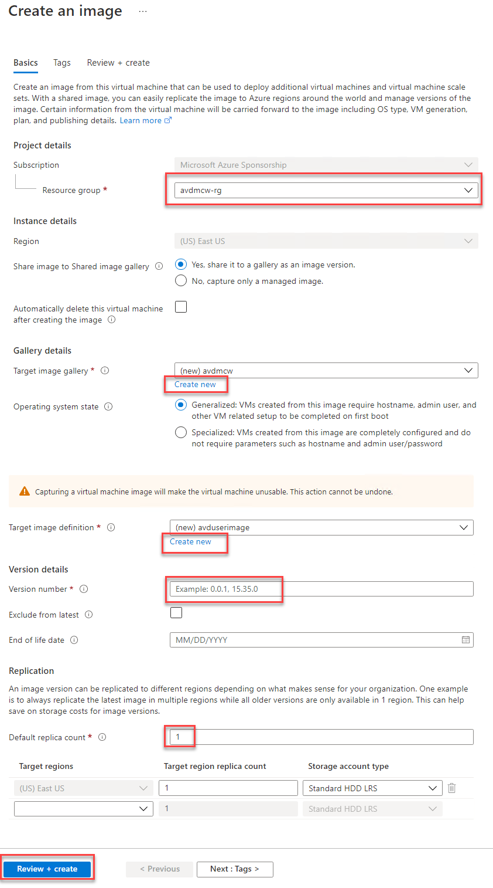

7. Once complete, type **VM image definitions** in the **Search resources field** at the top of the page. Select **VM image definitions** from the list.

8. Locate your image and **Select** the name.

    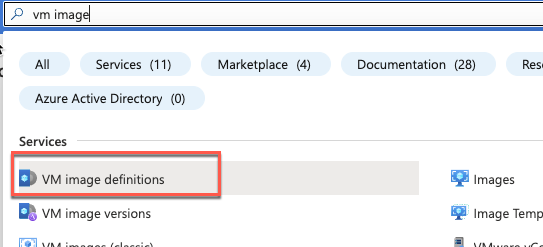

9. On the Overview blade for your image, make note of the **Name** field and **Resource group** field. These attributes are needed when you provision your host pools.

    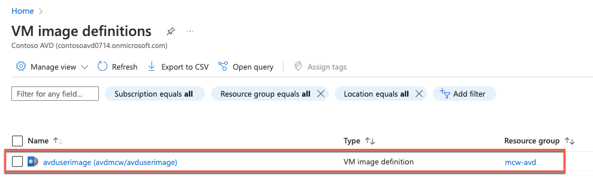

## Exercise 5: Create a host pool for personal desktops

Duration:  45 minutes

In this exercise, we will create an Azure Virtual Desktop host pool for personal desktops. This is a set of computers or hosts which operate on an as-needed basis. In a pooled configuration, we will host multiple non-persistent sessions with no user profile information stored locally. This is where FSLogix Profile Containers dynamically provide the users' profile to the host. This allows an organization to fully utilize the compute resources on a single host and lower the total overhead, cost, and the number of remote workstations.

**Additional Resources**

  |              |            |  
|----------|:-------------:|
| Description | Links |
| Create a host pool with the Azure portal | https://docs.microsoft.com/en-us/azure/virtual-desktop/create-host-pools-azure-marketplace |
  |              |            |

### Task 1: Create a new Host Pool and Workspace

1. Sign in to the [Azure Portal](https://portal.azure.com/).

2. Search for **Azure Virtual Desktop** and select it from the list.

    

3. Under Manage, select **Host pools**, and select **+ Create**.

    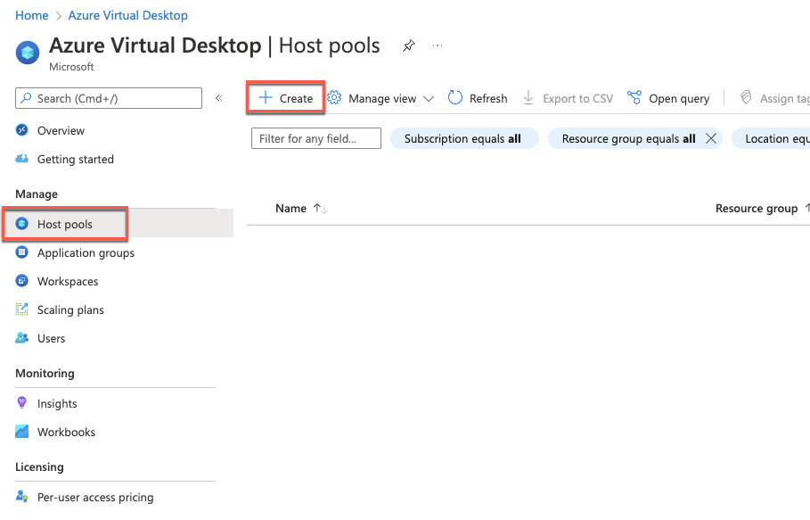

4. On the Basics page, change **Validation environment** to **Yes**. Set the host pool type to **Personal** and Assignment type to **Automatic**. Once complete, select **Next: Virtual Machines**.

    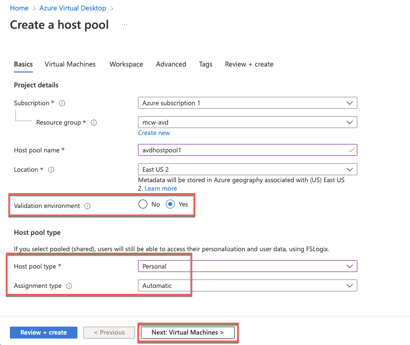

5. Toggle **Add Azure virtual machines** to **Yes** and configure the Virtual Machines settings as follows:

   - Resource Group: The Resource Group you deployed the host pool in
   - Name prefix: Choose anything; shorter is better
   - Virtual machine location: Location you deployed your other AVD resources
   - Available options: No infrastructure redundancy required
   - Image: select a minimum of **Windows 10 Enterprise Cloud PC, version 21H2 + Microsoft 365 Apps - Gen 1**
   - Virtual network: The AVD virtual network your other AVD Hosts are connected to.
   - AD domain join UPN: your adadmin@domain.com users
   - Password: a complex password your adadmin user will have
   - Virtual Machine Administrator account.
     - Username: a user name to be added as a local admin
     - Password and Confirm password: the password you want to assign to your local admin.

   >**Note**: Selecting an image with Microsoft 365 Apps is important. You will need Microsoft 365 to assign apps in this exercise.

    

    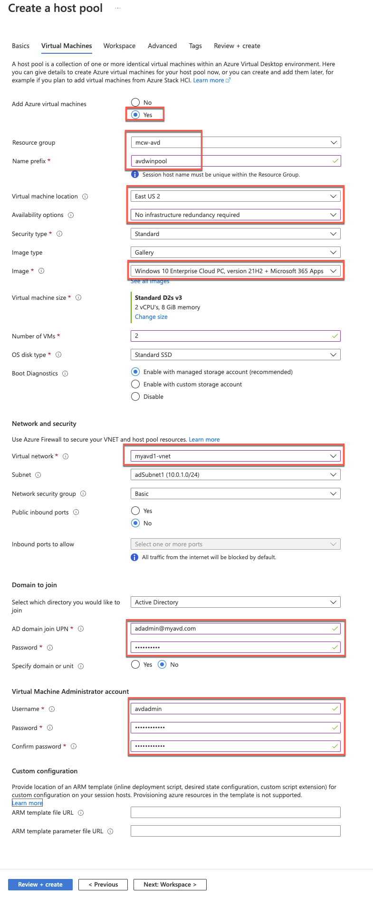

6. On the Workspace page, select **Yes** to register a new desktop app group. Select **Create new** and provide a **Workspace name**. Select **OK** and **Review + create**.

    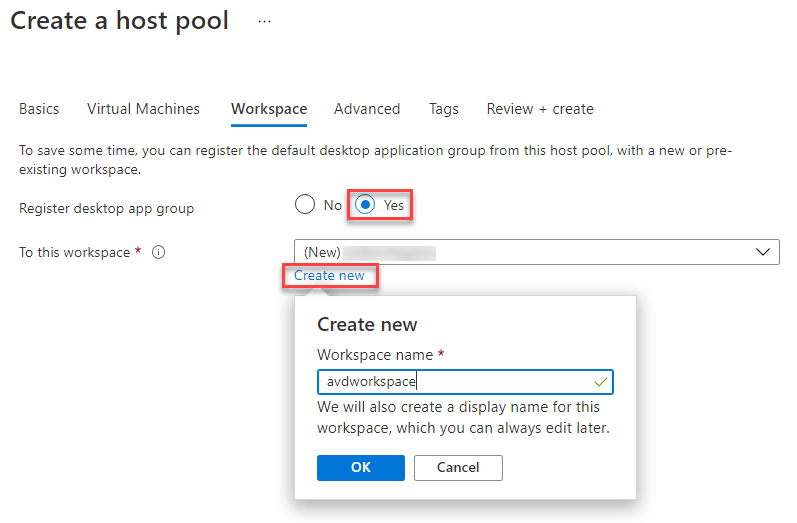

7. On the Create a host pool page, select **Create**.


### Task 2: Create a friendly name for the workspace

The name of the Workspace is displayed when the user signs in. Available resources are organized by Workspace. For a better user experience, we will provide a friendly name for our new Workspace.

>**Note**: The workspace will not appear until Task 1 has completed deployment.

1. Sign in to the [Azure Portal](https://portal.azure.com/).

2. Search for **Azure Virtual Desktop** and select it from the list.

    

3. Under Manage, select **Workspaces**, locate the Workspace you want to update and select the name.

    

4. Under Settings, select **Properties**.

5. Update the **Friendly name** field to your desired name and select **Save**.

    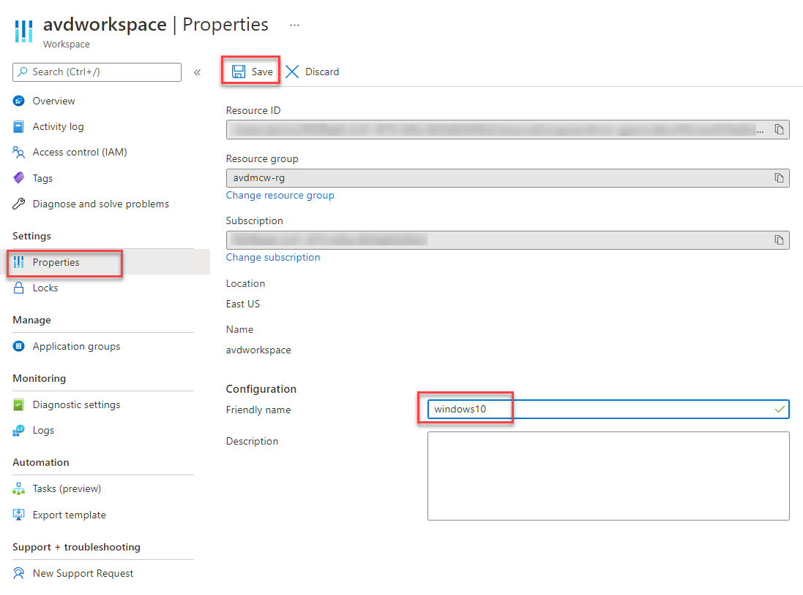

### Task 3: Assign an Azure AD group to an application group

In the new Azure Virtual Desktop ARM portal, we can now use Azure Active Directory groups to manage access to our host pools.

1. Sign in to the [Azure Portal](https://portal.azure.com/).

2. Search for **Azure Virtual Desktop** and select it from the list.

    

3. Under Manage, select **Application groups**.

4. Locate the Application group created as part of Task 1 (**\<poolName\>-DAG**). Select the name to manage the Application group.

    

5. Under Manage, select **Assignments**, and select **+ Add**.

    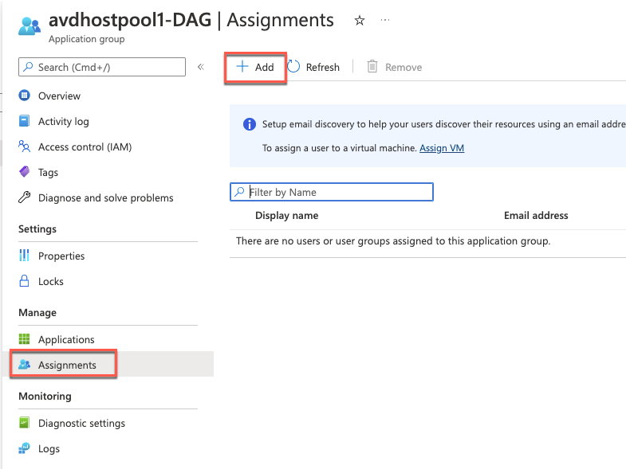

6. In the fly-out, enter **AVD** in the search to find the name of your Azure AD group. In this exercise, we will select **AVD Pooled Desktop Users** and **AAD DC Administrators**.
    >**Note**: AAD DC Administrators will allow you to use your Azure tenant login to access resources in Exercise 7.

    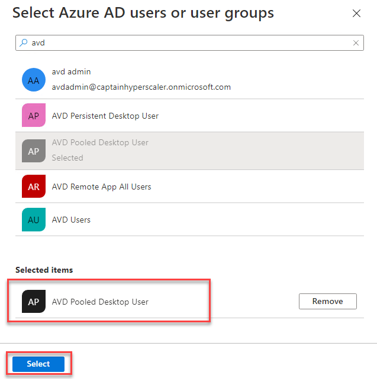

7. Choose **Select** to save your changes.

    

With the assignment added, you can move on to the next exercise. The users in the Azure AD group can be used to validate access to the new host pool in a later exercise.

## Exercise 6: Create a host pool from your custom image and assign pooled remote apps.

Duration:  45 minutes

In this exercise, you will create a non-persistent host pool for publishing remote apps. This enables you to assign users access to specific applications rather than an entire desktop. This type of application deployment serves many purposes and is not new to AVD but has existed in Windows Server Remote Desktop Services for many years.

Before continuing this exercise, check your available regional vCPUs and increase your quota if necessary. You'll need a minimum of 4 vCPU cores available for this exercise.

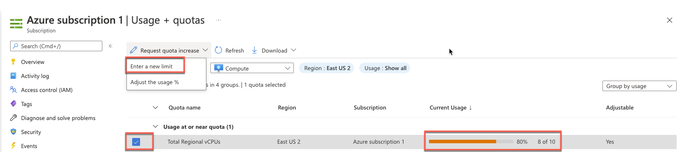

**Additional Resources**

  |              |            |  
|----------|:-------------:|
| Description | Links |
| Publish built-in apps in Azure Virtual Desktop | https://docs.microsoft.com/en-us/azure/virtual-desktop/publish-apps |
| Manage app groups with the Azure portal | https://docs.microsoft.com/en-us/azure/virtual-desktop/manage-app-groups |
  |              |            | 

### Task 1: Create a new host pool and workspace

1. Sign in to the [Azure Portal](https://portal.azure.com/).

2. Search for **Azure Virtual Desktop** and select it from the list.

    

3. Under Manage, select **Host pools**, and select **+ Create**.

    

4. On the Basics page, fill in the fields as follows:
   - Host pool name: **avdremotepool1**
   - Validation environment: **Yes**
   - Host pool type: **Pooled**
   - Load balancing algorithm: **Breadth-first**
   - Max session limit: 5

   Once complete, select **Next: Virtual Machine**.

    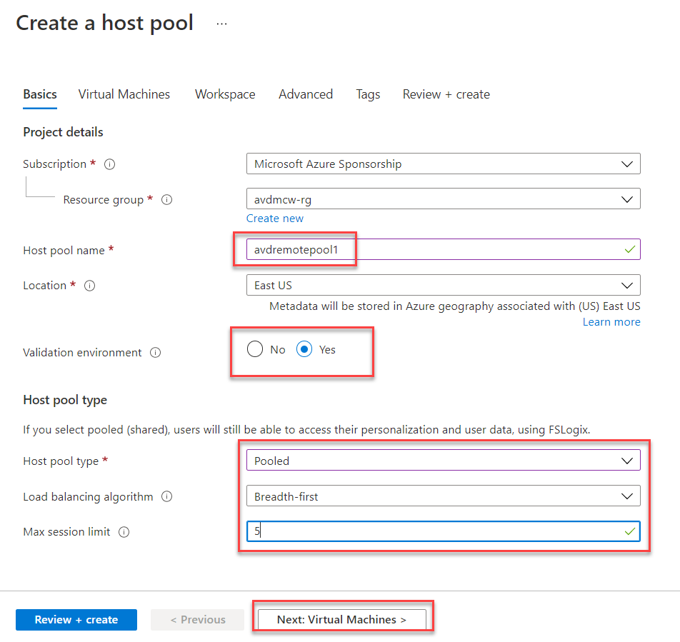

5. When you configure **Virtual machine settings**, select **Browse all images and disks** and then select the tab option for **My Items** to select the image created earlier in **Exercise 4**.

    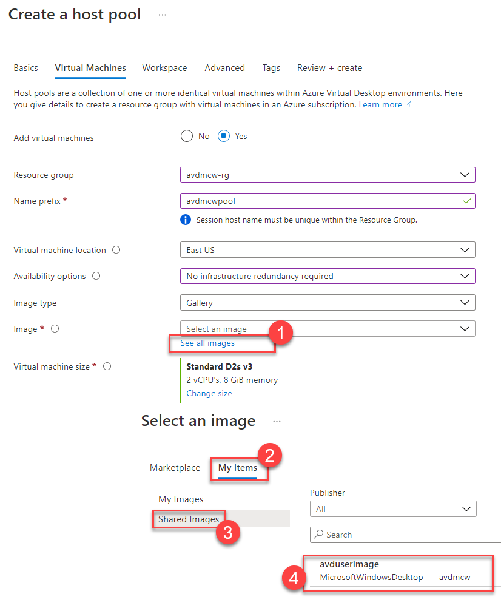

    >**Note**: Selecting this image is very important. You will need Microsoft 365 to assign apps in this exercise.

6. Now, enter the rest of the settings for your host pool.

    - Add Azure virtual machines: Yes
    - Name prefix: avdmcwpool (or anything else you prefer).
    - Virtual machine location: The region you've been creating your AVD host VMs.
    - Availability options: Non infrastructure redundancy required.
    - Image: Your custom Windows Image. It should be something similar to "avdmcw/avduserimage/1.0.0".
    - Number of VMs: 2
    - Virtual Netwokr: The virtual network you created for your host VMs.
    - AD domain join UPN: adamin@yourdomain.com, replacing yourdomain.com with the domain you chose to use for the lab.
    - Password: the password you set for you adadmin user.
    - Username: avdadmin
    - Password: The password you want to use for your avdadmin user.
    - Confirm passwrd: Re-enter the password you want to use for your avdadmin user.

    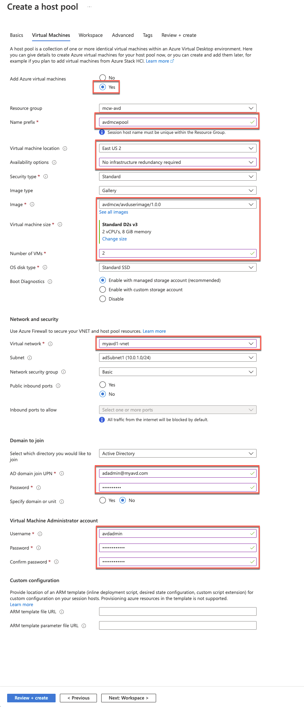

7. On the Workspace page, select **Yes** to register a new desktop app group. Select **Create new** and provide a **Workspace name**. Select **OK** and **Review + create**.

    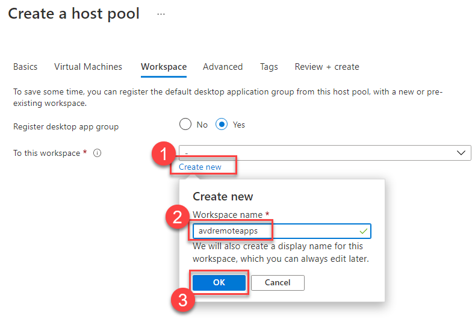

8. On the Create a host pool page, select **Create**.

9. Once the virtual machines have been created, use remote desktop to connect back to your domain controller.

10. Open up **Active Directory Users and Computers** and find the **AVD App Hosts** security group we created earlier and switch to the **Members** tab.

    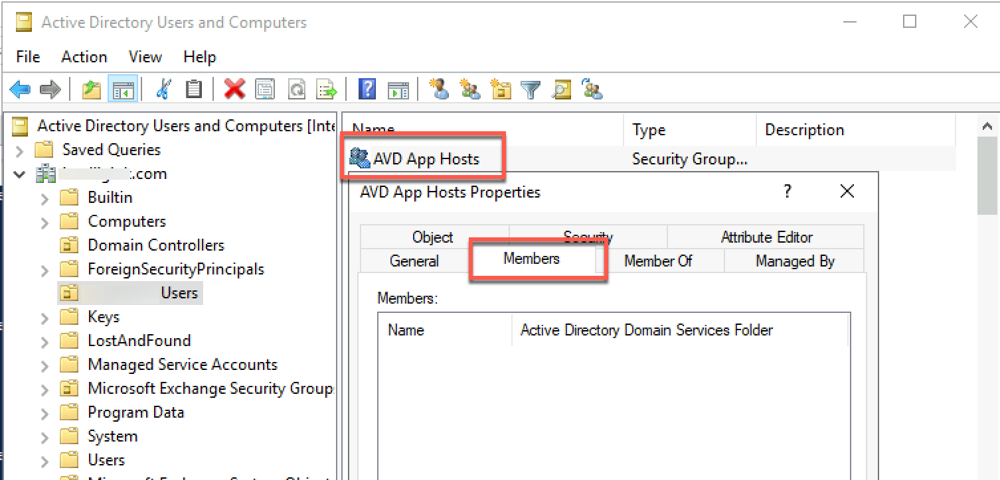

11. Select **Add..**

    - Add **computers** to the **Object Types**.
    - Add the two virtual machines we just created. Then select **OK**.
    - Select **OK**
    - Select **OK**

    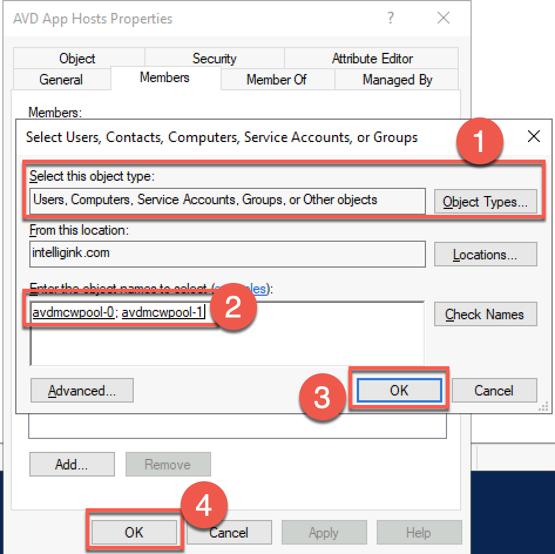

12. Wait a few minutes and make sure this change synchronizes to Azure Active Directory.

    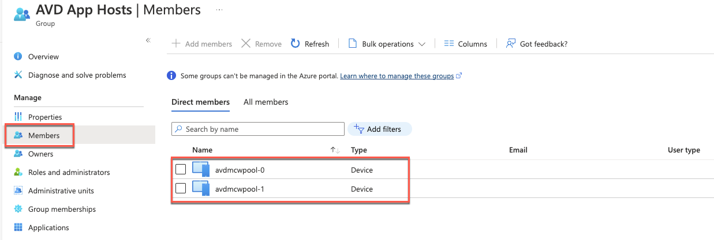

13. Reboot both of the virtual machines.

### Task 2: Create a friendly name for the workspace

The name of the Workspace is displayed when the user signs in. Available resources are organized by Workspace. For a better user experience, we will provide a friendly name for our new Workspace.

1. Sign in to the [Azure Portal](https://portal.azure.com/).

2. Search for **Azure Virtual Desktop** and select it from the list.

    

3. Under Manage, select **Workspaces**, locate the Workspace created for remote apps, and select the name.

    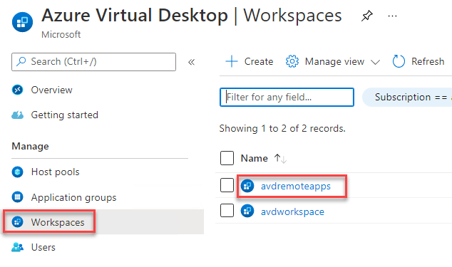

4. Under Settings, select **Properties**.

5. Update the **Friendly name** field to your desired name and select **Save**.

    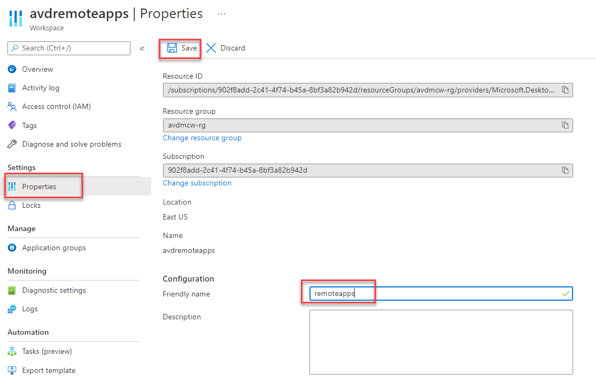

### Task 3: Add Remote Apps to your Host Pool

1. Sign in to the [Azure Portal](https://portal.azure.com/).

2. Search for **Azure Virtual Desktop** and select it from the list.

3. Under Manage, select **Host pools**, and select the host pool that you created in Task 1. Select **Application groups** and select **Add** to create a new application group.

    

4. In the Basics tab, name the application group. 

    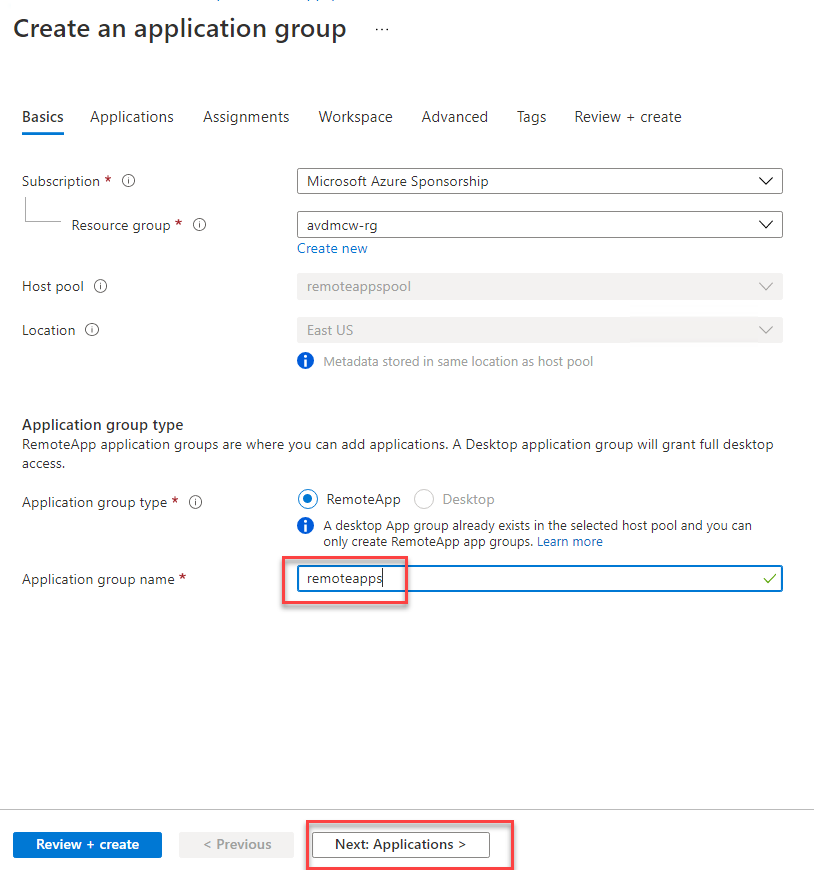

5. Select **Next: Applications**.

6. On the Applications page, select **+ Add Application**.

    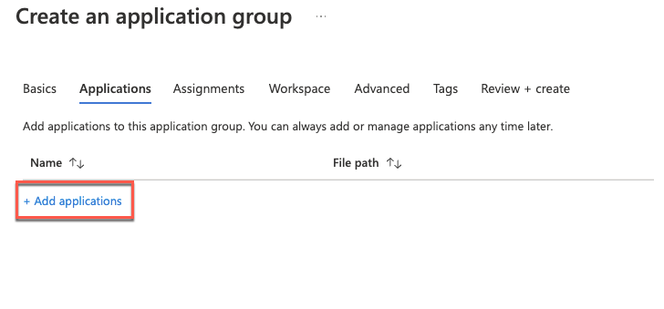

7. On the Add Application fly out, next to Application source, select **Start Menu**. Next, add the following applications, selecting **Save** between selections.

    - Outlook

    - Microsoft Edge

    - Microsoft Teams

    - Word

    - PowerPoint

    - Excel

    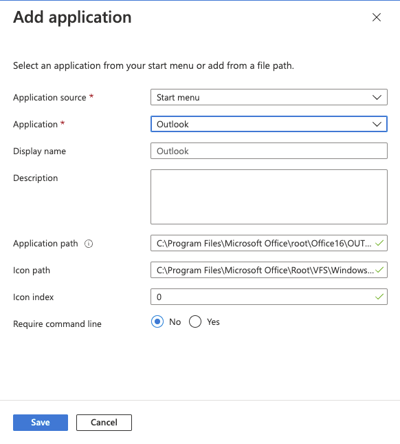

    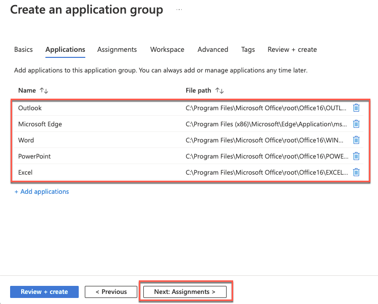

8. Select **Next: Assignments**.

9. On the assignments tab, select **Add assignments**, search for the **AVD Remote App All Users** created earlier in this guide, and choose **Select**.

    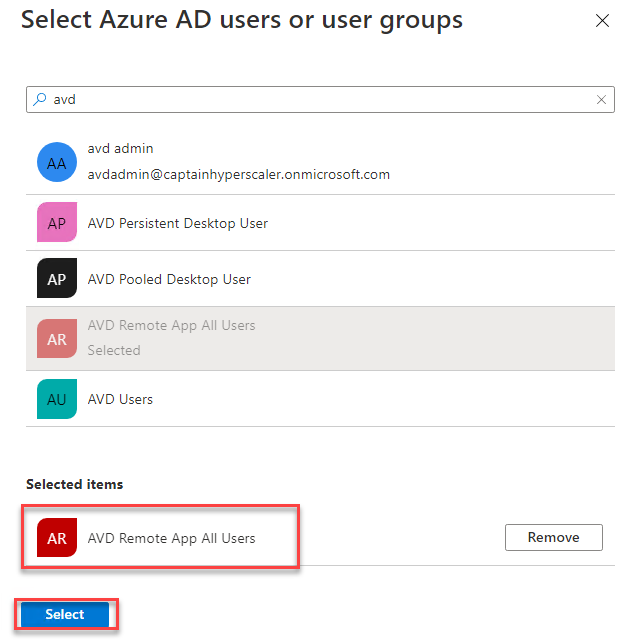

10. Select **Next: Workspace**.

11. On the Workspace page, select **Yes** to register the application group.

    >**Note**: The **Register application group** field will automatically populate with the workspace name.

12. Select **Review + Create**.

    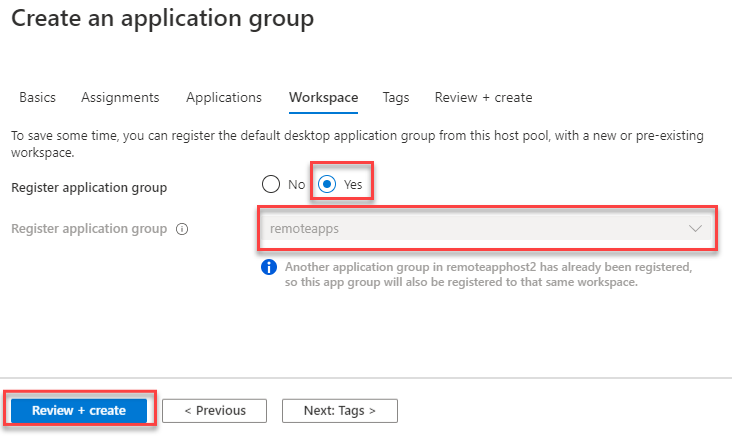

13. Select **Create**.

You have successfully created a Remote App non-persistent Host Pool with published apps. You can validate this configuration when you connect to the environment in a later exercise.

## Exercise 7: Connect to AVD with the web client

Duration:  30 minutes

In this exercise, you will walk through connecting to your AVD environment using the HTML5 web client and validating your deployment. The following operating systems and browsers are supported:

**Additional Resources**

There are multiple clients available for you to access AVD resources. Refer to the following Docs for more information about each client:
  |              |            |  
|----------|:-------------:|
| Description | Links |
|Connect with the Windows Desktop Client |  https://docs.microsoft.com/en-us/azure/virtual-desktop/connect-windows-7-and-10 |
| Connect with the HTML5 web client |  https://docs.microsoft.com/en-us/azure/virtual-desktop/connect-web |
| Connect with the Android client | https://docs.microsoft.com/en-us/azure/virtual-desktop/connect-android |
| Connect with the macOS client |  https://docs.microsoft.com/en-us/azure/virtual-desktop/connect-macos |
| Connect with the iOS client | https://docs.microsoft.com/en-us/azure/virtual-desktop/connect-ios |
  |              |            | 

### Task 1: Connecting with the HTML5 web client

1. Open a supported web browser. Use a different browser (or a private session), so you can use one of the synced accounts that isn't the admin account you've been using to configure Azure Virtual Desktop.

2. Navigate to https://rdweb.wvd.microsoft.com/arm/webclient.

    >**Note**: You will be asked to log in when you access the above URL. The credentials that you use are those from the lab.

3. Sign in using a synchronized identity that was assigned to an application group.

    >**Note**: This **must** be a user synchronized with AD DS using Azure AD Connect. Go to Azure Active Directory users to verify the directory sync users.

    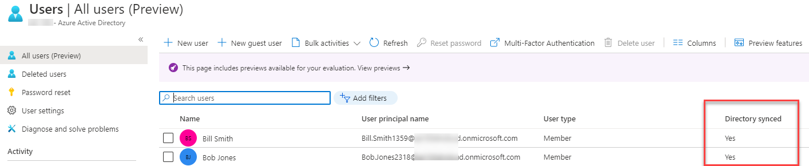

    

    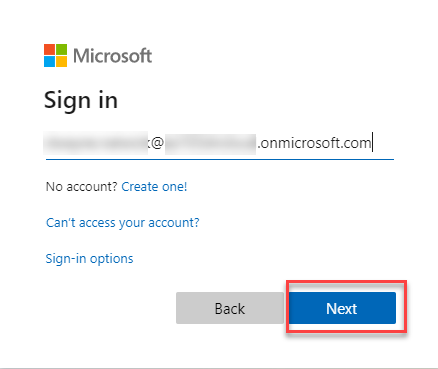

    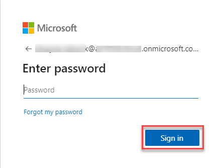

4. Select an available resource from the web client. In this example, we will connect to a host pool containing pooled desktop.

    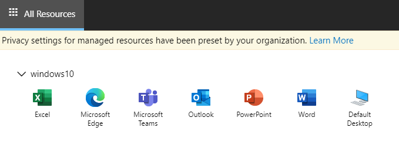

5. On the **Access local resources** prompt, review the available options and select **Allow**.

    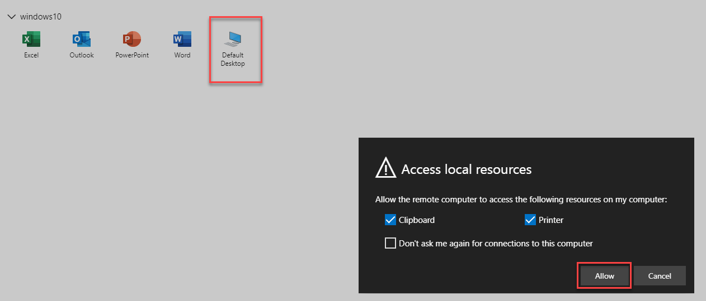

6. On the **Enter your credentials** prompt, sign in using the same account from Step 3 and select **Submit**.

    >**Note**: The username and password to login to the AVD desktop will be credentials from the domain controller username and password created upon initial deployment. When you need the user email, RDP into the domain controller VM and find the user in the **Active Directory Users and Groups** and **OrgUsers**.

    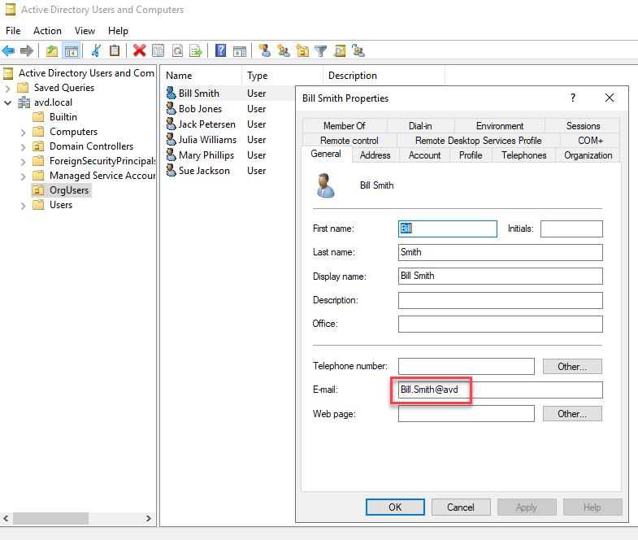

    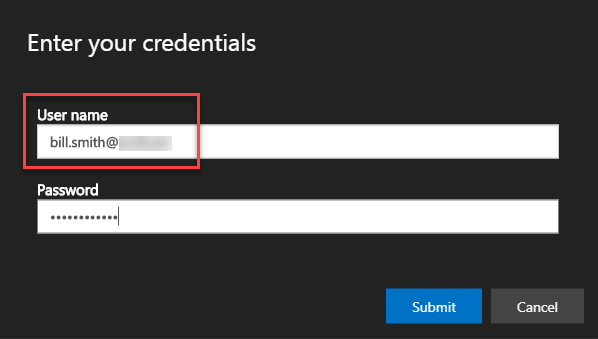

7. Once connected, validate the components relative to your configuration. You can find the Office applications when you go to the Windows start menu.

    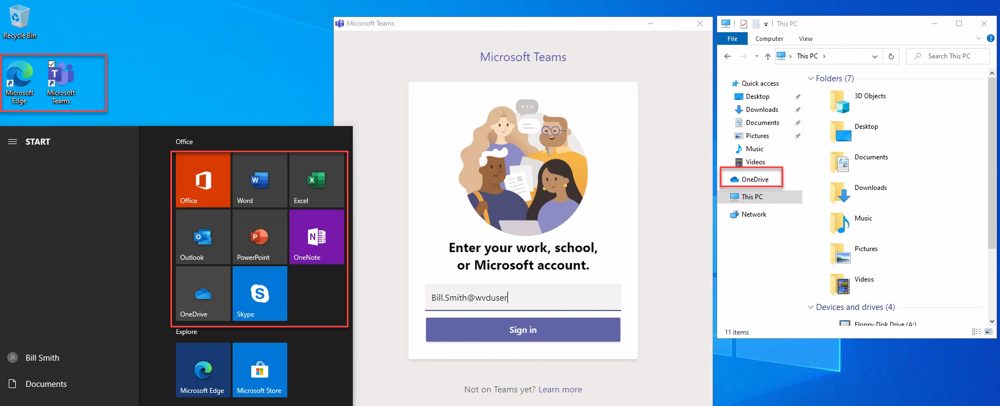

**Troubleshooting**

**Web client stops responding or disconnects**

Try connecting using another browser or client.

If issues continue even after you\'ve switched browsers, the problem may not be with your browser but your network. We recommend you contact network support.

**Web client keeps prompting for credentials**

If the Web client keeps prompting for credentials, follow these instructions:

1. Confirm the web client URL is correct.

2. Confirm that the credentials you\'re using are for the Azure Virtual Desktop environment tied to the URL.

3. Clear browser cookies.

4. Clear browser cache.

5. Open your browser in Private mode.

## Exercise 8: Setup monitoring for AVD

Duration:  45 minutes

In this exercise, you will set up monitoring for the AVD host pools. There are multiple reasons why monitoring serves a critical role: troubleshooting, performance, security, etc. Multiple components make up the AVD service, which can add some variation to how customers implement monitoring (e.g., adding additional third-party solutions). By the end of this exercise, you will have the following monitoring capabilities enabled:

- Diagnostic logging for the AVD service

- Azure Monitor for the session host VMs

- Log Analytics Monitoring Agent for the session host VMs

**Additional Resources**

  |              |            |  
|----------|:-------------:|
| Description | Links |
| Use Log Analytics for diagnostic features | https://docs.microsoft.com/en-us/azure/virtual-desktop/diagnostics-log-analytics |
| Create diagnostic settings to collect resource logs and metrics in Azure |  https://docs.microsoft.com/en-us/azure/azure-monitor/platform/diagnostic-settings |
| PG Blog for Log Analytics Dashboard and Azure Monitor | https://techcommunity.microsoft.com/t5/windows-it-pro-blog/proactively-monitor-arm-based-windows-virtual-desktop-with-azure/ba-p/1508735 |
|Enable monitoring for a single Azure VM |  https://docs.microsoft.com/en-us/azure/azure-monitor/insights/vminsights-enable-single-vm#enable-monitoring-for-a-single-azure-vm |
|Enable Azure Monitor for VMs by using Azure Policy |   https://docs.microsoft.com/en-us/azure/azure-monitor/insights/vminsights-enable-at-scale-policy |
|Enable Azure Monitor for VMs using Azure templates |  https://docs.microsoft.com/en-us/azure/azure-monitor/insights/vminsights-enable-at-scale-powershell |
  |              |            |

### Task 1: Create a Log Analytics workspace

A Log Analytics workspace is required for each monitoring capability covered in this exercise. You have the option to stream log data into different workspaces if desired. There are several factors to consider around a single workspace versus multiple. For example, RBAC controls, query performance, report development, etc. For AVD
environments, it is common to have all monitor data pointing to a single dedicated workspace.

In this exercise, we will create a dedicated workspace for our environment. When you already have a workspace created, move on to Task 2.

1. Sign in to the [Azure Portal](https://portal.azure.com/).

2. At the top of the page, in the **Search resources** field, type \"**log analytics workspace**\"; select **Log Analytics workspaces** from the list.

    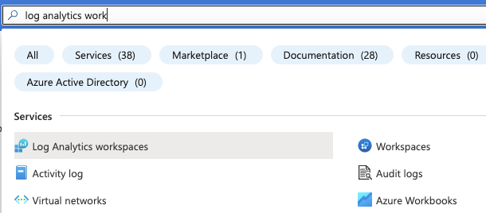

3. On the Log Analytics workspaces blade, select **+ Create**.

    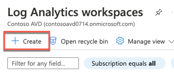

4. On the Create Log Analytics workspace blade, fill in the following information, and select **Review + Create**.

    - **Subscription:** Select the desired subscription for the Log Analytics workspace.

    - **Resource Group:** Create a new resource group or select one from the list.

    - **Name:** Enter a unique name for the workspace.

    - **Region:** Select a region for the workspace.

5. Select **Create**.

    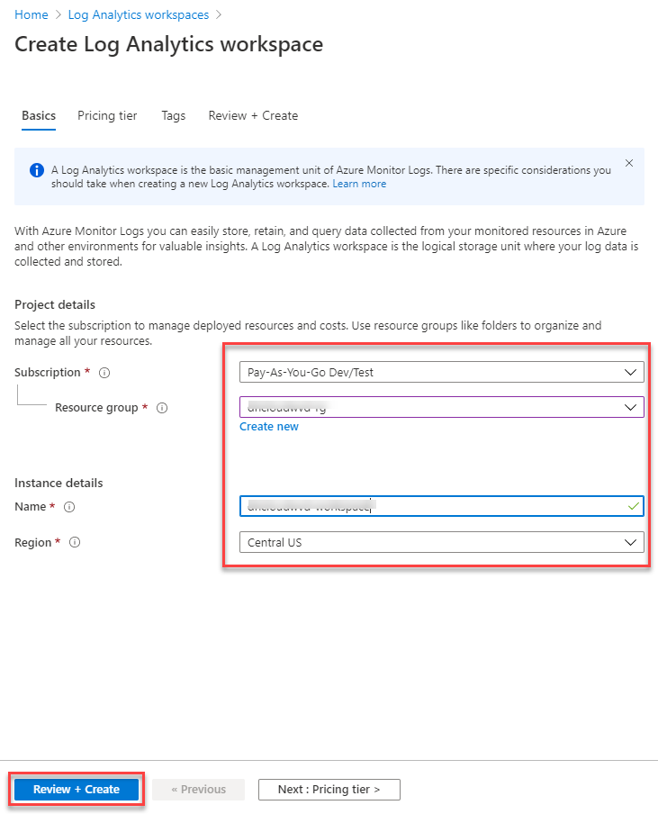

Monitor the notification bell in the upper-right corner and wait for the deployment to complete. Once complete, move on to task 2.

### Task 2: Enabling diagnostic logging for AVD

Like many other Azure services, AVD uses Azure Monitor for monitoring and alerts. To enable diagnostic data collection, you need to enable it for each ARM object you want to monitor (e.g., Host pools, Application groups, and Workspaces). Once enabled, it can take a few hours for the data to appear in your workspace.

Each AVD ARM object has different diagnostic data categories available. For example, host pool objects will have different options than Workspaces. Refer to the following table for a summary of each data category and its associated objects.

  |              |            |     |
|----------|:-------------:|:-------------:|
| **Category**  |**Description**  |                                                                 **ARM Object(s)** |
  Checkpoint   |       Specific steps in the lifetime of an activity that were reached. For example, during a session, a user was load balanced to a particular host, then the user was signed on during a connection, and so on. |  Host pools, Application groups, Workspaces
  Connection    |      When users initiate and complete connections to the service.    |                                                                                                                                             Host pools
  Error       |        Are users encountering any issues with specific activities? This feature can generate a table that tracks activity data for you if the information is joined with the activities.     |               Host pools, Application groups, Workspaces |
  Feed   |             Can users successfully subscribe to workspaces? Do users see all resources published in the Remote Desktop client?      |                                                                                     Workspaces |
  Host Registration  | Was the session host successfully registered with the service upon connecting?       |                                                                                 Host pools| 
  Management     |     Track whether attempts to change Azure Virtual Desktop objects using APIs or PowerShell are successful. For example, can someone successfully create a host pool using PowerShell?       |                  Host pools, Application groups, Workspaces

### Task 3: Enable logging for host pools

1. Sign in to the [Azure Portal](https://portal.azure.com/).

2. At the top of the page, in the **Search resources** field, type \"**azure virtual desktop**\". Select **Azure Virtual Desktop** from the list.

    

3. On the Azure Virtual Desktop blade, under **Manage**, select **Host pools**.

4. On the Azure Virtual Desktop \| Host pools blade, locate a host pool and select the name.

5. On the blade for your host pool, under **Monitoring**, select **Diagnostic settings**.

6. On the Diagnostics settings blade, select **+Add diagnostic setting**.

    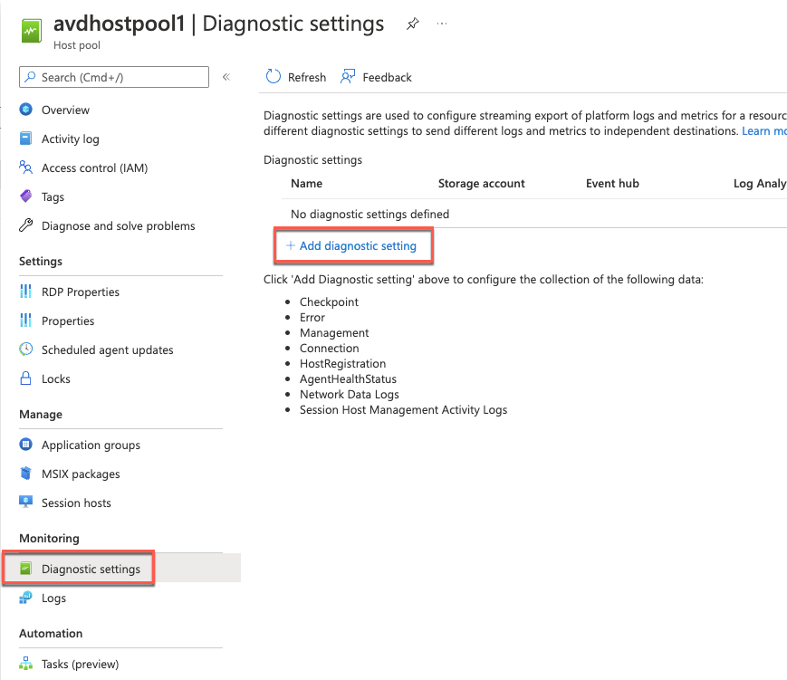

7. On the Diagnostic settings page, fill in the following information and select **Save**.

    - **Diagnostic settings name:** Enter a name for these settings. ARM objects can have multiple diagnostic settings applied.

    - **Category details \| log:** Check the box for the logs you want to collect.

    - **Destination details \| Send to Log Analytics:** Check this box.

         - **Subscription:** Select the desired subscription.

         - **Log Analytics workspace:** Select the desired workspace.

    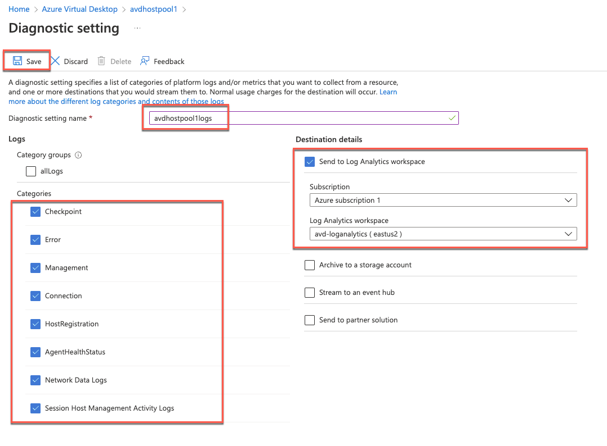

### Task 4: Enable logging for application groups

1. Sign in to the [Azure Portal](https://portal.azure.com/).

2. At the top of the page, in the **Search resources** field, type \"**azure virtual desktop**\". Select **Azure Virtual Desktop** from the list.

    

3. On the Azure Virtual Desktop blade, under **Manage**, select **Application groups**.

4. On the Azure Virtual Desktop \| Application groups blade, locate an application group and select the name.

5. On the blade for your application group, under **Monitoring**, select **Diagnostic settings**.

6. On the Diagnostics settings blade, select **+Add diagnostic setting**.

    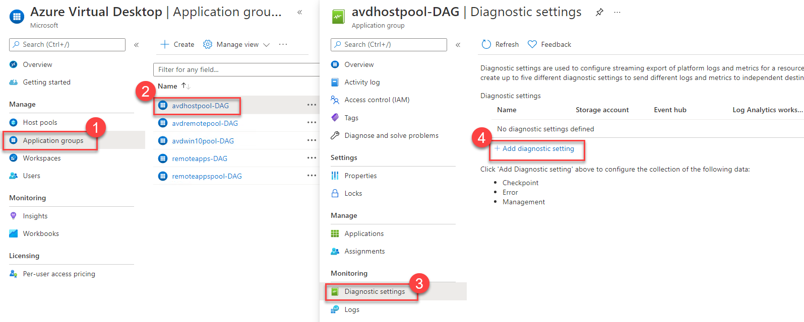

7. On the Diagnostic settings page, fill in the following information and select **Save**.

    - **Diagnostic settings name:** Enter a name for these settings. ARM objects can have multiple diagnostic settings applied.

    - **Category details \| log:** Check the box for the logs you want to collect.

    - **Destination details \| Send to Log Analytics:** Check this box.

        - **Subscription:** Select the desired subscription.

        - **Log Analytics workspace:** Select the desired workspace.

    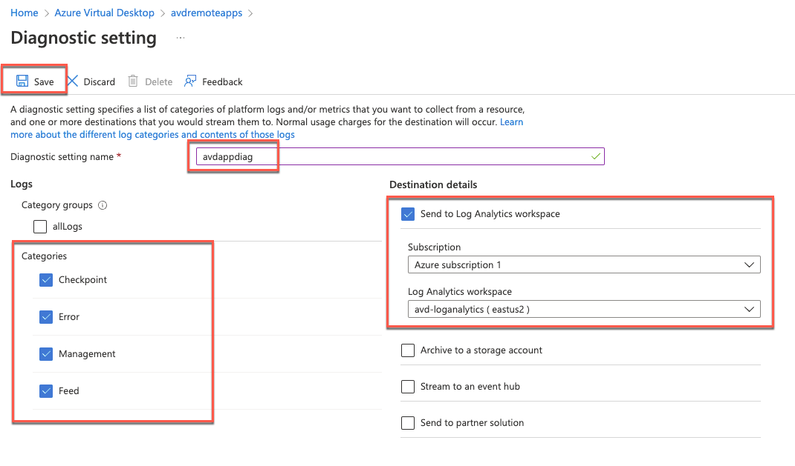

### Task 5: Enable logging for workspaces

1. Sign in to the [Azure Portal](https://portal.azure.com/).

2. At the top of the page, in the **Search resources** field, type \"**azure virtual desktop**\". Select **Azure Virtual Desktop** from the list.

    

3. On the Azure Virtual Desktop blade, under **Manage**, select **Workspaces**.

4. On the Azure Virtual Desktop \| Workspaces blade, locate a workspace and select the name.

5. On the blade for your workspace, under **Monitoring**, select **Diagnostic settings**.

6. On the Diagnostics settings blade, select **+Add diagnostic setting**.

    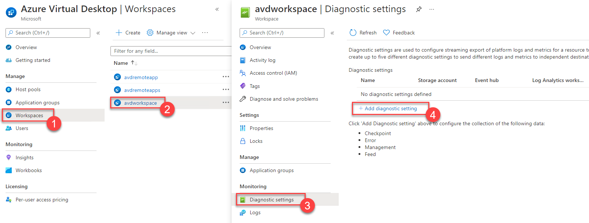

7. On the Diagnostic settings page, fill in the following information and select **Save**.

    - **Diagnostic settings name:** Enter a name for these settings. ARM objects can have multiple diagnostic settings applied.

    - **Category details \| log:** Check the box for the logs you want to collect.

    - **Destination details \| Send to Log Analytics:** Check this box.

        - **Subscription:** Select the desired subscription.

        - **Log Analytics workspace:** Select the desired workspace.

    

At this point, you should have diagnostic data enabled on at least 1 AVD ARM object of each type. To enable monitoring for additional objects,  repeat the above steps for each object.

### Task 6: Enabling Azure Monitor for the session hosts

Azure Monitor is leveraged with AVD to monitor the performance and health of your session host VMs. This feature can be enabled for Azure VMs in several ways. This exercise will walk through enabling Azure Monitor on VMs using the Azure portal. Refer to the following links for guidance on automation.

1. Sign in to the [Azure Portal](https://portal.azure.com/).

2. At the top of the page, in the **Search resources** field, type \"**virtual machines**\". Select **Virtual Machines** from the list.

    

3. On the Virtual Machines blade, locate a session host VM and select the name.

4. On the blade for the virtual machine, under **Monitoring**, select **Insights**.

    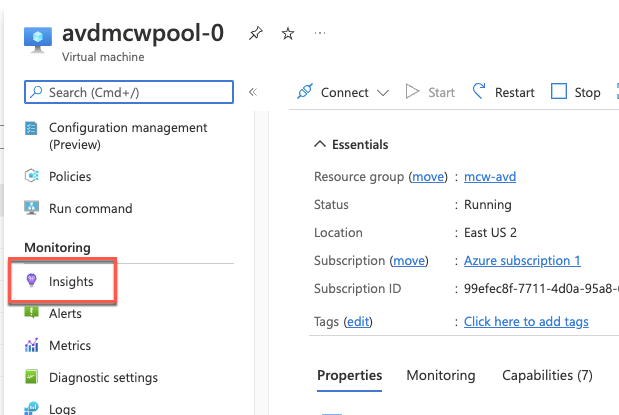

5. On the Insights blade, select **Enable**. This will initiate a validation check.

    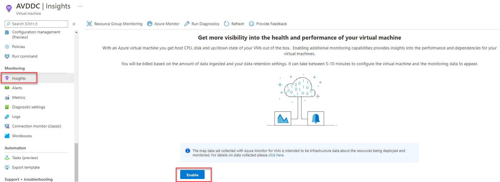

    >**Note**: The virtual machine must be running to enable Azure Monitor.

6. On the Insights setup page, fill in the following information, and select **Enable**.

    - **Workspace Subscription:** Select the desired subscription.

    - **Choose a Log Analytics Workspace:** Select the workspace used in the previous task.

    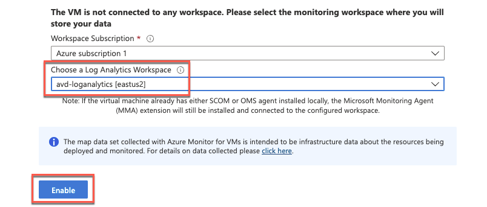

Monitor the notification bell in the upper-right corner and wait for the deployment to complete. This can take 5-10 minutes. Once complete, you will see the following items configured on the VM:

**New VM Extensions Added**. Two new extensions are added to the VM Extensions blade in Azure.

**New Monitoring Agents Installed**. Two new agents are installed on the VM.

**Monitoring Agent Configured for Log Analytics** The Microsoft Monitoring Agent is configured for your log analytics workspace.

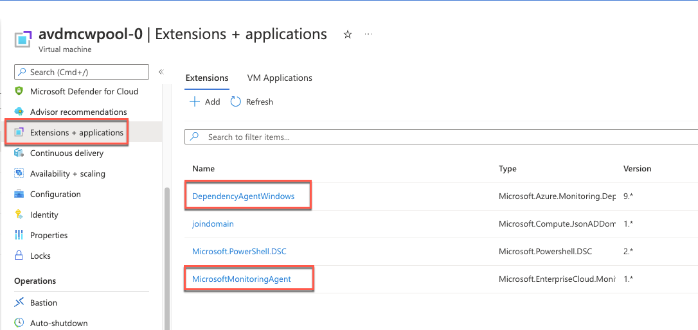

At this point, you should have Azure Monitor enabled on at least one session host VM. To enable Azure Monitor for additional session hosts, repeat the above steps. For automation, leverage Azure Policy or PowerShell to enable monitoring on multiple VMs.

**Example Kusto Queries**

For a list of example queries, refer to the following Docs article:

[**Use Log Analytics for the diagnostics feature \| Example queries**](https://docs.microsoft.com/en-us/azure/virtual-desktop/diagnostics-log-analytics#example-queries) 

**Troubleshooting**

- Go to your Log Analytics workspace, and then select **Logs**. An example query UI is shown automatically.
- Change the filter to **Category**.
- Select **Azure Virtual Desktop** to review available queries.
- Select **Run** to run the selected query.

Often during the deployment of AVD, there may be challenges with either having machines join the domain or installing the agent via automation.

## Exercise 9: Improving your AVD environment

Duration:  60 minutes

In this exercise, you will improve the AVD experience by utilizing additional features or tools with the host pools. AVD is designed to be a versatile platform to distribute and build your solutions from. These optional features allow you to enhance and/or secure the environment depending on your needs. By the end of this exercise, you will have the following features enabled:

- Autoscale pooled pool based on connections

- Centralized Application Management (MSIX App Attach)

- Protect your environment via Microsoft Defender for Endpoint

**Additional Resources**

| Description | Links |
|----------|:-------------:|
| Scale session hosts using Azure Automation | https://docs.microsoft.com/en-us/azure/virtual-desktop/set-up-scaling-script |
| Set up MSIX app attach with the Azure portal |  https://docs.microsoft.com/en-us/azure/virtual-desktop/app-attach-azure-portal |
| Prepare an MSIX image for Azure Virtual Desktop | https://docs.microsoft.com/en-us/azure/virtual-desktop/app-attach-image-prep |
| MSIX Packaging Tool | https://docs.microsoft.com/en-us/windows/msix/packaging-tool/tool-overview |
| Onboard Windows 10 multi-session devices in Windows Virtual Desktop | https://docs.microsoft.com/en-us/microsoft-365/security/defender-endpoint/Onboard-Windows-10-multi-session-device?view=o365-worldwide |
| Azure Cloud Shell | https://docs.microsoft.com/en-us/azure/cloud-shell/overview |

### Task 1: Configure permissions for Autoscale

In this task, we'll configure the permissions necessary to enable auto scall in Azure Virtual Desktop.

1. Navigate to the Azure Portal, and the subscription Azure Virtual Desktop is running in.

2. Select Access control (AIM). Select **+ Add** and **Add custom role**.

    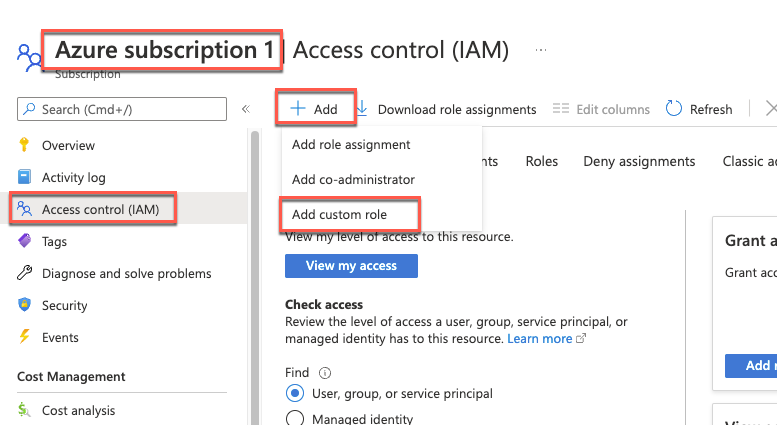

3. Enter a role name and description, then select **Next**.

    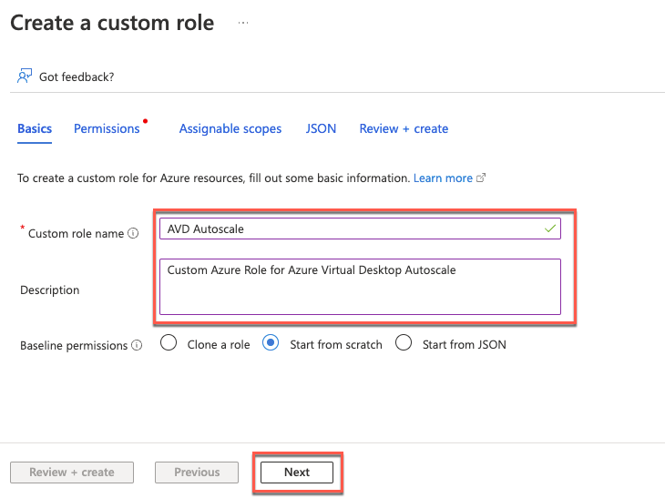

4. On the permissions tab, select **Next**; we aren't adding any permissions yet.

5. On the assignable scopes tab, select **Next**.

6. On the JSON tab, select **Edit**, then copy and paste the JSON below into the "actions": [] array.

    ```JSON
    "Microsoft.Insights/eventtypes/values/read",
    "Microsoft.Compute/virtualMachines/deallocate/action",
    "Microsoft.Compute/virtualMachines/restart/action",
    "Microsoft.Compute/virtualMachines/powerOff/action",
    "Microsoft.Compute/virtualMachines/start/action",
    "Microsoft.Compute/virtualMachines/read",
    "Microsoft.DesktopVirtualization/hostpools/read",
    "Microsoft.DesktopVirtualization/hostpools/write",
    "Microsoft.DesktopVirtualization/hostpools/sessionhosts/read",
    "Microsoft.DesktopVirtualization/hostpools/sessionhosts/write",
    "Microsoft.DesktopVirtualization/hostpools/sessionhosts/usersessions/delete",
    "Microsoft.DesktopVirtualization/hostpools/sessionhosts/usersessions/read",
    "Microsoft.DesktopVirtualization/hostpools/sessionhosts/usersessions/sendMessage/action"
    ```

    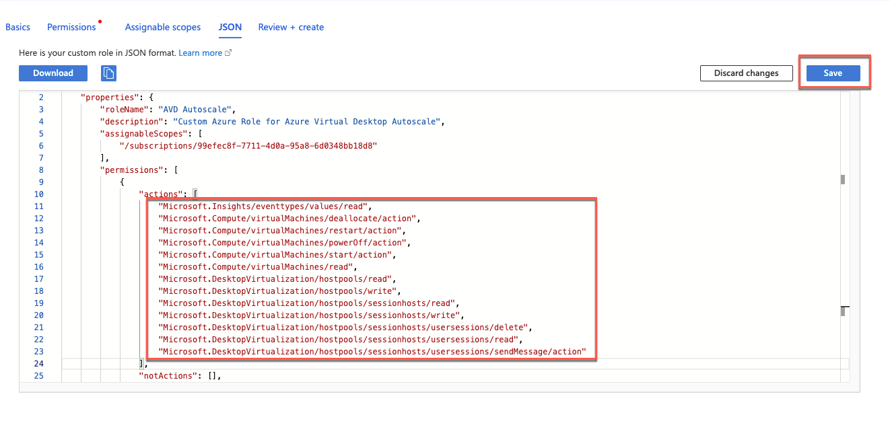

7. Select **Save**, **Review + Create**, then **Review + assign**.

8. Now, we need to assign the role to the Azure Virtual Desktop service principal. Back on the **Access control (AIM)** settings for the subscription, select **+ Add** and **Add role assignment**.

    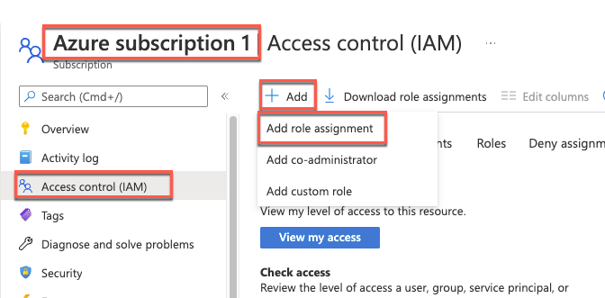

9. Select the **AVD Autoscale** custom role we just created and select **Next**.

    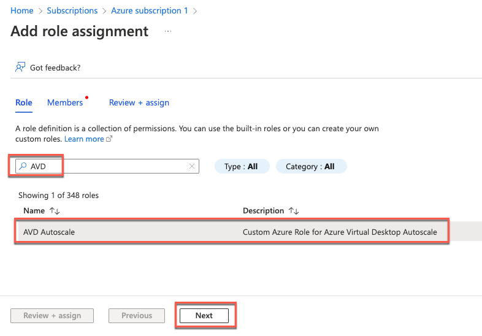

10. Select **+ Select members**, search for and select **Azure Virtual Desktop**.

    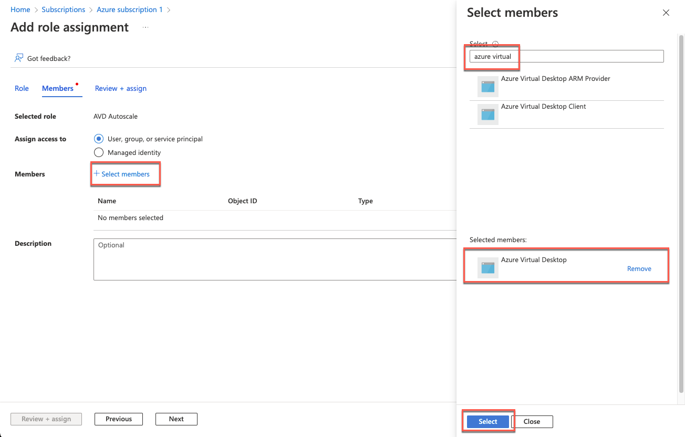

11. Select **Review + assign**, then **Create**

### Task 2: Enabling Autoscale

In this task, you will enable the scaling of your pool based on the number of connections. Azure Virtual Desktop allows you to create scaling plans which will enable us to automatically increase and decrease the number of hosts in an AVD host pool based on the demand of the environment.

1. Navigate to the Azure Portal and go to Azure Virtual Desktop.

2. Select **Scaling plans** under **Manage**, then select **Create scaling plan**.

    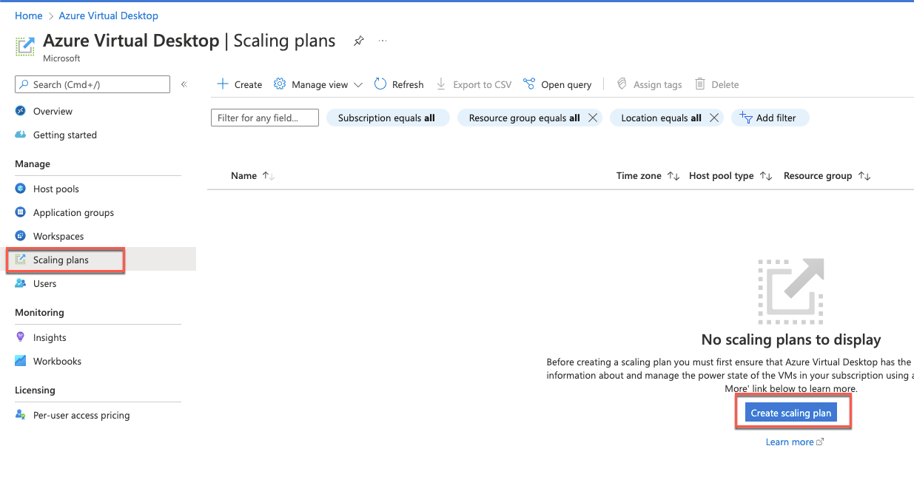

3. Select the resource group and location for Azure Virtual Desktop. Then give your scaling plan a friendly name and select **Next: Schedules >**.

    

4. Select **+ Add schedule**. Keep the defaults in General and select **Next**.

    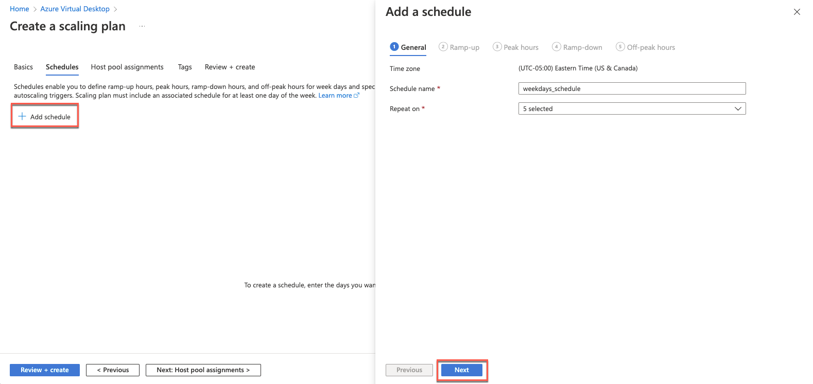

5. Within Ramp-up, review the settings, but we'll take the default settings again. Start time entails two things, the start of when you start to power on VMs and the end time of off-peak hours. Minimum is the minimum percentage of VMs that should be powered on starting at this time. The capacity threshold is what percentage of capacity needs to be used before another virtual machine is powered on. For example, with a pool of 10 VMs and a capacity of 20 sessions, at 8:00 am, a minimum of two VMs would be on. Once you get to 12 active sessions, a 3rd virtual machine will be powered on. Select **Next**.

    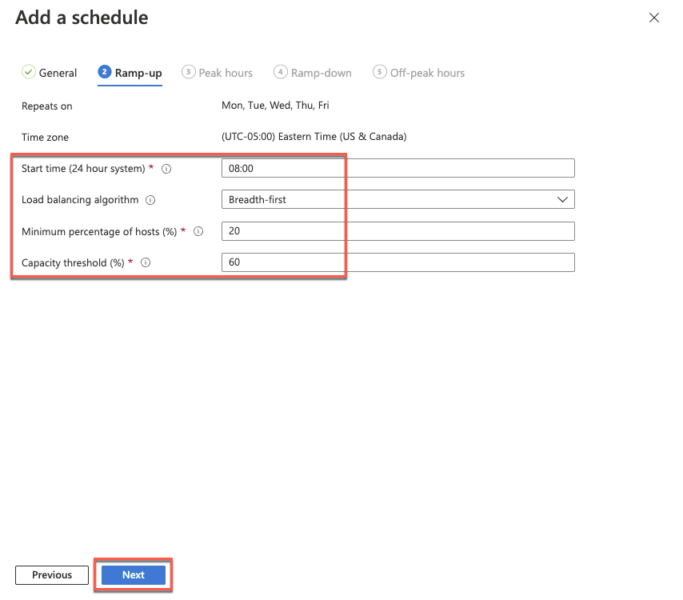

6. Peak hours is another one we won't make any changes to, but review the settings. The minimum number of VMs turned on will carry over from ramp-up as well as the capacity threshold.

    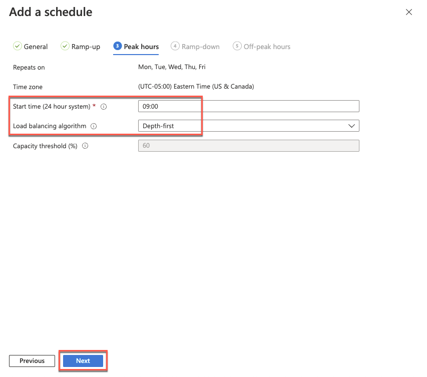

7. Ramp down is the time you want to start shutting down virtual machines and is the end of peak hours. Here the minimum percentage of hosts should be smaller than ramp-up and peak hours as you want to start shutting down virtual machines. The default is 10 percent, meaning in a pool of 10 virtual machines, you want to leave no less than 1 VM powered on. The capacity threshold will turn virtual machines on if you hit it, but this should be a larger number, so you aren't powering on virtual machines as you try to ramp down. The final set of settings is around logging users out. To shut down virtual machines, users need to log off and shift their sessions to other hosts. These settings allow you to configure if the user logout is forced, how long after they log out the machine is shut down, and the message given to users. Leave all settings the default and select **Next**.

    

8. Off-peak hours is the time that ramp-down will end and will also take the capacity threshold from the ramp-down settings. This capacity threshold takes the higher value from ramp-down as you don't want machines powered on during off-peak hours unless necessary. The off-peak hours will end when the next ramp-up time starts. Select **Add**.

    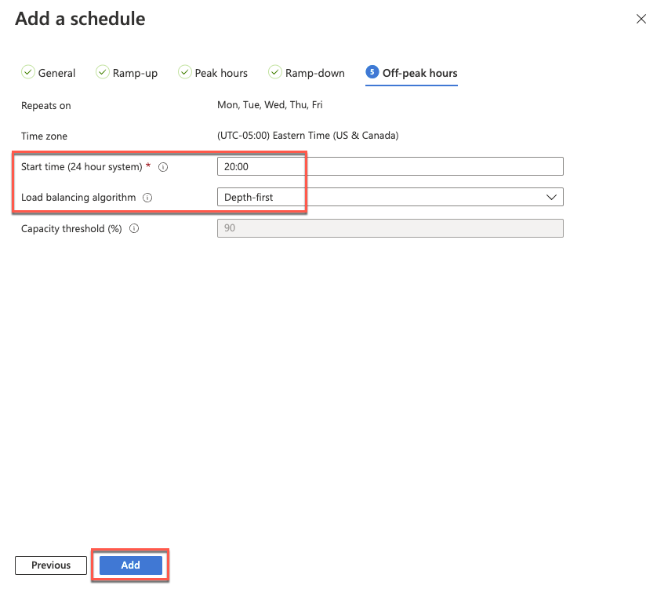

9. You'll see your new schedule added to the scaling plan schedule. Select **Next: Host pool assignments >**.

    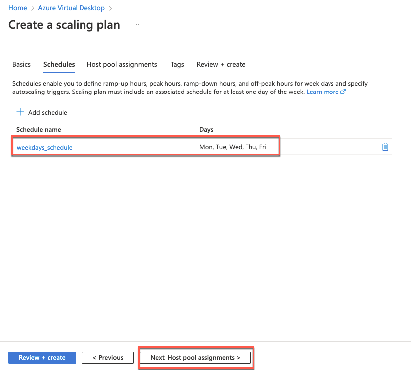

10. Select your load balanced host pool in the drop-down, ensure **Enable autoscale** is selected, select **Review + create**, then select **Create**.

    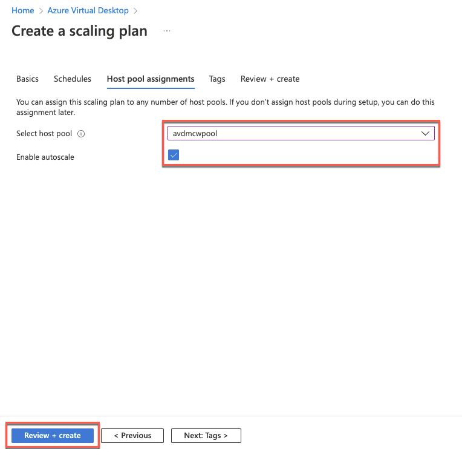

At this point, your AVD Host Pool that is Pooled will spin up and down hosts based on the environment's load.

### Task 2: Utilizing Application Packages (MSIX)

In this task, you will take an **MSIX package** created from the [MSIX packaging tool](https://docs.microsoft.com/en-us/windows/msix/packaging-tool/tool-overview) and utilize the Azure portal to attach the MSIX package dynamically to AVD pools as users log in. MSIX Packages are disk images containing all files, configurations, and publication details needed to run supported applications that can be mounted by Windows systems on the fly to allow users to run the application without having to install the application on the host machine. By utilizing this technique, we can minimize the footprint and management needs of the AVD hosts while still using multiple applications on the systems without installing the applications permanently on the system.

1. Go to the [Azure Portal](https://portal.azure.com/).

    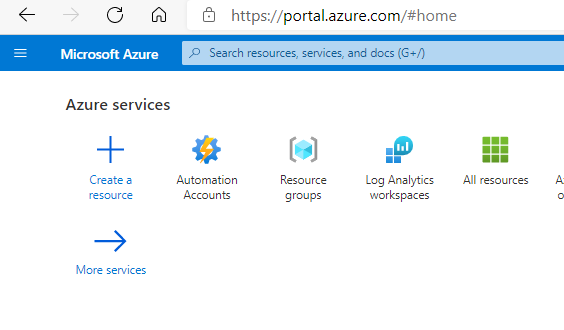

2. Go to the **Storage Account** created in Exercise 3 for the FSLogix profiles already joined to Active Directory.

3. Select the **File shares** under data storage and select the share created for AVD files.

    

4. Ensure the **MSIX** directory you created earlier is there; if not, go back to Exercise 3, Tasks 4-6 and follow the steps to create it.

    >**Note:** Normally, in production, you would create an additional share for MSIX files and place the files there. You would need to make sure the share or container the MSIX files are in you follow the same steps you use for the FSLogix storage account and apply the appropriate permissions to them (users typically only need Read access) and make sure there is enough room to store them. We are placing it on the same share for this exercise for expediency and easier setup. It is not uncommon to have a central MSIX storage with permissions to each MSIX file based on groups assigned to the appropriate application and the MSIX repository used by multiple pools or deployments but ensure network connectivity and speed are kept consistent.

5. In a new tab in your browser, navigate to [https://github.com/microsoft/MCW-Implementing-Azure-Virtual-Desktop-in-the-enterprise/blob/main/Hands-on%20lab/resources/VHD/](https://github.com/microsoft/MCW-Implementing-Azure-Virtual-Desktop-in-the-enterprise/blob/main/Hands-on%20lab/resources/VHD/) and download AVD-MSIX.vhd.

6. Back in your storage account, upload the .VHD file to the MSIX folder.

    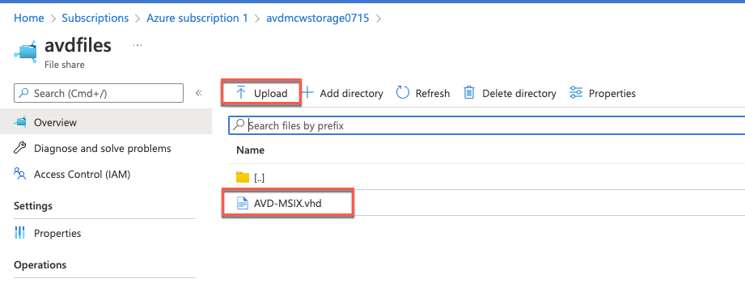

7. The MSIX images on the VHD have been signed with Device Guard v2; for it to work, the root certificate needs to be installed on the servers used for publishing the apps. These servers don't have a public IP address, so we'll use the domain controller as a jump box to the app servers. First, create a remote desktop session to the domain controller.

8. Get the IP address from the first server in your remote app pool. It should be something like 10.1.0.8.

    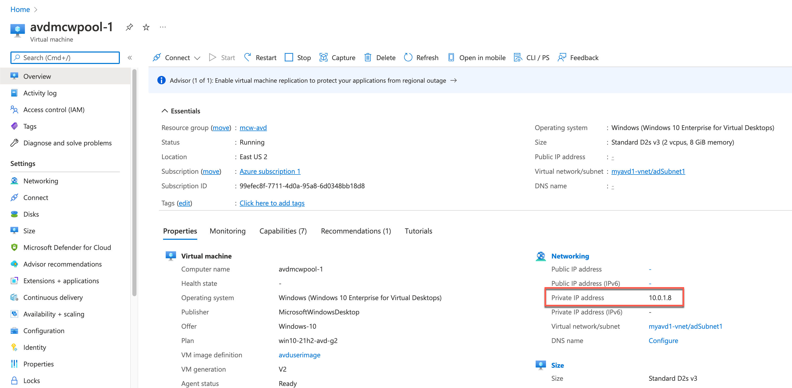

9. On the domain controller, open Remote Desktop Connection and connect to the IP address of your first remote app server. You can use the avdadmin account you set up as a local admin when creating the server by entering **/avdadmin** for the username.

    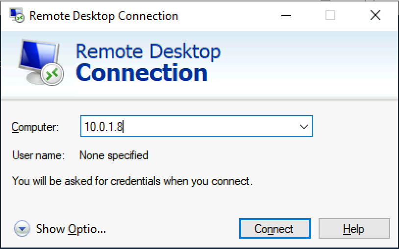

10. Once you're logged into the first app server, open up Microsoft Edge and navigate to the following URL:

    ```text
    https://www.microsoft.com/pkiops/certs/microsoft%20enterprise%20identity%20verification%20root%20certificate%20authority%202020.crt
    ```

11. Open the downloaded certificate; this root certificate is needed to verify the MSIX packages. Select **Open** when the Security Warning is shown.

    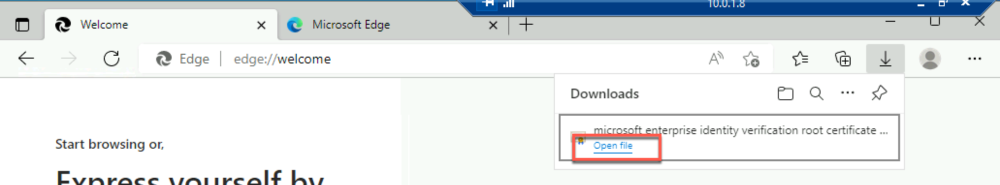

    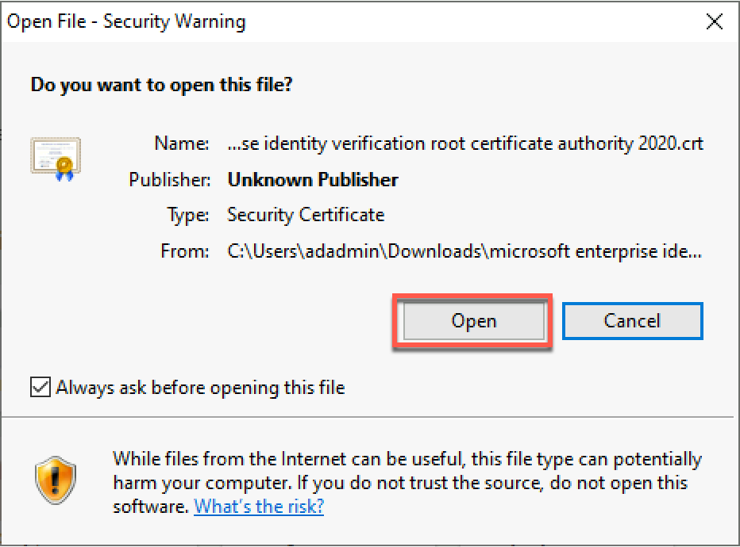

12. With the certificate opened, select **Install Certificate...**.

    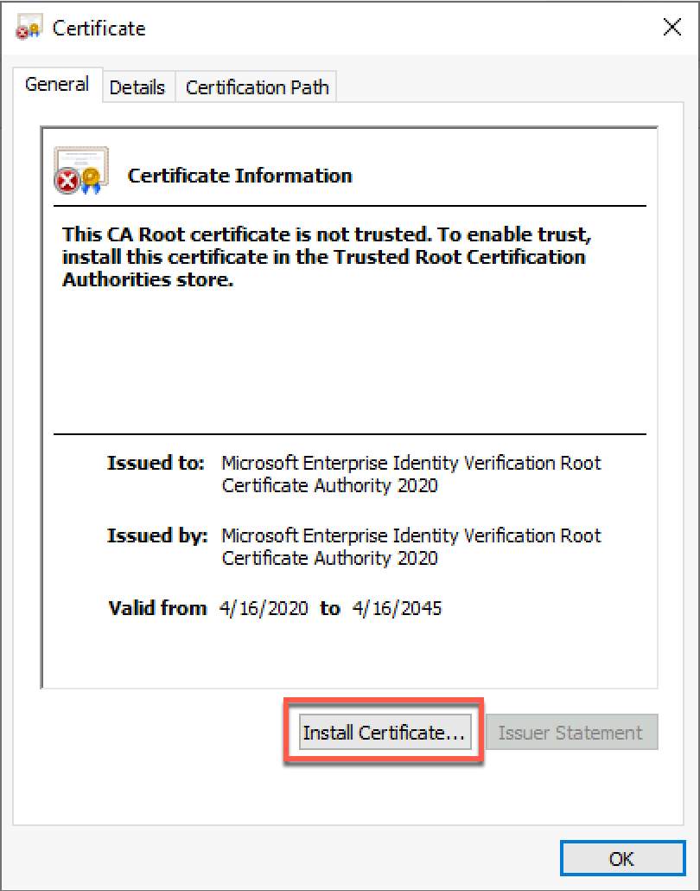

13. In the Certificate Import Wizard, select **Local Machine** for the Store Location. Then select **Next**.

    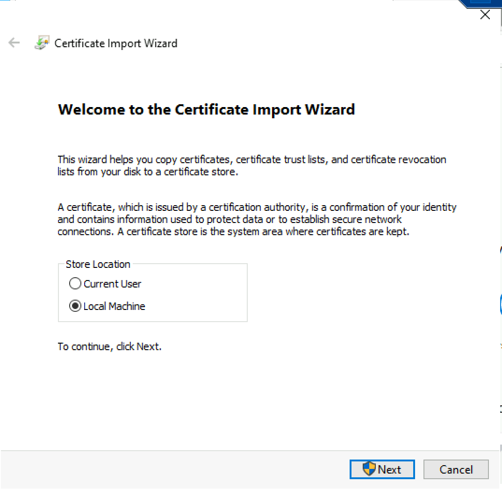

14. On the wizard's next step, select **Place all certificates in the following store**. Then select **Browser** and **Trusted Root Certification Authorities**. Select **Next**.

    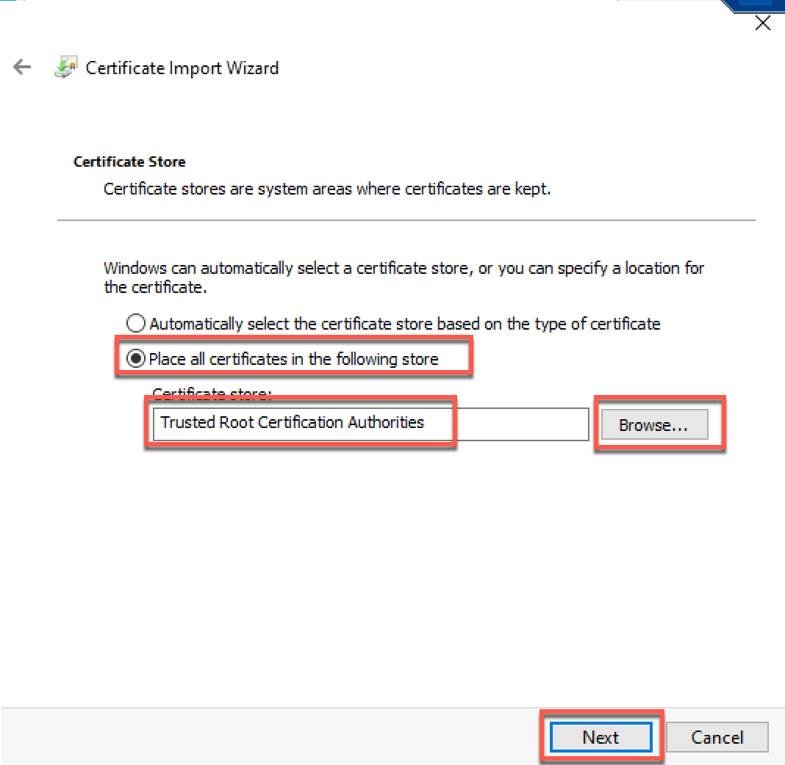

15. Select **Finish**, and you'll see a dialog that the import was completed successfully.

    

    

16. Restart virtual machine. Repeat steps 8 - 16 on the second remote app server in the pool to import the certificate there also.

    >**Note**: In a larger image, this certificate import could be done in the Gold Image used for provisioning machines or incorporated into the provisioning of any new app servers in the pool.

17. Once the certificate has been successfully imported into both remote app servers and they have both been rebooted, navigate back to **Azure Virtual Desktop** in the Azure portal.

18. Select **Host Pools**, your remote app pool, **MSIX packages**, and then **+ Add**.

    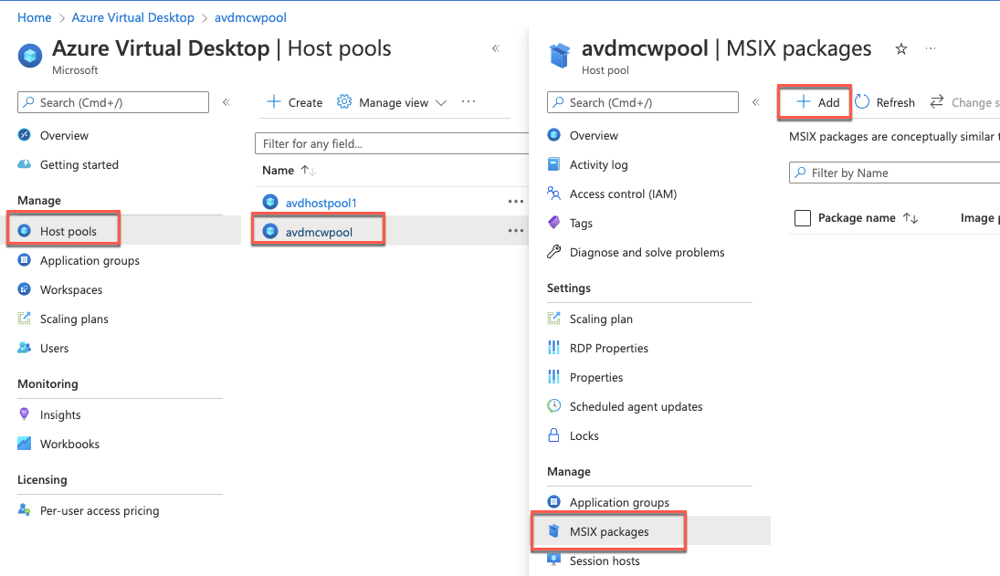

19. In the MSIX image path, paste the file share path to your MSIX file. It should be in the format below. After pasting it in, wait a few seconds, and the rest of the dialog boxes should appear.

    ```text
    \\<storage account name>.file.core.windows.net\<share name>\msix\AVD-MSIX.vhd.
    ```

20. Select **Firefox** in the MSIX package, type **Firefox** into the Display Name, and set the State to **Active**. Then select **Add**.

    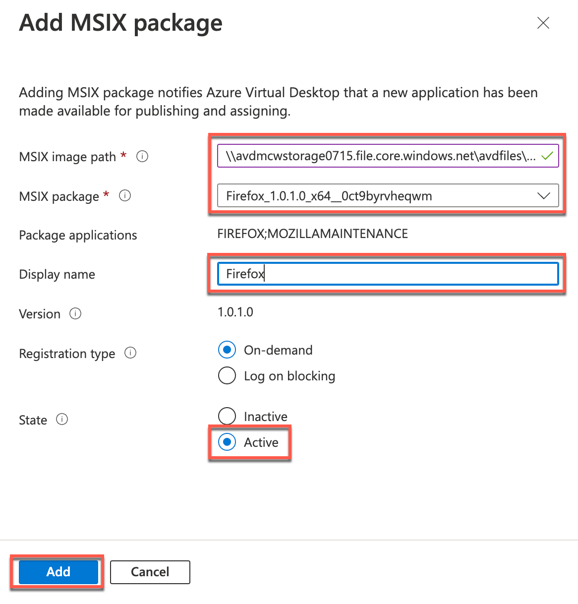

21. Repeat steps 19 and 20 to add the NotePad++ package using the same path to the .vhd file and configure the settings for Notepad++ with the following settings.

    - MSIX image path: the path to the network share containing you .vhd file. The same path from step 19.
    - MSIX package: Select your NotepadPlusPlus package from the dropdown
    - Display name: Notepad++
    - State: Active

    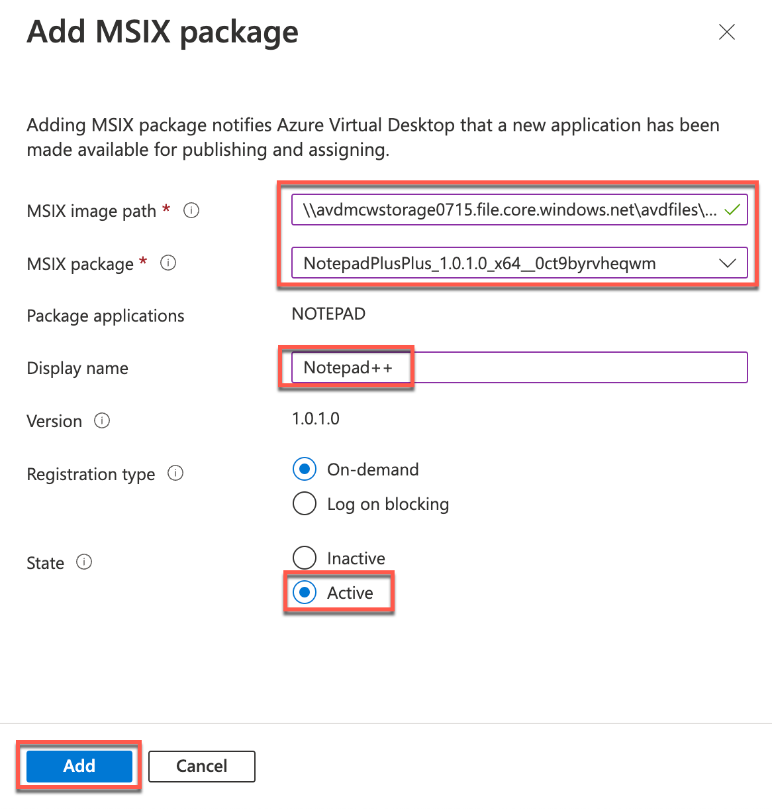

22. In **Azure Virtual Desktop**, select **Application groups** under Manage, then select your **remoteapps** group.

23. Within your **remoteapps** group, select **Applications** and **+Add**.

    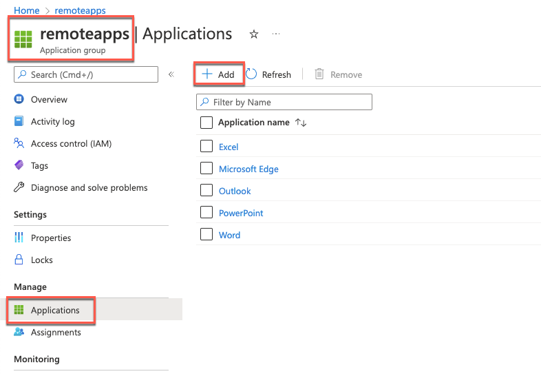

24. Set the Application source to **MSIX package**, select **Firefox**, and provide an Application name of **Firefox**. Select Save.

    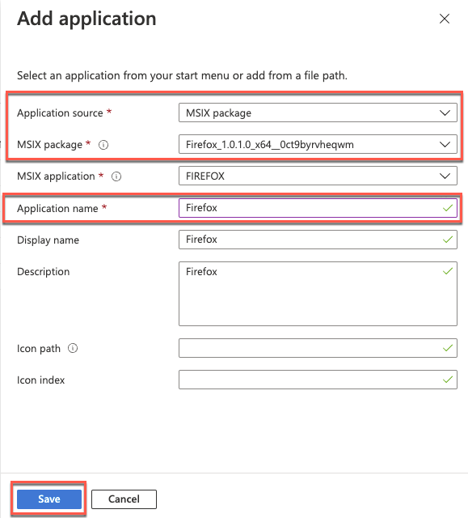

25. Repeat steps 23 and 24 to add the Notepad++ application.

26. You should have Firefox and Notepad++ added as available applications now.

    

27. Go to the [AVD Web Client](https://rdweb.wvd.microsoft.com/arm/webclient) (or AVD client if installed locally) and login as one of your end users.

28. Select the new application icon to launch the application (refresh the page if the new application does not show up).

    

This application is now running on the host pool, although it is not installed on the host system. This allows the application to be updated by changing which MSIX package the application points to and the next time a user logs into the application.

### Task 3: Protect AVD with Microsoft Defender for Endpoint

In this task, you will enable Microsoft Defender for Endpoint service and deploy the endpoint protection via Azure. This enables all systems to be protected by the Microsoft Defender for Endpoint service from potential vulnerabilities and alerts in the event of suspicious execution or activity.

>**Note:** This will require signing up for [Azure Defender trial](https://docs.microsoft.com/en-us/azure/security-center/enable-azure-defender#to-enable-azure-defender-on-your-subscriptions-and-workspaces) on your subscription. If this is a Visual Studio subscription or you do not want to sign up for the time trial yet, you will need to wait and deploy this when you can sign up for the Azure Defender trial.

1. Go to the [Azure Portal](https://portal.azure.com/).

    

2. Open **Microsoft Defender for Cloud**.

    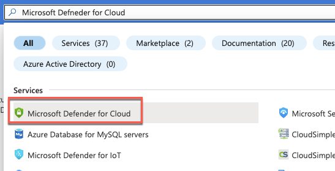

3. Select **Upgrade** on the **Getting started** page.

    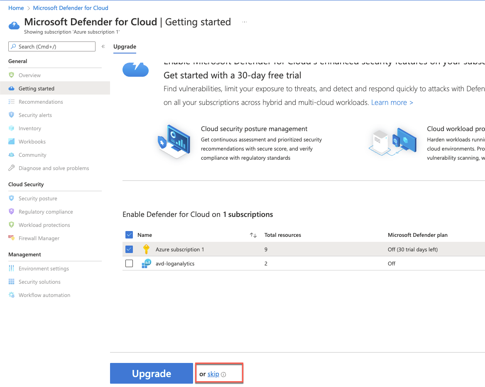

4. Go to the **Workload protections** under the Cloud Security section.

5. Select **Enable Microsoft Defender for Cloud** to set up the trial edition of Azure Defender for your subscription.

    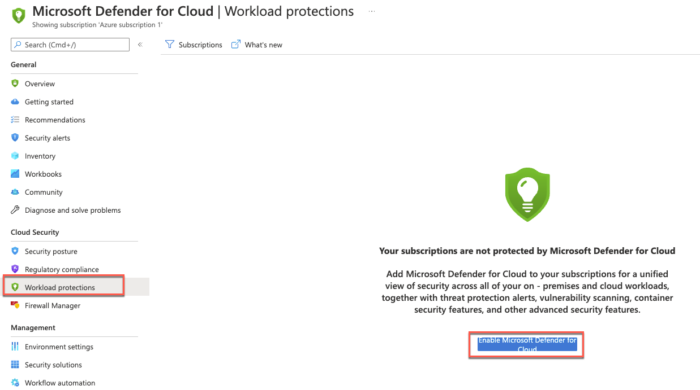

6. Select Upgrade to start the 30-day trial upgrade you skipped earlier. You could also have upgraded from the initial Getting Started page.

    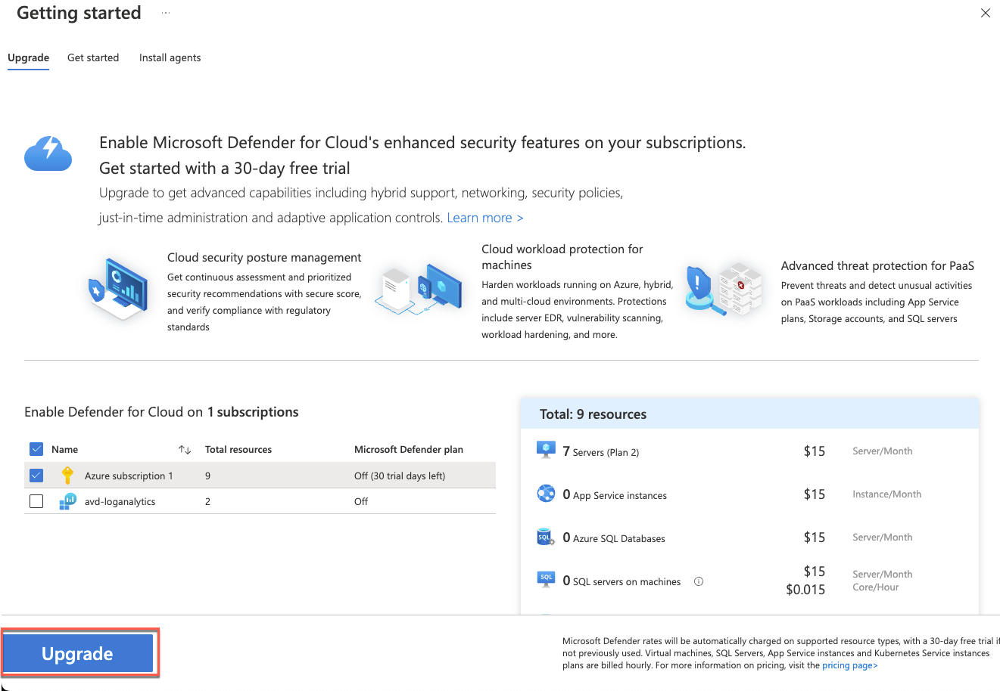

7. Select **Install agents** to deploy the security agents to your virtual machines. You'll also see the count of unprotected resources in the entire subscription.

    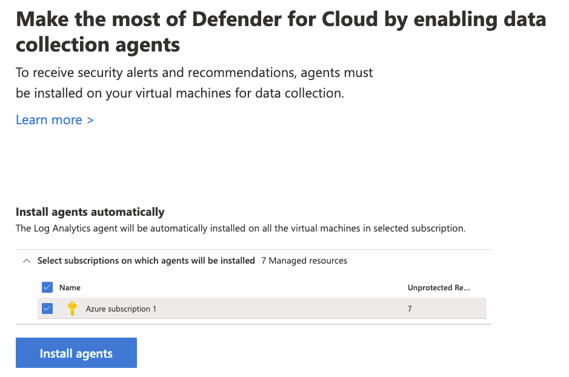

8. Refresh the **Workload protections** screen. At the top, you should see all your resources in the subscription now fully covered.

    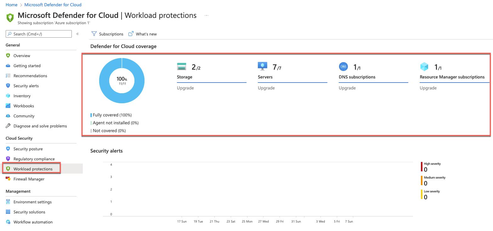

9. It can take some time for agents to deploy fully, but if you let it run for a while, you'll start seeing your resources show up in the Inventory.

    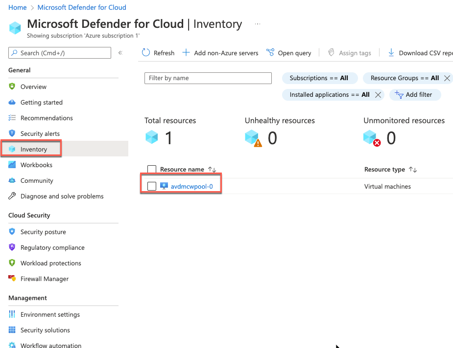

10. Depending on your AVD environment, you can deploy them to systems as they are added to your domain in the AVD OU by utilizing Group Policies using the [domain group policy scenario](https://docs.microsoft.com/en-us/microsoft-365/security/defender-endpoint/onboard-windows-10-multi-session-device?view=o365-worldwide#scenario-2-using-domain-group-policy). Another option when your host is not persistent or deployed from an image, is to use the instructions for [onboarding non-persistent VDI devices](https://docs.microsoft.com/en-us/microsoft-365/security/defender-endpoint/configure-endpoints-vdi?view=o365-worldwide).

## After the hands-on lab

Duration:  15 minutes

### Task 1: Delete Resource groups to remove the lab environment

1. Go to the **Azure portal**.

2. Go to your **Resource groups**.

    

3. Select the **Resource groups** you created.

4. Select **Delete Resource group**.

    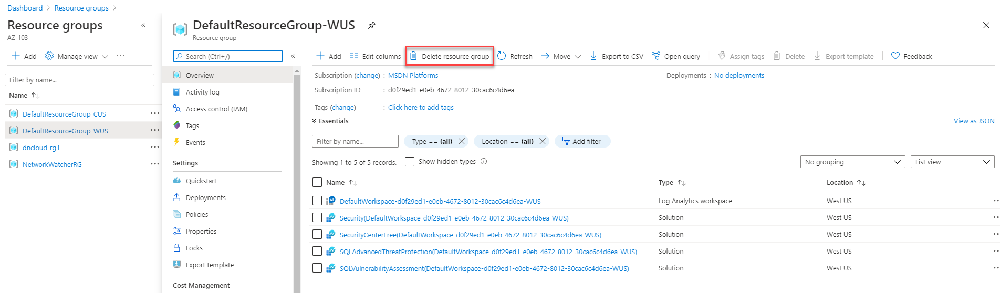

5. Enter the name of the **Resource group** and select **Delete**.

    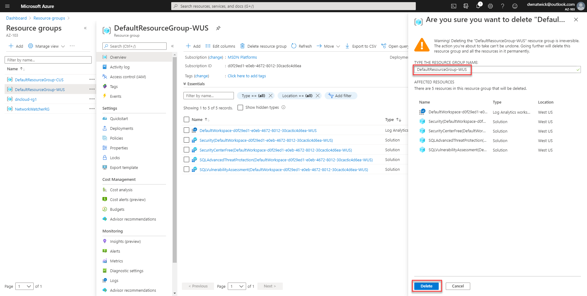

6. Repeat these steps for all **Resource groups** created for this lab, including those for **Azure Monitor** and **Log Analytics**.

You should follow all steps provided *after* attending the Hands-on lab.
