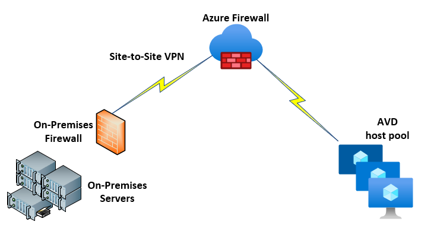

Implementing Azure Virtual Desktop in the enterprise

Whiteboard design session student guide

August 2022

Information in this document, including URLs and other Internet Web site references, is subject to change without notice. Unless otherwise noted, the example companies, organizations, products, domain names, e-mail addresses, logos, people, places, and events depicted herein are fictitious, and no association with any real company, organization, product, domain name, e-mail address, logo, person, place or event is intended or should be inferred. Complying with all applicable copyright laws is the responsibility of the user. Without limiting the rights under copyright, no part of this document may be reproduced, stored in or introduced into a retrieval system, or transmitted in any form or by any means (electronic, mechanical, photocopying, recording, or otherwise), or for any purpose, without the express written permission of Microsoft Corporation.

Microsoft may have patents, patent applications, trademarks, copyrights, or other intellectual property rights covering subject matter in this document. Except as expressly provided in any written license agreement from Microsoft, the furnishing of this document does not give you any license to these patents, trademarks, copyrights, or other intellectual property.

The names of manufacturers, products, or URLs are provided for informational purposes only and Microsoft makes no representations and warranties, either expressed, implied, or statutory, regarding these manufacturers or the use of the products with any Microsoft technologies. The inclusion of a manufacturer or product does not imply endorsement of Microsoft of the manufacturer or product. Links may be provided to third party sites. Such sites are not under the control of Microsoft and Microsoft is not responsible for the contents of any linked site or any link contained in a linked site, or any changes or updates to such sites. Microsoft is not responsible for webcasting or any other form of transmission received from any linked site. Microsoft is providing these links to you only as a convenience, and the inclusion of any link does not imply endorsement of Microsoft of the site or the products contained therein.

© 2022 Microsoft Corporation. All rights reserved.

Microsoft and the trademarks listed at https://www.microsoft.com/en-us/legal/intellectualproperty/Trademarks/Usage/General.aspx are trademarks of the Microsoft group of companies. All other trademarks are property of their respective owners.

**Contents**

<!-- TOC -->

- [Implementing Azure Virtual Desktop in the enterprise whiteboard design session student guide](#implementing-azure-virtual-desktop-in-the-enterprise-whiteboard-design-session-student-guide)
  - [Abstract and learning objectives](#abstract-and-learning-objectives)
  - [Step 1: Review the customer case study](#step-1-review-the-customer-case-study)
    - [Customer situation](#customer-situation)
    - [Customer needs](#customer-needs)
    - [Customer objections](#customer-objections)
    - [Infographic for common scenarios](#infographic-for-common-scenarios)
  - [Step 2: Design a proof of concept solution](#step-2-design-a-proof-of-concept-solution)
  - [Step 3: Present the solution](#step-3-present-the-solution)
  - [Wrap-up](#wrap-up)
  - [Additional references](#additional-references)

<!-- /TOC -->

# Implementing Azure Virtual Desktop in the enterprise whiteboard design session student guide

## Abstract and learning objectives

In the whiteboard design session, you will work in groups to design an Azure Virtual Desktop (formerly Windows Virtual Desktop) solution using Microsoft 365 and Azure technologies. Your solution will consider the necessary Microsoft 365 subscription required for Windows 10 Enterprise multi-user licensing, as well as the Azure Active Directory and security needs for a healthcare provider. You will need to determine how to connect Azure to the current VMware and Citrix on-premises infrastructure and the connections needed to connect this infrastructure to Azure for application access. Finally, you will need to design the Azure Virtual Desktop solution utilizing Azure virtual machines with availability and scalability to handle 24x7 operations without performance degradation.

At the end of the whiteboard design session, you will be better able to design a solution that leverages Microsoft 365 and Azure technologies together to build a secure and robust Azure Virtual Desktop infrastructure.

## Step 1: Review the customer case study

**Outcome**

Analyze your customer's needs.

Timeframe: 15 minutes

Directions:  With all participants in the session, the facilitator/SME presents an overview of the customer case study along with technical tips.

1. Meet your team members and trainer.

2. Read all directions for steps 1-3 in the student guide.

3. As a team, review the following customer case study.

### Customer situation

Contoso Healthcare, headquartered in Los Angeles, California, is a national healthcare provider with a network of affiliate hospitals and doctor’s offices located throughout North America. These locations continue to grow through acquisition.  The nature of their business requires a high level of security of Personal Identifiable Information (PII) for their employees.

Contoso currently has approximately 250 workstations within their environment with business applications for non-clinical users from developer, finance, and knowledge departments. Contoso is currently supporting existing data centers in California and Northern Virginia with VMware for the server control plane and a partial deployment of Citrix virtual desktop infrastructure. These locations are connected with a private WAN connection and a backup VPN over broadband.  

Ken Greenwald, Contoso Healthcare CTO, has been evaluating the value of the public cloud and views Microsoft Azure as an excellent option to maintain availability and increase the scalability of resources to the organization.  His team has also struggled with managing 250 workstations spread across the organization and needs an option to easily manage and maintain a standardized desktop image that gives users secure access to applications.  Ideally, these desktop images would not be maintained on local machines.  As Ken states, "Contoso Healthcare has continued to grow through the acquisition of doctor's offices and hospitals throughout North America, which has created an issue with our ability to standardize hardware at these locations.  The Board of Directors has been unwilling to increase capital expenditures for new equipment and we are forced as an IT organization to maximize our current VMware and Citrix virtual desktop infrastructure to deliver applications to users.  We need the ability to utilize what we have in place within our data centers and integrate Microsoft Azure technologies to facilitate our ability to standardize across the organization and quickly integrate a new office acquisition."

Contoso Healthcare's CISO, Laura Knight, has an additional list of objectives to address.  She is concerned with the threat of data exposure throughout the organization that is posed by the multiple devices that they have acquired through their office acquisitions.  The continued increase in mobility of these devices raises concerns of Personal Health Information (PHI) and Personally Identifiable Information (PII) being exposed to unauthorized individuals.  She also is responsible for the auditing of privacy standards, such as ISO 27001, HIPAA, and California Personal Protection Act (similar to GDPR) controls.  Laura has said, "The growth of Contoso Healthcare has created an increased burden on my security and compliance organization.  It has become more difficult to monitor systems as they come online with variations of operating systems.  Some of these operating systems do not support mobile device management software to audit use and application access.  In addition, enforcing a centralized standard for security policies and access to confidential information has been challenging.  My organization needs to be able to maintain the security of our data and resources, and mitigate the prospect of data loss due to threat or unauthorized access to devices."

Contoso Healthcare has completed an initial cloud assessment of their current infrastructure and applications, and they have divided the following areas that they feel that Microsoft 365 and Azure technologies can support:

**Security**: The business of healthcare has become more reliant on mobile devices to access files and financial records, which has created concern over theft and data exposure. Contoso would like to eliminate the possibility of any PHI or PII being located on a local device through use of a virtual desktop infrastructure. They would also like to be able to manage applications that are authorized, and block cloud applications that are not authorized.  Security controls will need to be audited, logged, and reviewed to ISO 27001, California Personal Protection Act, and HIPAA standards.

**Availability and Scalability**: Being a healthcare provider, Contoso requires applications to be accessible 24x7, so any infrastructure should be designed with high availability and scalability in mind. As Contoso Healthcare grows through acquisitions, they need to be able to scale out resources quickly for the addition of new users.

**Deployment Acceleration**: Contoso does not have a budget for the additional capital expenses required to upgrade current devices.  Therefore, they will need to utilize the current devices that are available to deliver a standard desktop image to users.   Contoso will be utilizing their current VMware and Citrix infrastructure and control plane for application delivery to user desktops.

### Customer needs

1. Contoso Healthcare needs the ability to manage mobile device location and avoid access to patient health records when not on the Contoso Health network.

2. Contoso Healthcare requires that any PHI and PII data is stored in a central encrypted storage account and not on local devices.

3. Contoso Healthcare must be able to log activity and access, and be able to audit compliance to ISO 27001, California Personal Protection Act, and HIPAA controls.

4. Contoso Healthcare requires 24x7 access to applications and the ability to scale resources as demand increases.

5. Contoso Healthcare needs redundancy in network connections with low latency when accessing applications.

6. Contoso Healthcare requires the ability to create and deploy a standardized desktop image to all users without the need to update and manage local devices.

7. Contoso Healthcare needs to leverage the current application infrastructure in their current California and Northern Virginia datacenters.

### Customer objections

1. The CTO at Contoso Healthcare does not want to invest in new workstations and mobile devices to support the standardized desktop image. This includes non-OS, Macs, Android, and thin clients.  Can these devices support the new image?

2. The CISO at Contoso Healthcare needs to be convinced that data will not be exposed. How would Microsoft support the data protection needs for Contoso Healthcare?

3. Contoso Healthcare must be able to log and audit all activity on the desktop image.  How will this be handled within the cloud and on-premises environments?

4. Connections between the cloud and existing data centers must be secure and reliable to support their requirements.  How will this be addressed and monitored?

5. Contoso Healthcare has made a substantial capital investment in their current data centers they do not want to decommission. Leverage existing infrastructure where possible is important.

### Infographic for common scenarios

### Security Scenarios
The security scenario applies to the potential security, monitoring, and compliance auditing options needed to design the solution.

![Common scenario of how Azure Monitor and Network Watcher can be used for both Azure and non-Azure VMs and network connections.  On the right, the on-premises servers are connected to Azure Monitor with an agent and Network Watcher is monitoring the connection between the on-premises datacenter and Azure.  In Azure, Azure Monitor is connected to the Azure Virtual Desktop host pool instances, and network watcher is monitoring the connect to these hosts and the VNET.  The metric and activity log information is then fed into Azure Monitor, Log Analytics, Azure Policy, and Microsoft Defender for Cloud for managing these resources for performance, activity, and compliance.](images/security.png "Security Scenario")

### Network Scenarios
Network scenarios diagram the potential options for connecting from Microsoft Azure to the on-premises network.

### Azure Virtual Desktop standard architecture
This diagram outlines a simple Azure Virtual Desktop architecture with Azure and Microsoft 365. This includes the Azure Virtual Desktop user connection and the Azure Virtual Desktop host pools.

## Step 2: Design a proof of concept solution

**Outcome**

Design a solution and prepare to present the solution to the target customer audience in a 15-minute chalk-talk format.

Timeframe: 60 minutes

**Business needs**

Directions: With your team, answer the following questions and be prepared to present your solution to others:

1. Who will you present this solution to? Who is your target customer audience? Who are the decision makers?

2. What customer business needs do you need to address with your solution?

**Design**

Directions: With your team, respond to the following questions:

*High-level architecture*

Design an Azure Virtual Desktop infrastructure that addresses the needs and requirements of the organization. Provide details of your implementation. Make sure to document your design with a diagram along with addressing the questions.  Address the requirements in the following areas:

*Microsoft 365*

1. What Microsoft 365 subscription is required for Windows 10 multi-user licensing?

2. What subscription is required for Contoso's mobile device requirements?

3. What subscription is needed to classify and protect PHI and PII access?

4. What subscription is necessary to enforce device access on the local network only?

5. Why did you select the Microsoft 365 subscription(s)?

*Security*

1. What is required to audit, log, and monitor controls for ISO 27001 and HIPAA?

2. How will you address monitoring these controls in Azure and the on-premises data centers?

3. How will you avoid data exposure for data in-transit and data at-rest?

4. How will you maintain identity access management for the cloud and current Active Directory infrastructure, and how will they synchronize?
  
5. How will you address the secure and centralized file storage needs of the organization?

6. Describe the reasons for the specific security services selected.

*Networking*

1. In what region or regions will you deploy resources and why?

2. How will you design the resource groups to support your design?

3. How will your virtual networks (VNETs) be configured for IP addresses and subnets?

4. How will you connect to Contoso Healthcare's data centers to minimize latency and maximize security?

5. What inbound ports, if any, need to be open to the session hosts for users to connect securely?

6. What will you use to identify and monitor threats on the network?

7. How would you monitor network throughput and latency over the network?

*Azure Virtual Desktop image*

1. How will the standardized desktop image be created?

2. How will applications be delivered to the desktop image?

3. What are the connection options for users to access the Azure Virtual Desktop image?

4. What are the minimum system requirements for users to access the Azure Virtual Desktop image?

*Azure Virtual Desktop host pool*

1. How many concurrent sessions will be required to access the virtual desktop image?

2. How many virtual machines are required to support the number of concurrent sessions?

**Prepare**

Directions: As a team:

1. Identify any customer needs that are not addressed with the proposed solution.

2. Identify the benefits of your solution.

3. Determine how you will respond to the customer's objections.

Prepare a 15-minute chalk-talk style presentation to the customer.

## Step 3: Present the solution

**Outcome**

Present a solution to the target customer audience in a 15-minute chalk-talk format.

Timeframe: 30 minutes

**Presentation**

Directions:

1. Pair with another team.

2. One group is the Microsoft team, the other is the customer.

3. The Microsoft team presents their proposed solution to the customer.

4. The customer makes one of the objections from the list of objections.

5. The Microsoft team responds to the objection.

6. The customer team gives feedback to the Microsoft team.

7. Switch roles and repeat Steps 2-6.

## Wrap-up

Timeframe: 15 minutes

Directions: Reconvene with the larger group to hear the facilitator/SME share the preferred solution for the case study.

## Additional references

|    |            |
|----------|:-------------:|
| **Description** | **Links** |
| Overview of Azure Virtual Desktop | <https://docs.microsoft.com/en-us/azure/virtual-desktop/overview> |
| Azure Virtual Desktop terminology | <https://docs.microsoft.com/en-us/azure/virtual-desktop/environment-setup> |
| Create a virtual desktop host pool | <https://docs.microsoft.com/en-us/azure/virtual-desktop/create-host-pools-azure-marketplace> |
| Azure Virtual Desktop licensing requirements and pricing | <https://azure.microsoft.com/en-us/pricing/details/virtual-desktop/> |
| Prepare and customize a VHD image for AVD | <https://docs.microsoft.com/en-us/azure/virtual-desktop/set-up-customize-master-image> |
| Azure Policy overview | <https://docs.microsoft.com/en-us/azure/governance/policy/overview> |
| Microsoft Defender for Cloud | <https://docs.microsoft.com/en-us/azure/defender-for-cloud//> |
| Azure Active Directory | <https://docs.microsoft.com/en-us/azure/active-directory/> |
| FSLogix File Storage containers in Azure Virtual Desktop | <https://docs.microsoft.com/en-us/azure/virtual-desktop/fslogix-containers-azure-files> |
| Connect to AVD with a web client | <https://docs.microsoft.com/en-us/azure/virtual-desktop/connect-web> |
| AVD security best practices | <https://docs.microsoft.com/en-us/azure/virtual-desktop/security-guide> |
| Microsoft 365 enterprise plans | <https://www.microsoft.com/en-us/microsoft-365/compare-microsoft-365-enterprise-plans> |
| Microsoft 365 Enterprise Mobility + Security plans | <https://www.microsoft.com/en-us/microsoft-365/enterprise-mobility-security/compare-plans-and-pricing?rtc=1> |
