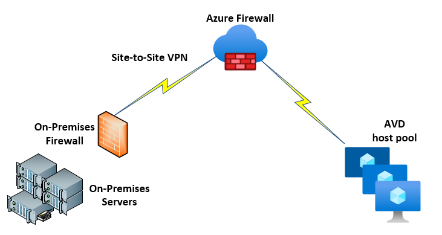
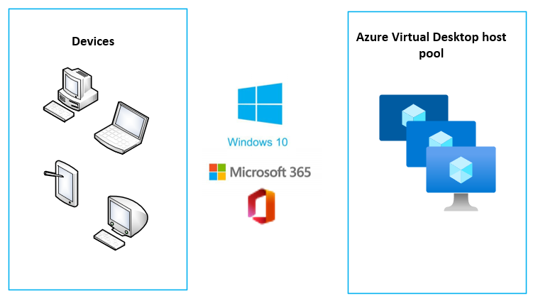
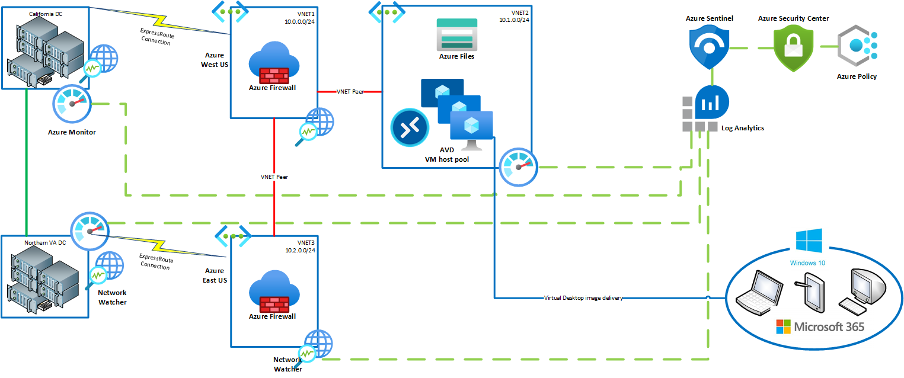

Implementing Azure Virtual Desktop in the enterprise

Whiteboard design session trainer guide

August 2022

Information in this document, including URL and other Internet Web site references, is subject to change without notice. Unless otherwise noted, the example companies, organizations, products, domain names, e-mail addresses, logos, people, places, and events depicted herein are fictitious, and no association with any real company, organization, product, domain name, e-mail address, logo, person, place or event is intended or should be inferred. Complying with all applicable copyright laws is the responsibility of the user. Without limiting the rights under copyright, no part of this document may be reproduced, stored in or introduced into a retrieval system, or transmitted in any form or by any means (electronic, mechanical, photocopying, recording, or otherwise), or for any purpose, without the express written permission of Microsoft Corporation.

Microsoft may have patents, patent applications, trademarks, copyrights, or other intellectual property rights covering subject matter in this document. Except as expressly provided in any written license agreement from Microsoft, the furnishing of this document does not give you any license to these patents, trademarks, copyrights, or other intellectual property.

The names of manufacturers, products, or URLs are provided for informational purposes only and Microsoft makes no representations and warranties, either expressed, implied, or statutory, regarding these manufacturers or the use of the products with any Microsoft technologies. The inclusion of a manufacturer or product does not imply endorsement of Microsoft of the manufacturer or product. Links may be provided to third party sites. Such sites are not under the control of Microsoft and Microsoft is not responsible for the contents of any linked site or any link contained in a linked site, or any changes or updates to such sites. Microsoft is not responsible for webcasting or any other form of transmission received from any linked site. Microsoft is providing these links to you only as a convenience, and the inclusion of any link does not imply endorsement of Microsoft of the site or the products contained therein.

© 2022 Microsoft Corporation. All rights reserved.

Microsoft and the trademarks listed at https://www.microsoft.com/en-us/legal/intellectualproperty/Trademarks/Usage/General.aspx are trademarks of the Microsoft group of companies. All other trademarks are property of their respective owners.

**Contents**

<!-- TOC -->

- [Trainer information](#trainer-information)
  - [Role of the trainer](#role-of-the-trainer)
  - [Whiteboard design session flow](#whiteboard-design-session-flow)
  - [Before the whiteboard design session: How to prepare](#before-the-whiteboard-design-session-how-to-prepare)
  - [During the whiteboard design session: Tips for an effective whiteboard design session](#during-the-whiteboard-design-session-tips-for-an-effective-whiteboard-design-session)
- [Implementing Azure Virtual Desktop in the enterprise whiteboard design session student guide](#implementing-azure-virtual-desktop-in-the-enterprise-whiteboard-design-session-student-guide)
  - [Abstract and learning objectives](#abstract-and-learning-objectives)
  - [Step 1: Review the customer case study](#step-1-review-the-customer-case-study)
    - [Customer situation](#customer-situation)
    - [Customer needs](#customer-needs)
    - [Customer objections](#customer-objections)
    - [Infographic for common scenarios](#infographic-for-common-scenarios)
  - [Step 2: Design a proof of concept solution](#step-2-design-a-proof-of-concept-solution)
  - [Step 3: Present the solution](#step-3-present-the-solution)
  - [Wrap-up](#wrap-up)
  - [Additional references](#additional-references)
- [Implementing Azure Virtual Desktop in the enterprise whiteboard design session trainer guide](#implementing-azure-virtual-desktop-in-the-enterprise-whiteboard-design-session-trainer-guide)
  - [Step 1: Review the customer case study](#step-1-review-the-customer-case-study-1)
  - [Step 2: Design a proof of concept solution](#step-2-design-a-proof-of-concept-solution-1)
  - [Step 3: Present the solution](#step-3-present-the-solution-1)
  - [Wrap-up](#wrap-up-1)
  - [Preferred target audience](#preferred-target-audience)
  - [Preferred solution](#preferred-solution)
  - [Checklist of preferred objection handling](#checklist-of-preferred-objection-handling)
  - [Customer quote (to be read back to the attendees at the end)](#customer-quote-to-be-read-back-to-the-attendees-at-the-end)

<!-- /TOC -->

# Trainer information

Thank you for taking time to support the whiteboard design sessions as a trainer!

## Role of the trainer

An amazing trainer:

- Creates a safe environment in which learning can take place.

- Stimulates the participant's thinking.

- Involves the participant in the learning process.

- Manages the learning process (on time, on topic, and adjusting to benefit participants).

- Ensures individual participant accountability.

- Ties it all together for the participant.

- Provides insight and experience to the learning process.

- Effectively leads the whiteboard design session discussion.

- Monitors quality and appropriateness of participant deliverables.

- Effectively leads the feedback process.

## Whiteboard design session flow

Each whiteboard design session uses the following flow:

**Step 1: Review the customer case study (15 minutes)**

**Outcome**

Analyze your customer's needs.

- Customer's background, situation, needs, and technical requirements

- Current customer infrastructure and architecture

- Potential issues, objectives, and blockers

**Step 2: Design a proof of concept solution (60 minutes)**

**Outcome**

Design a solution and prepare to present the solution to the target customer audience in a 15-minute chalk-talk format.

- Determine your target customer audience.

- Determine the customer's business needs to address your solution.

- Design and diagram your solution.

- Prepare to present your solution.

**Step 3: Present the solution (30 minutes)**

**Outcome**

Present solution to your customer:

- Present solution

- Respond to customer objections

- Receive feedback

**Wrap-up (15 minutes)**

- Review preferred solution

## Before the whiteboard design session: How to prepare

Before conducting your first whiteboard design session:

- Read the Student guide (including the case study) and Trainer guide.

- Become familiar with all key points and activities.

- Plan the points you want to stress, which questions you want to drive, transitions, and be ready to answer questions.

- Prior to the whiteboard design session, discuss the case study to pick up more ideas.

- Make notes for later.

## During the whiteboard design session: Tips for an effective whiteboard design session

**Refer to the Trainer guide** to stay on track and observe the timings.

**Do not expect to memorize every detail** of the whiteboard design session.

When participants are doing activities, you can **look ahead to refresh your memory**.

- **Adjust activity and whiteboard design session pace** as needed to allow time for presenting, feedback, and sharing.

- **Add examples, points, and stories** from your own experience. Think about stories you can share that help you make your points clearly and effectively.

- **Consider creating a "parking lot"** to record issues or questions raised that are outside the scope of the whiteboard design session or can be answered later. Decide how you will address these issues, so you can acknowledge them without being derailed by them.

***Have fun**! Encourage participants to have fun and share!*

**Involve your participants**. Talk and share your knowledge but always involve your participants, even while you are the one speaking.

**Ask questions** and get them to share to fully involve your group in the learning process.

**Ask first**, whenever possible. Before launching into a topic, learn your audience's opinions about it and experiences with it. Asking first enables you to assess their level of knowledge and experience and leaves them more open to what you are presenting.

**Wait for responses**. If you ask a question such as, "What's your experience with (fill in the blank)?" then wait. Do not be afraid of a little silence. If you leap into the silence, your participants will feel you are not serious about involving them and will become passive. Give participants a chance to think, and if no one answers, patiently ask again. You will usually get a response.

# Implementing Azure Virtual Desktop in the enterprise whiteboard design session student guide

## Abstract and learning objectives

In the whiteboard design session, you will work in groups to design an Azure Virtual Desktop (formerly Windows Virtual Desktop) solution using Microsoft 365 and Azure technologies. Your solution will consider the necessary Microsoft 365 subscription required for Windows 10 Enterprise multi-user licensing, as well as the Azure Active Directory and security needs for a healthcare provider. You will need to determine how to connect Azure to the current VMware and Citrix on-premises infrastructure and the connections needed to connect this infrastructure to Azure for application access. Finally, you will need to design the Azure Virtual Desktop solution utilizing Azure virtual machines with availability and scalability to handle 24x7 operations without performance degradation.

At the end of the whiteboard design session, you will be better able to design a solution that leverages Microsoft 365 and Azure technologies together to build a secure and robust Azure Virtual Desktop infrastructure.

## Step 1: Review the customer case study

**Outcome**

Analyze your customer's needs.

Timeframe: 15 minutes

Directions:  With all participants in the session, the facilitator/SME presents an overview of the customer case study along with technical tips.

1. Meet your team members and trainer.

2. Read all directions for steps 1-3 in the student guide.

3. As a team, review the following customer case study.

### Customer situation

Contoso Healthcare, headquartered in Los Angeles, California, is a national healthcare provider with a network of affiliate hospitals and doctor’s offices located throughout North America. These locations continue to grow through acquisition.  The nature of their business requires a high level of security of Personal Identifiable Information (PII) for their employees.

Contoso currently has approximately 250 workstations within their environment with business applications for non-clinical users from developer, finance, and knowledge departments. Contoso is currently supporting existing data centers in California and Northern Virginia with VMware for the server control plane and a partial deployment of Citrix virtual desktop infrastructure. These locations are connected with a private WAN connection and a backup VPN over broadband.  

Ken Greenwald, Contoso Healthcare CTO, has been evaluating the value of the public cloud and views Microsoft Azure as an excellent option to maintain availability and increase the scalability of resources to the organization.  His team has also struggled with managing 250 workstations spread across the organization and needs an option to easily manage and maintain a standardized desktop image that gives users secure access to applications.  Ideally, these desktop images would not be maintained on local machines.  As Ken states, "Contoso Healthcare has continued to grow through the acquisition of doctor's offices and hospitals throughout North America, which has created an issue with our ability to standardize hardware at these locations.  The Board of Directors has been unwilling to increase capital expenditures for new equipment and we are forced as an IT organization to maximize our current VMware and Citrix virtual desktop infrastructure to deliver applications to users.  We need the ability to utilize what we have in place within our data centers and integrate Microsoft Azure technologies to facilitate our ability to standardize across the organization and quickly integrate a new office acquisition."

Contoso Healthcare's CISO, Laura Knight, has an additional list of objectives to address.  She is concerned with the threat of data exposure throughout the organization that is posed by the multiple devices that they have acquired through their office acquisitions.  The continued increase in mobility of these devices raises concerns of Personal Health Information (PHI) and Personally Identifiable Information (PII) being exposed to unauthorized individuals.  She also is responsible for the auditing of privacy standards, such as ISO 27001, HIPAA, and California Personal Protection Act (similar to GDPR) controls.  Laura has said, "The growth of Contoso Healthcare has created an increased burden on my security and compliance organization.  It has become more difficult to monitor systems as they come online with variations of operating systems.  Some of these operating systems do not support mobile device management software to audit use and application access.  In addition, enforcing a centralized standard for security policies and access to confidential information has been challenging.  My organization needs to be able to maintain the security of our data and resources, and mitigate the prospect of data loss due to threat or unauthorized access to devices."

Contoso Healthcare has completed an initial cloud assessment of their current infrastructure and applications, and they have divided the following areas that they feel that Microsoft 365 and Azure technologies can support:

**Security**: The business of healthcare has become more reliant on mobile devices to access files and financial records, which has created concern over theft and data exposure. Contoso would like to eliminate the possibility of any PHI or PII being located on a local device through use of a virtual desktop infrastructure. They would also like to be able to manage applications that are authorized, and block cloud applications that are not authorized.  Security controls will need to be audited, logged, and reviewed to ISO 27001, California Personal Protection Act, and HIPAA standards.

**Availability and Scalability**: Being a healthcare provider, Contoso has a requirement for applications to be accessible 24x7, so any infrastructure should be designed with high availability and scalability in mind. As Contoso Healthcare grows through acquisitions, they need to be able to scale out resources quickly for the addition of new users.

**Deployment Acceleration**: Contoso does not have a budget for the additional capital expenses required to upgrade current devices.  Therefore, they will need to utilize the current devices that are available to deliver a standard desktop image to users.   Contoso will be utilizing their current VMware and Citrix infrastructure and control plane for application delivery to user desktops.

### Customer needs

1. Contoso Healthcare needs the ability to manage mobile device location and avoid access to patient health records when not on the Contoso Health network.

2. Contoso Healthcare requires that any PHI and PII data is stored in a central encrypted storage account and not on local devices.

3. Contoso Healthcare must be able to log activity and access, and be able to audit compliance to ISO 27001, California Personal Protection Act, and HIPAA controls.

4. Contoso Healthcare requires 24x7 access to applications and the ability to scale resources as demand increases.

5. Contoso Healthcare needs redundancy in network connections with low latency when accessing applications.

6. Contoso Healthcare requires the ability to create and deploy a standardized desktop image to all users without the need to update and manage local devices.

7. Contoso Healthcare needs to leverage the current application infrastructure in their current California and Northern Virginia datacenters.

### Customer objections

1. The CTO at Contoso Healthcare does not want to invest in new workstations and mobile devices to support the standardized desktop image. This includes non-OS, Macs, Android, and thin clients.  Can these devices support the new image?

2. The CISO at Contoso Healthcare needs to be convinced that data will not be exposed. How would Microsoft support the data protection needs for Contoso Healthcare?

3. Contoso Healthcare must be able to log and audit all activity on the desktop image.  How will this be handled within the cloud and on-premises environments?

4. Connections between the cloud and existing data centers must be secure and reliable to support their requirements.  How will this be addressed and monitored?

5. Contoso Healthcare has made a substantial capital investment in their current data centers they do not want to decommission. Leverage existing infrastructure where possible is important.

### Infographic for common scenarios

#### Security Scenarios
The security scenario applies to the potential security, monitoring, and compliance auditing options needed to design the solution.

![Common scenario of how Azure Monitor and Network Watcher can be used for both Azure and non-Azure VMs and network connections.  On the right, the on-premises servers are connected to Azure Monitor with an agent and Network Watcher is monitoring the connection between the on-premises datacenter and Azure.  In Azure, Azure Monitor is connected to the Azure Virtual Desktop host pool instances, and network watcher is monitoring the connect to these hosts and the VNET.  The metric and activity log information is then fed into Azure Monitor, Log Analytics, Azure Policy, and Microsoft Defender for Cloud for managing these resources for performance, activity, and compliance.](images/security.png "Security Scenario")

#### Network Scenarios
Network scenarios diagram the potential options for connecting from Microsoft Azure to the on-premises network.

#### Azure Virtual Desktop standard architecture
This diagram outlines a simple Azure Virtual Desktop architecture with Azure and Microsoft 365. This includes the Azure Virtual Desktop user connection and the Azure Virtual Desktop host pools.

## Step 2: Design a proof of concept solution

**Outcome**

Design a solution and prepare to present the solution to the target customer audience in a 15-minute chalk-talk format.

Timeframe: 60 minutes

**Business needs**

Directions: With your team, answer the following questions and be prepared to present your solution to others:

1. Who will you present this solution to? Who is your target customer audience? Who are the decision makers?

2. What customer business needs do you need to address with your solution?

**Design**

Directions: With your team, respond to the following questions:

*High-level architecture*

Design an Azure Virtual Desktop infrastructure that addresses the needs and requirements of the organization. Provide details of your implementation. Make sure to document your design with a diagram along with addressing the questions.  Address the requirements in the following areas:

*Microsoft 365*

1. What Microsoft 365 subscription is required for Windows 10 multi-user licensing?

2. What subscription is required for Contoso's mobile device requirements?

3. What subscription is needed to classify and protect PHI and PII access?

4. What subscription is necessary to enforce device access on the local network only?

5. Why did you select the Microsoft 365 subscription(s)?

*Security*

1. What is required to audit, log, and monitor controls for ISO 27001 and HIPAA?

2. How will you address monitoring these controls in Azure and the on-premises data centers?

3. How will you avoid data exposure for data in-transit and data at-rest?

4. How will you maintain identity access management for the cloud and current Active Directory infrastructure, and how will they synchronize?
  
5. How will you address the secure and centralized file storage needs of the organization?

6. Describe the reasons for the specific security services selected.

*Networking*

1. In what region or regions will you deploy resources and why?

2. How will you design the resource groups to support your design?

3. How will your virtual networks (VNETs) be configured for IP addresses and subnets?

4. How will you connect to Contoso Healthcare's data centers to minimize latency and maximize security?

5. What inbound ports, if any, need to be open to the session hosts for users to connect securely?

6. What will you use to identify and monitor threats on the network?

7. How would you monitor network throughput and latency over the network?

*Azure Virtual Desktop image*

1. How will the standardized desktop image be created?

2. How will applications be delivered to the desktop image?

3. What are the connection options for users to access the Azure Virtual Desktop image?

4. What are the minimum system requirements for users to access the Azure Virtual Desktop image?

*Azure Virtual Desktop host pool*

1. How many concurrent sessions will be required to access the virtual desktop image?

2. How many virtual machines are required to support the number of concurrent sessions?

**Prepare**

Directions: As a team:

1. Identify any customer needs that are not addressed with the proposed solution.

2. Identify the benefits of your solution.

3. Determine how you will respond to the customer's objections.

Prepare a 15-minute chalk-talk style presentation to the customer.

## Step 3: Present the solution

**Outcome**

Present a solution to the target customer audience in a 15-minute chalk-talk format.

Timeframe: 30 minutes

**Presentation**

Directions:

1. Pair with another team.

2. One group is the Microsoft team and the other is the customer.

3. The Microsoft team presents their proposed solution to the customer.

4. The customer makes one of the objections from the list of objections.

5. The Microsoft team responds to the objection.

6. The customer team gives feedback to the Microsoft team.

7. Switch roles and repeat Steps 2-6.

## Wrap-up

Timeframe: 15 minutes

Directions: Reconvene with the larger group to hear the facilitator/SME share the preferred solution for the case study.

## Additional references

|    |            |
|----------|:-------------:|
| **Description** | **Links** |
| Overview of Azure Virtual Desktop | <https://docs.microsoft.com/en-us/azure/virtual-desktop/overview> |
| Azure Virtual Desktop terminology | <https://docs.microsoft.com/en-us/azure/virtual-desktop/environment-setup> |
| Create a virtual desktop host pool | <https://docs.microsoft.com/en-us/azure/virtual-desktop/create-host-pools-azure-marketplace> |
| Azure Virtual Desktop licensing requirements and pricing | <https://azure.microsoft.com/en-us/pricing/details/virtual-desktop/> |
| Prepare and customize a VHD image for AVD | <https://docs.microsoft.com/en-us/azure/virtual-desktop/set-up-customize-master-image> |
| Azure Policy overview | <https://docs.microsoft.com/en-us/azure/governance/policy/overview> |
| Microsoft Defender for Cloud | <https://docs.microsoft.com/en-us/azure/defender-for-cloud//> |
| Azure Active Directory | <https://docs.microsoft.com/en-us/azure/active-directory/> |
| FSLogix File Storage containers in Azure Virtual Desktop | <https://docs.microsoft.com/en-us/azure/virtual-desktop/fslogix-containers-azure-files> |
| Connect to AVD with a web client | <https://docs.microsoft.com/en-us/azure/virtual-desktop/connect-web> |
| AVD security best practices | <https://docs.microsoft.com/en-us/azure/virtual-desktop/security-guide> |
| Microsoft 365 enterprise plans | <https://www.microsoft.com/en-us/microsoft-365/compare-microsoft-365-enterprise-plans> |
| Microsoft 365 Enterprise Mobility + Security plans | <https://www.microsoft.com/en-us/microsoft-365/enterprise-mobility-security/compare-plans-and-pricing?rtc=1> |

# Implementing Azure Virtual Desktop in the enterprise whiteboard design session trainer guide

## Step 1: Review the customer case study

- Check in with your participants to introduce yourself as the trainer.

- Ask, "What questions do you have about the customer case study?"

- Briefly review the steps and timeframes of the whiteboard design session.

- Ready, set, go! Let participants begin.

## Step 2: Design a proof of concept solution

- Check in with your teams to ensure that they are transitioning from step to step on time.

- Provide feedback on their responses to the business needs and design.

  - Try asking questions first that will lead the participants to discover the answers on their own.

- Provide feedback for their responses to the customer's objections.

  - Try asking questions first that will lead the participants to discover the answers on their own.

## Step 3: Present the solution

- Determine which groups will be paired together before Step 3 begins.

- For the first round, assign one group as the presenting team and the other as the customer.

- Have the presenting team present their solution to the customer team.

  - Have the customer team provide one objection for the presenting team to respond to.

  - The presentation, objections, and feedback should take no longer than 15 minutes.

  - If needed, the trainer may also provide feedback.

## Wrap-up

- Have participants reconvene with the larger session group to hear the facilitator/SME share the following preferred solution.

## Preferred target audience

- Ken Greenwood, Contoso Healthcare CTO

- Laura Knight, Contoso Healthcare CISO

- Desktop Administrators

- Service Delivery Managers

- Infrastructure, Virtualization, Storage, and Networking Teams

## Preferred solution

*High-level architecture*

Design an Azure Virtual Desktop infrastructure that addresses the needs and requirements of the organization. Provide details of your implementation. Make sure to document your design with a diagram along with addressing the questions.  Address the requirements in the following areas:

*Microsoft 365*

1. What Microsoft 365 subscription is required for Windows 10 multi-user licensing?

   Microsoft 365 licenses that support Azure Virtual Desktop include M365 E3, E5, A3, A5, F3, and Business Premium.

2. What subscription is required for Contoso's mobile device requirements?

   Microsoft Enterprise Mobility + Security E3 or E5 are required for Intune MDM.

3. What subscription is needed to classify and protect PHI and PII access?

   A Microsoft 365 E5 license is required for the full suite of data protection, information protection and classification, and advanced threat protection capabilities.

4. What subscription is necessary to enforce device access on the local network only?

   Conditional access policies are available on EMS E3 and E5.  However, risk-based conditional access policies are only available on EMS E5, which would be best suited for this organization.

5. Why did you select the Microsoft 365 subscription(s)?

   A Microsoft 365 Enterprise E5 will be required. Microsoft 365 Enterprise E5 includes Enterprise Mobility + Security E5 to support the full list of requirements outlined by the customer.  Microsoft 365 licenses that support Azure Virtual Desktop include M365 E3, E5, A3, A5, F3, and Business Premium.  However, the additional requirements for mobile device management, data classification and information protection, and conditional access policies require the Microsoft 365 E5 license.  Business Premium licensing is also only supported to up to 300 users.

*Security*

1. What is required to audit, log, and monitor controls for ISO 27001 and HIPAA? 

    Azure Policy initiatives for ISO 27001 and HIPAA should be enabled for the resource groups that are created to govern the Azure Virtual Desktop infrastructure.  In addition, Microsoft Defender for Cloud should be upgraded to the Standard tier subscription to properly monitor and alert on control compliance to ISO 27001 and HIPAA standards.

    To address compliance with the California Personal Protection Act, the Azure Policy initiative for GDPR will be assigned and custom policies will be added as needed to comply with the CPPA.

2. How will you address monitoring these controls in Azure and the on-premises data centers?

   Azure Monitor agents should be installed on all Azure and on-premises virtual machines in order to govern the Azure Policy initiatives.  These agents will provide activity logs that can be monitored within Microsoft Defender for Cloud.

    Microsoft Defender should be used to monitor threats.

    Microsoft Sentinel should be used for incident response and investigation.

3. How will you avoid data exposure for data in transit and data at rest?

    All connections for data in-transit will be transmitted through an encrypted SSL connection.  Data at-rest will be encrypted at-rest.

    Microsoft Defender for Cloud Apps for managing authorized applications. This will be used to block unauthorized cloud storage services to protect data from being copied.

4. How will you maintain identity access management for the cloud and current Active Directory infrastructure, and how will they synchronize?

    The cloud identity will be created within Azure Active Directory.  This will be the primary identity source for Microsoft 365, Azure Virtual Desktop, and Azure services.  User identities from Active Directory Domain Services will be synchronized with Azure Active Directory to maintain user login credentials.  Azure AD Connect will be installed at Contoso Healthcare's data center in order to synchronize user credentials for single sign-on.  Password Hash Synchronization will be used so that users have the ability to authenticate through the data center Active Directory services or the cloud Azure Active Directory services.

5. How will you address the secure and centralized file storage needs of the organization?

    Azure Files is the preferred method for storage use with Azure Virtual Desktop.  In addition, FSLogix can be used in conjunction with Azure Files to manage user virtual desktop profiles.  Azure Files must be deployed in the same region as the Virtual Machine pools.

6. Describe the reasons for the specific security services selected.

    Azure Monitor, Microsoft Defender for Identity, Microsoft Defender for Cloud Apps, Microsoft Defender for Cloud, and Microsoft Sentinel will provide services to monitor, manage and investigate any potential vulnerabilities, threats, or anomalies within the environment to protect users and data across Azure, Microsoft 365, and on-premises resources.

*Networking*

1. In what region or regions will you deploy resources and why?

    In order to decrease latency West US and East US regions should be peered in Azure to decrease latency to California and Northern Virginia.

    A single resource group will be deployed for the Window Virtual Desktop infrastructure resources.

2. How will you design the resource groups to support your design?

    The entire Azure Virtual Desktop infrastructure should be created within a single resource group.  This will allow for ease of management of the resources and the ability to analyze and review the consumption easily within the Azure subscription.  

3. How will your virtual networks (VNETs) be configured for IP addresses and subnets?

    The resource group should be configured with at least three separate VNETs with subnets.  The first would be the VNET for the Virtual Desktop host pool, the second will be the VNET used to connect to the on-premises network, and the third would be a VNET for a Bastion host to be used for secure virtual machine access for support.  The VNETs will be peered with only the Virtual Desktop host pool VNET having gateway access for security.  This configuration of VNETs provides a level of isolation to the networks for security and control.

4. How will you connect to Contoso Healthcare's data centers to minimize latency and maximize security?

    The VNET identified above will connect the on-premises network utilizing an Azure Firewall that creates a site-to-site VPN connection to the primary datacenter in Los Angeles.  The recommendation would be to also utilize an Azure ExpressRoute connection directly from the Los Angeles datacenter to Azure West US, if available, and the VPN be used for backup connectivity to maximize connection speed and security, and East US to the Northern Virginia datacenter.

5. What inbound ports, if any, need to be open to the session hosts for users to connect securely?

    The answer is none. Because of reverse-connect, no inbound ports are required to access the session hosts, thus reducing the attack surface 
    (https://docs.microsoft.com/en-us/azure/virtual-desktop/security-guide#session-host-security-best-practices).

6. What will you use to identify and monitor threats on the network?

    Azure Monitor, Azure Log Analytics, and Microsoft Defender should all be turned on with actions and alerts to the security group.  

    The Microsoft Defender for Cloud standard subscription will provide a central dashboard for monitoring, locating, and alerting on common threats found in the Microsoft Threat database.

    Network Watcher will be utilized to monitor network connection speeds and health.

    Service Map will be utilized for additional monitoring of virtual machines.

    Microsoft Sentinel will be the central source for incident response and investigation of threats, vulnerabilities, and anomalies.

7. How would you monitor network throughput and latency over the network?

    Turning on Network Watcher within the VNETs will provide logs and analysis of the network speeds across VNETs and to the on-premises network.

*Azure Virtual Desktop image*

1. How will the standardized desktop image be created?

    The recommendation would be to create the managed WVD image that Contoso Healthcare wants to deliver to their users. Optionally, they could also create a VHD for the standard image.  Details on this process are in the links provided in the student guide.  Another option is to have an image created with Windows 10 multi-user licensing and Office365 ProPlus at the time of creating the Azure Virtual Desktop host pool, and then making adjustments to that image based on custom requirements. You could use the following automated image building solutions to create and manage this image, such as Azure Image Builder (https://docs.microsoft.com/en-us/azure/virtual-machines/windows/image-builder-overview) or build image with Packer (https://docs.microsoft.com/en-us/azure/virtual-machines/windows/build-image-with-packer) to manage images in Azure.

2. How will applications be delivered to the desktop image?

    To simplify the application delivery and licensing, Contoso Healthcare would like to leverage the current Citrix infrastructure that they have in place.  To accomplish this, a shortcut can be provided on the standard desktop image for the Citrix app marketplace that provides users with the applications they are authorized to access.

3. What are the connection options for users to access the Azure Virtual Desktop image?

    There are multiple connection options for users to access their Azure Virtual Desktop.  The Remote Desktop client application can be used with Windows 10, Windows 7, Android, macOS, or iOS.  Users can also connect through an HTML5-capable web browser.  Since we are unsure of the full scope of operating systems on the 500 existing workstations within Contoso Healthcare, we recommend connection through the web browser on desktop devices and using the Remote Desktop app on mobile devices.

4. What are the minimum system requirements for users to access the Azure Virtual Desktop image?

    Officially supported browsers are Microsoft Edge, Apple Safari, Google Chrome, and Mozilla Firefox (v55 or higher).  Windows 10, Windows 10 IoT Enterprise, Windows 7, and macOS operating systems are supported.  Microsoft Remote Desktop app is available for Android and iOS mobile devices.

*Azure Virtual Desktop host pool*
  
1. How many concurrent sessions will be required to access the virtual desktop image?

    We will design the capacity to support the full 250 sessions that were identified in our initial discussions with the customer.

2. How many virtual machines are required to support the number of concurrent sessions?

    You should have used the Azure pricing calculator to create an initial capacity estimate.  This estimate calculated at most 31 DS2s v3 instances as the base availability set with 8 virtual desktop sessions per host (according to: https://docs.microsoft.com/en-us/windows-server/remote/remote-desktop-services/virtual-machine-recs).  Additional instances to scale as capacity increases.  The example estimate can be accessed here: https://azure.com/e/296a636cede24f1c859b42a63687c80c.

*Diagram of the on-premises to Azure Virtual Desktop solution*

   This diagram shows the possible solution for Contoso's Azure Virtual Desktops.  The California datacenter is connecting to the Azure West US region, and the Northern Virginia datacenter is connecting to the East US region utilizing ExpressRoutes to each.  The West US and East US region VNETs are peered for high-speed backbone connection with a pass-through peering allowed from East US to the WVD VM host pool VNET that is peered with West US.

   

## Checklist of preferred objection handling

1. The CTO at Contoso Healthcare does not want to invest in new workstations and mobile devices to support the standardized desktop image. Can these devices support the new image?

    Azure Virtual Desktop is flexible in that users can access their virtual desktop. The design will utilize web browser access to the virtual desktop on workstations, and the remote desktop app on mobile devices.  

2. The CISO at Contoso Healthcare needs to be convinced that data will not be exposed. How would Microsoft support the data protection needs for Contoso Healthcare?

    The designed solution for Contoso Healthcare includes Microsoft 365 E5 with Enterprise Mobility + Security (EMS) E5.  This provides a full suite of data and information protection to classify sensitive data and audit activity.  Microsoft Defender for Cloud Apps can also be used to block access to unauthorized file sharing services to avoid users from copying files to unprotected locations.  Data protection controls can be monitored through Microsoft 365 Security Policy Advisor, and Microsoft Defender for Cloud.

3. Contoso Healthcare must be able to log and audit all activity on the desktop image.  How will this be handled within the cloud and on-premises environments?

    Azure Monitor and Azure Log Analytics will be activated within the Azure environment.  Azure Monitor agents will be deployed to the session hosts in Azure and the on-premises devices (laptops, phones) to monitor activity across the entire infrastructure.

4. Connections between the cloud and existing data centers must be secure and reliable to support their requirements.  How will this be addressed and monitored?

    The initial design will utilize a secure and encrypted site-to-site VPN connections from Azure to the California and Northern Virginia data centers.  An option has also been provided to utilize an Azure ExpressRoute connection to provide private dedicated connectivity from Azure to the California and Northern Virginia data centers.  Network Watcher will be used to monitor network traffic and throughput over the connections.  Microsoft Defender for Cloud and Advanced Threat Protection will be in place to monitor and alert on potential vulnerabilities and threats.

5. Contoso Healthcare has made a substantial capital investment in their current data centers that they do not want to decommission. How can the infrastructure be architected to support the current data centers?

    The designed solution has been architected to integrate the current application delivery configuration through Citrix into the standardized Azure Virtual Desktop image.  In addition, Azure AD Connect will be used with hash synchronization to provide a single sign-on environment between the Azure Active Directory identity management and the existing on-premises Active Directory domain.  As hardware is depreciated within the current data centers, application servers can be migrated to Azure and the Azure Virtual Desktop image can be updated for the new location of these servers.

## Customer quote (to be read back to the attendees at the end)

"Microsoft has designed a secure and manageable infrastructure that can grow with Contoso Healthcare. This depth and breadth will allow us to meet both our business needs and regulatory requirements for our applications. Not to mention ensuring that our healthcare practitioners will have access to the patient data that they need when they need it."

Ken Greenwald, CTO of Contoso Healthcare
