<div class="MCWHeader1">
Building a resilient IaaS architecture
</div>

<div class="MCWHeader2">
Hands-on lab step-by-step
</div>

<div class="MCWHeader3">
May 2022
</div>


Information in this document, including URL and other Internet Web site references, is subject to change without notice. Unless otherwise noted, the example companies, organizations, products, domain names, e-mail addresses, logos, people, places, and events depicted herein are fictitious, and no association with any real company, organization, product, domain name, e-mail address, logo, person, place or event is intended or should be inferred. Complying with all applicable copyright laws is the responsibility of the user. Without limiting the rights under copyright, no part of this document may be reproduced, stored in or introduced into a retrieval system, or transmitted in any form or by any means (electronic, mechanical, photocopying, recording, or otherwise), or for any purpose, without the express written permission of Microsoft Corporation.

Microsoft may have patents, patent applications, trademarks, copyrights, or other intellectual property rights covering subject matter in this document. Except as expressly provided in any written license agreement from Microsoft, the furnishing of this document does not give you any license to these patents, trademarks, copyrights, or other intellectual property.

The names of manufacturers, products, or URLs are provided for informational purposes only and Microsoft makes no representations and warranties, either expressed, implied, or statutory, regarding these manufacturers or the use of the products with any Microsoft technologies. The inclusion of a manufacturer or product does not imply endorsement of Microsoft of the manufacturer or product. Links may be provided to third party sites. Such sites are not under the control of Microsoft and Microsoft is not responsible for the contents of any linked site or any link contained in a linked site, or any changes or updates to such sites. Microsoft is not responsible for webcasting or any other form of transmission received from any linked site. Microsoft is providing these links to you only as a convenience, and the inclusion of any link does not imply endorsement of Microsoft of the site or the products contained therein.

© 2022 Microsoft Corporation. All rights reserved.

Microsoft and the trademarks listed at https://www.microsoft.com/en-us/legal/intellectualproperty/Trademarks/Usage/General.aspx are trademarks of the Microsoft group of companies. All other trademarks are property of their respective owners.

**Contents**

<!-- TOC -->

- [Building a resilient IaaS architecture hands-on lab step-by-step](#building-a-resilient-iaas-architecture-hands-on-lab-step-by-step)
  - [Abstract and learning objectives](#abstract-and-learning-objectives)
  - [Overview](#overview)
  - [Solution architecture](#solution-architecture)
  - [Requirements](#requirements)
    - [Help references](#help-references)
  - [Exercise 1: Enable High Availability for the Contoso application](#exercise-1-enable-high-availability-for-the-contoso-application)
    - [Task 1: Deploy HA resources](#task-1-deploy-ha-resources)
    - [Task 2: Configure HA for the Domain Controller tier](#task-2-configure-ha-for-the-domain-controller-tier)
    - [Task 3: Configure HA for the SQL Server tier](#task-3-configure-ha-for-the-sql-server-tier)
    - [Task 4: Configure HA for the Web tier](#task-4-configure-ha-for-the-web-tier)
  - [Exercise 2: Enable Disaster Recovery for the Contoso application](#exercise-2-enable-disaster-recovery-for-the-contoso-application)
    - [Task 1: Deploy DR resources](#task-1-deploy-dr-resources)
    - [Task 2: Inspect DR for the Domain Controller tier](#task-2-inspect-dr-for-the-domain-controller-tier)
    - [Task 3: Configure DR for the SQL Server tier](#task-3-configure-dr-for-the-sql-server-tier)
    - [Task 4: Configure DR for the Web tier](#task-4-configure-dr-for-the-web-tier)
    - [Task 5: Configure a public endpoint using Azure Front Door](#task-5-configure-a-public-endpoint-using-azure-front-door)
  - [Exercise 3: Enable Backup for the Contoso application](#exercise-3-enable-backup-for-the-contoso-application)
    - [Task 1: Create the Azure Backup resources](#task-1-create-the-azure-backup-resources)
    - [Task 2: Enable Backup for the Web tier](#task-2-enable-backup-for-the-web-tier)
    - [Task 3: Enable Backup for the SQL Server tier](#task-3-enable-backup-for-the-sql-server-tier)
  - [Exercise 4: Validate resiliency](#exercise-4-validate-resiliency)
    - [Task 1: Validate High Availability](#task-1-validate-high-availability)
    - [Task 2: Validate Disaster Recovery - Failover IaaS region to region](#task-2-validate-disaster-recovery---failover-iaas-region-to-region)
    - [Task 3: Validate Disaster Recovery - Failback IaaS region to region](#task-3-validate-disaster-recovery---failback-iaas-region-to-region)
    - [Task 4: Validate VM Backup](#task-4-validate-vm-backup)
    - [Task 5: Validate SQL Backup](#task-5-validate-sql-backup)
  - [After the hands-on lab](#after-the-hands-on-lab)
    - [Task 1: Delete the lab resources](#task-1-delete-the-lab-resources)

<!-- /TOC -->

# Building a resilient IaaS architecture hands-on lab step-by-step

## Abstract and learning objectives

In this hands-on lab, you will deploy a pre-configured IaaS environment and then redesign and update it to account for resiliency and high availability. Throughout the hands-on lab, you will use various configuration options and services to help build a resilient architecture.

At the end of the lab, you will be better able to design and use availability zones, SQL Server Always On Availability Groups, Azure Site Recovery, Azure Backup, and Azure Front Door to implement a fully resilient IaaS application. The training includes content on high availability, disaster recovery, as well as knowledge of how to back up the databases and virtual machines.

## Overview

Contoso has asked you to deploy their infrastructure in a resilient manner to ensure their infrastructure will be available for their users and gain an SLA from Microsoft.

## Solution architecture

The following diagram shows the highly resilient application architecture you will build in this lab. Starting with just WebVM1, SQLVM1 and DCVM1, you will first build out a fully-redundant, high-availability environment in Central US. You will then extend this environment to a disaster recovery site in East US 2 and add a backup solution for both the web tier and database tier.


## Requirements

Complete the steps given in the [Before the HOL - Building a resilient IaaS architecture](https://github.com/microsoft/MCW-Building-a-resilient-IaaS-architecture/blob/master/Hands-on%20lab/Before%20the%20HOL%20-%20Building%20a%20resilient%20IaaS%20architecture.md) guide before starting this lab.

### Help references
|    |            |
|----------|:-------------:|
| **Description** | **Links** |
| Azure Resiliency Overview | <https://azure.microsoft.com/features/resiliency/> |
| Always-On Availability Groups | <https://docs.microsoft.com/sql/database-engine/availability-groups/windows/overview-of-always-on-availability-groups-sql-server?view=sql-server-2017> |
| SQL Server Backup in Azure VMs | <https://docs.microsoft.com/azure/backup/backup-azure-sql-database> |
| Azure Backup |  <https://azure.microsoft.com/services/backup/> |
| Azure Site Recovery | https://docs.microsoft.com/en-us/azure/site-recovery/ |
| | |

## Exercise 1: Enable High Availability for the Contoso application

Duration: 60 minutes

The Contoso application has been deployed to the Central US region. This initial deployment does not have any redundancy - it uses a single web VM, a single database VM, and a single domain controller VM.

In this exercise, you will convert this deployment into a highly-availability architecture by adding redundancy to each tier.

### Task 1: Deploy HA resources

In this task, you will deploy additional web, database, and domain controller VMs.

A template will be used to save time. You will configure each tier in subsequent exercises in this lab.

1. Select the **Deploy to Azure** button below to open the Azure portal and launch the template deployment for the additional infrastructure components that will be used to enable high availability for the Contoso application. Log in to the Azure portal using your subscription credentials.

    [](https://portal.azure.com/#create/Microsoft.Template/uri/https%3A%2F%2Fraw.githubusercontent.com%2Fmicrosoft%2FMCW-Building-a-resilient-IaaS-architecture%2Fmaster%2FHands-on%20lab%2FResources%2Ftemplates%2Fcontoso-iaas-ha.json)

2. Complete the Custom deployment blade as follows:

    - Resource Group: **ContosoRG1** (existing)
    - Location: Location close to you. This will be your primary location.

    Select **Review + Create** and then **Create** to deploy resources.

    

3. While you wait for the HA resources to deploy, review the template contents. You can review the template by navigating to the **ContosoRG1** resource group, selecting **Deployments** in the resource group left-nav, and selecting any of the deployments, followed by **template**.

    

    The template contains five child templates, containing the various resources required for:

    - The ADVM2 virtual machine, which will be a second Domain Controller.
    - The SQLVM2 virtual machine, which will be a second SQL Server.
    - The WebVM2 virtual machine, which will be a second web server.
    - Two load balancers, one for the web tier and one for the SQL tier.
    - The virtual network with the proper DNS configuration in place.

4. You can check the HA resource deployment status by navigating to the **ContosoRG1** resource group, selecting **Deployments** in the resource group left-nav, and checking the status of the deployments. Make sure the deployment status is **Succeeded** for all templates before proceeding to the next task.

    


### Task 2: Configure HA for the Domain Controller tier

In this task, you will reboot all the virtual machines to ensure they receive the updated DNS settings.

When using a domain controller VM in Azure, other VMs in the virtual network must be configured to use the domain controller as their DNS server. This is achieved with the DNS settings in the virtual network. These settings are then picked up by the VMs when they reboot or renew their DHCP lease.

The initial deployment included a first domain controller VM, **ADVM1**, with static private IP address **10.0.3.100**. The initial deployment also configured this IP address in the VNet DNS settings.

The HA resources template has added a second domain controller, **ADVM2**.  The static private IP address should be **10.0.3.101**. This server has already been promoted to be a domain controller using a CustomScriptExtension (you can review this script if you like, you'll find it linked from the ADVM2 deployment template). The template also updated the DNS setting on the virtual network to include the IP address of the second domain controller.

In this task, you will reboot all the servers to ensure they have the latest DNS settings.

1. Restart the **ADVM1** and **ADVM2** virtual machines in the **ContosoRG1** resource group, so they pick up the new DNS server settings.

2. Wait for a minute or two for the domain controller VMs to boot fully, then restart the **WebVM1**, **WebVM2**, **SQLVM1**, and **SQLVM2** virtual machines, so they also pick up the new DNS server settings.

### Task 3: Configure HA for the SQL Server tier

In this task, you will build a Windows Failover Cluster and configure SQL Always On Availability Groups to create a high-availability database tier.

1. From the Azure portal home page, select **+ Create a resource**. Select **Storage account**.

2. Complete the **Create storage account** form using the following details:

    - **Resource group**: Use existing / ContosoRG1
    - **Storage account name**: Unique name starting with `contososqlwitness`
    - **Location**: Any location in your area that is **NOT** your Primary or Secondary site, for example **West US 3**.
    - **Performance**: Standard
    - **Replication**: Zone-redundant storage (ZRS)
    - **Access tier (default)**: Hot

    

3. Switch to the **Advanced** tab. Change the **Minimum TLS version** to **Version 1.0**. Then select **Review + Create**, followed by **Create**.

    

    > **Note**: To promote the use of the latest and most secure standards, by default, Azure storage accounts require TLS version 1.2. This storage account will be used as a Cloud Witness for our SQL Server cluster. SQL Server requires TLS version 1.0 for the Cloud Witness.

4. Once the storage account is created, navigate to the storage account blade. Select **Access keys** under **Security + networking**. Toggle the **Show/Hide keys button** (Shown as hide keys in the screenshot), copy the **storage account name** and the **first access key**, and paste them into your text editor of choice - you will need these values later.

    

5. Return to the Azure portal and navigate to the **ContosoSQLLBPrimary** load balancer blade. Select **Backend pools** and open **BackEndPool1**.

    

6. In the **BackendPool1** blade, select **+ Add** and choose the two SQL VMs. Select **Add** to close. Select **Save** to add these SQL VMs to **BackEndPool1**.

    

    > **Note**: The load-balancing rule in the load balancer has been created with **Floating IP (direct server return)** enabled. This is important when using the Azure load balancer for SQL Server AlwaysOn Availability Groups.

7. From the Azure portal, navigate to the **SQLVM1** virtual machine. Select **Connect**, then choose **Bastion**.

    

8. Connect to the machine using the following credentials:

    - **Username**: `demouser@contoso.com`
    - **Password**: `Demo!pass123`

    > **Note**: When using Azure Bastion to connect to a VM using domain credentials, the username must be specified in the format `user@domain-fqdn` and **not** in the format `domain\user`.

    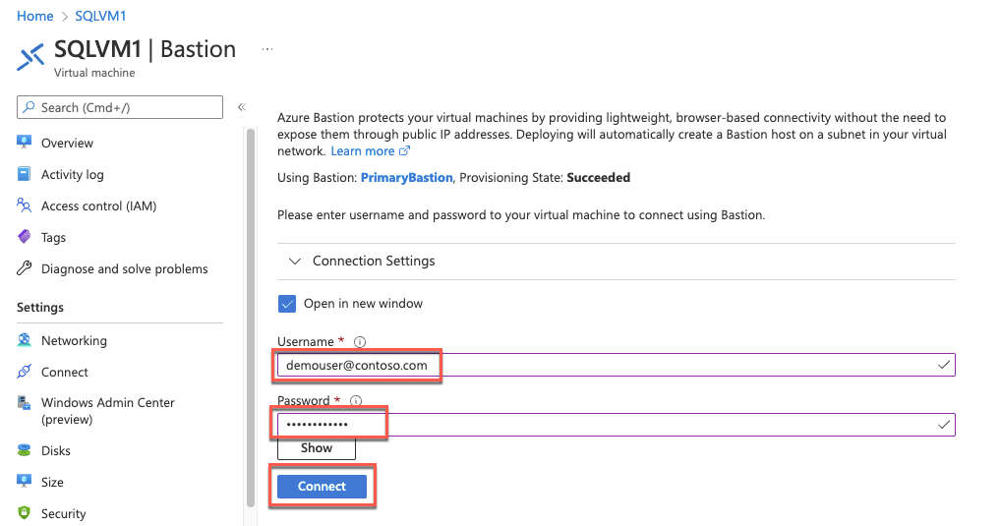

9. On **SQLVM1**, select **Start** and then choose **Windows PowerShell**.

    

10. Copy and paste the following command into PowerShell and execute it. This will create the Windows Failover Cluster and add all the SQL VMs as nodes in the cluster. It will also assign a static IP address of **10.0.2.99** to the new Cluster named **AOGCLUSTER**.

    ```PowerShell
    New-Cluster -Name AOGCLUSTER -Node SQLVM1,SQLVM2 -StaticAddress 10.0.2.99
    ```

    

    >**Note**: It is possible to use a wizard for this task, but the resulting cluster will require additional configuration to set the static IP address in Azure.

11. After the cluster has been created, select **Start** and then **Windows Administrative Tools**. Locate and open the **Failover Cluster Manager**.

    

12. When the cluster opens, select **Nodes**, and the SQL Server VMs will show as nodes of the cluster and show their status as **Up**.

    

13. If you select **Roles**, you will notice that currently, there aren't any roles assigned to the cluster.

    

14. Select Networks, and you will see **Cluster Network 1** with status **Up**. If you navigate to the network, you will see the IP address space, and on the lower tab, you can select **Network Connections** and review the nodes.

    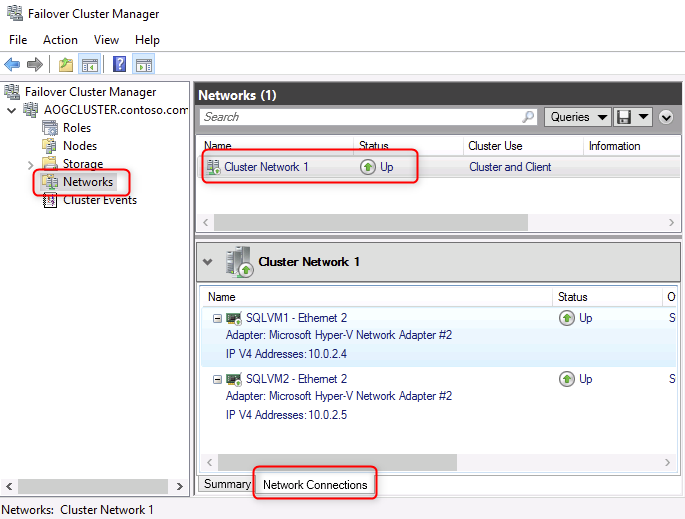

15. Right-click **AOGCLUSTER,** then select **More Actions**, **Configure Cluster Quorum Settings**.

    

16. On **Before you Begin** in the wizard, select **Next**. Then choose **Select the quorum witness**. Then, select **Next** again.

    

17. Select **Configure a cloud witness** and **Next**.

    

18. Copy the **storage account name** and **storage account key** values you noted earlier and paste them into their respective fields on the form. Leave the Azure Service endpoint as configured. Then, select **Next**.

    

19. Select **Next** on the Confirmation screen.

    

20. Select **Finish**.

    

21. Select the name of the Cluster again, and the **Cloud Witness** should now appear in the **Cluster Resources**. It is important to always use a third data center; in your case, a third Azure Region is used for your Cloud Witness.

    

22. Select **Start** and launch **SQL Server 2017 Configuration Manager**.

    

23. Select **SQL Server Services**, then right-click **SQL Server (MSSQLSERVER)** and select **Properties**.

    

24. Select the **AlwaysOn High Availability** tab and check the box for **Enable Always OnAvailability Groups**. Select **Apply** and then select **OK** on the message that notifies you that changes won't take effect until after the server is restarted.

    

    

25. On the **Log On** tab, change the service account to `contoso\demouser` with the password `Demo!pass123`. Select **OK** to accept the changes, and then select **Yes** to confirm the restart of the server.

    

    

26. Return to the Azure portal and open a new Azure Bastion session to **SQLVM2**. Launch **SQL Server 2017 Configuration Manager** and repeat the steps above to **Enable SQL AlwaysOn** and change the **Log On** username. Make sure that you have restarted the SQL Service.

27. Return to your session with **SQLVM1**. Use the Start menu to launch **Microsoft SQL Server Management Studio 18** and connect to the local instance of SQL Server. (Located in the Microsoft SQL Server Tools folder).

    

28. Select **Connect** to sign on to **SQLVM1**. **Note**: The username for your lab should show **CONTOSO\demouser**.

    

29. Right-click **Always On High Availability**, then select **New Availability Group Wizard**.

    

30. Select **Next** on the Wizard.

    

31. Provide the name **BCDRAOG** for the **Availability group name**, then select **Next**.

    

32. Select the **ContosoInsurance Database**, then select **Next**.

    

33. On the **Specify Replicas** screen next to **SQLVM1**, select **Automatic Failover**.

    

34. Select **Add Replica**.

    

35. On the **Connect to Server** dialog box, enter the Server Name of **SQLVM2**and select **Connect**. **Note**: The username for your lab should show **CONTOSO\demouser**.

    

36. For **SQLVM2**, select Automatic Failover and Availability Mode of Synchronous commit.

    

37. Select **Endpoints** and review these that the wizard has created.

    

38. Next, select **Listener**. Then, select the **Create an availability group listener**.

    

39. Add the following details:

    - **Listener DNS Name**: BCDRAOG
    - **Port**: 1433
    - **Network Mode**: Static IP

    

40. Next, select **Add**.

    

41. Select the Subnet of **10.0.2.0/24** and then add IPv4 **10.0.2.100** and select **OK**. This is the IP address of the Internal Load Balancer that is in front of the **SQLVM1** and **SQLVM2** in the **Data** subnet running in the **Primary** Site.

    

42. Select **Next**.

    

43. On the **Select Initial Data Synchronization** screen, ensure that **Automatic seeding** is selected and select **Next**.

    

44. On the **Validation** screen, you should see all green. Select **Next**.

    

45. On the Summary page, select **Finish**.

    

46. Once the AOG is built, check that each task was successful and select **Close**.

    

47. Move back to **SQL Management Studio** on **SQLVM1** and expand the **Always On High Availability** item in the tree view. Under Availability Groups, expand the **BCDRAOG (Primary)** item.

    

48. Right-click **BCDRAOG (Primary)** and then select **Show Dashboard**. You should see that all the nodes have been added and are now "Green".

    

49. Next, select **Connect** and then **Database Engine** in SQL Management Studio.

    

50. Enter **BCDRAOG** as the Server Name. This will be connected to the listener of the group that you created. **Note**: The username for your lab should show **CONTOSO\demouser**.

    

51. Once connected to the **BCDRAOG**, you can select **Databases** and will be able to see the database there. Notice that you do not know directly which server this is running on.

    

52. Move back to **PowerShell** on **SQLVM1**. Open a new file, paste in the following script, and select the **Play** button. This will update the Failover cluster with the IP address of the Listener that you created for the AOG.

    ```Powershell
    $ClusterNetworkName = "Cluster Network 1"
    $IPResourceName = "BCDRAOG_10.0.2.100"
    $ILBIP = "10.0.2.100"
    Import-Module FailoverClusters
    Get-ClusterResource $IPResourceName | Set-ClusterParameter -Multiple @{"Address"="$ILBIP";"ProbePort"="59999";"SubnetMask"="255.255.255.255";"Network"="$ClusterNetworkName";"EnableDhcp"=0}
    Stop-ClusterResource -Name $IPResourceName
    Start-ClusterResource -Name "BCDRAOG"
    ```

    

53. Move back to SQL Management Studio, select **Connect**, and then **Database Engine**.

    

54. This time, put the following into the IP address of the Internal Load balancer of the **Primary** Site AOG Load Balancer: **10.0.2.100**. You again will be able to connect to the server, which is up and running as the master. **Note**: The username for your lab should show **CONTOSO\demouser**.

    

55. Once connected to **10.0.2.100**, you can select **Databases** and will be able to see the database there. Notice that you do not know directly which server this is running on.

    

    > **Note**: It could take a minute to connect the first time as this goes through the Azure Internal Load Balancer.

56. Move back to Failover Cluster Manager on **SQLVM1**, and you can review the IP Addresses that were added by selecting Roles and **BCDRAOG** and viewing the Resources. Notice how the **10.0.2.100** is Online.

    

You have now successfully set up the SQL Server VMs to use Always On Availability Groups with a Cloud Witness storage account located in another region.

### Task 4: Configure HA for the Web tier

In this task, you will configure a high-availability web tier. This comprises two web server VMs, which you will locate behind an Azure load balancer. You will also configure the VMs to access the database using the Always On Availability Group endpoint you created earlier.

1. In the Azure portal, navigate to **WebVM1**, select **Connect** followed by **Bastion**, and connect to the VM using the following credentials:

    - **Username**: `demouser@contoso.com`
    - **Password**: `Demo!pass123`

2. In **WebVM1**, open Windows Explorer, navigate to **C:\inetpub\wwwroot** and open the **Web.config** file using Notepad.

    > **Note**: If the **Web.config** change does not run, go to **Start**, **Run** and type **iisreset /restart** from command line.

3. In the **Web.config** file, locate the **\<ConnectionStrings\>** element and replace **SQLVM1** with **BCDRAOG** in the data source. Remember to **Save** the file.

    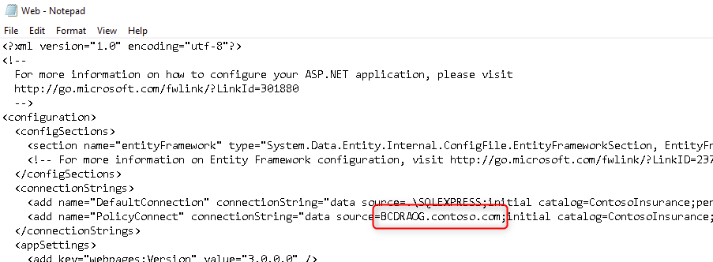

4. Repeat the above steps to make the same change on **WebVM2**.

5. Return to the Azure portal and navigate to the **ContosoWebLBPrimary** load balancer blade. Select **Backend pools** and open **BackEndPool1**.

    

6. In the **BackendPool1** blade, select **VNet1 (ContosoRG1)** as the Virtual network. Then select **+ Add** and select the two web VMs. Select **Save**.

    

7. You will now check that the Contoso sample application is working when accessed through the load-balancer. In the Azure portal, navigate to the **ContosoWebLBPrimaryIP** resource. This is the public IP address attached to the web tier load balancer front end. Copy the **DNS name** to the clipboard.

    

8. Open a new browser tab and paste the DNS name. The Contoso Insurance sample app is shown.

    

    > **Note**: You will test the HA capabilities later in the lab.

## Exercise 2: Enable Disaster Recovery for the Contoso application

Duration: 90 minutes

In this exercise, you will enable a secondary DR site in East US 2. This site will support each tier of the Contoso application, using a different technology in each case. The DR approach is summarized in the following table.

|  Tier   |   DR Strategy   |
|:--------|:----------------|
| Web     | Failover using Azure Site Recovery |
| SQL     | Secondary SQL Always On Availability Group replica, with asynchronous replication. Failover steps are integrated into Azure Site Recovery using Azure Automation. |
| AD      | Active-active domain controllers |

### Task 1: Deploy DR resources

In this task, you will deploy the resources used by the DR environment. First, you will deploy a template to create the network and virtual machines. You will then manually deploy the Recovery Services Vault and Azure Automation account that Azure Site Recovery uses.

1. In a new browser tab, navigate to **https://shell.azure.com**. You will be redirected to **https://portal.azure.com/#cloudshell** automatically. Open a **PowerShell** session, and create a Cloud Shell storage account if prompted to do so.

    

2. Update the **-Location** parameter in each of the commands below to be a different location than **ContosoRG11**. Execute the commands. These commands will create the DR resource group and deploy the DR resources.
    You can proceed to the following tasks while the template deployment is in progress.

    ```PowerShell
    New-AzResourceGroup -Name 'ContosoRG2' -Location 'East US 2'

    New-AzSubscriptionDeployment -Name 'Contoso-IaaS-DR' `
        -TemplateUri 'https://raw.githubusercontent.com/microsoft/MCW-Building-a-resilient-IaaS-architecture/master/Hands-on%20lab/Resources/templates/contoso-iaas-dr.json' `
        -Location 'East US 2'
    ```

    > **Note**: If your deployment fails with an error *`"The requested size for resource '<resourceID>' is currently not available"`*, add the parameter `-skuSizeVM 'D2s_v5'` to the end of the `New-AzSubscriptionDeployment` and rerun the command:

    ```powershell
    # Only run this command if the previous deployment failed with an error that size was not available
    New-AzSubscriptionDeployment -Name 'Contoso-IaaS-DR-SKU' `
        -TemplateUri 'https://raw.githubusercontent.com/microsoft/MCW-Building-a-resilient-IaaS-architecture/master/Hands-on%20lab/Resources/templates/contoso-iaas-dr.json' `
        -Location 'East US 2' -skuSizeVM 'D2s_v5'
    ```

3. Take a few minutes to review the template while it deploys. Navigate to the Azure portal home page, select **Subscriptions**, then **Deployments**  to review the template and deployment progress. Note that the template includes:
    - A DR virtual network, which is connected using VNet peering to the existing virtual network.
    - Two additional domain controller VMs, **ADVM3** and **ADVM4**.
    - An additional SQL Server VM, **SQLVM3**.
    - Azure Bastion, to enable VM access.

    

    Next, you will create the Recovery Services Vault used to replicate the Web tier VMs and orchestrate the cross-site failover.

4. From the Azure portal, select **+Create a resource**, search for and select **Backup and Site Recovery**, and select **Create**.

5. Complete the **Recovery Services Vault** blade using the following inputs, then select **Review and Create**, followed by **Create**:

    - **Resource Group**: ContosoRG2
    - **Name**: `BCDRRSV`
    - **Location**: East US 2 *(your secondary region)*

    

6. Once the **BCDRRSV** Recovery Service Vault has been created, open it in the Azure portal and select the **Site Recovery** tab.

    

7. This is your dashboard for Azure Site Recovery (ASR).

    

    > **Important**: Next, you will set up the Azure Automation account that will be used to automate certain failover and failback tasks. This will require several PowerShell scripts to be imported as Azure Automation runbooks. **Be sure to execute the following steps from the LabVM since that is where the scripts are located.**

8. From the Azure portal, select **+Create a resource**, followed by **IT & Management Tools**, then **Automation**.

9. Complete the **Add Automation Account** blade using the following inputs and then select **Review + Create** followed by **Create**:

    - **Name**: Enter a Globally unique name starting with `BCDR`.
    - **Resource group**: Use existing / **ContosoRG2**
    - **Location**: Any region that support automation **except for** your primary region.

    

    > **Note**: Azure Automation accounts are only allowed to be created in certain Azure regions, but they can act on any region in Azure (except Government, China, or Germany). It is not required to have your Azure Automation account in the same region as the failover resources, but it **CANNOT** be in your primary region.

10. Once the Azure automation account has been created, select **Run as accounts** under **Account Settings**. Then, select **Create** under **Azure Run as Account**.

    

11. Select Create. Once the deployment has finished, you'll have a new Azure Run As Account listed with an expiration date.

    

12. Open the account and select **Modules** under **Shared Resources**.

    

13. When the Modules load, search for and select **Az.Accounts**, then select **Import**, then **OK**.

    

    

14. It will take a few minutes to import the module. From the Recovery Services Vault blade, select **Modules** to view the current status and **Refresh** to monitor progress.

    

15. Once the Az.Accounts module has been imported; repeat the above steps to import the **Az.Network** and **Az.Compute** modules.

16. Next, navigate back to the **Azure Automation Account** blade and select **Runbooks**, then select **Import a runbook**.

    

    > **Note**: You must be connected to the **LABVM** to complete the next steps.

17. Select the **Folder** icon on the Import blade and select the file **ASRRunbookSQL.ps1** from the `C:\HOL\` directory on the **LABVM**. Set the Runbook type to **PowerShell Workflow**. Update the name to **ASRSQLFailover**. This is the name of the Workflow inside the Runbook script. Leave everything else set to the default. Select **Import**.

    

18. Once the Runbook is imported, the runbook editor will load. You can review the comments to understand the runbook better if you wish. Once you are ready, select **Publish**, followed by **Yes** at the confirmation prompt. This makes the runbook available for use.

    

19. Repeat the above steps to import and publish the **ASRRunbookWEB.ps1** runbook. Name this runbook **ASRWEBFailover**.

20. . Navigate back to **Runbooks**, and make sure that both Runbooks show as **Published**.

    

    > **Note**: When you configure the ASR Recovery Plan for the IaaS deployment, you will use the SQL Runbook as a Pre-Failover Action and the Web Runbook as a Post-Failover action. They will run both ways and have been written to take the "Direction" of the failover into account when running.

    Next, you will create a variable in Azure Automation that contains settings (such as resource group names and VM names) that describe your environment. This information is required by the runbooks you imported. Using variables allows you to avoid hard-coding this information in the runbooks themselves.

21. In your Azure Automation account, select **Variables**, then **Add a variable**.

    

22. In the **New Variable** blade, enter `BCDRIaaSPlan` as the variable name. The variable type should be **String**. Paste the following into the variable **Value**, then select **Create**.

    ```json
    {
        "PrimarySiteRG": "ContosoRG1",
        "PrimarySiteSQLVM1Name": "SQLVM1",
        "PrimarySiteSQLVM2Name": "SQLVM2",
        "PrimarySiteSQLPath": "SQLSERVER:\\Sql\\SQLVM1\\DEFAULT\\AvailabilityGroups\\BCDRAOG",
        "PrimarySiteVNetName": "VNet1",
        "PrimarySiteWebSubnetName": "Apps",
        "PrimarySiteWebLBName": "ContosoWebLBPrimary",
        "SecondarySiteRG": "ContosoRG2",
        "SecondarySiteSQLVMName": "SQLVM3",
        "SecondarySiteSQLPath": "SQLSERVER:\\Sql\\SQLVM3\\DEFAULT\\AvailabilityGroups\\BCDRAOG",
        "SecondarySiteVNetName": "VNet2",
        "SecondarySiteWebSubnetName": "Apps",
        "SecondarySiteWebLBName": "ContosoWebLBSecondary"
    }
    ```

    

23. Notice that the variable **BCDRIaaSPlan** has been created.

    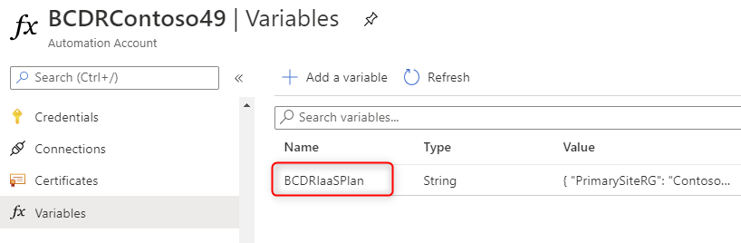

24. Before continuing, check that the template deployment you started at the beginning of this task has been completed successfully. Then, from the Azure portal home page, select **Subscriptions**, select your subscription, then select **Deployments**.

    

### Task 2: Inspect DR for the Domain Controller tier

The failover site in East US 2 has been deployed with two additional domain controllers, **ADVM3** and **ADVM4**. These are integrated with the existing `contoso.com` domain hosted on **ADVM1** and **ADVM2** in the primary site. They run in a fully active-active configuration (therefore, no failover is required for this tier).

The configuration of these domain controllers is fully automatic. In this task, you will simply review the rest of the configuration to confirm everything is as it should be.

1. From the Azure portal home page, select **Subscriptions**, choose your subscription, select **Deployments**, then open the **Contoso-IaaS-DR** deployment used for the DR site.

    

2. Select **Template** and review the template contents. Note the use of `dependsOn` to carefully control the deployment sequence. The resources are deployed as follows:

    - The VNet2 virtual network is created.
    - VNet2 is peered with VNet1. This peering creates connectivity between the two networks.
    - The DNS settings in VNet2 are updated to point to the domain controllers in VNet1.
    - The new domain controllers, **ADVM3** and **ADVM4**, are deployed to VNet2 with static private IP addresses. A custom script extension is used to configure these VMs as domain controllers.
    - The DNS settings in VNet2 are then updated to point to these new domain controllers.
    - Other VMs (such as **SQLVM3**) are now able to be deployed.

    

3. Navigate to the **ContosoRG2** resource group. Inspect network interface (NIC) resources for the **ADVM3** and **ADVM4** VMs to confirm their network settings include the static private IP addresses **10.1.3.100** and **10.1.3.101**, respectively.

    

4. Navigate to the **VNet2** virtual network. Select **DNS servers** and confirm that the IP addresses for **ADVM3** and **ADVM4** are configured.

    

5. Select **Peerings** and confirm that the network is peered with VNet1.

    

### Task 3: Configure DR for the SQL Server tier

This task will extend the SQL Server Always On Availability Group you created earlier to include **SQLVM3** as an asynchronous replica running in the DR site.

This task comprises the following steps:

- Add SQLVM3 to the load-balancer backend pool in the DR site.
- Add SQLVM3 to the existing Windows Server Failover Cluster.
- Enable AlwaysOn and set the domain login credentials on SQLVM3.
- Update the Availability Group Listener to include the SQLVM3 IP address.
- Add SQLVM3 as an asynchronous replica in the existing Always On Availability Group.
- Update the failover cluster with the Listener IP address.

1. Return to the Azure portal and navigate to the **ContosoSQLLBSecondary** load balancer blade in **ContosoRG2**. Select **Backend pools** and open **BackEndPool1**. Note that the pool is connected to the **VNet2** virtual network. Select **+ Add**.

    

2. Select **SQLVM3**. Select **Add**. Select **Save** on **BackEndPool1** to save changes.

    

    > **Note**: For this lab, the DR site is configured with a single SQL Server VM. Using a load balancer is therefore not strictly required. However, it allows the DR site to be extended to include its own HA cluster if needed.

3. Return to your browser tab containing your Bastion session with **SQLVM1**. (If you have closed the tab, reconnect using Azure Bastion with username `demouser@contoso.com` and password `Demo!pass123`.)

4. On **SQLVM1**, use **Windows PowerShell** to execute the following command. This command will add **SQLVM3** as a node in the existing Windows Server Failover Cluster.

    ```PowerShell
    Add-ClusterNode -Name SQLVM3
    ```

5. Select **Start** and then **Windows Administrative Tools**. Locate and open the **Failover Cluster Manager**. Expand the **AOGCLUSTER** and select **Nodes**. Note that SQLVM3 is now included in the list, with the status **Up**.

    

6. Return to the Azure portal. Locate **SQLVM3**, and connect to the VM using Azure Bastion with the username `demouser@contoso.com` and the password `Demo!pass123`.

7. On **SQLVM3**, select **Start** and launch **SQL Server 2017 Configuration Manager**.

    

8. Select **SQL Server Services**, then right-click **SQL Server (MSSQLSERVER)** and select **Properties**.

    

9. Select the **AlwaysOn High Availability** tab and check the box for **Enable AlwaysOn Availability Groups**. Select **Apply** and then select **OK** on the message that notifies you that changes won't take effect until after the server is restarted.

    

    

10. On the **Log On** tab, change the service account to `contoso\demouser` with the password `Demo!pass123`. Select **OK** to accept the changes, and then select **Yes** to confirm the restart of the server.

    

    

11. Return to your session with **SQLVM1**. Open **Microsoft SQL Server Management Studio 18** and connect to the local instance of SQL Server.

12. Expand the **Always On High Availability** node. Under **Availability Group Listeners**, right-click on **BCDRAOG** and select **Properties**.

    

13. On the BCDRAOG Listener properties dialog, select **Add**.

    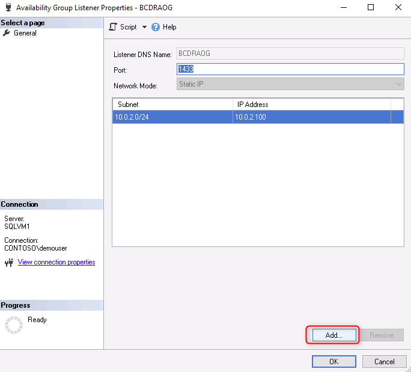

14. On the Add IP Address dialog, check the subnet is **10.1.2.0** (this is the Data subnet in VNet2). Enter the IP address **10.1.2.100** (this is the frontend IP of the SQL load balancer in VNet2). Select **OK**.

    

15. Two IP addresses should be shown on the BCDRAOG Listener properties dialog. Select **OK** to close the dialog and commit the change.

    

16. Under **Availability Groups**, right-click on **BCDRAOG (Primary)** and select **Add Replica..** to open the Add Replica wizard.

    

17. Select **Next** on the wizard.

    

18. Select **Connect** to connect to SQLVM2, then **Connect** again on the 'Connect to Server' prompt. Then select **Next**.

    

19. On the **Specify Replicas** page, select **Add Replica...**.

    

20. On the **Connect to Server** dialog box, enter the Server Name of **SQLVM3** and select **Connect**.

    

21. For **SQLVM3**, leave the default settings of 'Asynchronous commit' with 'Automatic Failover' disabled. Select **Next**.

    

22. On the **Select Data Synchronization** page, ensure that **Automatic seeding** is selected and select **Next**.

    

23. On the **Validation** screen, you should see all green, except for a warning for 'Checking the listener configuration'. The listener configuration warning will be addressed later. Select **Next**.

    

24. On the Summary page, select **Finish**.

    

25. Once the AOG is built, check that each task was successful and select **Close**.

    

26. Under Availability Groups, right-click **BCDRAOG (Primary)** and then select **Show Dashboard**. You should see that the **SQLVM3** node has been added and is synchronizing.

    

27. Move back to **PowerShell** on **SQLVM1**. Paste in the following script, and press **Return**. This script will update the Failover cluster with the new Listener IP address you created.

    ```Powershell
    $ClusterNetworkName = "Cluster Network 2"
    $IPResourceName = "BCDRAOG_10.1.2.100"
    $ILBIP = "10.1.2.100"
    Import-Module FailoverClusters
    Get-ClusterResource $IPResourceName | Set-ClusterParameter -Multiple @{"Address"="$ILBIP";"ProbePort"="59999";"SubnetMask"="255.255.255.255";"Network"="$ClusterNetworkName";"EnableDhcp"=0}
    Stop-ClusterResource -Name $IPResourceName
    Start-ClusterResource -Name "BCDRAOG"
    ```

    

28. Move back to Failover Cluster Manager on **SQLVM1**, select **Roles**, then **BCDRAOG**. Notice how the **Resources** tab shows that the new IP address **10.1.2.100** has been added and is currently Offline.

    

### Task 4: Configure DR for the Web tier

In this task, you will configure DR for the Contoso application web tier.

The DR solution for the web tier uses Azure Site Recovery to continually replicate the primary site web tier VMs to Azure storage. During failover, the replicated data is used to create new VMs in the DR site, which is pre-configured with the virtual network and web-tier load balancer.

Custom scripts in Azure Automation are called by Azure Site recovery to add the recovered web VMs to the load balancer and failover the SQL Server.

1. From the Azure portal on **LABVM**, open the **BCDRRSV** Recovery Services Vault located in the **ContosoRG2** resource group.

2. Under **Getting Started**, select **Site Recovery**. Next, select **Step 1: Enable replication** in the **For On-Premises Machines and Azure VMs** section.

    

3. On **Step 1 - Source**, select the following inputs and then select **Next**:

    - **Source Location**: Central US *(or what you select as your Primary region)*
    - **Azure virtual machine deployment model**: Resource Manager
    - **Source resource group**: ContosoRG1
    - **Disaster Recovery between Availability Zones?**: No (this option is for DR between availability zones *within* a region)

    

4. On **Step 2 - Virtual Machines**, select **WebVM1** and **WebVM2** and then select **Next**.

    

5. On the **Replication settings** tab, select the **Target location** as **East US 2** (or what you selected as your secondary site Azure region). Then, in the 'Resource group, Network, Storage and Availability' section, select **Customize**.

    

6. Update the blade using the following:

    - **Target resource group**: ContosoRG2
    - **Target virtual network**: VNet2

    Review the settings for each VM, keeping their default values. Then select **OK**.

    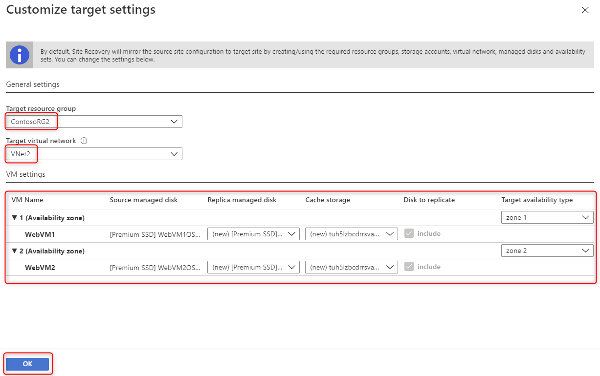

    > **Note**: Double check these selections; they are **critical** to your on-premise to Azure failover.

7. Under 'Replication Policy', review the default policy but do not make any changes.

    

8. Under 'Extension settings', select **\[+\] Show details**. Change the **Automation Account** to use your existing Automation Account.

    

9. Next, select **Enable replication**.

    

10. The Azure portal will start the deployment. This deployment will take approximately 10 minutes to complete. Wait for replication to complete before moving to the next step.

    ")

11. The **BCDRRSV** blade should still have the **Site Recovery** option (under 'Getting started') selected. Select **Step 2: Manage Recovery Plans**.

    

12. Select **+Recovery plan**.

    

13. Fill in the **Create recovery plan** blade as follows:

    - **Name**: BCDRIaaSPlan
    - **Source**: Central US *(This is your primary region.)*
    - **Target**: East US 2 *(This is your secondary region.)*
    - **Allow items with deployment model**: Resource Manager
    - **Select Items**: Select **WebVM1** and **WebVM2**.

    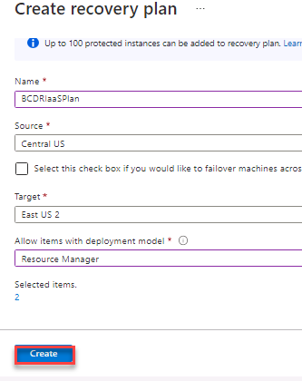

    > **Note**: It is **critical** to use the correct recovery plan name `BCDRIaaSPlan`. This plan name must match the name of the Azure Automation variable you created in the first task in this exercise.

14. Select **Create** to create the recovery plan. After a moment, the **BCDRIaaSPlan** Recovery plan will appear. Select it to review.

    

15. When the **BCDRIaaSPlan** loads **notice**, it shows **2 VMs in the Source**, which is your **Primary** Site.

16. You will now customize the recovery plan to trigger the SQL failover and configure the web tier load-balancer during the failover process; select **Customize**.

    

17. Once the **BCDRIaaSPlan** blade loads, select the **ellipsis** next to **All groups failover**, then select **Add pre-action** from the context menu.

    

18. On the **Insert action** blade, select **Script** and then provide the name `ASRSQLFailover`. Ensure that your Azure Automation account is selected, and then choose the Runbook name: **ASRSQFailover**. Select **OK**.

    > **Note**: If nothing happens, select the **X** in the upper right corner and select **OK** when asked about discarding your changes. You will notice that the script is still added to the recovery plan.

    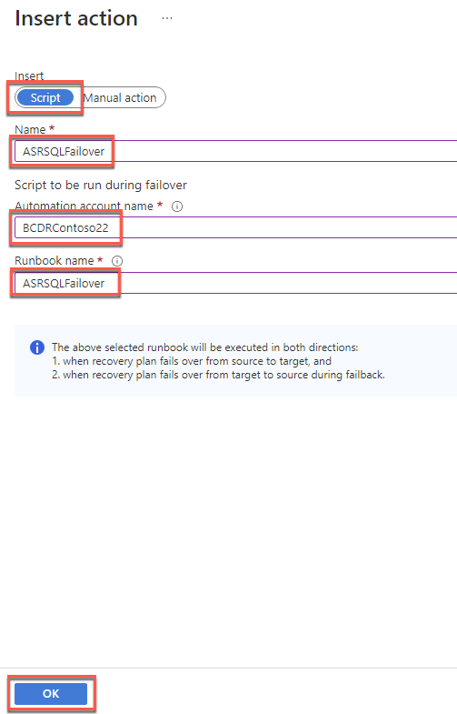

    > **Note**: As noted on the 'Insert action' blade, the ASRSQLFailover runbook will be executed on both failover and failback. The runbook has been written to support both scenarios.

19. Once the **BCDRIaaSPlan** blade loads, select the **ellipsis** next to **Group 1: Start**, then select **Add post action** from the context menu.

    

20. On the **Insert action** blade, select **Script** and then provide the name: **ASRWEBFailover.** Ensure that your Azure Automation account is selected and then choose the Runbook name: **ASRWEBFailover**. Select **OK**.
    
    > **Note**: If nothing happens, select the **X** in the upper right corner and select **OK** when asked about discarding your changes. You'll notice that the script is still added to the recovery plan.

    

21. Make sure that your **Pre-steps** are running under **All groups failover** and the **Post-steps** are running under **Group1: Start**. Select **Save**.

    

22. After a minute, the portal will provide a successful update notification. This means that your recovery plan is fully configured and ready to failover and back between the primary and secondary regions.

    

23. Return to the Recovery Services Vault **BCDRRSV** blade and select the **Replicated Items** link under **Protected Items**. You should see **WebVM1** and **WebVM2**. The Replication Health should be **Healthy**. The Status will show the replication progress. Once both VMs show status **Protected** replication is complete, you will be able to test the failover.

    

    > **Note**: It can take up to 30 minutes for the replication to complete.

### Task 5: Configure a public endpoint using Azure Front Door

There is just one step remaining to complete your DR environment. After a failover to the DR site, the IP address for the Contoso application (the web-tier load balancer frontend IP address) will change. Therefore, users need to be directed to the failover IP address.

The redirection to the failover IP address can be achieved in either of two ways:

- Update the DNS record for the user endpoint to point to the new IP address. This update can be implemented using Azure Traffic Manager.
- Direct users to a proxy service and have that service forward traffic to the currently active endpoint. Azure Front Door provides such a service.

In this task, you will use the Front Door approach to configure a highly available endpoint that directs traffic to your primary or secondary site, depending on which site is currently available.

1. You will now build a Front Door to direct traffic to your Primary and Secondary Sites. From the Azure portal, select **+Create a resource**, then search for and select **Front Door and CDN profiles**. Select **Create**.

    

2. Select **Azure Front Door** and **Custom create**. Then select **Continue to create a  Front Door**.

    

3. Complete the **Basics** tab of the **Create a Front Door** blade using the following inputs, then select **Next: Secrets >**.

    - **Resource group**: Use existing / **ContosoRG1**
    - **Location**: Automatically assigned based on the region of **ContosoRG1**.
    - **Profile name**: ContosoFD1
    - **Tier**: Standard

    

4. Select **Next: Endpoint >**.

5. Select **Add an endpoint** to set the hostname of Front Door. In the **Add an endpoint** pane, enter the following values, then select **Add**:

    - **Endpoint name**: `contosoiaas`
    - **Status**: Leave **Enable this endpoint** selected.

    

6. Under **Routes** select **+ Add a route**.

   

7. Select **Add a new origin group**.

   

8. Give the new origin group the name of `ContosoOrigins`.

9. Select **+ Add an origin**.

   

10. For adding an origin, use the following values. Leave all other values set to their default. Then select Add.

    - Name: `ContosoWebPrimary`
    - Origin type: Public IP Address
    - Host name: ContosoWebLBPrimaryIP
    - Priority: 1

    

11. Repeat step 10 and change the values to the following.

    - Name: `ContosoWebSecondary`
    - Origin type: Public IP Address
    - Host name: ContosoWebLBSecondaryIP
    - Priority: 2
  
12. Update **Interval (in seconds)** to 30. Click Add

    

13. Enter the following values in **Add a route**. Leave all other values as default. Select **Add**.

    - **Name**: `ContosoRoute`
    - **Accepted protocols**: HTTP only
    - **Redirect**: Uncheck **Redirect all traffic to use HTTPS**.
    - **Origin group**: Ensure **ContosoOrigins** is selected.
    - **Forwarding protocol**: HTTP only

    

14. Select **Review + Create**. Once validation has been completed, select **Create** to provision the Front Door service.

    

15. Navigate to the Azure Front Door resource. Select the **Frontend host** URL of Azure Front Door, and the Policy Connect web application will load. The web application is routing through the **ContosoWebLBPrimary** External Load Balancer configured in front of **WEBVM1** and **WEBVM2** running in the **Primary** Site in **ContosoRG1** resource group and connecting to the SQL AlwaysOn Listener at the same location.

    

    

    > **Note**: Be sure to use **HTTP** to access the Azure Front Door **frontend host** URL. The lab configurations only support HTTP for Front Door since WebVM1 and WebVM2 are only set up for HTTP support, not HTTPS (no SSL\TLS).
    > **Note**: If you get an "Our services aren't available right now" error (or a 404-type error) accessing the web application, then continue with the lab and come back to this later. Sometime this can take a ~10 minutes for the routing rules to publish before it's "live".
    >
    > If you continue to have this issue beyond 15 minutes, ensure that you are using the correct backend host header (Step 5) and using HTTP for both the routing rules and the health probes of the backend pools. (Step 4).
    >
    > 

## Exercise 3: Enable Backup for the Contoso application

Duration: 30 minutes

In this exercise, you will use Azure Backup to enable backup for the Contoso application. You will configure backup for the web tier VMs and the SQL Server database.

### Task 1: Create the Azure Backup resources

Azure Backup and Azure Site Recovery are implemented using the same Azure resource type, the Recovery Services Vault. However, for Azure Backup, the vault must be deployed to the same region as the resources being protected; in this case, the primary site is in Central US. In contrast, for Azure Site Recovery, the vault was deployed to the secondary region. In this task, you will create the vault in the primary region for use by Azure Backup.

1. From the Azure portal, select **+Create a resource**, search for and select **Backup and Site Recovery**, and select **Create**.

    

2. Complete the **Recovery Services Vault** blade using the following inputs, then select **Review and Create**, followed by **Create**:

    - **Resource Group**: ContosoRG1
    - **Name**: `BackupRSV`
    - **Location**: *your primary region*

    

3. Once the deployment completes, navigate to the **BackupRSV** resource and select **Properties**.

    

4. Under **Backup Configuration**, select **Update**. In the Backup Configuration blade, check that the storage replication type is set to **Geo-redundant** and set the Cross-Region Restore option to **Enable** then **Save** your changes and close the Backup Configuration panel.

    

    > **Note**: This enables backups from the primary site to be restored in the DR site if required.

5. Still in the BackupRSV Properties blade, under **Security Settings**, select **Update**. Under Soft Delete, select **Disabled**, then **Save** your changes and close the Security Settings panel.

    

    > **Note**: In a production environment, you should leave Soft Delete enabled. However, it is better to disable this feature for this lab since leaving it enabled makes it more difficult to clean up your lab resources once the lab is complete.

### Task 2: Enable Backup for the Web tier

In this task, you will configure Azure Backup for the Web tier virtual machines. Of course, if the Web VMs are stateless, backup may not be required, so long as the VM image and/or application installation are protected.

1. From the **BackupRSV** Recovery Services vault blade, under 'Getting Started', select **Backup**. Under 'Where is your workload running?', select **Azure**. Under 'What do you want to backup?', select **Virtual machine**. Then select **Backup**.

    

2. On the 'Configure Backup' blade, Leave **Standard** selected and select **Create a new policy** and fill in the Create Policy blade as follows:

    - **Policy name**: `WebVMPolicy`
    - **Backup schedule**: Daily, 9:00 PM, UTC
    - **Retain instant recovery snapshots for**: 2 day(s)
    - **Retention of daily backup point**: Enabled, 180 days
    - **Retention of weekly backup point**: Enabled, Sunday, 12 weeks
    - **Retention of monthly backup point**: Enabled, First Sunday, 24 months
    - **Retention of yearly backup point**: Enabled, day-based, January 1, 5 years
    - **Azure Backup Resource Group**: ContosoBackupRG

    When finished, select **OK**.

    

3. On the 'Backup' blade, under 'Virtual Machines', select **Add**. Select the **WebVM1** and **WebVM2** virtual machines, then **OK**.

    

4. Select **Enable Backup** and wait for the deployment to complete.

    

5. From the **BackupRSV** Recovery Services vault blade, under 'Protected items', select **Backup items**. The blade should show 2 Azure VMs protected.

    

6. Select **Azure Virtual Machine**. The 'Backup Items (Azure Virtual Machine' blade loads, listing **WebVM1** and **WebVM2**). In both cases, the 'Last Backup Status is 'Warning (Initial backup pending)'.

    ")

7. Select **View details** for **WebVM1** to open the 'WebVM1' backup status blade. Select **Backup now**, leave the default backup retention and select **OK**.

    

    

    >**Note**: The backup policy created earlier determines the retention period for scheduled backups. For on-demand backups, the retention period is specified separately.

8. Close the WebVM1 backup status blade. Then, repeat the above step to trigger an on-demand backup for **WebVM2**.

9. From the **BackupRSV** Recovery Services vault blade, under 'Monitoring', select **Backup Jobs** to load the Backup Jobs blade. This blade shows the current status of each backup job. The blade should show two completed jobs (configuring backup for WebVM1 and WebVM2) and two in-progress jobs (backup for WebVM1 and WebVM2).

    

10. Select **View Details** for **WebVM1** to open the backup job view. This backup job view shows the detailed status of the tasks within the backup job.

    

    > **Note**: To restore from a backup, it suffices that the 'Take Snapshot' task is complete. Transferring the data to the vault does not need to be complete since recent backups can be restored from the snapshot.

    You can proceed to the next task without waiting for the backup jobs to complete.

### Task 3: Enable Backup for the SQL Server tier

In this task, you will configure backup for the SQL Server database.

There are two approaches to backup for SQL Server running on Azure VMs. One uses native SQL managed backup to Azure storage. The other uses Azure Backup. For this lab, you will use Azure Backup.

Before enabling Azure Backup, you will first register the SQL Server VMs with the SQL VM resource provider. This resource provider installs the **SqlIaaSExtension** onto the virtual machine. Azure Backup uses this extension to configure the `NT SERVICE\AzureWLBackupPluginSvc` account with the necessary permissions to discover databases on the virtual machine.

1. In a new browser tab, navigate to [https://shell.azure.com](https://shell.azure.com) and open a **PowerShell** session.

2. Unless you have done so previously, you will need to register your Azure subscription to use the `Microsoft.SqlVirtualMachine` resource provider. In the Cloud Shell window, execute the following command:

    ```PowerShell
    Register-AzResourceProvider -ProviderNamespace Microsoft.SqlVirtualMachine
    ```

    

    > **Note**: It may take several minutes to register the resource provider. Wait until the registration is complete before proceeding to the next step. You can check the registration status using `Get-AzResourceProvider -ProviderNamespace Microsoft.SqlVirtualMachine`.

3. Register **SQLVM1** with the resource provider by executing the following command in the Cloud Shell window. Ensure that **-Location** matches the location SQLVM1 is deployed.

    ```PowerShell
    New-AzSqlVM -Name 'SQLVM1' -ResourceGroupName 'ContosoRG1' -SqlManagementType Full -Location 'Central US' -LicenseType PAYG
    ```

    

    > **Note**: This will register the resource provider using the `Full` management mode. This change causes the SQL service to restart, which may impact production applications. To avoid this restart in production environments, you can alternatively register the resource provider in `LightWeight` mode and upgrade later during a scheduled maintenance window.

4. Register **SQLVM2** and **SQLVM3** with the resource provider using the following commands. Ensure you specify the correct locations.

    ```PowerShell
    New-AzSqlVM -Name 'SQLVM2' -ResourceGroupName 'ContosoRG1' -SqlManagementType Full -Location 'Central US' -LicenseType PAYG
    New-AzSqlVM -Name 'SQLVM3' -ResourceGroupName 'ContosoRG2' -SqlManagementType Full -Location 'East US 2' -LicenseType PAYG
    ```

    > **Note**: This lab uses SQL Server under a 'Developer' tier license. When using SQL Server in production at the 'Standard' or 'Enterprise' tier, you can specify `DR` as the license type for failover servers (each full-price server includes a license for 1 DR server). The DR license type reduces your licensing cost significantly. Check the SQL Server licensing documentation for full details.

5. In the Azure portal, navigate to the **ContosoRG1** resource group. In addition to the SQLVM1 and SQLVM2 virtual machines, there are now parallel SQLVM1 and SQLVM2 resources of type 'SQL virtual machine' These additional resources provide additional management capabilities for SQL Server in Azure virtual machines.

    

6. Select the **SQLVM1** virtual machine (the standard VM resource, not the SQL virtual machine resource). Then select **Extensions**. Note that the **SqlIaaSExtension** has been installed on the virtual machine.

    

    With the SQL virtual machine resources created and the SQL IaaS extension installed, you can now configure Azure Backup for virtual machines.

7. In the Azure portal, navigate to the **BackupRSV** Recovery Services Vault resource in **ContosoRG1**. Under 'Getting started', select **Backup**. Under 'Where is your workload running?', select **Azure**. Under 'What do you want to backup?', select **SQL Server in Azure VM**. Then select **Start Discovery**.

   

8. In the 'Select Virtual Machines' blade, select **SQLVM1** and **SQLVM2**, then select **Discover DBs**.

    

9. This will trigger a deployment. Wait for the deployment to complete (this may take several minutes).

    

10. On the 'BackupRSV' blade, select **Configure Backup**.

    

11. On the 'Backup' blade, select **Add**.

    

12. On the 'Select items to backup' blade, select the **\>** icon next to the `BCDRAOG\BCDRAOG` entry to show the databases. Note that the ContosoInsurance database is listed. Change the **AutoProtect** setting for BCDRAOG to **ON**, then select **OK**.

    

    > **Note**: Using AutoProtect backups up the current database and any future databases on this Always On Availability Group.
    > 
    > **Note**: You may also want to backup system databases on each of the SQL Servers.

13. On the 'Backup' blade, note that **BCDRAOG\BCDRAOG** is now listed for backup. Leave the policy as the default `HourlyLogBackup` policy. Select **Enable Backup** and wait for the deployment to complete.

    

14. In the **BackupRSV** Recovery Service Vault, navigate to the **Backup Jobs** view. You should see a backup configuration job in progress for the ContosoInsurance database. (If this job does not show immediately, wait a minute and select **Refresh**.)

    

15. Wait for the backup configuration job to complete. Use the **Refresh** button to monitor progress. The configuration job will take several minutes.

16. Select **Backup items**, then select **SQL in Azure VM**.

    

17. From the backup items list, note that the **contosoinsurance** database has status **Warning (Initial backup pending)**.

    

18. Select **View details** on the **contosoinsurance** database and select **Backup now**

    

19. Review the default backup settings, then select **OK** to start the backup.

    

20. The backup process starts. You can monitor progress from the **Backup Job** pane.

    

    > **Note**: You can continue to the next step in the lab without waiting for the backup job to complete.

## Exercise 4: Validate resiliency

Duration: 90 minutes

This exercise will validate the high availability, disaster recovery, and backup solutions you have implemented in the earlier lab exercises.

### Task 1: Validate High Availability

In this task, we will validate high availability for both the Web and SQL tiers.

1. In the Azure portal, open the **ContosoRG1** resource group. Select the public IP address for the web tier load-balancer, **ContosoWebLBPrimary**. Select the **Overview** tab, copy the DNS name to the clipboard, and navigate to it in a different browser tab.

2. The Contoso application should load in your browser tab. Select **Current Policy Offerings** to view the policy list - this shows the database is accessible. As an additional check, edit an existing policy and save your changes to show that the database is writable.

3. Open an Azure Bastion session with **SQLVM1** (with username `demouser@contoso.com` and password `Demo!pass123`). Open **SQL Server Management Studio** and connect to **SQLVM1** using Windows Authentication. Locate the BCDRAOG availability group, right-click and select **Show Dashboard**. Note that the dashboard shows **SQLVM1** as the primary replica.

   

4. Using the Azure portal, stop both **WebVM1** and **SQLVM1**. Wait a minute for the VMs to stop.

5. Refresh the browser tab with the Contoso application. The application still works. Confirm again that the database is writable by changing one of the policies.

6. Open an Azure Bastion session with **SQLVM2** (with username `demouser@contoso.com` and password `Demo!pass123`). Open **SQL Server Management Studio** and connect to **SQLVM2** using Windows Authentication. Locate the BCDRAOG availability group, right-click and select **Show Dashboard**. Note that the dashboard shows **SQLVM2** as the primary replica, and there is a critical warning about **SQLVM1** not being available.

   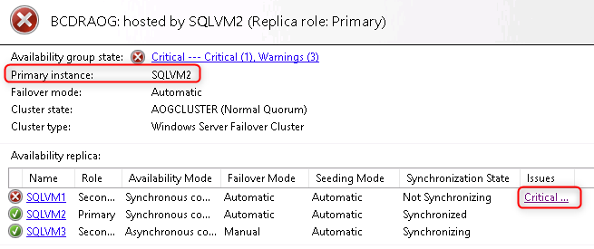

7. Restart **WebVM1** and **SQLVM1**. **Wait a full two minutes** for the VMs to start - **this is important**; we don't want to test simultaneous failover of SQLVM1 and SQLVM2 at this stage. Then stop **WebVM2** and **SQLVM2**.

8. Refresh the blade with the Contoso application. The application still works. Confirm again that the database is writable by changing one of the policies.

9. Re-open an Azure Bastion session with **SQLVM1** (with username `demouser@contoso.com` and password `Demo!pass123`). Open **SQL Server Management Studio** and connect to **SQLVM1** using Windows Authentication. Locate the BCDRAOG availability group, right-click and select **Show Dashboard**. Note that the dashboard shows **SQLVM1** as the primary replica, and there is a critical warning about **SQLVM2** not being available.

    

10. Re-start **SQLVM2** and **WebVM2**.

### Task 2: Validate Disaster Recovery - Failover IaaS region to region

In this task, you will validate the failover of the Contoso application from Central US to East US 2. The failover is orchestrated by Azure Site Recovery using the recovery plan you configured earlier. It includes the failover of both the web tier (creating new Web VMs from the replicated data) and the SQL Server tier (failure to the SQLVM3 asynchronous replica). The failover process is fully automated, with custom steps implemented using Azure Automation runbooks triggered by the Recovery Plan.

1. Using the Azure portal, open the **ContosoRG1** resource group. Navigate to the Front Door resource, locate Frontend Host URL, and open it in a new browser tab. Navigate to it to ensure that the application is up and running from the Primary Site.

    

    Keep this browser tab open; you will return to it later in the lab.

2. From a new browser tab, open the Azure portal, then navigate to the **BCDRRSV** Recovery Services Vault located in the **ContosoRG2** resource group.

3. Select **Recovery Plans (Site Recovery)** in the **Manage** area, then select **BCDRIaaSPlan**.

    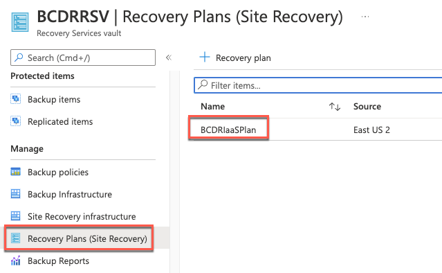

4. Select **Failover**.

    

5. On the warning about No Test Failover, select **I understand the risk, Skip test failover**.

    

6. Review the Failover direction. Notice that **From** is the **Primary** site, and **To** is the **Secondary** site. Select **OK**.

    

7. After the Failover is initiated, close the Failover blade and navigate to **Site Recovery Jobs**. Select the **Failover** job to monitor the progress.

    

8. You can monitor the progress of the Failover from this panel.

    

    > **Note**: Do not make any changes to your VMs in the Azure portal during this process. Allow ASR to take the actions and wait for the failover notification before moving on to the next step. You can open another portal view in a new browser tab and review the output of the Azure Automation Jobs by opening the jobs and selecting Output.
    >
    > 

9. Once the Failover job has finished, it should show as *Successful* for all tasks. The failover job may take more than 15 minutes.

    

10. Select **Resource groups** and select **ContosoRG1**. Open **WebVM1** and notice that it currently shows as **Status: Stopped (deallocated).** This shows that failover automation has stopped the VMs at the **Primary** site.

    

    > **Note**: Do not select Start! The VM will be restarted automatically by ASR during failback.

11. Move back to the Resource group and select the **ContosoWebLBPrimaryIP** Public IP address. Copy the DNS name and paste it into a new browser tab. The website will be unreachable at the Primary location since the Web VMs at this location have been stopped by ASR during failover.

12. In the Azure portal, move to the **ContosoRG2** resource group. Locate the **WebVM1** in the resource group and select to open. Notice that **WebVM1** is running on the **Secondary** site.

    

13. Move back to the **ContosoRG2** resource group and select the **ContosoWebLBSecondaryIP** Public IP address. Copy the DNS name and paste it into a new browser tab. The Contoso application is now responding from the **Secondary** site. Make sure to select the current Policy Offerings to ensure connectivity to the SQL Always-On group that was also failed over in the background.

14. Return to the browser tab pointing to the Contoso application at the Front Door URL. Refresh the page. The site loads immediately from the DR site. Web site users accessing the service via Front Door are automatically routed to the currently available site, so there is no change in how they access the site even though it is failed over. There **will** be downtime as the failover happens, but once the site is back online, their experience will be no different from when it is running in the **Primary** site.

    

    > **Optional task**: You can log in to **SQLVM3** and open the SQL Management Studio to review the Failed over **BCDRAOG**. You will see that **SQLVM3**, which is running in the **Secondary** site, is now the Primary Replica.

15. Now that you have successfully tested failover, you need to configure ASR for failback. Move back to the **BCDRSRV** Recovery Service Vault using the Azure portal. Select **Recovery Plans** on the ASR dashboard. The **BCDRIaaSPlan** will show as **Failover completed.**

    

16. Select the BCDRIaasPlan plan. Notice that two (2) VMs are now shown in the **Target** tile.

    

17. Select **Re-protect**.

    

18. On the **Re-protect** screen, review the configuration and select **OK**.

    

19. The portal will submit a deployment. This process will take up to 30 minutes to commit the failover and then synchronize WebVM1 and WebVM2 with the Recovery Services Vault. Once this process is complete, you will be able to failback to the primary site.

    > **Note**: You need to wait for the re-protect process to complete before continuing with the failback. You can check the status of the Re-protect using the Site Recovery Jobs area of the BCDRSRV.
    >
    > 
    >
    > Once the jobs are completed, move to the **Replicated items** blade and wait for the **Status** to show as **Protected**. This status shows the data synchronization is complete, and the Web VMs are ready to failback.
    >
    > 

### Task 3: Validate Disaster Recovery - Failback IaaS region to region

In this task, you will failback the Contoso application from the DR site in your secondary region back to the primary site (your primary region).

1. Still in the **BCDRRSV** Recovery Services vault, select **Recovery Plans** and re-open the **BCDRIaaSPlan**. Notice that the VMs are still at the Target since they failed over to the secondary site.

2. Select **Failover**. At the warning about No Test Failover, select **I understand the risk, Skip test failover**. Notice that **From** is the **Secondary** site and **To** is the **Primary** site. Select **OK**.

    ")

3. After the Failover is initiated, close the blade and select **Site Recovery Jobs**, then select the **Failover** job to monitor the progress. Once the job has finished, it should show as successful for all tasks.

    

4. Confirm that the Contoso application is once again accessible via the **ContosoWebLBPrimaryIP** public IP address and is **not** available at the **ContosoWebLBSecondaryIP** address. This test shows it has returned to the primary site. Open the **Current Policy Offerings** and edit a policy to confirm database access.

    > **Note**: If you get an "Our services aren't available right now" error (or a 404-type error) accessing the web application, verify that you are utilizing the **ContosoWebLBPrimaryIP**. If it does not come up within ~10 minutes, verify that the backend system is responding.

5. Confirm that the Contoso application is also available via the Front Door URL.

6. Now that you have successfully failed back, you need to prep ASR for the Failover again. Move back to the **BCDRSRV** Recovery Service Vault using the Azure portal. Select Recovery Plans and open the **BCDRIaaSPlan**.

7. Notice that now 2 VMs are shown in the **Source**. Select **Re-protect**, review the configuration, and select **OK**.

    

8. As previously, the portal will submit a deployment. This process will take some time. You can proceed with the lab without waiting.

9. Next, you need to reset the SQL Always On Availability Group environment to ensure a proper failover. Use Azure Bastion to connect to **SQLVM1** with username `demouser@contoso.com` and password `Demo!pass123`.

10. Once connected to **SQLVM1**, open SQL Server Management Studio and Connect to **SQLVM1**. Expand the **Always On Availability Group**s and then right-click on **BCDRAOG** and select **Show Dashboard**.

11. Notice that all the Replica partners are now Synchronous Commit with Automatic Failover Mode. You need to manually reset **SQLVM3** to be **Asynchronous** with **Manual Failover**.

    

12. Right-click the **BCDRAOG** and select **Properties**.

    

13. Change **SQLVM3** to **Asynchronous** and **Manual Failover** and select **OK**.

    

14. Show the Availability Group Dashboard again. Notice that the change has been made and that the AOG is now reset.

    

    > **Note**: This task could have been done using the Azure Automation script during Failback, but most DBAs would prefer a clean failback and then do this manually once they are comfortable with the failback.

### Task 4: Validate VM Backup

In this task, you will validate the backup for the Contoso application WebVMs. You will do this by removing several image files from **WebVM1**, breaking the Contoso application. You will then restore the VM from backup.

1. From the Azure portal, locate and shut down **WebVM2**. This forces all traffic to be served by **WebVM1**, making the backup/restore verification easier.

2. Navigate to **WebVM1** and connect to the VM using Azure Bastion, using username `demouser@contoso.com` and password `Demo!pass123`.

3. Open Windows Explorer and navigate to the `C:\inetpub\wwwroot\Content` folder. Select the three `.PNG` files and delete them.

    

4. In the Azure portal, locate the **ContosoWebLBPrimaryIP** public IP address in **ContosoRG1**. Copy the DNS name and open it in a new browser tab. Hold down `CTRL` and refresh the browser to reload the page without using your local browser cache. The Contoso application should be shown with images missing.

    

5. To restore WebVM1 from backup, Azure Backup requires that a 'staging' storage account be available. To create this account, in the Azure portal, select **+ Create a resource**, then search for and select **Storage account**. Select **Create**.

6. Complete the 'Create storage account' form as follows, then select **Review + Create** followed by **Create**.

    - **Resource group:** ContosoRG1
    - **Storage account name:** Unique name starting with `backupstaging`.
    - **Location:** *your primary region*
    - **Performance:** Standard
    - **Replication:** Locally-redundant storage (LRS)

    

7. Before restoring a VM, the existing VM must be shut down. Use the Azure portal to shut down **WebVM1**.

    > **Note**: since WebVM2 is also shut down, this will break the Contoso application. In a real-world scenario, you would keep WebVM2 running while restoring WebVM1.

8. In the Azure portal, navigate to the **BackupRSV** Recovery Services Vault. Under 'Protected Items', select **Backup items**, then select **Azure Virtual Machine**.

    

9. On the Backup items page, select **View details** for **WebVM1**. On the **WebVM1** page, select **RestoreVM**.

    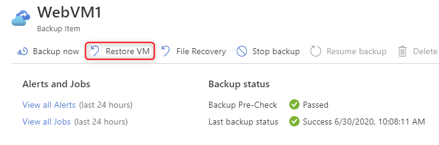

10. Complete the Restore Virtual Machine page as follows, then select **Restore**.

    - **Restore point**: Select the most recent restore point.
    - **Restore Configuration**: Replace existing
    - **Staging Location**: Choose the storage account you created earlier, starting with `backupstaging`.

    

11. In the **BackupRSV** vault, navigate to the **Backup Jobs** view. Note that two new jobs are shown as 'In progress', one to take a backup of the VM and a second to restore the VM.

    

12. It will take several minutes for the VM to be restored. Wait for the restore to complete before proceeding with the lab.

13. Once the restore operation is complete, navigate to the **WebVM1** blade in the Azure portal and **Start** the VM.

14. Wait for the VM to start, then return to your browser tab showing the Contoso application with missing images. Hold down `CTRL` and select **Refresh** to reload the page. The application is displayed with the images restored, showing the restore from backup has been successful. (As an optional step, you can also open a Bastion connection to the VM and check the deleted .PNG files have been restored.)

15. Start **WebVM2**.

### Task 5: Validate SQL Backup

In this task, you will validate the ability to restore the Contoso application database from Azure Backup.

1. In the Azure portal, navigate to the **BackupRSV** in **ContosoRG1**. Under 'Protected items', select **Backup items**, then select **SQL in Azure VM**.

    

2. From the backup items list, select **View details** for the **contosoinsurance** database.

3. From the **contosoinsurance** blade, select **Restore**.

    

4. Review the default settings on the **Restore** blade. By default, the backup will be restored to a new database alongside the existing database on SQLVM1.

    

    > **Note**: For an Always On Availability Group backup, the option to overwrite the existing database is not available. You must restore to a parallel location.

5. Select the option to choose your Restore Point. On the 'Select restore point' blade, explore the restore options. Note how the log-based option offers a point-in-time restore, whereas the full & differential option provides backup based on the backup schedule.

    Choose any restore point and select **OK**.

    

    

6. Under 'Advanced Configuration', select **Configure**. Review the settings but don't change anything. Select **OK** to accept the default configuration

7. Select **OK** to start the restore process.

8. Navigate to the **Backup Jobs** view. The ContosoInsurance job is 'In progress'. Use the **Refresh** button to monitor the progress and wait for the job to complete.

    

9. Navigate to **SQLVM1** and connect to the VM using Azure Bastion, using username `demouser@contoso.com` and password `Demo!pass123`.

10. On SQLVM1, open **SQL Server Management Studio** and connect to SQLVM1.

11. Note that the restored database is present alongside the production database on the server.

    

    > **Note**: You can now either copy data from the restored database to the production database or add this database to the Always On Availability Group and switch the Web tier to use the restored database.

## After the hands-on lab

### Task 1: Delete the lab resources

1. Within the Azure portal, select Resource Groups on the left navigation.

2. To delete the Recovery Services Vaults, you will first need to open the vaults, disable all VM backup and replication and delete any backup and replicated data.

3. Delete each of the resource groups created in this lab by selecting them, followed by the **Delete resource group** button. You will need to confirm the name of the resource group to delete.

You should follow all steps provided ***after*** attending the hands-on lab.
