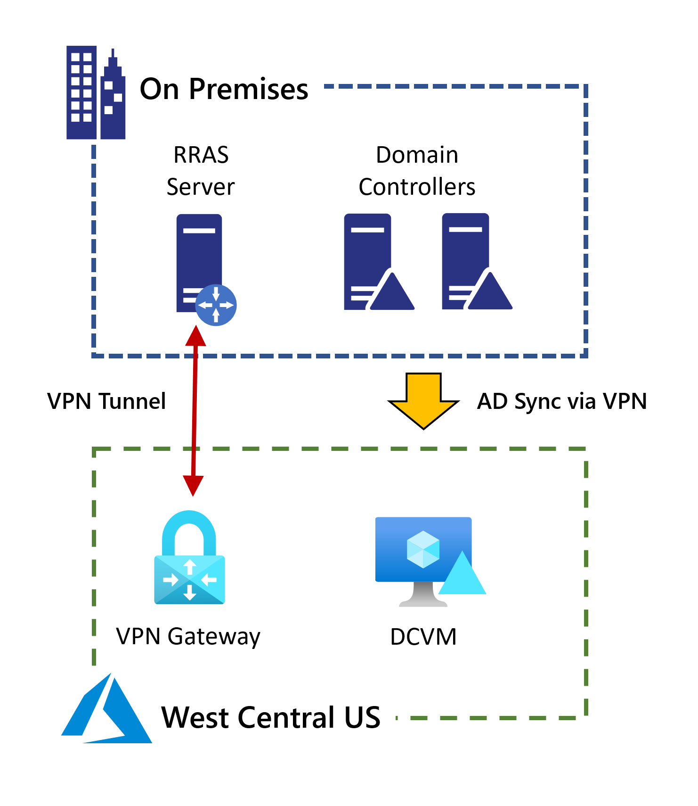
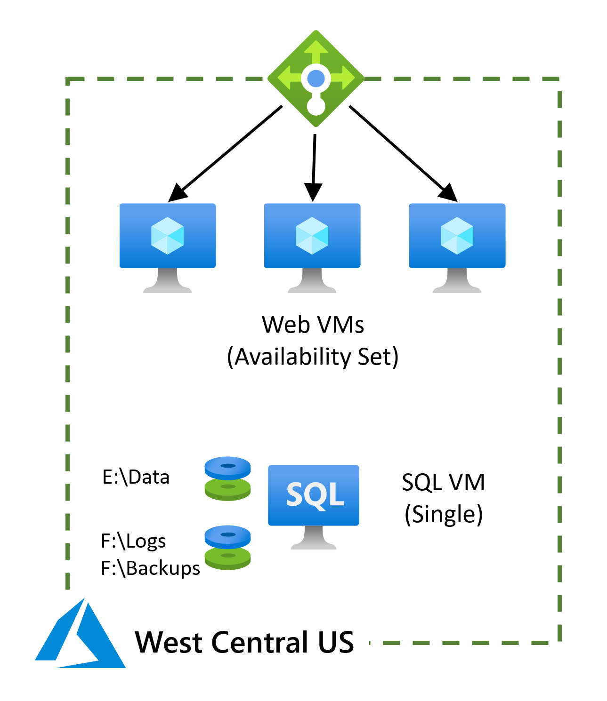
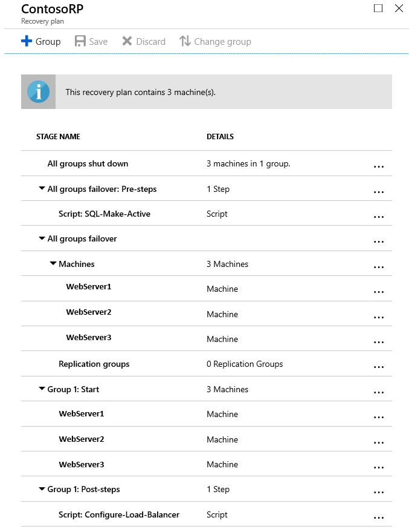

Building a resilient IaaS architecture

Whiteboard design session trainer guide

May 2022

Information in this document, including URL and other Internet Web site references, is subject to change without notice. Unless otherwise noted, the example companies, organizations, products, domain names, e-mail addresses, logos, people, places, and events depicted herein are fictitious, and no association with any real company, organization, product, domain name, e-mail address, logo, person, place or event is intended or should be inferred. Complying with all applicable copyright laws is the responsibility of the user. Without limiting the rights under copyright, no part of this document may be reproduced, stored in or introduced into a retrieval system, or transmitted in any form or by any means (electronic, mechanical, photocopying, recording, or otherwise), or for any purpose, without the express written permission of Microsoft Corporation.

Microsoft may have patents, patent applications, trademarks, copyrights, or other intellectual property rights covering subject matter in this document. Except as expressly provided in any written license agreement from Microsoft, the furnishing of this document does not give you any license to these patents, trademarks, copyrights, or other intellectual property.

The names of manufacturers, products, or URLs are provided for informational purposes only and Microsoft makes no representations and warranties, either expressed, implied, or statutory, regarding these manufacturers or the use of the products with any Microsoft technologies. The inclusion of a manufacturer or product does not imply endorsement of Microsoft of the manufacturer or product. Links may be provided to third party sites. Such sites are not under the control of Microsoft and Microsoft is not responsible for the contents of any linked site or any link contained in a linked site, or any changes or updates to such sites. Microsoft is not responsible for webcasting or any other form of transmission received from any linked site. Microsoft is providing these links to you only as a convenience, and the inclusion of any link does not imply endorsement of Microsoft of the site or the products contained therein.

© 2022 Microsoft Corporation. All rights reserved.

Microsoft and the trademarks listed at https://www.microsoft.com/en-us/legal/intellectualproperty/Trademarks/Usage/General.aspx are trademarks of the Microsoft group of companies. All other trademarks are property of their respective owners.

**Contents**

<!-- TOC -->

- [Trainer information](#trainer-information)
  - [Role of the trainer](#role-of-the-trainer)
  - [Whiteboard design session flow](#whiteboard-design-session-flow)
  - [Before the whiteboard design session: How to prepare](#before-the-whiteboard-design-session-how-to-prepare)
  - [During the whiteboard design session: Tips for an effective whiteboard design session](#during-the-whiteboard-design-session-tips-for-an-effective-whiteboard-design-session)
- [Building a resilient IaaS architecture whiteboard design session student guide](#building-a-resilient-iaas-architecture-whiteboard-design-session-student-guide)
    - [Abstract and learning objectives](#abstract-and-learning-objectives)
    - [Step 1: Review the customer case study](#step-1-review-the-customer-case-study)
        - [Customer situation](#customer-situation)
        - [Customer needs](#customer-needs)
        - [Customer objections](#customer-objections)
        - [Infographic for common scenarios](#infographic-for-common-scenarios)
    - [Step 2: Design a proof of concept solution](#step-2-design-a-proof-of-concept-solution)
    - [Step 3: Present the solution](#step-3-present-the-solution)
    - [Wrap-up](#wrap-up)
    - [Additional references](#additional-references)
- [Building a resilient IaaS architecture whiteboard design session trainer guide](#building-a-resilient-iaas-architecture-whiteboard-design-session-trainer-guide)
    - [Step 1: Review the customer case study](#step-1-review-the-customer-case-study-1)
    - [Step 2: Design a proof of concept solution](#step-2-design-a-proof-of-concept-solution-1)
    - [Step 3: Present the solution](#step-3-present-the-solution-1)
    - [Wrap-up](#wrap-up-1)
    - [Preferred target audience](#preferred-target-audience)
    - [Preferred solution](#preferred-solution)
    - [Checklist of preferred objection handling](#checklist-of-preferred-objection-handling)
    - [Customer quote (to be read back to the attendees at the end)](#customer-quote-to-be-read-back-to-the-attendees-at-the-end)

<!-- /TOC -->

# Trainer information

Thank you for taking time to support the whiteboard design sessions as a trainer!

## Role of the trainer

An amazing trainer:

- Creates a safe environment in which learning can take place.

- Stimulates the participant's thinking.

- Involves the participant in the learning process.

- Manages the learning process (on time, on topic, and adjusting to benefit participants).

- Ensures individual participant accountability.

- Ties it all together for the participant.

- Provides insight and experience to the learning process.

- Effectively leads the whiteboard design session discussion.

- Monitors quality and appropriateness of participant deliverables.

- Effectively leads the feedback process.

## Whiteboard design session flow 

Each whiteboard design session uses the following flow:

**Step 1: Review the customer case study (15 minutes)**

Outcome 

Analyze your customer's needs.

- Customer's background, situation, needs and technical requirements

- Current customer infrastructure and architecture

- Potential issues, objectives and blockers

**Step 2: Design a proof of concept solution (60 minutes)**

Outcome

Design a solution and prepare to present the solution to the target customer audience in a 15-minute chalk-talk format.

- Determine your target customer audience.

- Determine customer's business needs to address your solution.

- Design and diagram your solution.

- Prepare to present your solution.

**Step 3: Present the solution (30 minutes)**

Outcome

Present solution to your customer.

- Present solution

- Respond to customer objections

- Receive feedback

**Wrap-up (15 minutes)**

- Review preferred solution

## Before the whiteboard design session: How to prepare

Before conducting your first whiteboard design session:

- Read the Student guide (including the case study) and Trainer guide.

- Become familiar with all key points and activities.

- Plan the point you want to stress, which questions you want to drive, transitions, and be ready to answer questions.

- Prior to the whiteboard design session, discuss the case study to pick up more ideas.

- Make notes for later.

## During the whiteboard design session: Tips for an effective whiteboard design session

**Refer to the Trainer guide** to stay on track and observe the timings.

**Do not expect to memorize every detail** of the whiteboard design session.

When participants are doing activities, you can **look ahead to refresh your memory**.

- **Adjust activity and whiteboard design session pace** as needed to allow time for presenting, feedback, and sharing.

- **Add examples, points, and stories** from your own experience. Think about stories you can share that help you make your points clearly and effectively.

- **Consider creating a "parking lot"** to record issues or questions raised that are outside the scope of the whiteboard design session or can be answered later. Decide how you will address these issues, so you can acknowledge them without being derailed by them.

***Have fun**! Encourage participants to have fun and share!*

**Involve your participants.** Talk and share your knowledge but always involve your participants, even while you are the one speaking.

**Ask questions** and get them to share to fully involve your group in the learning process.

**Ask first**, whenever possible. Before launching into a topic, learn your audience's opinions about it and experiences with it. Asking first enables you to assess their level of knowledge and experience and leaves them more open to what you are presenting.

**Wait for responses**. If you ask a question such as, "What is your experience with (fill in the blank)?" then wait. Do not be afraid of a little silence. If you leap into the silence, your participants will feel you are not serious about involving them and will become passive. Give participants a chance to think, and if no one answers, patiently ask again. You will usually get a response.

# Building a resilient IaaS architecture whiteboard design session student guide

## Abstract and learning objectives

In this whiteboard design session, you will look at how to design for converting/extending an existing IaaS deployment for resiliency. Throughout the whiteboard design session, you will look at the various configuration options and services to help build resilient architectures.

At the end of the workshop, you will be better able to design and use resiliency concepts including high availability with Availability Zones, disaster recovery for virtual machines to another region using Azure Site Recovery, and SQL Server high availability and disaster recovery using Always On Availability Groups. You will also learn how to assess the availability SLA, RPO and RTO of your design, and how to use Azure Backup to protect and secure your SQL data and VMs against corruption and loss.

You will also discuss how to achieve a similar level of resiliency for a PaaS-based implementation the same application, based on Azure App Service and Azure SQL Database. Finally, you will consider the costs associated with both approaches.

## Step 1: Review the customer case study 

**Outcome**

Analyze your customer's needs.

Timeframe: 15 minutes

Directions:  With all participants in the session, the facilitator/SME presents an overview of the customer case study along with technical tips.

1. Meet your team members and trainer.

2. Read all directions for steps 1-3 in the student guide.

3. As a team, review the following customer case study.

### Customer situation

Contoso Insurance (CI), headquartered in Miami, provides insurance solutions across North America. Its products include accident and health insurance, life insurance, travel, home, and auto coverage. CI manages data collection services by sending mobile agents directly to the insured to gather information as part of the data collection process for claims from an insured individual. These mobile agents are based all over the US and are residents of the region in which they work. Mobile agents are managed remotely, and each regional corporate office has a support staff responsible for scheduling their time based on requests that arrive to the system. The company's headquarters in in Miami, Florida with a second large location in Seattle, Washington along with three smaller branch offices scatted around the United States.

Contoso would be considered by most as a classic IT shop, mainly focused on their infrastructure. Their application development department's skill set is dated, predominantly focused on client/server development. Two years ago, the company began a project to move portions of their infrastructure to Azure to gain efficiencies and eventually exit the hardware obsolescence cycle. This project has been executed under the leadership of Lewis Franklin, head of infrastructure and operations.

Many Contoso applications have an Active Directory Domain Services (AD DS) dependency, and so building a domain controller infrastructure was the starting point for Contoso's cloud build-out. For the current AD DS implementation in Azure, the team has deployed a single domain controller VM in the West Central US region. This region was chosen due to its proximity to the Cheyenne Headquarters. It is running on a Standard D2 instance with Active Directory deployed on the C: drive.

For many years Contoso's claims process was done mainly via phone by their remote agents. This was then upgraded to a web-based claims application. The web application team then migrated the claims application to Azure using VMs within the same West Central US region. They have deployed a load balancer in front of the web servers and configured a TCP health probe to monitor the servers in the load balanced pool. When they need scalability, they manually configure another web server and often leave it running even after the need for additional capacity has passed.

Taking their cue from the AD and Web teams, the Database Administrators have also rolled out their SQL servers onto Azure VMs, choosing to host them in the West Central US region as well. The claims application database has been deployed on a single VM with multiple disks. One disk is utilized for the data; the other disk is for backup and log file storage.

Each of the branch offices are small enough to not require an on-site server infrastructure. These locations have connectivity to the Cheyenne headquarters through a Virtual Private Network (VPN). 

While the Azure deployments have served Contoso well so far, they are concerned about their reliability:

- Agents have reported intermittent issues with the reliability of the claims application. These incidents have been correlated with service health issues of the underlying SQL Server VM.

- Over a recent three-day holiday weekend, there was an incident with the AD DS Domain Controllers where the disk drive housing the AD database filled up and corrupted the database. This prompted a high-priority support call to Microsoft. While the damage was mitigated, the team was fortunate that the consequences were minimal. Retroactively, checks were made on other Azure VM disk drives and there were several of them that were getting close to capacity due to teams not proactively monitoring their servers. 

- At times, various branch offices have experienced connectivity issues over the VPN to Cheyenne. While there is some understanding of these occurrences, there is a desire to increase the stability of the connection as growth continues. Contoso is connected via a Windows Server Routing and Remote Access Service (RRAS) VPN connection to Azure via a Site-to-Site Gateway. They are looking for options to provide redundancy for the hybrid connectivity to Azure due to recent network issues.

These issues prompted Contoso to perform a business impact analysis of the claims application. In the resulting report, Janet Lewis, business continuity team director, says, "It appears that while services have moved to the cloud, the overall paradigm has not moved from the single datacenter model we have always deployed."

As a result, Lewis's team has been given an executive mandate to implement an claims application SLA of at least 99.95% over each calendar month, with proactive monitoring and alerting for key metrics on all critical servers. In addition, the mandate requires a disaster recovery solution in place in the event of a failure of the entire West Central US Azure region. The business has specified a 4 hours recovery time objective (RTO) with a recovery point objective (RPO) of 6 hours for the data. Backup of all critical VMs and databases must also be verified and monitored.

In parallel with the above, Jordan North, the Senior Development Lead responsible for the claims application, has been working on the next-generation architecture for the claims application. He plans to migrate the application from IaaS to PaaS, using Web Apps for the web tier and Azure SQL Database for the database. Aware of the increased focus on resiliency, he is aware that the PaaS migration project will be stalled if it offers a lower level of resilience than the enhanced IaaS implementation. He is therefore looking to implement an equivalent level of high availability, disaster recovery, and backup.

### Customer needs 

1. Redundancy and resiliency for the AD DS domain controller servers, and the web and database servers for the claims application, to deliver the 99.95% or greater SLA required by the business.

2. Improved reliability for their VPN connections from branch offices.

3. An automated mechanism for a quick recovery of the claims application in the event of disaster impacting the entire West Central US Azure region.

4. A plan for recovery from data corruption or accidental deletion for all critical infrastructure components.

5. A comprehensive solution for monitoring the health of Azure VMs, databases and backups, with proactive alerting of any issues.

6. An understanding of how to achieve an equivalent level of high availability, disaster recovery and backup for the next-generation PaaS-based implementation of the claims application.

In addition, Contoso require a detailed understanding of the costs associated with each of the above.

### Customer objections 

1. Contoso are uncomfortable with any situation that assumes the cloud provider will handle their fail-over.

2. Contoso want to know their BCDR and backup solutions are secure.

3. Contoso also want to be able to test both the BCDR and Backup solutions regularly.

### Infographic for common scenarios

## Step 2: Design a proof of concept solution

**Outcome**

Design a solution and prepare to present the solution to the target customer audience in a 15-minute chalk-talk format.

Timeframe: 60 minutes

**Business needs**

Directions: With your team, answer the following questions and be prepared to present your solution to others:

1. Who will you present this solution to? Who is your target customer audience? Who are the decision makers?

2. What customer business needs do you need to address with your solution?

**Design**

Directions: With your team, respond to the following questions:

1. How will you provide an SLA in excess of 99.95% (per month) for the overall claims application?
  
   - Consider each application tier: Web, database, and domain controllers.

2. How can you improve the reliability for the Contoso branch office VPN connections?

   - Identify and eliminate as many single-points-of-failure as you can.

3. Describe how you will implement a disaster recovery solution for the claims application.

   - Which secondary Azure region will you use?
   - How will the DR be configured? Consider each component (web, database, AD, VPN)
   - What process is required to fail over to the secondary site? Consider each component (web, database, AD, VPN). Are all process steps automated?
   - What is the impact on agents using the application? How are they routed to the DR site after failover?
   - Does the solution meet the RPO and RTO requirements?

4. How will you protect both VMs and databases from data corruption or accidental deletion?

    - Describe both the solution and the recovery process.

5. How will you monitor and alert on Azure VMs metrics? Does this approach extend to SQL monitoring? What about backup monitoring?

6. How can the PaaS implementation of the claims application achieve an equivalent level of resiliency?

    - How is high availability provided by the Web Application and SQL Database? Can the SLA target be met?
    - How will the PaaS solution recover from a complete failure of the primary Azure region? Can the RPO and RTO targets be met?
    - How is backup implemented and executed?

**Pricing**

Provide an estimate of the costs associated with each aspect of your solution.

- Be sure to cover all aspects of the design, including the primary site, DR solution, backup solution, VPN, and monitoring costs
- Include a comparison of the IaaS solution and the PaaS solution
- Have you included all appropriate cost-saving measures?

**Prepare**

Directions: As a team:

1. Identify any customer needs that are not addressed with the proposed solution.

2. Identify the benefits of your solution.

3. Determine how you will respond to the customer's objections.

Prepare a 15-minute chalk-talk style presentation to the customer.

## Step 3: Present the solution

**Outcome**

Present a solution to the target customer audience in a 15-minute chalk-talk format.

Timeframe: 30 minutes

**Presentation**

Directions:

1. Pair with another team.

2. One group is the Microsoft team and the other is the customer.

3. The Microsoft team presents their proposed solution to the customer.

4. The customer makes one of the objections from the list of objections.

5. The Microsoft team responds to the objection.

6. The customer team gives feedback to the Microsoft team.

7. Switch roles and repeat Steps 2-6.

## Wrap-up

Timeframe: 15 minutes

Directions: Reconvene with the larger group to hear the facilitator/SME share the preferred solution for the case study.

## Additional references

|    |            |
|----------|:-------------:|
| **Description** | **Links** |
| Microsoft Azure Reference Architectures| <https://docs.microsoft.com/azure/guidance/guidance-architecture> |
| Azure Resiliency Overview | <https://azure.microsoft.com/features/resiliency/> |
| Regions and Availability Zones in Azure | <https://docs.microsoft.com/azure/availability-zones/az-overview> | 
| High availability checklist | <https://docs.microsoft.com/azure/resiliency/resiliency-high-availability-checklist> |
| Azure resiliency technical guidance | <https://azure.microsoft.com/documentation/articles/resiliency-technical-guidance/> |
| Introduction to Active Directory Domain Services (AD DS) Virtualization (Level 100) | <https://docs.microsoft.com/windows-server/identity/ad-ds/introduction-to-active-directory-domain-services-ad-ds-virtualization-level-100> |
| Running your AD in Windows Azure | <https://docs.microsoft.com/azure/architecture/reference-architectures/identity/adds-extend-domain> |
| Running VMs for an N-tier architecture on Azure | <https://docs.microsoft.com/azure/guidance/guidance-architecture> |
| High availability with VPN Gateway | <https://docs.microsoft.com/azure/vpn-gateway/vpn-gateway-highlyavailable> |
| Azure Backup documentation | <https://docs.microsoft.com/azure/backup/> |

# Building a resilient IaaS architecture whiteboard design session trainer guide

## Step 1: Review the customer case study

- Check in with your participants to introduce yourself as the trainer.

- Ask, "What questions do you have about the customer case study?"

- Briefly review the steps and timeframes of the whiteboard design session.

- Ready, set, go! Let participants begin.

## Step 2: Design a proof of concept solution

- Check in with your teams to ensure that they are transitioning from step to step on time.

- Provide feedback on their responses to the business needs and design.

  - Try asking questions first that will lead the participants to discover the answers on their own.

- Provide feedback for their responses to the customer's objections.

  - Try asking questions first that will lead the participants to discover the answers on their own.

## Step 3: Present the solution

- Determine which groups will be paired together before Step 3 begins.

- For the first round, assign one group as the presenting team and the other as the customer.

- Have the presenting team present their solution to the customer team.

  - Have the customer team provide one objection for the presenting team to respond to.

  - The presentation, objections, and feedback should take no longer than 15 minutes.

  - If needed, the trainer may also provide feedback.

## Wrap-up

- Have participants reconvene with the larger session group to hear the facilitator/SME share the following preferred solution.

## Preferred target audience

- Lewis Franklin, Head of Infrastructure and Operations
- Janet Lewis, Business Continuity Team Director
- Jordan North, Principal Software Development Lead
- You should also aim to identify the business owner of the claims application and the key stakeholders of the business impact analysis that provided the executive mandate for improved resiliency

## Preferred solution

1. How will you provide an SLA in excess of 99.95% (per month) for the overall claims application?
  
   - Consider each application tier: Web, database, and domain controllers.

   **Solution**

   Azure provides two approaches to high availability for VM-based applications: availability sets and availability zones. Availability sets provide an SLA of 99.95%, whereas availability zones provide an SLA of 99.99%. To achieve a composite SLA across all application tiers in excess of 99.95%, the application must use availability zones.

   This will require migrating from the West Central US region to one of the [4 US regions that supports Availability Zones](https://docs.microsoft.com/azure/availability-zones/az-region). The closest supported regions to West Central US are West US 2 and Central US. Central US is recommended, being closer to Contoso's Cheyenne HQ.

   

   Using Availability Zones will require Standard-tier load-balancer and Standard-tier public IP addresses to be used.

   Considering each tier in turn:

   *Web Tier*

   - Web VMs should be straightforward to deploy into Availability Zones.

   - The Web VM load-balancer currently uses a TCP health probe. This should be changed to a HTTP probe, preferably pointing to a custom health check page that verifies the application is working as expected, including access to the database.

   - With the change from the Basic to Standard LB SKU required for availability zone, the behavior of the load-balancer in the event of all probes failing (often a result of misconfiguration) changes so TCP flows continue.

   - Migrating to VM Scale Sets would allow the Web tier to auto-scale based on demand (rather than the current approach of manually adding VMs and forgetting to remove them later). VM Scale sets support regional deployment spanning availability zones.

   *SQL Server(s)*

   - A second SQL server should be deployed to the primary site, forming a SQL Server Always On Availability Group. This should be configured with synchronous replication and automatic failover. A storage account can be used as the 'cloud witness'.

   - The servers should be behind an internal Azure load balancer with Direct Server Return (DSR) enabled.

   - The SQL Servers will use premium managed disks with a database and log files on separate disks. The TempDB will be housed on the local host SSD drive and split to match the number of cores in the VM.

       SQL Servers will have three drive letters: C:\\, F:\\ and G:\\

       | Drive  | Type      |  Purpose | 
       | ------- | ----------- | ----------------------------------------------------------- |
       | C:\\   | S10       | OS  | 
       | D:\\   | Local SSD  | TempDB broken into multiple files (match number of cores) |
       | F:\\   | P20        | SQL Database Files | 
       | G:\\   | P20        | SQL Database Log Files |

       >**Note:** Never use the E:\\ drive on an Azure VM as some Azure Regions have Host machines that contain DVD Drives.

   *AD DS Domain Controllers*

   - AD DS Domain Controller should be deployed into separate availability zones, with two VMs in the Central US region. These servers should be synchronized with the on-premises AD via the VPN. The virtual network DNS server settings should be updated to point to these servers.

   - Storing the AD files on a data disk with caching set to None will keep the AD DS database and SYSVOL from any potential corruption due to caching.

   - AD native Replication across regions allows for disaster recovery from region wide outage should the need arise and faster recovery of the AD DS database.

2. How can you improve the reliability for the Contoso branch office VPN connections?

   - Identify and eliminate as many single-points-of-failure as you can.

   **Solution**

   The current VPN has single points of failure at the on-premises VPN gateway (RRAS server), the Azure Virtual Network Gateway, and the ISP connection from the on-premises site to the Internet. All three of these single points of failure can be eliminated.

   

   *On-premises gateway:*

   - The RRAS VPN servers can be deployed in a cluster ([here's how](https://docs.microsoft.com/windows-server/remote/remote-access/ras/cluster/deploy-remote-access-in-cluster)). Alternatively, the servers could be upgraded to dedicated hardware VPN devices.

   *ISP Internet connection:* 

   - You need to create multiple S2S VPN connections from each on-premises VPN device to Azure. When you connect multiple VPN devices from the same on-premises network to Azure, you need to create one local network gateway for each VPN device, and one connection from your Azure VPN gateway to the local network gateway.

   - The local network gateways corresponding to your VPN devices must have unique public IP addresses in the \"GatewayIpAddress\" property. These IP addresses can be provided by different ISPs.

   - BGP is required for this configuration. Each local network gateway representing a VPN device must have a unique BGP peer IP address specified in the \"BgpPeerIpAddress\" property.

   - The AddressPrefix property field in each local network gateway must not overlap. You should specify the \"BgpPeerIpAddress\" in /32 CIDR format in the AddressPrefix field.

   - You should use BGP to advertise the same prefixes of the same on-premises network prefixes to your Azure VPN gateway, and the traffic will be forwarded through these tunnels simultaneously.

   - Each connection is counted against the maximum number of tunnels for your Azure VPN gateway (max 30 for the non-Basic SKUs).

   *Azure VPN Gateway:*

   - The VPN gateway should be configured for 'active-active' mode rather than the default failover mode.

   - An 'Az' SKU should be used to provide protection against failure of individual data centers in the chosen Azure region.

3. Describe how you will implement a disaster recovery solution for the claims application.

   - Which secondary Azure region will you use?
   - How will the DR be configured? Consider each component (web, database, AD, VPN)
   - What process is required to fail over to the secondary site? Consider each component (web, database, AD, VPN). Are all process steps automated?
   - What is the impact on agents using the application? How are they routed to the DR site after failover?
   - Does the solution meet the RPO and RTO requirements?

   **Solution**

   

   *Which secondary Azure region will you use?*

   - The primary region chosen above was Central US (changed from West Central US to gain Availability Zone support). The secondary region should be the appropriate region pair, in this case East US 2.

   *How will the DR be configured? Consider each component (web, database, AD, VPN)*.

   - Web server VMs: These should be configured for replication and failover using Azure Site Recovery (ASR). The underlying 'landing zone' infrastructure in the secondary region (network, load balancer, etc.) should be provisioned in advance, since ASR will only fail over the Web VMs themselves.

   - SQL Server: There are two approaches for extending the SQL Server infrastructure to the secondary region.

      - Additional SQL Server VMs can be provisioned, and configured as asynchronous replicas in the same Always On availability group as the primary site. During failover, a 'forced failover' will promote one of these secondary servers to primary, and the other server should be reconfigured to replicate synchronously from this new primary.
      - Alternatively, SQL Server VMs in the secondary site can be configured as a second Always On Availability Group, with synchronous replication between servers in the secondary site and asynchronous replication between primary and secondary sites (this is known as a 'distributed Availability Group'). This is more complicated to set up.

   - Domain Controller VMs: A pair of domain controller VMs should be provisioned into availability zones in the secondary site, replicating the set up in the primary site. These are required in the event of a failover, and should be kept running rather than only being provisioned in the event of a failover, so they are always up-to-date.

   - VPN: The secondary site should implement VPN connections similar to the primary site. This is required for domain controller replication and so that branch offices can access the secondary site in the event of a failover.

   *What process is required to fail over to the secondary site? Consider each component (web, database, AD, VPN). Are all process steps automated?*

   - The AD and VPN components are pre-provisioned in both primary and secondary sites in an active-active configuration. We will therefore focus on the Web VMs and SQL Server database.

   - Provisioning of the Web VMs in the secondary site is carried out by ASR during failover. Once provisioned, the failover VMs must be integrated with the load-balancer in the secondary region. ASR supports load-balancer configuration as part of the failover settings, however, this only supports internal load-balancers. For a public load-balancer, adding the VMs to the backend pool is an additional post-failover step.

   - For the SQL Server database, we will assume the first of the two approaches described earlier is used, with secondary replicas in the failover site replicating asynchronously as part of the same Always On Availability Group. At the start of the failover, one of the secondary replicas must be promoted to primary ('forced failover') and the other configured to act as a synchronous replica of this primary.

   - These failover steps can be automated using Azure Automation Runbooks. The Automation Account should be provisioned to a separate Azure region, so it is not impacted by the failover in any way.

   - The overall failover process should be orchestrated using an ASR Recovery Plan. This plan defines the various failover steps, including scripts/runbooks to execute and VM failover actions. For the claims application, the sequence is:
       - First, make the secondary SQL as Active using automation script.
       - Second, failover the web servers and start the machines.
       - Third, configure the load balancer for the web servers in the secondary region.

       

   *What is the impact on agents using the application? How are they routed to the DR site after failover?*

   The claims application is an Internet-facing application. The public IP address of the application will change during the failover between Azure regions. Agents using the application must be directed to the new IP address. This can be achieved in one of three ways.

   - The DNS entry for the claims application can be updated as a custom step in the ASR recovery plan. The DNS zone can be hosted in Azure DNS, or in a third-party DNS provider (with API access). Be sure to use a suitably short TTL on the DNS entry (both before and after failover), otherwise DNS caching in external systems will continue to route agents to the (failed) primary site, and impair your ability to fail back to the primary once it recovers.
   - Azure Traffic Manager can be used with the '[Priority](https://docs.microsoft.com/azure/traffic-manager/traffic-manager-routing-methods#priority-traffic-routing-method)' traffic routing method to automatically direct users to the secondary site deployment when the primary site fails (detected via health probes)
   - Azure Front Door can be used as a proxy. Front Door will receive the agent request and forward to either the primary or secondary site based on the monitoring status.

   *Does the solution meet the RPO and RTO requirements?*

   - The recovery time achieved depends on the time required for ASR to execute the failover. For a VM, ASR has an [RTO SLA of 2 hours](https://docs.microsoft.com/azure/site-recovery/azure-to-azure-common-questions#failover), although usually a recovery is executed in minutes. You can view the recovery plan recovery time for test failovers in the Azure portal. This comfortably exceeds the RTO requirement of 4 hours specified by the business.

   - Achieving the 6-hour recovery point objective depends on the replication of data to the secondary site. Of primary concern is the SQL Server database, although the web VMs should also be considered in case they store any state locally. Both ASR replication and SQL Server asynchronous replication occur continuously, and should give an RPO far shorter than the 6 hours specified by the business.

   - Automating the recovery plan using ASR and Azure Automation is critical to keeping the RTO as short as possible. It has the added advantage of making the recovery process more testable and less prone to human error.

4. How will you protect both VMs and databases from data corruption or accidental deletion?

   - Describe both the solution and the recovery process.

   **Solution**

   *Azure Virtual Machines*

   - Azure Backup provides a comprehensive backup solution for Azure VMs. To enable Azure Backup, create a Recovery Services Vault, configure the storage settings (geo-redundancy and soft delete), then add VMs either from the Azure Backup or VM experiences in the Azure portal. It can also be configured via the command line. Encrypted disks are supported (ensure the backup service has the required access to the Key Vault). A retention policy determines how long the daily, weekly, monthly and yearly backups are kept.

   - Azure Backup supports several recovery options. Individual files can be recovered by mounting the backup as a file share. Alternatively, the VM disk(s) can be restored in-place (same VM), or as a new VM (the Availability Zone is preserved). You can also restore only the disks, and build the VM yourself from those disks. This is required in a [wide range of scenarios](https://docs.microsoft.com/azure/backup/backup-azure-arm-restore-vms#restore-vms-with-special-configurations).

   *SQL Server in Azure Virtual Machines*

   - Azure Backup for SQL Server provides a solution that requires zero-infrastructure: no complex backup server, no management agent, and no backup storage to manage. Azure Backup provides centralized management for your backups across all servers that are running SQL Server, or even different workloads. Businesses can define their backup schedule and retention policy based on their LTR and compliance needs, do point in time restores and automatically detect and protect any new database that gets added in the future. This will help meet Contoso their RPO of 15minutes.

   > For details on Azure Backup for SQL Server IaaS VMs, see <https://docs.microsoft.com/azure/backup/backup-azure-sql-database>

   - Alternatively, you can also use SQL Server Managed Backup to Azure. It manages and automates SQL Server backups to Microsoft Azure Blob storage.

       For details on SQL Server Managed Backup see <https://docs.microsoft.com/sql/relational-databases/backup-restore/enable-sql-server-managed-backup-to-microsoft-azure?view=sql-server-2017>

5. How will you monitor and alert on Azure VMs metrics? Does this approach extend to SQL monitoring? What about backup monitoring?

    **Solution**

    *VM Monitoring*

    - Azure Monitor for VMs provides in-depth monitoring for Azure VMs, VM scale sets, and non-Azure servers running on-premises or in other clouds.

    - Azure Monitor for VMs is a Log Analytics-based solution. As such, initial on-boarding requires installing the Log Analytics agent and registering it to send data to a Log Analytics workspace. 

    - In addition to the Log Analytics agent, for full functionality the dependency agent should also be installed. This captures process and network connection data from the VM enabling the inbound and outbound VM dependencies to be mapped. This is an optional feature which may not be necessary on all servers.

    - Both the Log Analytics agent and the dependency agent can be deployed to Azure VMs using Azure policy, to automate deployment across large VM footprints.

    - Once the agents are installed, the final deployment step is to configure the VM insights solution on the Log Analytics workspace. This is straightforward from the VM Insights blade in Azure Monitor; it can also be automated via a template.

    - Once data is gathered to Log Analytics, it can be used for a wide variety of monitoring scenarios. Azure monitor for VMs includes a number of pre-defined reports, such as 'top N' reports by various metrics such as CPU, memory and disk.

    - Log-based and metric-based alerts can be implemented using Azure Alerts.

    *SQL Monitoring*

    - SQL metrics and logs can be gathered via Log Analytics using the above mechanism, by simply configuring the metrics required. 
    
    - DB experts should be engaged to define the precise logs and metrics required, and how alerts should be configured (details are out of scope for this exercise).

    *Azure Backup*

    - Azure Backup has recently delivered two new monitoring solutions (as preview): Backup Explorer and Backup Reports. Both solutions are built using Azure Monitor Workbooks

    - Backup Explorer provides a near-real-time dashboard of backup health. It is powered by the Azure Resource Graph, and hence does not require any additional diagnostics configuration, storage accounts, or Log Analytics workspaces. It is always available, for all Recovery Services Vaults. It only supports data from the past 7 days.

    - Backup Reports provide deeper analysis of backup performance, including storage space consumed and historical trends. This solution is built on Log Analytics. It requires the Recovery Services Vault to be configured to send diagnostic logs to the Log Analytics workspace, and data can take up to 24 hours to surface in the reports.

    - Backup alerts can be delivered in two ways: alerts configured directly within the Recovery Services Vault (email only), or alerts based on Log Analytics queries and Azure Monitor. The built-in alerts have several limitations. For this reason, Log Analytics/Azure Monitor alerts should be used. These have the additional advantage of supporting Action Groups.

    - Log-based alerts should be configured based on the Azure Backup 'V2' diagnostic data schema. Note that V1 schema is planned for deprecation.

    - This requires that each Recovery Services Vault is configured to send diagnostic data to a Log Analytics workspace. Diagnostic logging can be configured using Azure Policy (see '\[Preview\]: Deploy Diagnostic Settings for Recovery Services Vault to Log Analytics workspace for resource specific categories.')

    - For more information, see [https://docs.microsoft.com/en-us/azure/backup/monitor-azure-backup-with-backup-explorer].

6. How can the PaaS implementation of the claims application achieve an equivalent level of resiliency?

- How is high availability provided by the Web Application and SQL Database? Can the SLA target be met?
- How will the PaaS solution recover from a complete failure of the primary Azure region? Can the RPO and RTO targets be met?
- How is backup implemented and executed?

**Solution**

*How is high availability provided by the Web Application and SQL Database?*

- Azure Web Apps provide built-in high availability, natively within the platform. No special configuration is required.
  
- Azure SQL Database also provides built-in high availability. There are two models:

   - Standard availability (used by the Basic, Standard and General Purpose tiers) relies on a stateless compute layer backed by Azure blob storage as a resilient data layer. Heavy workloads can suffer performance degradation during failure due to cold cache process starts.
   - Premium availability (used by the Premium and Business Critical tiers) uses technology similar to SQL Server Always On Availability Groups in a 3 to 4 node cluster. This does not suffer performance degradation during failures.

    Contoso will need to choose the appropriate tier depending on their performance needs. For more information see [High availability for Azure SQL Database and SQL Managed Instance](https://docs.microsoft.com/azure/azure-sql/database/high-availability-sla).

*Can the SLA target be met?*

- Azure Web Apps (at the Standard tier or above) provide a [99.95% availability SLA](https://azure.microsoft.com/support/legal/sla/app-service/v1_4/). No special configuration is required. Availability zones are not supported for Web Apps.

- Azure SQL Database supports a [99.99% availability SLA](https://azure.microsoft.com/support/legal/sla/sql-database/v1_4/) across a wide range of tiers (Basic, Standard, General Purpose, Premium, Business Critical). A 99.995% SLA is provided when using the Business Critical or Premium tiers configured with zone-redundant deployment.

- The composite SLA may therefore fall *just* short of the 99.95% demanded by the business. This should be negotiated with the business team defining the SLA requirement. If no compromise is possible, the [Web App may be run in an active-active configuration across both primary and secondary regions](https://docs.microsoft.com/azure/architecture/reference-architectures/app-service-web-app/multi-region).

*How will the PaaS solution recover from a complete failure of the primary Azure region?*

- Web Apps may be run in a multi-region deployment, with either cold standby, hot standby, or active-active configuration. For details, see the link above.

- Azure SQL Database offers [active geo-replication](https://docs.microsoft.com/azure/azure-sql/database/active-geo-replication-overview), which provides readable secondary databases in up to 4 additional regions, with failover capabilities. In addition, [auto-failover groups](https://docs.microsoft.com/azure/azure-sql/database/auto-failover-group-overview?tabs=azure-powershell) can be used to enable automatic failover based on a user-defined policy.

*Can the RPO and RTO targets be met?*

Yes. See table.

| Service | RTO | RPO |
|:--------|-----|-----|
| Web App |  < 5 min*   |  n/a (stateless)   |
| SQL DB  | [1 hr (auto) / 30 sec (manual)](https://docs.microsoft.com/en-us/azure/azure-sql/database/business-continuity-high-availability-disaster-recover-hadr-overview)   |  [5 sec](https://docs.microsoft.com/azure/azure-sql/database/business-continuity-high-availability-disaster-recover-hadr-overview)  |
|         |     |     |

\* Time to start secondary web app and for endpoint failover via Traffic Manager or Front Door health probes.

*How is backup implemented and executed?*

- The Web App is stateless; hence backup does not apply.

- Both SQL Database and SQL Managed Instance use SQL Server technology to create full backups every week, differential backups every 12-24 hours, and transaction log backups every 5 to 10 minutes. The frequency of transaction log backups is based on the compute size and the amount of database activity.

- When you restore a database, the service determines which full, differential, and transaction log backups need to be restored.

- These backups enable databases to restore to a point in time within the configured retention period. The backups are stored as RA-GRS storage blobs that are replicated to a paired region for protection against outages impacting backup storage in the primary region.

- If your data protection rules require that your backups are available for an extended time (up to 10 years), you can configure long-term retention for both single and pooled databases.

- For full details, see [Automated backups - Azure SQL Database & SQL Managed Instance](https://docs.microsoft.com/azure/azure-sql/database/automated-backups-overview).

### Pricing

1. Provide an estimate of the costs associated with each aspect of your solution.

- Be sure to cover all aspects of the design, including the primary site, DR solution, backup solution, VPN, and monitoring costs.
- Include a comparison of the IaaS solution and the PaaS solution.
- Have you included all appropriate cost-saving measures?

**Solution**

Pricing Azure solutions is a complex task. The example solution below includes many assumptions, for example on resource size and bandwidth consumed. These need to be validated with Contoso.

*Infrastructure*

| Component     | Site          | Details / Assumptions                                           | Monthly Cost (USD) |
|:--------------|:--------------|:--------------------------------------------------------------------------|---------:|
| DC VMs        | Central US    | 2 VMs, Windows, D2s_v3, 1 year reservation, 2x Premium SSD 128 GiB per VM | $314.50  |
| DC VMs        | East US 2     | 2 VMs, Windows, D2s_v3, 1 year reservation, 2x Premium SSD 128 GiB per VM | $289.67  |
| VPN Gateway   | Central US    | VpnGw2AZ, 730 hours, 0 additional tunnels, 100 GB traffic                 | $419.98  |
| VPN Gateway   | East US 2     | VpnGw2AZ, 730 hours, 0 additional tunnels, 100 GB traffic                 | $419.98  |
| Log Analytics | Central US    | 3GB per VM, 180 day retention                                             | $  7.08  |
| Log Analytics | East US 2   | 3GB per VM, 180 day retention                                             | $  7.08  |
| Alert Rules   | Central US    | 2 VMs x 10 metrics + 5 log signals @ 5 minutes                            | $  9.50  |
| Alert Rules   | East US  2  | 2 VMs x 10 metrics + 5 log signals @ 5 minutes                            | $  9.50  |
| **Total** | | | **$1,477.30** |
| | | | |

*Claims Application - Primary Site and BCDR*

| Component     | Site          | Details / Assumptions                                           | Monthly Cost (USD) |
|:--------------|:--------------|:--------------------------------------------------------------------------|---------:|
| Web VMs       | Central US    | 2 VMs, Windows, D4s_v3, 1 year reservation, 1x Premium SSD 128 GiB per VM | $510.56  |
| SQL VMs       | Central US    | 2 VMs (1x primary + 1x secondary), Windows, E4as_v4, 1 year reservation, SQL Enterprise, 2x Premium SSD 512GiB per VM      | $1,906.02 |
| Bandwidth     | Central US    | 500 GB                                                                    | $ 43.07  |
| Log Analytics | Central US    | 3GB per VM, 180 day retention                                             | $ 27.96  |
| Alert Rules   | Central US    | 2 VMs x 10 metrics + 5 log signals @ 5 minutes                            | $ 11.50  |
| VM Backup     | Central US    | 2x Web VMs, 80GB each, GRS, low churn, 30 daily/26 weekly/24 monthly/3 yearly RPs, steady state | $ 54.69 |
| SQL Backup    | Central US    | 300 GB, GRS, high churn, 30 daily/6 weekly/12 monthly RPs, steady state | $695.28 |
| ASR           | East US 2   | 2 instances                                                               | $ 50.00  |
| SQL VMs (DR)  | East US 2    | 2 VMs (1x primary + 1x secondary), Windows, E4as_v4, 1 year reservation, SQL Enterprise, 2x Premium SSD 512GiB per VM      | $1,613.64 |
| Traffic Manager | Global      | 10M DNS queries, 2 endpoints                                              | $  6.12  |
| VNet          | East US 2     | Global peering bandwidth for SQL replication to East US 2, 200GB          | $ 14.00  |
| Log Analytics | East US 2   | 3GB per VM, 180 day retention                                             | $  7.08  |
| Alert Rules   | East US 2   | 2 VMs x 10 metrics + 5 log signals @ 5 minutes                            | $  9.50  |
| **Total** | | | **$4,949.42** | 
| | | | |

>**Note:**
>- SQL Server Enterprise licensing is required for Always On Availability Groups
>- Each SQL Server Enterprise license includes one additional license for a DR server. Hence of the 4 SQL VMs, only 2 need the SQL license. This is a substantial saving.
>- Data between Availability Zones in the same region will be billed from Feb 1, 2021

*PaaS Solution*

| Component     | Site          | Details / Assumptions                                           | Monthly Cost (USD) |
|:--------------|:--------------|:--------------------------------------------------------------------------|---------:|
| Web App       | Central US    | 2 instances, S3 tier                                                      | $584.00  |
| Web App (DR)  | East US 2     | As above                                                                  | $584.00  |
| SQL Database  | Central US    | Single DB, General Purpose, 4 vCores, PAYG, 2 instances, 500GB. Backup: RA-GRS, 1TB point-in-time, 300GB average backup size, 26 weeks/12 months/3 years retention  | $1,719.54 |
| SQL Database (DR)  | East US 2     | As above, no backup                                                | $1,530.25  |
| Traffic Manager | Global      | 10M DNS queries, 2 endpoints                                              | $  6.12  |
| VNet          | Central US    | Global peering bandwidth for SQL replication to East US 2, 200GB          | $ 14.00  |
| Bandwidth     | Central US    | 500 GB                                                                    | $ 43.07  |
| App Insights  | Central US    | 100GB/month, 5 multi-step web tests                                       | $312.20  |
| Alert Rules   | Central US    | 20 metrics + 10 log signals x 5 minutes                                   | $ 17.00  |
| **Total** | | | **$4,810.17** | 
| | | | |

This compares with a monthly total for the IaaS implementation of **$4,949.42** (excluding infra costs, on the assumption these are still required for other applications).

The PaaS implementation is roughly the same price. However, a cost-only comparison does not take into account the considerable additional benefits of a PaaS-based approach, e.g. reduced management overhead. Overall, the PaaS solutions offers significantly better value.

*Cost-saving measures*

For the above estimates, note:

- 1 year reserved VM instances included (could extend to 3 years for extra savings).
- Does not use Hybrid Benefit (check existing licenses, for both Windows and SQL).
- Does not use Log Analytics [Capacity Reservation](https://docs.microsoft.com/azure/azure-monitor/platform/manage-cost-storage#pricing-model).
- PaaS solution does not include reservations. A 1-year reservation for the SQL Database would reduce monthly costs, but must be paid up-front.

## Checklist of preferred objection handling

1. Contoso are uncomfortable with any situation that assumes the cloud provider will handle their fail-over.

    - ASR provides full control over the failover process, including the ability to include custom steps.
    - For the PaaS implementation, some aspects (such as in-region HA) are handled natively by the platform. Cross-region DR can be managed either manually, or automatically using services such as Traffic Manager and Front Door for the customer endpoint and SQL Database auto-failover groups.

2. Contoso want to know their BCDR and backup solutions are secure.

    - All of the traffic and data used for all Azure BCDR features is secured both at rest and in-transit. As a result, there is no difference in this data and any other data that is running or stored in Azure.

3. Contoso also want to be able to test both the BCDR and Backup solutions regularly.

    - ASR allows for non-disruptive test failovers to validate the failover process.
    - Backups can be restored to a parallel cloud environment to verify their availability and integrity.

## Customer quote (to be read back to the attendees at the end)

"By using Azure, we can build out resiliency for all aspects of our environment. It allows for infrastructure, networking, web applications, AD, and other items to be redundant and highly available. With some planning and deployment of resilient resources, I envision our LOB apps and websites will no longer be impacted by outages."

---Lewis Franklin, head of infrastructure and enterprise operations, Contoso
