

Enterprise-class networking in Azure

Before the hands-on lab setup guide

December 2022

Information in this document, including URL and other Internet Web site references, is subject to change without notice. Unless otherwise noted, the example companies, organizations, products, domain names, e-mail addresses, logos, people, places, and events depicted herein are fictitious, and no association with any real company, organization, product, domain name, e-mail address, logo, person, place or event is intended or should be inferred. Complying with all applicable copyright laws is the responsibility of the user. Without limiting the rights under copyright, no part of this document may be reproduced, stored in or introduced into a retrieval system, or transmitted in any form or by any means (electronic, mechanical, photocopying, recording, or otherwise), or for any purpose, without the express written permission of Microsoft Corporation.

Microsoft may have patents, patent applications, trademarks, copyrights, or other intellectual property rights covering subject matter in this document. Except as expressly provided in any written license agreement from Microsoft, the furnishing of this document does not give you any license to these patents, trademarks, copyrights, or other intellectual property.

The names of manufacturers, products, or URLs are provided for informational purposes only and Microsoft makes no representations and warranties, either expressed, implied, or statutory, regarding these manufacturers or the use of the products with any Microsoft technologies. The inclusion of a manufacturer or product does not imply endorsement of Microsoft of the manufacturer or product. Links may be provided to third party sites. Such sites are not under the control of Microsoft and Microsoft is not responsible for the contents of any linked site or any link contained in a linked site, or any changes or updates to such sites. Microsoft is not responsible for webcasting or any other form of transmission received from any linked site. Microsoft is providing these links to you only as a convenience, and the inclusion of any link does not imply endorsement of Microsoft of the site or the products contained therein.

© 2022 Microsoft Corporation. All rights reserved.

Microsoft and the trademarks listed at <https://www.microsoft.com/en-us/legal/intellectualproperty/Trademarks/Usage/General.aspx> are trademarks of the Microsoft group of companies. All other trademarks are property of their respective owners.

**Contents**

<!-- TOC -->

- [Enterprise-class networking in Azure before the hands-on lab setup guide](#enterprise-class-networking-in-azure-before-the-hands-on-lab-setup-guide)
  - [Requirements](#requirements)
  - [Before the hands-on lab](#before-the-hands-on-lab)
    - [Task 1: Download hands-on lab step-by-step support files](#task-1-download-hands-on-lab-step-by-step-support-files)
    - [Task 2: Create a Virtual Network (hub) with Subnets](#task-2-create-a-virtual-network-hub-with-subnets)
    - [Task 3: Use the Azure portal for a template deployment](#task-3-use-the-azure-portal-for-a-template-deployment)
    - [Task 4: Validate the CloudShop application is up after the deployment](#task-4-validate-the-cloudshop-application-is-up-after-the-deployment)

<!-- /TOC -->

# Enterprise-class networking in Azure before the hands-on lab setup guide

## Requirements

You must have a working Azure subscription with Owner or Contributor access in order to carry out this step-by-step, hands-on lab.

## Before the hands-on lab

Duration: 15 minutes

### Task 1: Download hands-on lab step-by-step support files

1. Download the zipped hands-on lab step-by-step student files by navigating to the following link: <https://github.com/microsoft/MCW-Enterprise-class-networking/tree/main/Hands-on%20lab/labfiles/ECN-Hackathon.zip>

2. Extract the downloaded ECN-Hackathon.zip file into the directory **C:\\ECN-Hackathon**.

    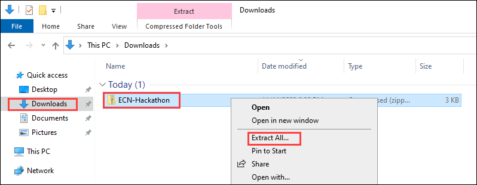

     Folders dialog")

### Task 2: Create a Virtual Network (hub) with Subnets

1. Connect to the Azure portal. Expand the left navigation, and select **+ Create a resource**. In the **Search the Marketplace** box, search for and select **Virtual Network**, then select **Create**.

2. On the **Basics** tab of the **Create virtual network** blade, enter the following information:

    - Subscription: **Choose your subscription**.

    - Resource group: Select **Create new**, and enter the name **WGVNetRG2**.

    - Name: **WGVNet2**

    - Region: **(US) South Central US**

3. Upon completion, it should look like the following screenshot. Validate the information is correct, and choose **Next: IP Addresses**.

    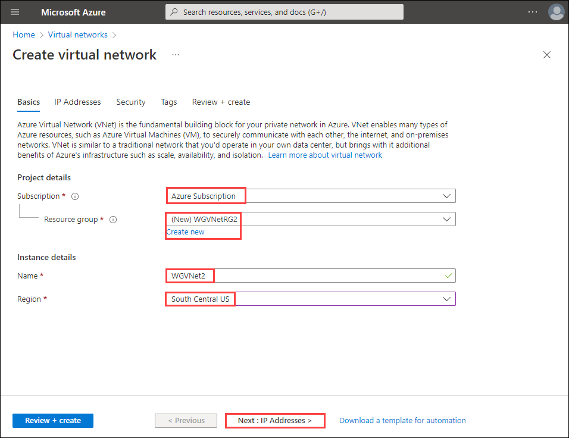

4. On the **IP Addresses** tab of the **Create virtual network** blade, enter the following information:

    - IPv4 address space: **10.8.0.0/20**

    - Select **+ Add subnet** then in the **Add subnet** blade that appears on the right, enter the following information and select **Add**.

       - Subnet name: **AppSubnet**

       - Subnet address range: **10.8.0.0/25**

       - NAT Gateway: **None**

    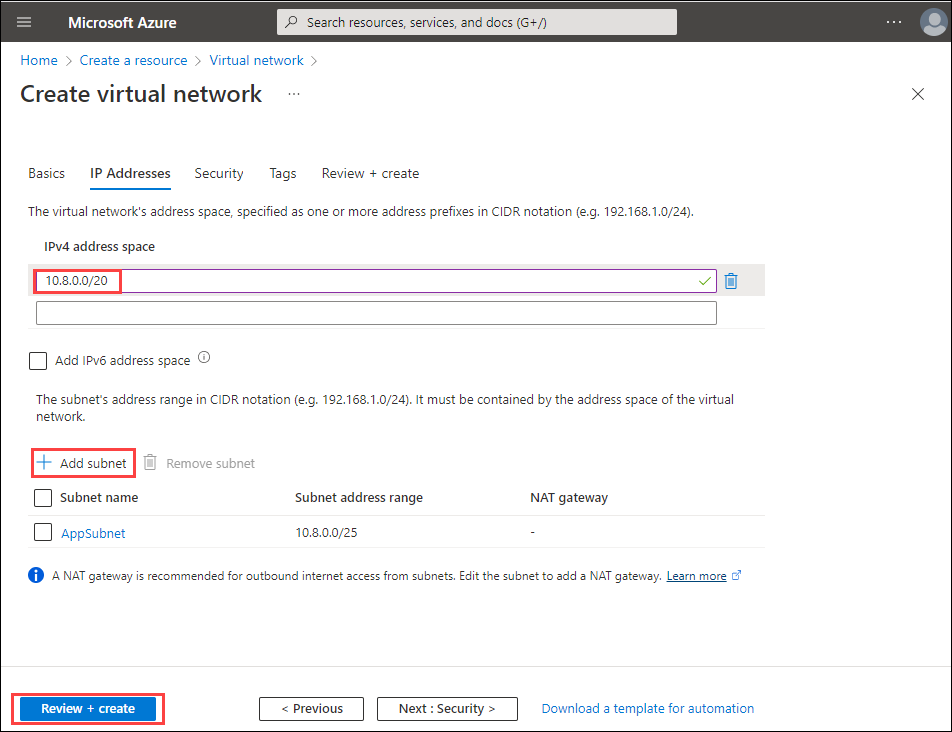

5. Once complete, click **Review + Create** then once the validation passes, click **Create**.

6. Go to the WGVNetRG2 Resource Group, select the **WGVNet2** blade, and select **Subnets** under **Settings** on the left.

    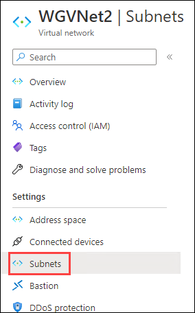

7. In the **Subnets** blade, select **+ Subnet**.

    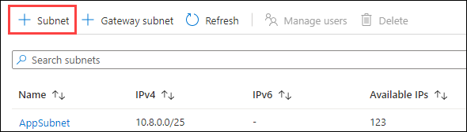

8. On the **Add subnet** blade, enter the following information:

    - Name: **DataSubnet**

    - Address range: **10.8.1.0/25**

    - NAT gateway: **None**

    - Network security group: **None**

    - Route table: **None**

9. When your dialog looks like the following screenshot, select **Save** to create the subnet.

    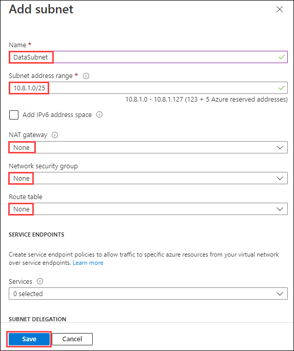

10. When the subnet has completed its configuration, your subnet deployment will look like the following screenshot.

     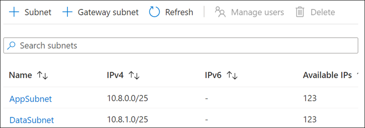  

### Task 3: Use the Azure portal for a template deployment

1. Open the folder which contains the extracted student files for this lab. This is the folder you extracted the files to in Task 1, Step 2.

2. Make sure you are signed into the Azure portal at <http://portal.azure.com>.

3. Expand the left navigation and choose **+ Create a resource**. Search for and select **template deployment (deploy using custom templates)**.

    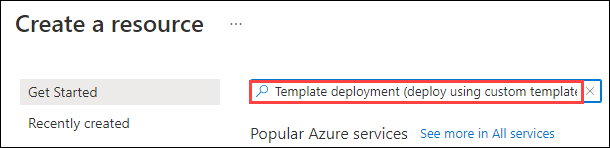

4. On the **Template deployment (deploy using custom templates)** blade, select **Create**.

5. On the Custom deployment blade, select **Build your own template in the editor**.

    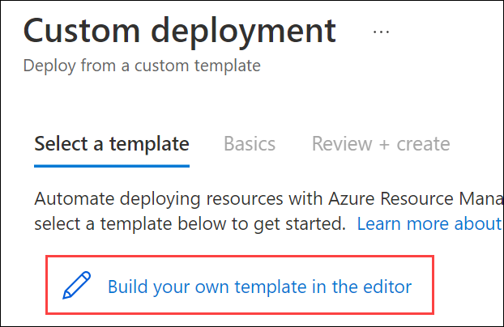

6. Choose **Load file**. Select the **CloudShop.json** file from your **C:\\ECN-Hackathon** directory. Select **Save**.

    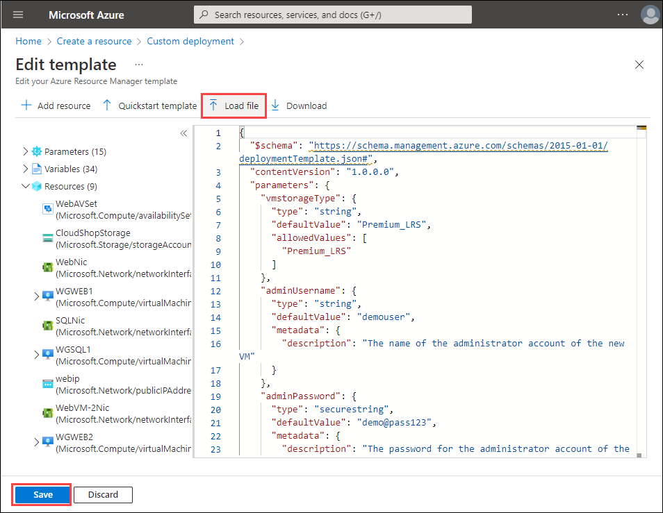

7. Update the following parameters to reference the **WGVNet2** virtual network in the **WGVNetRG2** resource group and to the **AppSubnet** and **DataSubnet** subnets.

    - Existing Virtual Network Name: **WGVNet2**
  
    - Existing Virtual Network Resource Group: **WGVNetRG2**
  
    - Web Subnet: **AppSubnet**
  
    - Data Subnet: **DataSubnet**

    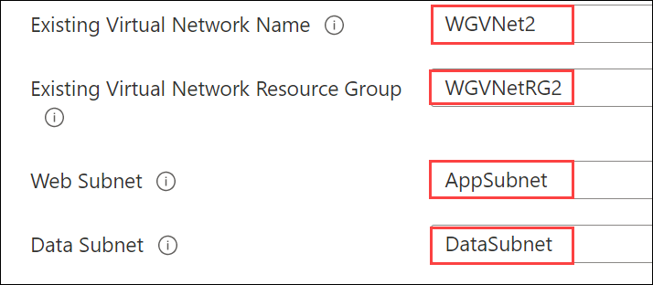

8. Update the **Custom deployment** blade using the following inputs, agree to the terms, and select **Review + create**. Review the configuration, and then select **Create**. This deployment will take approximately 30-40 minutes.

    - Resource Group: Select **WGVNetRG2** you created earlier.

    - Region: This should be the same location you used to provision resources earlier in this lab.

    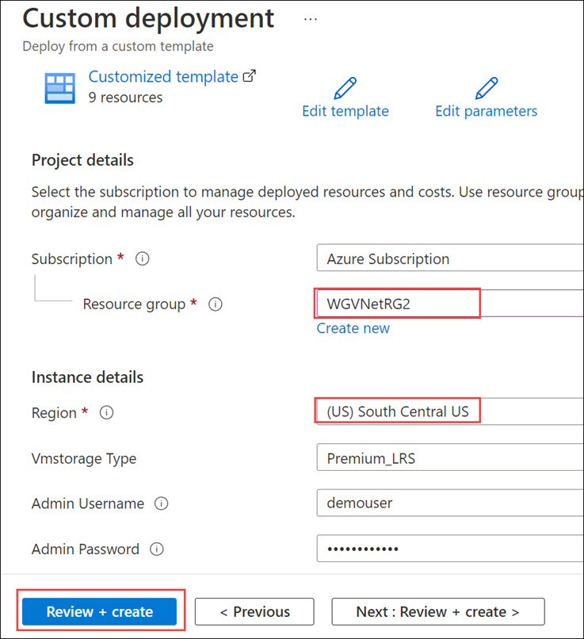

### Task 4: Validate the CloudShop application is up after the deployment

1. Using the Azure portal, open the **WGVNetRG2** resource group and review the deployment.

2. Navigate to the **WGWEB1** blade.

3. On the **WGWEB1** blade, first select **Connect**, then select **RDP**. When prompted, choose **Download RDP file** to download the RDP file to connect to WGWEB1.

    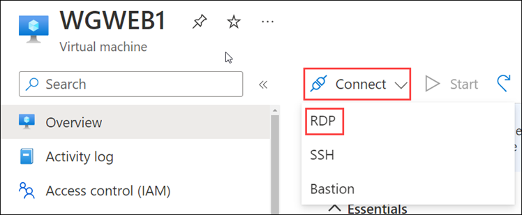

4. Depending on your Remote Desktop protocol client and browser configuration, you will either be prompted to open an RDP file, or you will need to download it and then open it separately to connect.

5. Log in with the credentials specified during creation:

    - User: **demouser**

    - Password: **demo@pass123**

6. You will be presented with a Remote Desktop Connection warning because of a certificate trust issue. Select **Yes** to continue with the connection.

    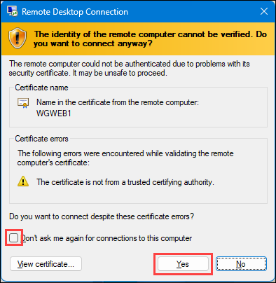

7. When logging on for the first time, you will have a prompt asking about network discovery. Select **No**.

    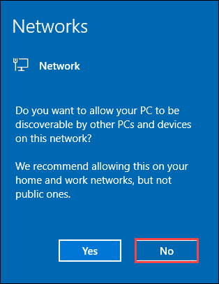

8. Notice that Server Manager opens by default. Close Server Manager.

9. You will now ensure the CloudShop application is up and running. Open Microsoft Edge from the Start menu. Browse to both CloudShop sites running on the WGWEB1 and WGWEB2 servers using the URLs below. The output will look like the following image.

    - WGWEB1 CloudShop site: <http://wgweb1>
    - WGWEB2 CloudShop site: <http://wgweb2>

    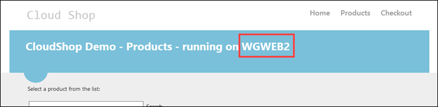

You should follow all steps provided *before* performing the Hands-on lab.
