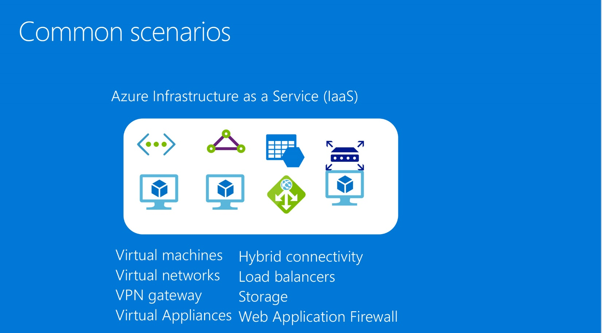
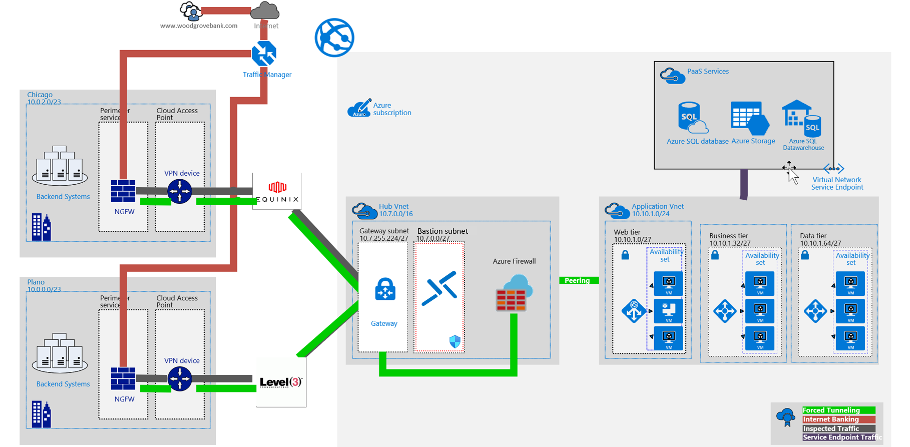
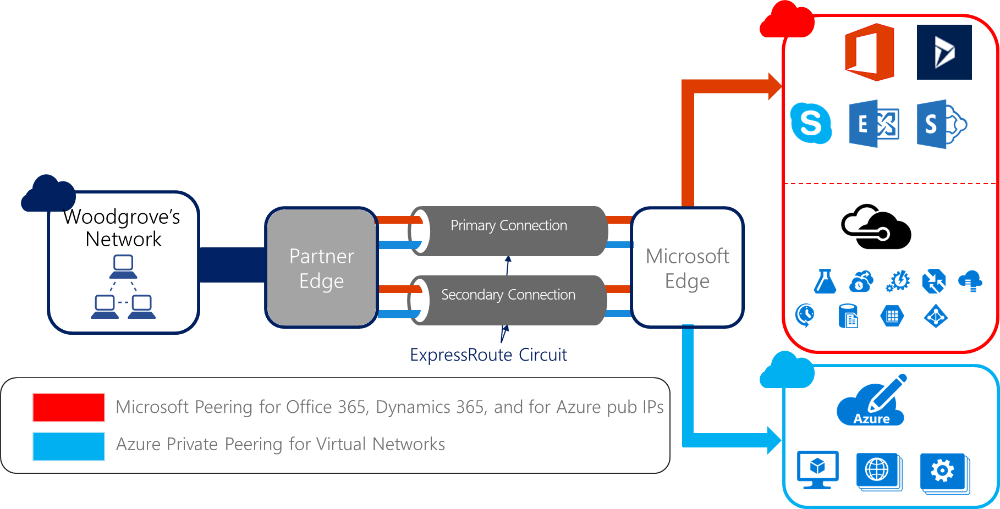
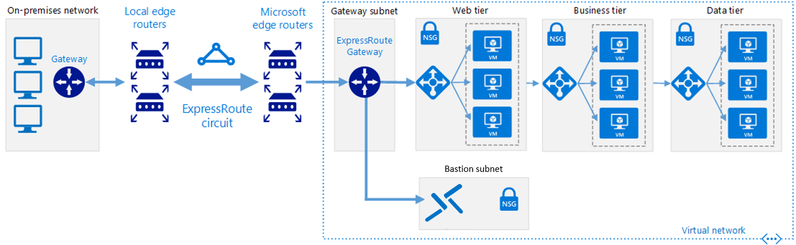



<div class="MCWHeader1">
Enterprise-class networking in Azure
</div>

<div class="MCWHeader2">
Whiteboard design session trainer guide
</div>

<div class="MCWHeader3">
December 2022
</div>

Information in this document, including URL and other Internet Website references, is subject to change without notice. Unless otherwise noted, the example companies, organizations, products, domain names, e-mail addresses, logos, people, places, and events depicted herein are fictitious, and no association with any real company, organization, product, domain name, e-mail address, logo, person, place or event is intended or should be inferred. Complying with all applicable copyright laws is the responsibility of the user. Without limiting the rights under copyright, no part of this document may be reproduced, stored in or introduced into a retrieval system, or transmitted in any form or by any means (electronic, mechanical, photocopying, recording, or otherwise), or for any purpose, without the express written permission of Microsoft Corporation.

Microsoft may have patents, patent applications, trademarks, copyrights, or other intellectual property rights covering subject matter in this document. Except as expressly provided in any written license agreement from Microsoft, the furnishing of this document does not give you any license to these patents, trademarks, copyrights, or other intellectual property.

The names of manufacturers, products, or URLs are provided for informational purposes only and Microsoft makes no representations and warranties, either expressed, implied, or statutory, regarding these manufacturers or the use of the products with any Microsoft technologies. The inclusion of a manufacturer or product does not imply endorsement of Microsoft of the manufacturer or product. Links may be provided to third party sites. Such sites are not under the control of Microsoft and Microsoft is not responsible for the contents of any linked site or any link contained in a linked site, or any changes or updates to such sites. Microsoft is not responsible for webcasting or any other form of transmission received from any linked site. Microsoft is providing these links to you only as a convenience, and the inclusion of any link does not imply endorsement of Microsoft of the site or the products contained therein.

© 2022 Microsoft Corporation. All rights reserved.

Microsoft and the trademarks listed at <https://www.microsoft.com/en-us/legal/intellectualproperty/Trademarks/Usage/General.aspx> are trademarks of the Microsoft group of companies. All other trademarks are property of their respective owners.

**Contents**
<!-- TOC -->

- [Trainer information](#trainer-information)
  - [Role of the trainer](#role-of-the-trainer)
  - [Whiteboard design session flow](#whiteboard-design-session-flow)
  - [Before the whiteboard design session: How to prepare](#before-the-whiteboard-design-session-how-to-prepare)
  - [During the whiteboard design session: Tips for an effective whiteboard design session](#during-the-whiteboard-design-session-tips-for-an-effective-whiteboard-design-session)
- [Enterprise-class networking in Azure whiteboard design session student guide](#enterprise-class-networking-in-azure-whiteboard-design-session-student-guide)
  - [Abstract and learning objectives](#abstract-and-learning-objectives)
  - [Step 1: Review the customer case study](#step-1-review-the-customer-case-study)
    - [Customer background](#customer-background)
    - [Customer situation](#customer-situation)
    - [Customer needs](#customer-needs)
    - [Customer objections](#customer-objections)
    - [Infographic for common scenarios](#infographic-for-common-scenarios)
  - [Step 2: Design a proof of concept solution](#step-2-design-a-proof-of-concept-solution)
  - [Step 3: Present the solution](#step-3-present-the-solution)
  - [Wrap-up](#wrap-up)
  - [Additional references](#additional-references)
- [Enterprise-class networking in Azure whiteboard design session trainer guide](#enterprise-class-networking-in-azure-whiteboard-design-session-trainer-guide)
  - [Step 1: Review the customer case study](#step-1-review-the-customer-case-study-1)
  - [Step 2: Design a proof of concept solution](#step-2-design-a-proof-of-concept-solution-1)
  - [Step 3: Present the solution](#step-3-present-the-solution-1)
  - [Wrap-up](#wrap-up-1)
  - [Preferred target audience](#preferred-target-audience)
  - [Preferred solution](#preferred-solution)
  - [Checklist of preferred objection handling](#checklist-of-preferred-objection-handling)
  - [Customer quote (to be read back to the attendees at the end)](#customer-quote-to-be-read-back-to-the-attendees-at-the-end)

<!-- /TOC -->

# Trainer information

Thank you for taking time to support the whiteboard design sessions as a trainer!

## Role of the trainer

An amazing trainer:

- Creates a safe environment in which learning can take place.

- Stimulates the participant's thinking.

- Involves the participant in the learning process.

- Manages the learning process (on time, on topic, and adjusting to benefit participants).

- Ensures individual participant accountability.

- Ties it all together for the participant.

- Provides insight and experience to the learning process.

- Effectively leads the whiteboard design session discussion.

- Monitors quality and appropriateness of participant deliverables.

- Effectively leads the feedback process.

## Whiteboard design session flow

Each whiteboard design session uses the following flow:

**Step 1: Review the customer case study (15 minutes)**

**Outcome**

Analyze your customer's needs.

- Customer's background, situation, needs, and technical requirements

- Current customer infrastructure and architecture

- Potential issues, objectives, and blockers

**Step 2: Design a proof of concept solution (60 minutes)**

**Outcome**

Design a solution and prepare to present the solution to the target customer audience in a 15-minute chalk-talk format.

- Determine your target customer audience.

- Determine the customer's business needs to address your solution.

- Design and diagram your solution.

- Prepare to present your solution.

**Step 3: Present the solution (30 minutes)**

**Outcome**

Present solution to your customer:

- Present solution

- Respond to customer objections

- Receive feedback

**Wrap-up (15 minutes)**

- Review preferred solution

## Before the whiteboard design session: How to prepare

Before conducting your first whiteboard design session:

- Read the Student guide (including the case study) and Trainer guide.

- Become familiar with all key points and activities.

- Plan the point you want to stress, which questions you want to drive, transitions, and be ready to answer questions.

- Prior to the whiteboard design session, discuss the case study to pick up more ideas.

- Make notes for later.

## During the whiteboard design session: Tips for an effective whiteboard design session

**Refer to the Trainer guide** to stay on track and observe the timings.

**Do not expect to memorize every detail** of the whiteboard design session.

When participants are doing activities, you can **look ahead to refresh your memory**.

- **Adjust activity and whiteboard design session pace** as needed to allow time for presenting, feedback, and sharing.

- **Add examples, points, and stories** from your own experience. Think about stories you can share that help you make your points clearly and effectively.

- **Consider creating a "parking lot"** to record issues or questions raised that are outside the scope of the whiteboard design session or can be answered later. Decide how you will address these issues, so you can acknowledge them without being derailed by them.

***Have fun**! Encourage participants to have fun and share!*

**Involve your participants.** Talk and share your knowledge but always involve your participants, even while you are the one speaking.

**Ask questions** and get them to share to fully involve your group in the learning process.

**Ask first**, whenever possible. Before launching into a topic, learn your audience's opinions about it and experiences with it. Asking first enables you to assess their level of knowledge and experience, and leaves them more open to what you are presenting.

**Wait for responses**. If you ask a question such as, "What's your experience with (fill in the blank)?" then wait. Do not be afraid of a little silence. If you leap into the silence, your participants will feel you are not serious about involving them and will become passive. Give participants a chance to think, and if no one answers, patiently ask again. You will usually get a response.

# Enterprise-class networking in Azure whiteboard design session student guide

## Abstract and learning objectives

In this whiteboard design session, you will look at the process of configuring an enterprise class network within Azure. Your design will include technologies to connect multiple virtual networks, as well as using capabilities such as routing to deploy network virtual appliances such as firewalls to secure your deployment.

At the end of this whiteboard design session, you will be better able to design solutions using Azure Networking features and capabilities.

## Step 1: Review the customer case study

**Outcome**

Analyze your customer's needs.

Timeframe: 15 minutes

Directions:  With all participants in the session, the facilitator/SME presents an overview of the customer case study along with technical tips.

1. Meet your team members and trainer.

2. Read all directions for steps 1-3 in the student guide.

3. As a team, review the following customer case study.

### Customer background

Woodgrove Financial Services has been in business for over 75 years and is a well-known and respected name brand in the financial industry. They are historically risk-averse, and it has served them well, enabling them to weather several financial storms that closed the doors on similarly sized institutions. While Woodgrove started in the United States, around 20 years ago, they branched out into the international arena by acquiring a bank headquartered in Mexico City. Today, they have 224 branches in the United States and 64 in Mexico.

Five years ago, a new president of Woodgrove Financial Services was brought on board to help modernize the image of the bank and to drive efficiencies through the use of modern technologies. The new president is under stiff pressure from the board to lower capital costs and help Woodgrove refocus on its core business. Woodgrove's mission is to promote its customer's well-being and secure their future through a broad range of financial services.

Woodgrove Financial Services headquarters is in Chicago, IL, and their United States branches exist in several states extending over the North Central United States. Their Mexico-based branches are in Mexico City and in the surrounding cities.

### Customer situation

Ten years ago, Woodgrove went through a major upgrade of their Ethernet core and WAN connectivity between their two United States datacenters (located in Plano, TX and Chicago, IL). Today, the United States datacenters have redundant 5 Gbps connections between them. At the same time, they increased the bandwidth from their United States branch locations to no less than 100 Mbps with each branch having connectivity to both datacenters. Most United States branches have an MPLS-based connection to both datacenters but about forty percent have 1 MPLS connection to a datacenter and one Site-to-Site VPN connection to the other datacenter. About five percent of the United States branches have only Site-to-Site connections to both datacenters.

There is also a datacenter in Mexico, located in Mexico City. The Mexico datacenter has an MPLS connection to the Chicago datacenter with 200 Mbps bandwidth and a Site-to-Site VPN connection for redundancy that is 100 Mbps. All 64 of the Mexico-based branches have Site-to-Site VPN connections to this datacenter and the internet bandwidth for all branches was standardized recently at 50 Mbps up/down.

![The diagram of Woodgrove's current scenario has a cloud at the top, city locations below the cloud, and branches and one headquarters below the cities. Two of the cities - Plano Texas and Chicago Illinois - connect to the cloud with 500 Mbps connections. Mexico City Mexico, the third city, connect with a 100 Mbps connection. Plano and Chicago connect to each other with 5 Gbps connections, while Chicago and Mexico connect with a 200 Mbps, and 100 Mbps connections. Mexico City has three branch offices with 50 Mbps connections, while Plano and Chicago share four branch offices and headquarters. Connections between Chicago / Plano and the branches vary between 100 Mbps and 200 Mbps. The connection with headquarters is 200Mbps.](media/woodgrove-location-network-diagram.png "Woodgrove current scenario diagram")

Figure 1 - Woodgrove current network configuration

Woodgrove leadership has been watching the emergence of hyper-scale public cloud offerings, and over the last several years, they have been discussing the adoption of public cloud. Through strong executive-level relationships with Microsoft, the organization has been predominantly a Microsoft shop for at least the last 15 years. Due in large part to this relationship, Woodgrove executives envision that over a five-year period they will transition 80-90% of their IT infrastructure to Microsoft Azure and will eventually decommission their Chicago datacenter altogether.

Woodgrove's business critical applications include:

- Their core banking application (a client-server application taking advantage of approximately 50 application servers and a SQL Server 2014-based data tier using Always on Availability Groups and In-Memory tables).

- Their website enables online banking features (running on several web farms in the company's perimeter network and securely interacting with the banking application servers).

- Their HR system (a custom-written system taking advantage of several application servers and an Oracle-based data tier).

- Email (Exchange Server 2010 taking advantage of Database Availability Groups that span their two datacenters).

Woodgrove has also a large number of multi-tier custom business apps that, due to their legacy dependencies, will likely be migrated to Azure IaaS.

Woodgrove's pilot deployment of cloud-native applications will include:

- Implementing a simple marketing web application in Azure. The application should use PaaS rather than IaaS.

- Identifying an alternative to forced tunneling. To support the strategy of embracing cloud technologies, Network and security team are considering alternatives to redirecting internet traffic via an on-premises security gateway for this deployment. They are looking for a Cloud-native security solution.

- Evaluating options for securing multi-tier business apps. Woodgrove IT is considering leveraging Azure Network Security Groups in combination with Application Security Groups.

- Securing connectivity to Azure PaaS. To minimize exposure of Azure PaaS services via public endpoints, Woodgrove's Information Security requested that communication between Azure IaaS and Azure PaaS services do not rely on public endpoints, whenever possible.

### Customer needs

1. A detailed architecture and plan for providing robust, secure connectivity between their datacenters and Azure. The plan must support migration efforts and connectivity from the branch offices to Azure to allow connectivity to migrated applications. The solution should be able to continue to provide connectivity in the case of a severe connectivity partner outage.

2. A detailed architecture and plan for providing an enterprise-class networking scenario supporting secure data flow between tiers in the core banking application. All components of the design must be highly available.

3. The result of needs one and two should be a network design that allows applications to run both on-premises and in Azure.

4. For the time being, all internet traffic must be passed through an on-premises intrusion detection or prevention system to comply with company policy.

5. All the incoming traffic must be inspected to ensure protection against SQL injections, cross-site scripting and other web attacks such as HTTP protocol violation, etc.

6. All traffic targeting the cloud-based marketing web app will not be passed through on-premises network. An alternative cloud-native security solution is required.

7. URL based routing, redirection, and SSL termination will need to be implemented on the FW/LB level for the new cloud web apps.

8. A DDoS protection plan must be configured for the Virtual Network which will host the Data and Web tiers of the core banking application.

9. All traffic that goes in and out of Azure virtual networks must be filtered and passed through a firewall appliance.

10. All traffic that goes through the ExpressRoute circuit needs to be distributed based on business units and will have granular control of circuit distributions.

11. ExpressRoute circuits need to be linked together to make a private network so that data can directly exchange between offices.

### Customer objections

1. As a financial institution, Woodgrove is under tight regulatory compliance requirements. Security is a key aspect of compliance and as such, it must be a key tenet of all operations including those related to technology. The corporate security officer is generally opposed to using services solely accessible over the public internet. Services like Office 365, CRM, and other Microsoft SaaS offerings are off limits. Additionally, PaaS services accessed over the internet are also unusable. It has relegated Woodgrove to private Azure services such as IaaS.

2. The director of Network Operations is under the impression that complex enterprise-grade networking scenarios, such as those that support n-tier applications, cannot be configured in hyper-scale public clouds. Trust comes slowly with this director. She will most likely need detailed solution plans, case studies, and even customer testimonials to help convince her of the viability of anything other than simple networking scenarios in Azure.

3. The director of Network Operations also does not trust cloud security. She will need a strategy in place which allows Network Engineers the ability to analyze traffic flows and capture packets when needed for cloud-hosted resources.

4. The corporate compliance officer of Woodgrove must ensure compliance with many requirements to ensure his organization passes audits from both internal and external entities. One requirement is all outbound internet requests must pass through an on-premises system that inspects and logs this traffic. The CCO is skeptical of IaaS solutions in Azure since "those VMs in the cloud can access the internet directly."

### Infographic for common scenarios



Figure 2 - Common scenarios using Azure Infrastructure as a Service

## Step 2: Design a proof of concept solution

**Outcome**

Design a solution and prepare to present the solution to the target customer audience in a 15-minute chalk-talk format.

Timeframe: 60 minutes

**Business needs**

Directions: With your team, answer the following questions and be prepared to present your solution to others:

1. Who will you present this solution to? Who is your target customer audience? Who are the decision makers?

2. What customer business needs do you need to address with your solution?

**Design**

Directions: With your team, respond to the following questions:

The desired outcome is a network architecture that meets the needs of a modern financial services organization. This design will not have single points of failure and will include concepts such as a perimeter network with redundant firewalls protecting the internal subnets containing the application tiers. A simple network design will most likely confirm the director of Network Operation's beliefs that Azure cannot support real-world, enterprise-class networking (see customer objections)---*prove her wrong!*

*High-Level architecture*

1. Create a high-level architecture diagram and explanation of the components of your solution.

*Address the following customer requirements*

1. Explain the approach you would take to deploying ExpressRoute Circuits including location and circuit size.

2. What ExpressRoute peering options you would enable and what workloads would use them? Diagram your peering configuration including the subnet, IP, and autonomous system number configuration needed.

3. What are the NAT requirements for ExpressRoute integration?

4. How does your design address availability at the network layer?

5. How is routing configured in your overall design?

6. Identify where Network Security Groups are used in your design.

**Prepare**

Directions: As a team:

1. Identify any customer needs that are not addressed with the proposed solution.

2. Identify the benefits of your solution.

3. Determine how you will respond to the customer's objections.

Prepare a 15-minute chalk-talk style presentation to the customer.

## Step 3: Present the solution

**Outcome**

Present a solution to the target customer audience in a 15-minute chalk-talk format.

Timeframe: 30 minutes

**Presentation**

Directions:

1. Pair with another team.

2. One group is the Microsoft team and the other is the customer.

3. The Microsoft team presents their proposed solution to the customer.

4. The customer makes one of the objections from the list of objections.

5. The Microsoft team responds to the objection.

6. The customer team gives feedback to the Microsoft team.

7. Switch roles and repeat Steps 2-6.

## Wrap-up

Timeframe: 15 minutes

Directions: Reconvene with the larger group to hear the facilitator/SME share the preferred solution for the case study.

## Additional references

|    |            |
|----------|:-------------:|
| **Description** | **Links** |
| IP Addressing and Subnetting for New Users                | <http://www.cisco.com/c/en/us/support/docs/ip/routing-information-protocol-rip/13788-3.html>  |
| ExpressRoute documentation                                | <https://learn.microsoft.com/en-us/azure/expressroute/>                                       |
| ExpressRoute Routing requirements                         | <https://learn.microsoft.com/en-us/azure/expressroute/expressroute-routing/>                  |
| ExpressRoute NAT requirements                             | <https://learn.microsoft.com/en-us/azure/expressroute/expressroute-nat>                       |
| ExpressRoute workflows                                    | <https://learn.microsoft.com/en-us/azure/expressroute/expressroute-workflows>                 |
| ExpressRoute Global Reach                                 | <https://learn.microsoft.com/azure/expressroute/expressroute-global-reach>                    |
| Site-to-Site VPN documentation                            | <https://learn.microsoft.com/en-us/azure/vpn-gateway/>                                        |
| Virtual Network documentation                             | <https://learn.microsoft.com/en-us/azure/virtual-network/>                                    |
| Plan Virtual Networks                                     | <https://learn.microsoft.com/en-us/azure/virtual-network/virtual-network-vnet-plan-design-arm>|
| Virtual Network Traffic Routing                           | <https://learn.microsoft.com/en-us/azure/virtual-network/virtual-networks-udr-overview>       |
| Load Balancer                                             | <https://learn.microsoft.com/en-us/azure/load-balancer/load-balancer-overview>                |
| Microsoft Azure Virtual Datacenter: A Network Perspective | <https://learn.microsoft.com/en-us/azure/cloud-adoption-framework/resources/networking-vdc>   |
| Deploy highly available network virtual appliances        | <https://learn.microsoft.com/azure/architecture/reference-architectures/dmz/nva-ha>           |
| Azure Firewall Documentation                              | <https://learn.microsoft.com/azure/firewall/>                                                 |
| Virtual Network Service Endpoints                         | <https://learn.microsoft.com/azure/virtual-network/virtual-network-service-endpoints-overview>|
| Azure Bastion                                             | <https://learn.microsoft.com/azure/bastion/bastion-overview>                                  |

# Enterprise-class networking in Azure whiteboard design session trainer guide

## Step 1: Review the customer case study

- Check in with your participants to introduce yourself as the trainer.

- Ask, "What questions do you have about the customer case study?"

- Briefly review the steps and timeframes of the whiteboard design session.

- Ready, set, go! Let participants begin.

## Step 2: Design a proof of concept solution

- Check in with your teams to ensure that they are transitioning from step to step on time.

- Provide feedback on their responses to the business needs and design.

  - Try asking questions first that will lead the participants to discover the answers on their own.

- Provide feedback for their responses to the customer's objections.

  - Try asking questions first that will lead the participants to discover the answers on their own.

## Step 3: Present the solution

- Determine which groups will be paired together before Step 3 begins.

- For the first round, assign one group as the presenting team and the other as the customer.

- Have the presenting team present their solution to the customer team.

  - Have the customer team provide one objection for the presenting team to respond to.

  - The presentation, objections, and feedback should take no longer than 15 minutes.

  - If needed, the trainer may also provide feedback.

## Wrap-up

- Have participants reconvene with the larger session group to hear the facilitator/SME share the following preferred solution.

## Preferred target audience

- Director of Network Operations

- Corporate Security Officer

- Corporate Compliance Officer

## Preferred solution

*High-level architecture*

1. Create a high-level architecture diagram and explanation of the components of your solution.

The solution for Woodgrove involved several technologies, including:

- ExpressRoute Global Reach with private and Microsoft peering enabled for connectivity for its virtual machines/Virtual Networks, and potential future plans for accessing Microsoft public services.

- Advanced networking, which allows certain instance sizes to hit 25 Gbps for accelerated networking scenarios.

- Testing the resiliency of the networking design. which involves taking a link down and ensuring services are still available.

- Azure Bastion service for secure remote administration with Just-in-time (JIT) virtual machine access for RDP port security.

- Implementing an enterprise-class configuration within an Azure Virtual Network to support the 3-tier core banking application. Components of this solution include:
  
  - Multiple Virtual Networks
  - Six subnet designations, including gateway, perimeter, web tier, business tier, data tier, and Bastion subnet.
  - Azure Firewall configured to provide hybrid connectivity support and internal firewall capabilities internal to the Azure VNet and any paired VNets.
  - Five route tables associated with their corresponding subnets, each with specific user defined routes configured.
  - Five Network Security Groups associated with their respective subnets, each with specific allow/deny rules configured.
  - Application Security Groups (three per each multi-tier legacy business app) to secure traffic within the same subnet, along with the corresponding Network Security Groups.
  - Three internal Azure Load Balancers to direct load to the primary NGFW and to the servers in each application tier.
  - One application gateway to load balance incoming traffic and provide Layer-7 (WAG and WAF) protection of the Web tier.
  - Virtual Network Service endpoints to further secure access to PaaS services such as storage and Azure SQL.

- Implementing a WAF in order to inspect and protect incoming traffic.

  - Application Gateway will be used.
  - Azure Web Apps will be configured as back-end pool members of Application Gateway.

    - To ensure that incoming traffic is directed via the Application Gateway, a CNAME record can be used to designate the public endpoint of the application gateway.

      - To create the CNAME record, it is necessary to create a public IP address resource and assign to it a DNS name.

- Implementing DDoS protection services for the virtual networks hosting Data and Web tiers in order to protect them against DDoS attacks.

- Implementing Azure Firewall to make sure it protects and filters all the traffic coming into and going out from the Azure virtual network.

    

    Figure 3 - Preferred Solution diagram

*Address the following customer requirements*

1. Explain the approach you would take to deploying ExpressRoute Circuits including location and circuit size.*

    Two ExpressRoute circuits will be provisioned.

    - The first will be connected in Dallas, TX (corresponding to the Plano, TX Woodgrove datacenter) and will take advantage of level 3 Communications as the connectivity provider.

    - The second will be connected in Chicago, IL (corresponding to Woodgrove's Chicago, IL datacenter) and will take advantage of Equinix as the connectivity provider.

    Taking advantage of different providers will enable Woodgrove to maintain robust connectivity to Azure even in the case of a catastrophic provider issue.

    Because of the potential of large amounts of data movement back and forth between Azure and the on-premises environment, the metered data option was chosen for both ExpressRoute circuits (the customer has the option of converting from metered to unlimited if needed). From a bandwidth perspective, after completing a study of current bandwidth usage trends, 1 Gbps circuit sizes were selected for both ExpressRoute circuits.

2. What ExpressRoute peering options you would enable and what workloads would use them? Diagram your peering configuration including subnet, IP and autonomous system number configuration needed.

    After learning that, with ExpressRoute, PaaS services do not traverse the internet, there was renewed interest in planning for PaaS adoption. These needs, in conjunction with connecting to private services (such as IaaS), dictate for the ExpressRoute circuits to be set up for private and Microsoft peering.

    

    Figure 4 - Peering for ExpressRoute

    **Private peering**

    To support private peering, Woodgrove needed to provide addresses from a range that does not overlap with internal networks or Azure-based Virtual Networks. The addresses can be public or private. They need to provide either a single /29 or two /30 subnets (a /29 will be broken up into 2 /30 subnets). Woodgrove chose to use:

    - 10.0.5.0/30

    - 10.0.5.4/30

    Addresses from the two subnets will be used to establish two private peering for redundancy.

    **Private peering - Link 1**

    | IP Address | Usage |
    |----|----|
    |10.0.5.1/30 | Customer/Provider use |
    |10.0.5.2/30 | Microsoft use |

    **Private peering - Link 2**

    | IP Address | Usage |
    |----|----|
    |10.0.5.5/30 | Customer/Provider use |
    |10.0.5.6/30 | Microsoft use |

    **Microsoft peering**

    Woodgrove needed to provide public IP addresses they own to set up Microsoft peering. Microsoft must be able to verify the ownership of the IP addresses through Routing Internet Registries and Internet Routing Registries. Additionally, Woodgrove must use their registered Autonomous System (AS) number in the peering configuration. Woodgrove's registered AS number is AS20046. They chose to use the following from their public IP addresses:

    - 72.191.44.0/30

    - 72.191.44.4/30

    **Microsoft peering - Link 1**

    | IP Address | Autonomous System Number | Usage |
    |----|----|----|
    |72.191.44.1/30 | AS20046 | Customer/Provider use |
    |72.191.44.2/30 | AS20046 | Microsoft use |

    **Microsoft peering - Link 2**

    | IP Address | Autonomous System Number | Usage |
    |----|----|----|
    |72.191.44.5/30 | AS20046 | Customer/Provider use |
    |72.191.44.6/30 | AS20046 | Microsoft use |

    **ExpressRoute connectivity type for Chicago**

    Woodgrove Financial Services happen to use co-location datacenter space at a facility in which Equinix has a presence. As a result, it made sense to connect the ExpressRoute circuit in Chicago using virtual cross-connections through Equinix's Ethernet exchange. To reduce cost, Woodgrove chose Equinix's unmanaged layer 2 connectivity. It requires Woodgrove networking staff to provision redundant edge routers and to configure all BGP peering. Specifically, they will need to:

    - Create an ExpressRoute circuit by using the following command:

    ```powershell
        New-AzExpressRouteCircuit -Name <<circuit-name>> -ResourceGroupName <<resource-group>> -Location <<location>> -SkuTier <<sku-tier>> `

    > -SkuFamily <<sku-family>> -ServiceProviderName <<service-provider-name>> -PeeringLocation <<peering-location>> -BandwidthInMbps <<bandwidth-in-mbps>>
    ```

    - Send the ServiceKey for the new circuit to the service provider.

    - Wait for the provider to provision the circuit. You can verify the provisioning state of a circuit by using the following PowerShell command:

    ```powershell
    Get-AzExpressRouteCircuit -Name <<circuit-name>> -ResourceGroupName <<resource-group>>
    ```

    - Reserve two /30 subnets for each peering type desired (private or public for private peering and public for Microsoft peering). These /30 subnets will be used to provide IP addresses for the routers used for the circuit.

    - Configure routing for the ExpressRoute circuit. You need to run the command below for each type of peering you want to configure (private and Microsoft).

    ```powershell
    Set-AzExpressRouteCircuitPeeringConfig -Name <<peering-name -Circuit <<circuit-name -PeeringType <<peering-type -PeerASN <<peer-asn -PrimaryPeerAddressPrefix <<primary-peer-address-prefix -SecondaryPeerAddressPrefix <<secondary-peer-address-prefix -VlanId <<vlan-id

    Set-AzExpressRouteCircuit -ExpressRouteCircuit <<circuit-name>>
    ```

    - Reserve another pool of valid Public IP addresses to use for NAT for Microsoft peering. Specify the pool to your connectivity provider, so they can configure BGP advertisements for those ranges.

    - Link your private VNet(s) in the cloud to the ExpressRoute circuit. Use the following PowerShell commands:

    ```powershell
    $circuit = Get-AzExpressRouteCircuit -Name <<circuit-name -ResourceGroupName <<resource-group

    $gw = Get-AzVirtualNetworkGateway -Name <<gateway-name -ResourceGroupName <<resource-group>>

    New-AzVirtualNetworkGatewayConnection -Name <<connection-name -ResourceGroupName <<resource-group -Location <<location>> -VirtualNetworkGateway1 $gw -PeerId $circuit.Id -ConnectionType ExpressRoute
    ```

    Because Woodgrove is using a layer 2 connection in Chicago, they deployed redundant routers in the datacenter in an active-active configuration. They connected the primary connection to one router and the secondary connection to the other. It provided a highly available connectivity at both ends of the connection. It is necessary to realize the ExpressRoute SLA.

    **ExpressRoute connectivity type for Plano**

    At the Plano datacenter, Woodgrove opted to work with level 3 and connect the second ExpressRoute circuit to their existing MPLS cloud. This connectivity type was offered as a managed layer 3 service, which Woodgrove signed up for. The steps to configure ExpressRoute in this case are fewer because the provider configures BGP peering on the customer's behalf. The steps to complete are:

    - Create an ExpressRoute circuit by using the following command:

    ```powershell
    New-AzExpressRouteCircuit -Name <<circuit-name -ResourceGroupName <<resource-group -Location <<location -SkuTier <<sku-tier `
    -SkuFamily <<sku-family -ServiceProviderName <<service-provider-name -PeeringLocation <<peering-location -BandwidthInMbps <<bandwidth-in-mbps>>
    ```

    - Send the ServiceKey for the new circuit to the service provider.

    - Wait for the provider to provision the circuit. You can verify the provisioning state of a circuit by using the following PowerShell command:

    ```powershell
    Get-AzExpressRouteCircuit -Name <<circuit-name -ResourceGroupName <<resource-group>>
    ```

    - Link your private VNet(s) in the cloud to the ExpressRoute circuit. Use the following PowerShell commands:

    ```powershell
    $circuit = Get-AzExpressRouteCircuit -Name <<circuit-name>> -ResourceGroupName <<resource-group>>

    $gw = Get-AzVirtualNetworkGateway -Name <<gateway-name>> -ResourceGroupName <<resource-group>>

    New-AzVirtualNetworkGatewayConnection -Name <<connection-name>> -ResourceGroupName <<resource-group>> -Location <<location> -VirtualNetworkGateway1 $gw -PeerId $circuit.Id -ConnectionType ExpressRoute
    ```

3. What are the NAT requirements for ExpressRoute integration?

    The Microsoft peering path enables you to connect to all services hosted in Azure over their Public IP addresses. These services include all services listed in the ExpressRoute FAQ and any services hosted by ISVs on Microsoft Azure. The Microsoft peering also lets you connect to Office 365 services such as Exchange Online, SharePoint Online, Skype for Business, and to CRM Online. Microsoft supports bidirectional connectivity via Microsoft peering. Traffic destined to Microsoft cloud services must be SNATed to valid Public IPv4 or IPv6 addresses before they enter the Microsoft network.

    

    Figure 5 - Microsoft peering SNAT diagram

4. How does your design address availability at the network layer?

    The following diagram shows a configuration with redundant on-premises routers connected to the primary and secondary circuits. Each circuit handles the traffic for a Microsoft peering and a private peering.

    

    Figure 6 - Redundancy and Peering with ExpressRoute

    Azure Firewall has high-availability built-in, so no additional load balancers are required and there is nothing for you to configure for redundancy.

5. How is routing configured in your overall design?

    For many cases, this solution will apply user defined routes to ensure desired routing; however, because ExpressRoute is in use, we must take advantage of BGP routing for some scenarios like force tunneling. In the case of the preferred solution, we are using a BGP route to force outbound internet traffic back to an on-premises firewall. This device is monitoring outbound traffic for sensitive data such as unencrypted social security numbers, credit card numbers, etc.

    Keep in mind that user defined routing only applies to traffic leaving the subnet they are applied to. Also, the appliance you are forwarding traffic to cannot be in the same subnet where the traffic originates. Always create a separate subnet for your appliances.

    **Web tier subnet route table**

    **Address Prefix**               |  **Next Hop Type** |   **Next Hop Address**
    --------------------------------- | ------------------- | ----------------------
    0.0.0.0/0                         | Virtual Appliance  |  10.7.0.38
    10.10.1.32/27 (Business Tier)    |  Virtual Appliance  |  10.7.0.38
    10.10.1.64/27 (Data Tier)        |  Virtual Appliance  |  10.7.0.38
    10.7.255.224/27 (GatewaySubnet)  |  Virtual Appliance  |  10.7.0.38
    10.7.0.0/27 (Bastion Subnet)        |  Virtual Appliance  |  10.7.0.38

    **Business tier subnet route table**

    **Address Prefix**               |  **Next Hop Type** |   **Next Hop Address**
    --------------------------------- |  ------------------- | ----------------------
    0.0.0.0/0                        |  Virtual Appliance  |  10.7.0.38
    10.10.1.64/27 (Data Tier)        |  Virtual Appliance  |  10.7.0.38
    10.10.1.0/27 (Web Tier)          |  Virtual Appliance  |  10.7.0.38
    10.7.255.224/27 (GatewaySubnet)  |  Virtual Appliance  |  10.7.0.38
    10.7.0.0/27 (Bastion Subnet)        |  Virtual Appliance  |  10.7.0.38

    **Data tier subnet route table**

    **Address Prefix**               |  **Next Hop Type**  |  **Next Hop Address**
    --------------------------------- |  ------------------- | ----------------------
    0.0.0.0/0                       |   Virtual Appliance |   10.7.0.38
    10.10.1.32/27 (Business Tier)   |   Virtual Appliance |   10.7.0.38
    10.10.1.0/27 (Web Tier)         |   Virtual Appliance |   10.7.0.38
    10.7.255.224/27 (GatewaySubnet) |   Virtual Appliance |   10.7.0.38
    10.7.0.0/27 (Bastion Subnet)       |   Virtual Appliance |   10.7.0.38

6. Identify where Network Security Groups are used in your design.

    Network Security Groups (NSGs) will be used to help secure the configuration by limiting traffic flow. NSGs function by customer-defined inbound and outbound filter rules. NSGs may be applied to either individual NICs or to subnets. In Woodgrove's case, there will be a single NSG applied to each subnet.

    **Perimeter NSG**

    Traffic to manage the NSGs will only be allowed from the Bastion subnet and from within the headquarters address range that represents the Woodgrove Financial Services NOC.

    **Name**  |   **Priority** |   **Source**              |     **Protocol** |   **Source Port Range** |  **Destination**  |  **Dest. Port Range** |   **Action**
    ----------- | -------------- | --------------------------- | -------------- |  ----------------------- | ----------------- |  ---------------------- | ------------
    Bastion1       | 100            | 10.7.0.0/27                 | TCP            | Any                     | 10.7.0.32/27      | 807                    | Allow
    Bastion2       | 110            | 10.7.0.0/27                 | TCP            | Any                     | 10.7.0.32/27      | 801                    | Allow
    TINA\_VPN   | 200            | OnPrem PIP of VPN gateway   | Any            | Any                     | 10.7.0.32/27      | 691                    | Allow
    HTTP        | 300            | Any                         | TCP            | Any                     | 10.7.0.32/27      | 80                     | Allow
    SSH         | 400            | 10.7.0.0/27                 | TCP            | Any                     | 10.7.0.32/27      | 22                     | Allow
    Bastion3       | 500            | 10.7.0.0/27                 | TCP            | Any                     | 10.7.0.32/27      | 807                    | Allow
    Bastion4       | 510            | 10.7.0.0/27                 | TCP            | Any                     | 10.7.0.32/27      | 801                    | Allow
    Bastion5       | 520            | 10.7.0.0/27                 | TCP            | Any                     | 10.7.0.32/27      | 22                     | Allow

    **Bastion NSG**

    Only RDP traffic from the headquarters-based NOC will be allowed into the Bastion subnet.

    **Name**  |  **Priority**  |  **Source**   |  **Protocol**  |  **Source Port Range**  |  **Destination**  |  **Dest. Port Range**  |  **Action**
    ---------- | --------------|  ------------- | --------------|  ----------------------- | ----------------- | ---------------------- | ------------
    RDP        | 100           |  10.0.2.0/23 |   Any           |  Any                    |  10.7.0.0/27      |  3389                  | Allow
    RDP       |  110           |  10.0.0.0/23  |  Any            | Any                    |  10.7.0.0/27      |  3389                  |  Allow

    **Web Tier NSG**

    **Name**  |  **Priority**  |  **Source**  |   **Protocol** |   **Source Port Range** |   **Destination**  |  **Dest. Port Range** |  **Action**
    ----------|  --------------|  -------------|  --------------|  ----------------------- | ----------------- | ----------------------|  ------------
    HTTP      |  100           |  Any           | TCP            | Any                     | 10.10.1.0/27      | 80                    |  Allow
    HTTPS     |  110           |  Any           | TCP           |  Any                     | 10.10.1.0/27      | 443                   |  Allow
    RDP       |  120           |  10.7.0.0/27  |  Any          |   Any                    |  10.10.1.0/27     |  3389                  |  Allow

    **Business Tier NSG**

    **Name**  |  **Priority** |   **Source**  |    **Protocol** |   **Source Port Range** |   **Destination** |   **Dest. Port Range** |   **Action**
    ---------- | -------------- | -------------- | -------------- | -----------------------| ----------------- | ---------------------- | ------------
    RDP        | 100           |  10.7.0.0/27   |  Any           |  Any                     | 10.10.1.32/27    |  3389                  |  Allow
    HTTPS     |  110           |  10.10.1.0/27  |  TCP           |  Any                    |  10.10.1.32/27   |   443                   |  Allow

    **Data Tier NSG**

    **Name** |   **Priority**  |  **Source**   |    **Protocol**  |  **Source Port Range** |   **Destination** |  **Dest. Port Range**  |  **Action**
    ---------- | --------------|  --------------- | -------------- | ----------------------- | ----------------- | ---------------------- | ------------
    SQL        | 100           |  10.10.1.32/27  |  TCP           |  Any                     | 10.10.1.64/27    |  1433                  |  Allow
    RDP        | 110           |  10.7.0.0/27    |  ANY           |  Any                    |  10.10.1.64/27     | 3389                  |  Allow

    In addition, to accommodate control of traffic flow for legacy business apps that will be collocated on the same subnets, the design includes provisions for creating Application Security Groups. There will be a distinct application security group per application (e.g. App1WebTier, App1BusinessTier, and App1DataTier), with the corresponding Network Security Groups, referencing individual application security groups as their sources or destinations.

## Checklist of preferred objection handling

1. As a financial institution, Woodgrove is under tight regulatory compliance requirements. Security is a key aspect of compliance and as such, it must be a key tenant of all operations including those related to technology. The corporate security officer is generally opposed to using services solely accessible over the public internet. Services like Office 365, CRM, and other Microsoft SaaS offerings are off limits. Additionally, PaaS services accessed over the internet are also unusable. It has relegated Woodgrove to private Azure services such as IaaS.

    **Potential Answer**

    Using ExpressRoute, Woodgrove can access and use Azure private and public services without traversing the internet. This secure connectivity, in addition to the business-class SLAs and greater bandwidth, makes ExpressRoute a compelling offering that addresses this objection. Regarding SaaS offerings, such as Office 365, Woodgrove can employ Azure Active Directory conditional access to provide controls such as a multi-factor authenticated user, an authenticated device, and a compliant device. All traffic to and from Office 365 is encrypted with SSL/TLS, and the data is encrypted at rest in Microsoft datacenters.

2. The director of Network Operations is under the impression that complex enterprise-grade networking scenarios, such as those that support n-tier applications, cannot be configured in hyper-scale public clouds. Trust comes slowly with this director. She will most likely need detailed solution plans, case studies, and even customer testimonials to help convince her of the viability of anything other than simple networking scenarios in Azure.

    **Potential Answer**

    Azure supports many critical enterprise-grade scenarios, including scenarios that require hybrid connectivity and high availability such as Woodgrove. Many of these scenarios are documented in the Azure Architecture Center with reference architectures that cover best practices.

3. The director of Network Operations also does not trust cloud security. She will need a strategy in place which allows Network Engineers the ability to analyze traffic flows and capture packets when needed for cloud-hosted resources.

    **Potential Answer**

    Azure fully supports forced tunneling ensuring that all internet traffic is directed to the desired site, be that in an Azure Virtual Network or on-premises. For example, all Internet traffic can easily be routed from Azure to an on-premises appliance for intrusion detection/prevention and logging.

4. The corporate compliance officer of Woodgrove must ensure compliance with many requirements to ensure his organization passes audits from both internal and external entities. One requirement is all outbound internet requests must pass through an on-premises system that inspects and logs this traffic. The CCO is skeptical of IaaS solutions in Azure since "those VMs in the cloud can access the internet directly."

    **Potential Answer**

    This can be addressed by enabling forced tunneling, which directs all outbound traffic to an on-premises location such as a security appliance. This is enabled in ExpressRoute by advertising a default BGP route.

## Customer quote (to be read back to the attendees at the end)

Quote from the Network Director:

"Azure's advanced networking capabilities and support for partner solutions are a welcome surprise. Your proof of concept has clearly demonstrated the platform's ability to more than satisfy our complex requirements."
